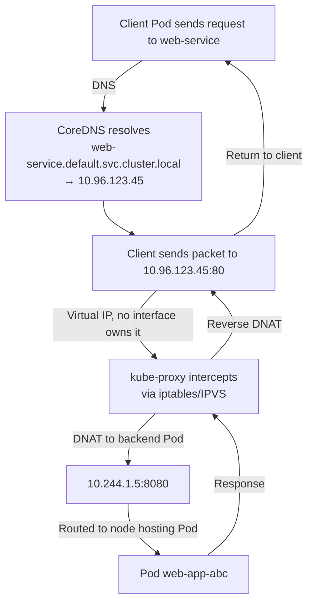

# Services - ClusterIP - Core Mechanics

## Overview

ClusterIP is the default Kubernetes Service type that provides internal cluster access to a set of Pods. Understanding the underlying mechanics — from IP allocation to iptables/IPVS rule installation — is essential for debugging connectivity issues and mastering the CKAD exam.

## The Five Core Mechanics

### 1. Virtual IP Allocation

When a Service is created, the API server allocates a ClusterIP from the configured service CIDR range (`--service-cluster-ip-range`). This IP is virtual — it is not assigned to any network interface and cannot be reached directly from outside the cluster.

```bash
# Check the configured service CIDR
kubectl cluster-info dump | grep service-cluster-ip-range
# Or from the API server logs

# Default CIDR in most distributions
# 10.96.0.0/12 (10.96.0.0 — 10.99.255.255)
```

The ClusterIP is allocated from this range and stored in the Service specification:

```yaml
apiVersion: v1
kind: Service
metadata:
  name: web-service
spec:
  type: ClusterIP
  clusterIP: 10.96.123.45  # Allocated from the service CIDR
  selector:
    app: web-app
  ports:
    - port: 80
      targetPort: 8080
```

**Key points:**
- The ClusterIP is a virtual IP that belongs to the cluster's internal network
- It is not bound to any specific network interface on any node
- Packets sent to the ClusterIP are intercepted and redirected by kube-proxy
- The ClusterIP remains stable for the lifetime of the Service

### 2. Endpoint Tracking

The Kubernetes control plane continuously monitors which Pods match a Service's selector and creates Endpoints (or the modern EndpointSlice) objects that list the IP addresses and ports of all ready matching Pods.

```mermaid
flowchart TD
    S[Service Created with Selector] --> W[Workload Controller]
    W --> R[Creates Pods matching selector]
    R --> H[Pod becomes Ready (readinessProbe passes)]
    H --> C[EndpointSlice Controller detects match]
    C --> E[Adds Pod IP:Port to EndpointSlice]
    E --> I[kube-proxy updates iptables/IPVS rules]
    I --> RT[Traffic can now reach the Pod]
```

#### EndpointSlice (Modern, K8s 1.21+)

EndpointSlices replace the legacy Endpoints object. Each EndpointSlice contains up to 100 backend addresses, which reduces the size of individual objects and improves performance for Services with many backends.

```bash
# View EndpointSlices for a Service
kubectl get endpointslices -l kubernetes.io/service-name=web-service -o wide
# NAME              PORTS    ADDRESSES                        READY   AGE
# web-service       80/TCP   10.244.1.5,10.244.2.7,10.244.3.2  True    10m

# View the legacy Endpoints object (still exists for compatibility)
kubectl get endpoints web-service
# NAME          ENDPOINTS                          AGE
# web-service   10.244.1.5:8080,10.244.2.7:8080   10m
```

**Why EndpointSlices matter:** When a Service has hundreds or thousands of backends (e.g., in a large microservice deployment), the Endpoints object grows very large and causes performance issues with `kubectl get endpoints` and kube-proxy syncs. EndpointSlices distribute this load across multiple objects.

#### Endpoints and Readiness

Only Pods that pass their `readinessProbe` are included in Endpoints. This is why readiness probes are critical for Service reliability:

```yaml
apiVersion: v1
kind: Pod
metadata:
  name: web-app
spec:
  containers:
    - name: app
      image: myapp:latest
      readinessProbe:
        httpGet:
          path: /healthz
          port: 8080
        initialDelaySeconds: 5
        periodSeconds: 10
```

**Without a readinessProbe:** All running Pods are added to Endpoints, including those still initializing and unable to serve traffic. This leads to connection failures and 503 errors.

### 3. DNS Registration by CoreDNS

CoreDNS runs as a cluster DNS service (typically in the `kube-system` namespace). It automatically registers DNS records for every Service.

#### CoreDNS Configuration

CoreDNS is configured via a ConfigMap in the `kube-system` namespace:

```bash
kubectl -n kube-system get configmap coredns -o yaml
```

A typical Corefile includes the `kubernetes` plugin that intercepts DNS queries for cluster services:

```
kubernetes cluster.local in-addr.arpa ip6.arpa {
    pods insecure
    fallthrough in-addr.arpa ip6.arpa
    svc_tcp /etc/coredns/db.cluster.local
}
```

This plugin handles DNS resolution for:
- `<service-name>.<namespace>.svc.cluster.local` → ClusterIP (A record)
- `<service-name>.<namespace>` → ClusterIP (search domain lookup)
- `<service-name>` → ClusterIP (in the current namespace)

#### DNS Record Types

| Query | Record Type | Answer |
|-------|-------------|--------|
| `web-svc.default.svc.cluster.local` | A | ClusterIP (e.g., 10.96.123.45) |
| `web-svc.default.svc.cluster.local` | SRV | Port and pod endpoints |
| `web-svc.default` | A | ClusterIP (via search domain) |
| `my-service.external.svc.cluster.local` | A | ClusterIP of `my-service` in `external` namespace |
| Headless Service (clusterIP: None) | A | Individual Pod IPs (one per Pod) |

#### Testing DNS from Inside the Cluster

```bash
# Quick DNS test using a temporary Pod
kubectl run dns-test --image=busybox:1.36 --rm -it --restart=Never -- \
  nslookup web-service

# Test with dig (if available in the image)
kubectl run dns-test --image=busybox:1.36 --rm -it --restart=Never -- \
  dig web-service.default.svc.cluster.local

# Test SRV records for named ports
kubectl run dns-test --image=busybox:1.36 --rm -it --restart=Never -- \
  nslookup -type=SRV _http._tcp.web-service
```

### 4. kube-proxy Rule Installation

kube-proxy runs on every node and installs networking rules that intercept traffic destined for ClusterIPs and redirect it to actual backend Pods. It operates in one of three modes.

#### kube-proxy Modes

```mermaid
flowchart TD
    Traffic[Traffic Destined for ClusterIP] --> KP[kube-proxy Intercepts]

    KP -->|iptables mode| IPTABLES[iptables DNAT rules]
    KP -->|nftables mode| NFT[nftables sets]
    KP -->|IPVS mode| IPVS[IPVS load balancer]

    subgraph iptables "iptables Mode"
        IPTABLES --> RANDOM["Random selection<br/>O(n) rules per endpoint"]
    end

    subgraph nftables "nftables Mode (K8s 1.25+)"
        NFT --> SETS["nftables set-based matching<br/>Faster than iptables at scale"]
    end

    subgraph ipvs "IPVS Mode"
        IPVS --> SCHED["Scheduler: rr, lc, wlc,<br/>dh, sh, sed, nq"]
        SCHED --> REALSERVER["Forward to real servers<br/>(Pod IPs)"]
    end
```

#### iptables Mode (Default in Most Distributions)

iptables mode creates a large set of DNAT rules that redirect ClusterIP:Port traffic to random backend Pod IPs.

```
Packet flow (iptables):
1. Client sends packet to ClusterIP:80
2. iptables PREROUTING chain intercepts the packet
3. DNAT rule changes destination to Pod1:8080 (random selection)
4. Packet is routed to the node hosting Pod1
5. Pod1 processes request and sends response back
6. Conntrack tracks the connection; return traffic is reverse-DNATed
```

**Inspecting iptables rules:**
```bash
# List KUBE-SERVICE chain rules (where ClusterIP rules live)
sudo iptables -t nat -L KUBE-SERVICES -n -v

# Find rules for a specific service ClusterIP
sudo iptables -t nat -L -n -v | grep <cluster-ip>

# List service-specific chain rules
sudo iptables -t nat -L KUBE-SVC-XXXXX -n -v

# Note: The output can be very large in clusters with many services
```

#### nftables Mode (Kubernetes 1.25+)

nftables mode replaces iptables with nftables sets, offering better performance at scale. It is available but not yet the default in most distributions.

```bash
# Check current kube-proxy mode
kubectl -n kube-system get configmap kube-proxy -o jsonpath='{.data.config\.yaml}' | grep -i mode

# To switch to nftables mode:
kubectl edit configmap -n kube-system kube-proxy
# Set: mode: "nftables"
```

#### IPVS Mode (Recommended for Large Clusters)

IPVS (IP Virtual Server) is a Linux kernel module that implements L4 load balancing with multiple scheduling algorithms. It is significantly more efficient than iptables at scale.

```bash
# Check if IPVS is available on a node
lsmod | grep ip_vs

# View IPVS virtual server and real server table
sudo ipvsadm -Ln
# Output:
# TCP  10.96.123.45:80 rr
#   -> 10.244.1.5:8080   Masq    1  0          0
#   -> 10.244.2.7:8080   Masq    1  0          0
#   -> 10.244.3.2:8080   Masq    1  0          0
```

**IPVS Scheduling Algorithms:**

| Algorithm | Description | Use Case |
|-----------|-------------|----------|
| `rr` | Round Robin | Default; even distribution |
| `lc` | Least Connection | Directs to least busy backend |
| `wlc` | Weighted Least Connection | Weights backends by capacity |
| `dh` | Destination Hashing | Pins to Pods by destination IP |
| `sh` | Source Hashing | Pins to Pods by source IP |
| `sed` | Shortest Expected Delay | Minimizes expected queue delay |
| `nq` | Never Queue | Never queues if a real server is idle |

#### Conntrack and Connection Tracking

When kube-proxy DNATs a packet to a backend Pod, the Linux kernel's `conntrack` module tracks the connection state. This is essential for return traffic to be routed correctly back to the client.

```bash
# View conntrack entries (requires conntrack tools)
sudo conntrack -L | grep <cluster-ip>

# Monitor conntrack in real time
sudo conntrack -E

# Check conntrack limits (can cause issues under high connection volume)
sudo sysctl net.netfilter.nf_conntrack_max
sudo sysctl net.netfilter.nf_conntrack_count
```

**Pitfall:** If `nf_conntrack_max` is too low, the kernel will start dropping connections. This is common in clusters with many short-lived connections (e.g., HTTP microservices). Monitor with:

```bash
# Watch for conntrack drops
# Check dmesg for "nf_conntrack: table full, dropping packet"
sudo dmesg | grep conntrack

# Increase the limit (temporary)
sudo sysctl -w net.netfilter.nf_conntrack_max=262144
```

## Complete Traffic Flow (All Five Mechanics Combined)



## Best Practices

1. **Set appropriate `readinessProbe` on all backend Pods** — without it, Endpoints include unhealthy Pods.
2. **Use IPVS mode for clusters with > 500 Services** — iptables rule count grows linearly with services × ports × endpoints.
3. **Monitor `conntrack` table usage** — it is a common bottleneck in high-traffic clusters.
4. **Use the right IPVS scheduler** for your workload (e.g., `lc` for long-lived connections, `dh` for stateful applications).
5. **Keep kube-proxy config updated** — changes to the kube-proxy ConfigMap require a rollout restart:
   ```bash
   kubectl -n kube-system rollout restart daemonset kube-proxy
   ```

## Troubleshooting

| Symptom | Likely Cause | Diagnosis |
|---------|-------------|-----------|
| Service returns nothing | No Endpoints (selector mismatch or no ready Pods) | `kubectl get endpoints <svc-name>` |
| DNS returns correct IP but connection refused | Endpoints empty or backend not listening | `kubectl exec` into another Pod and test connectivity |
| Intermittent 503 errors | Backend Pods flapping (readinessProbe failing) | `kubectl describe pod` check readiness conditions |
| High latency for Service calls | iptables rules causing packet congestion at scale | Check IPVS connection counts; switch to IPVS if using iptables |
| kube-proxy not syncing | kube-proxy pod crashed or not running | `kubectl -n kube-system get pods -l k8s-app=kube-proxy` |
| Conntrack table full | Too many connections for the kernel to track | Increase `nf_conntrack_max`; check for connection leaks |