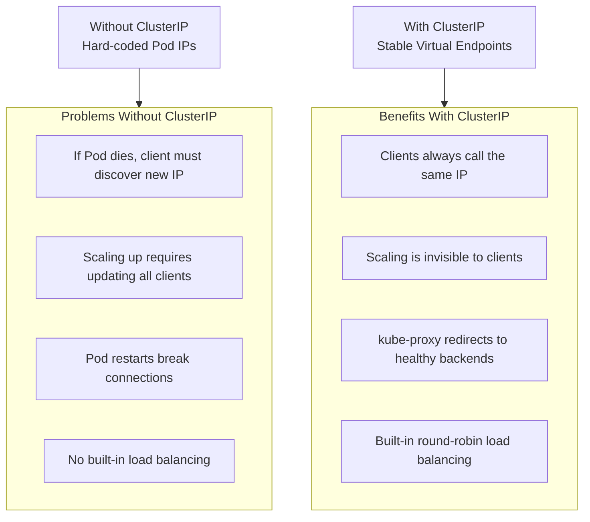
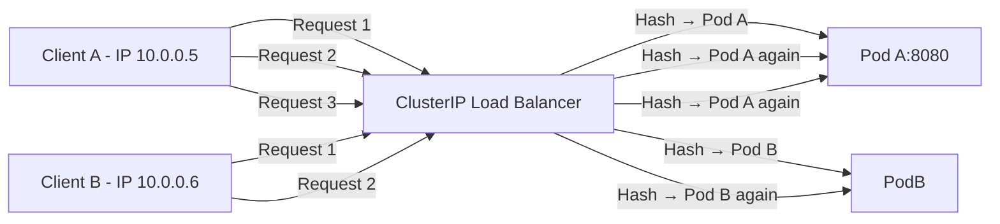
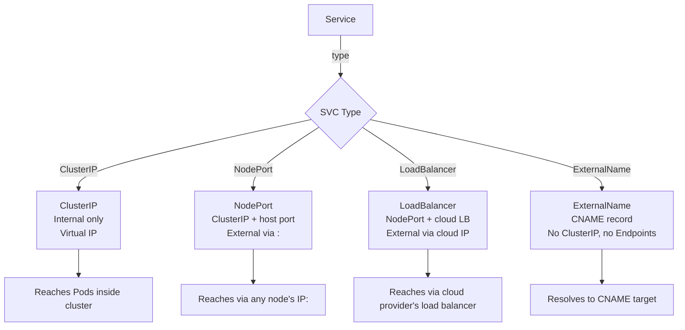

# Services - ClusterIP - Human-Friendly Notes

## Overview

ClusterIP is the fundamental building block of internal Kubernetes networking. This section explains the concept using analogies and a layered breakdown, complementing the technical details in other files with intuitive explanations and the mental models that make these concepts stick.

## The Analogy: A Company Switchboard

Think of a ClusterIP Service as a **company switchboard number**:

- The switchboard number (ClusterIP) is a **fixed, published number** that employees (Pods) can call.
- When someone dials the switchboard, the operator (kube-proxy) routes the call to the **appropriate desk** (a backend Pod).
- If desks change (Pods restart, scale up/down), the switchboard automatically updates its routing list (Endpoints/EndpointSlices).
- The switchboard number itself is **not a physical phone** — it is virtual. It only works within the company's internal phone network (the cluster's network).

If you call the switchboard from outside the company (from outside the cluster), you cannot reach it — you need a public-facing number (NodePort, LoadBalancer, or Ingress).

## Why ClusterIP Exists

In a real application, you often have:
- Multiple replicas of a service running on different nodes
- Pods starting, stopping, and restarting dynamically
- Services that need to talk to each other internally

Without ClusterIP, a client Pod would need to know the exact IP address of every backend Pod and handle failures, scaling, and restarts itself. ClusterIP abstracts all of this away, providing a single stable endpoint that always routes to healthy backends.



## ClusterIP Is NOT a Real IP Address

This is a crucial concept that is often overlooked. The ClusterIP is not assigned to any network interface on any machine. It is a virtual IP that exists only in the context of `iptables` or `IPVS` rules on each node.

```bash
# You will NEVER see the ClusterIP on any network interface
ip addr show  # ClusterIP will NOT appear here

# The ClusterIP only exists as a rule in the networking layer
sudo iptables -t nat -L KUBE-SERVICES -n -v | grep <cluster-ip>
```

**What happens to a packet sent to ClusterIP:**
1. The packet leaves the client Pod with destination `ClusterIP:Port`
2. The packet reaches the host network stack on the node
3. `iptables` or `IPVS` intercepts the packet (prerouting chain)
4. The destination is changed (DNAT) to a backend Pod's real IP:Port
5. The packet is routed to the node hosting that Pod
6. The backend Pod processes the request and responds
7. The response undergoes reverse DNAT and returns to the client

## The Lifecycle of a ClusterIP

```mermaid
flowchart LR
    Create[Service Created] --> Alloc[API Server allocates ClusterIP<br/>from service-cluster-ip-range]
    Alloc --> Store[ClusterIP stored in Service object<br/>etcd]
    Store --> Sync[Every node's kube-proxy syncs]
    Sync --> Rule[kube-proxy installs iptables/IPVS rules]
    Rule --> Virtual[ClusterIP becomes operational]
    Virtual --> Active[Pods can receive traffic via ClusterIP]

    subgraph "Until Service is Deleted"
        Active
    end

    Active --> Delete[Service Deleted]
    Delete --> Remove[ClusterIP released<br/>iptables/IPVS rules removed]
    Remove --> Gone[ClusterIP no longer reachable]
```



## EndpointSlices vs Legacy Endpoints

Under the hood, Kubernetes tracks which Pods are backing a Service. The modern mechanism is `EndpointSlice`:

**EndpointSlice characteristics:**
- Can contain up to 100 backend addresses per object
- Uses a label-based selector (`kubernetes.io/service-name`) instead of owner references
- Supports more topology and conditions information per backend
- More efficient at scale (smaller objects, less API pressure)

**Legacy Endpoints characteristics:**
- Single object per Service
- Uses owner references to link to the Service
- Only contains Pod IP and port (no conditions or topology)
- Still supported for backward compatibility

```bash
# Compare EndpointSlice vs Endpoints
kubectl get endpointslices -l kubernetes.io/service-name=web-service
kubectl get endpoints web-service

# Both should show the same backend Pod IPs — they are redundant but both work
```

## DNS Resolution: The Invisible Layer

DNS is the way Pods discover ClusterIPs. Without DNS, every client would need to know the ClusterIP hardcoded or pass it as an environment variable.

The resolution chain works like this:

```
Pod wants to reach "web-service" in namespace "api"
    → Pod's DNS config resolves using cluster search domains
    → Appends namespace and domain: web-service.api.svc.cluster.local
    → Query goes to CoreDNS
    → CoreDNS looks up Service object "web-service" in namespace "api"
    → CoreDNS returns the ClusterIP (A record)
    → Pod connects to ClusterIP:port
    → kube-proxy DNATs to a backend Pod
```

**Why this matters for CKAD:**
- Short DNS names (`web-service`) only work in the same namespace
- `web-service.api` (namespace-qualified) works across all namespaces
- `web-service.api.svc.cluster.local` is the fully qualified domain name (FQDN) and always works

## Session Affinity (Sticky Sessions)

By default, ClusterIP load-balances traffic evenly across backends. Each new connection may hit a different Pod. Session affinity changes this behavior by pinning a client to a specific backend.

```yaml
apiVersion: v1
kind: Service
metadata:
  name: sticky-service
spec:
  selector:
    app: web-app
  ports:
    - port: 80
      targetPort: 8080
  sessionAffinity: ClientIP
  sessionAffinityConfig:
    clientIP:
      timeoutSeconds: 10800  # 3 hours
```

**How it works:** kube-proxy records a mapping from the client's IP to a specific backend Pod. All subsequent requests from that client IP within the timeout window are directed to the same Pod.



**⚠ Limitations of session affinity:**
1. **Pod restart breaks affinity** — if Pod A restarts, Client A's next request hits a different Pod (the client's mapping is lost)
2. **Not sticky across clients with the same source IP** — NAT/proxy environments may have many clients sharing one IP
3. **Timeout-based** — after `timeoutSeconds`, the client is re-assigned (potentially to a different Pod)
4. **No L7 awareness** — affinity is based on IP only, not on user identity or session tokens

## Related Service Types (Quick Reference)



## Best Practices

1. **Always use ClusterIP for internal microservice communication** — it is the correct abstraction and provides load balancing and service discovery.
2. **Never hardcode ClusterIPs** — they can change if the Service is deleted and recreated. Always use DNS names.
3. **Use `sessionAffinity: ClientIP` sparingly** — it is only needed for stateful protocols like WebSocket or TCP-based streaming that require a persistent connection.
4. **Set `externalTrafficPolicy: Local` for NodePort/LoadBalancer Services** if you need to preserve the client's source IP — but be aware this can cause uneven traffic distribution if NodePorts are only reachable from certain nodes.
5. **Verify DNS resolution** in your test pods after creating a Service — the most common CKAD mistake is using the wrong DNS name format.
6. **Use headless Services (`clusterIP: None`) only for StatefulSets or custom service discovery** — for regular load balancing, always use ClusterIP.

## Common Student Questions

**Q: Can I reach a ClusterIP Service from my local machine?**
A: No. ClusterIP is a virtual IP that only exists inside the cluster network. From your local machine, you need a NodePort, LoadBalancer, or Ingress.

**Q: What happens if I delete a Service and recreate it with the same name?**
A: A new ClusterIP is allocated. Any references to the old ClusterIP in scripts or client code will break until they are updated or DNS propagates.

**Q: Why does my Service have no Endpoints?**
A: The Service's selector does not match any Pods (check labels), or the matching Pods are not ready (check readinessProbe).

**Q: Is ClusterIP reachable from other namespaces?**
A: Yes, within the cluster. Use `service.namespace.svc.cluster.local` or `service.other-namespace` to reach it from a different namespace.

**Q: Can two Services in different namespaces have the same name?**
A: Yes! Services are namespace-scoped, so `web-service` in namespace `api` and `web-service` in namespace `frontend` are two different Services with different ClusterIPs.