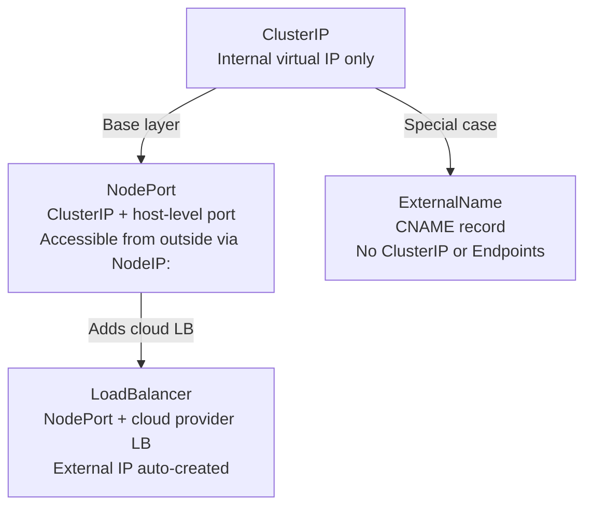
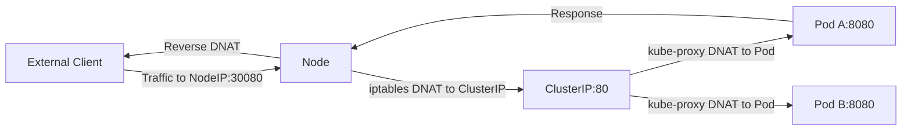
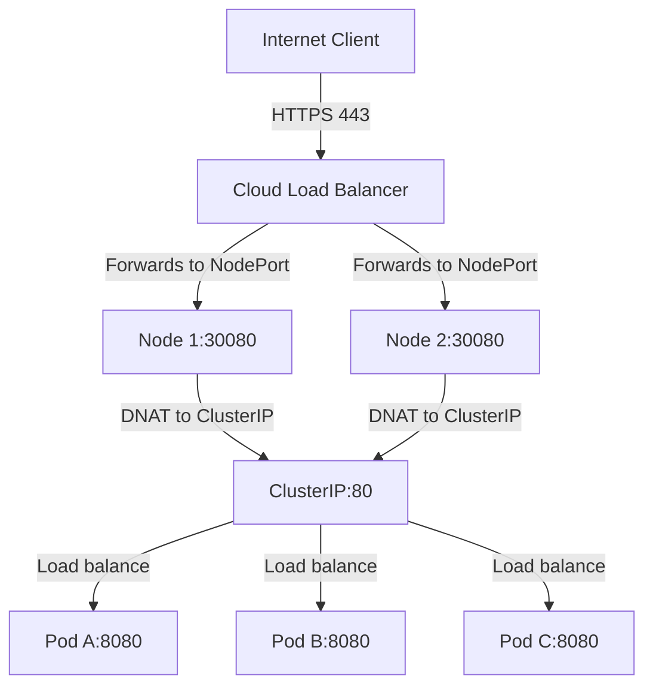
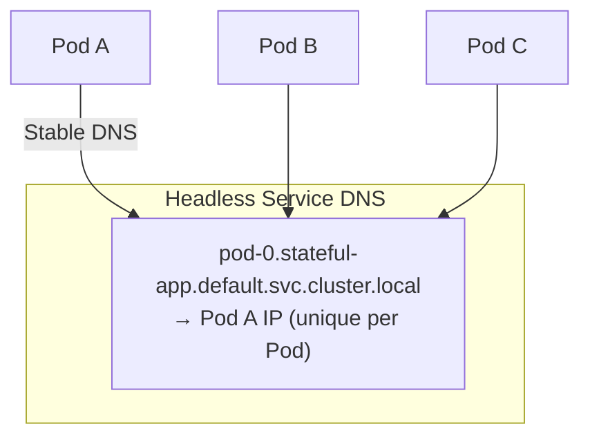

# Services - ClusterIP - Related Concepts

## Overview

ClusterIP is the default Kubernetes Service type, but it is part of a broader ecosystem of Service types and networking concepts. Understanding how ClusterIP relates to NodePort, LoadBalancer, ExternalName, headless Services, and Ingress is essential for building complete network architectures in Kubernetes.

## Service Type Hierarchy

The Kubernetes Service types form a logical hierarchy where each type builds upon the previous one:



### ClusterIP — The Foundation

ClusterIP provides an internal virtual IP that routes traffic to backend Pods within the cluster. It is the foundation that all other Service types build upon.

```yaml
apiVersion: v1
kind: Service
metadata:
  name: internal-api
spec:
  type: ClusterIP
  selector:
    app: api
  ports:
    - port: 80
      targetPort: 8080
```

**Key characteristics:**
- Only reachable from within the cluster
- Provides automatic load balancing across backends
- DNS resolves to ClusterIP via CoreDNS
- Uses kube-proxy for traffic interception and forwarding

### NodePort — ClusterIP + Host Port

NodePort opens a specific port on every cluster node, forwarding external traffic to the ClusterIP and then to backend Pods. NodePort is always built on top of a ClusterIP Service.

```yaml
apiVersion: v1
kind: Service
metadata:
  name: web-nodeport
spec:
  type: NodePort
  selector:
    app: web-app
  ports:
    - port: 80
      targetPort: 8080
      nodePort: 30080    # Optional; 30000-32767 if omitted
```

**How it works:**
1. External client sends traffic to `<any-node-ip>:30080`
2. The node's iptables/IPVS rules forward the packet to the ClusterIP (the internal Service)
3. kube-proxy load-balances the ClusterIP traffic to a backend Pod
4. The response follows the reverse path back to the client



**Port range:** NodePort values must be in the range 30000–32767 by default. This is configured via the `--service-node-port-range` API server flag.

**⚠ Pitfall:** If you specify a `nodePort` outside the valid range, the API server will reject the Service creation:

```bash
# This will fail — nodePort must be 30000-32767
kubectl apply -f service.yaml
# Error: Invalid value: 8080: must be in the range 30000-32767
```

**Best Practice for NodePort:** When possible, let Kubernetes assign the nodePort automatically by omitting `nodePort` from the spec. This avoids port conflicts between Services.

### LoadBalancer — NodePort + Cloud External IP

A LoadBalancer Service is a NodePort Service with an additional feature: the cloud provider automatically provisions an external load balancer (e.g., AWS ELB, GCP Cloud Load Balancer, Azure Load Balancer) and configures it to forward traffic to the NodePort on each node.

```yaml
apiVersion: v1
kind: Service
metadata:
  name: web-lb
spec:
  type: LoadBalancer
  selector:
    app: web-app
  ports:
    - port: 80
      targetPort: 8080
```

**What happens on major cloud providers:**

| Provider | Provisioned Resource | External Traffic Flow |
|----------|---------------------|----------------------|
| **AWS** | ELB / NLB | Client → ELB → NodeIP:NodePort → ClusterIP → Pod |
| **GCP** | Cloud Load Balancer | Client → L7/L4 LB → NodeIP:NodePort → ClusterIP → Pod |
| **Azure** | Azure Load Balancer | Client → LB → NodeIP:NodePort → ClusterIP → Pod |



**⚠ Cloud cost consideration:** Each LoadBalancer Service provisions a cloud load balancer, which incurs hourly and data processing charges. For development environments, prefer NodePort over LoadBalancer to reduce costs.

**Headless LoadBalancer:** Setting `clusterIP: None` with `type: LoadBalancer` creates a headless Service with an external load balancer. The cloud LB distributes traffic directly to Pod IPs (bypassing kube-proxy). This is used by some cloud providers for StatefulSet frontends.

### ExternalName — CNAME Record

ExternalName is a special Service type that does not use ClusterIP or Endpoints at all. It simply returns a CNAME DNS record pointing to an external hostname.

```yaml
apiVersion: v1
kind: Service
metadata:
  name: external-api
spec:
  type: ExternalName
  externalName: api.example.com
  ports:
    - port: 443
      targetPort: 443
```

**What happens:**
- DNS query for `external-api.default.svc.cluster.local` returns a CNAME record pointing to `api.example.com`
- No ClusterIP is allocated
- No Endpoints are created
- No kube-proxy rules are installed
- The client resolves the CNAME and connects directly to the external service

**Use case:** Routing internal service calls to external APIs without hardcoding the external hostname in client code.

```bash
# Verify ExternalName resolution
kubectl run dns-test --image=busybox:1.36 --rm -it --restart=Never -- \
  nslookup external-api

# Output should show a CNAME record
# Name:      external-api.default.svc.cluster.local
# Address:   api.example.com
# CNAME:     api.example.com
```

## Headless Services (clusterIP: None)

A headless Service disables cluster IP allocation, causing DNS to return individual Pod IPs instead of a single ClusterIP.

```yaml
apiVersion: v1
kind: Service
metadata:
  name: headless-svc
spec:
  clusterIP: None    # This makes it headless
  selector:
    app: stateful-app
  ports:
    - port: 8080
```

**DNS behavior difference:**

| Service Type | DNS Query Returns |
|-------------|-------------------|
| ClusterIP (normal) | A record with ClusterIP (e.g., 10.96.1.5) |
| Headless (`clusterIP: None`) | A records with individual Pod IPs (one per backend Pod) |

**Headless Service use cases:**
1. **StatefulSets** — Each Pod needs a stable, unique DNS record (e.g., `pod-0.stateful-app.default.svc.cluster.local`)
2. **Custom load balancers** — The client application performs its own load balancing
3. **Service discovery without proxying** — Clients discover all Pod IPs directly (e.g., for peer-to-peer protocols)
4. **Database clusters** — Where clients need to connect to specific instances (e.g., primary vs. replica)



**CKAD Exam Tip:** If a Service has `clusterIP: None`, DNS returns Pod IPs directly. For StatefulSets, this provides each Pod with a stable, unique DNS name that persists across Pod restarts.

## Ingress vs. Service Types

Ingress is not a Service type but often works alongside ClusterIP Services to provide external HTTP(S) access. The Ingress controller typically creates a LoadBalancer Service externally, and then routes HTTP(S) traffic to ClusterIP Services internally.
%comment broken maramaid 
```mermaid
flowchart LR
    Internet[Internet Client] -->|HTTPS| IngressCtrl[Ingress Controller<br/>(LoadBalancer/NodePort)]
    IngressCtrl -->|Routes by path/host| ClusterIP1[ClusterIP: user-service]
    IngressCtrl -->|Routes by path/host| ClusterIP2[ClusterIP: api-service]
    ClusterIP1 -->|Load balance| Pod1A[User Pod A]
    ClusterIP1 -->|Load balance| Pod1B[User Pod B]
    ClusterIP2 -->|Load balance| Pod2A[API Pod A]
    ClusterIP2 -->|Load balance| Pod2B[API Pod B]
```

The key distinction: Ingress operates at L7 (HTTP/HTTPS) and does path/host-based routing, while Service types operate at L4 (TCP/UDP) and do simple round-robin or session affinity.

## Service Discovery Comparison
%comment broken marmaid
```mermaid
flowchart TD
    A[How do clients discover backends?] --> B{Method}

    B --> C1[ClusterIP + kube-proxy<br/>Transparent proxying]
    B --> C2[DNS (CoreDNS)<br/>Resolves service names to IPs]
    B --> C3[EndpointSlice API<br/>Direct inspection of backends]

    C1 --> P1[Client connects to ClusterIP<br/>kube-proxy handles routing]
    C2 --> P2[Client resolves name via DNS<br/>then connects to ClusterIP or Pod IPs]
    C3 --> P3[Application queries EndpointSlice<br/>for backend list (e.g., client-side LB)"]
```

## Environment Variables and Service Discovery

When a Pod starts, Kubernetes injects environment variables for all Services visible in the Pod's namespace. This provides an alternative to DNS for service discovery.

```bash
# Environment variables injected at Pod startup
# For a Service named 'user-service' in namespace 'api':
USER_SERVICE_SERVICE_HOST=10.96.123.45
USER_SERVICE_SERVICE_PORT=80
USER_SERVICE_PORT_80_TCP=tcp
USER_SERVICE_PORT_80_TCP_ADDR=10.96.123.45
USER_SERVICE_PORT_80_TCP_PORT=80
USER_SERVICE_PORT_80_TCP_PROTO=tcp
```

**⚠ Limitation:** Environment variables are only set for Services that exist when the Pod starts. If you create a new Service after the Pod is running, the Pod will not have the corresponding environment variables. This is why DNS-based discovery is preferred in modern Kubernetes deployments.

## Endpoints for External Services

When you need to expose an external service through a Kubernetes Service, you can use manual Endpoints:

```yaml
apiVersion: v1
kind: Service
metadata:
  name: external-redis
spec:
  ports:
    - port: 6379
      targetPort: 6379
---
apiVersion: v1
kind: Endpoints
metadata:
  name: external-redis
subsets:
  - addresses:
      - ip: 10.0.1.100    # External Redis server
    ports:
      - port: 6379
```

**Alternative — ExternalName:**

```yaml
apiVersion: v1
kind: Service
metadata:
  name: external-redis
spec:
  type: ExternalName
  externalName: redis.example.com
```

**Choosing between manual Endpoints and ExternalName:**

| Criteria | Manual Endpoints | ExternalName |
|----------|-----------------|-------------|
| DNS resolution | A record with IP | CNAME to external hostname |
| Control over IPs | Explicit IPs required | Delegates to DNS |
| Supports multiple backends | Yes (multiple subsets) | No (single CNAME) |
| Health checking | Built into Service endpoints | Delegates to external DNS |
| Use case | Fixed external IPs | External DNS name with its own failover |

## Best Practices

1. **Use ClusterIP for internal communication** — it is the correct abstraction, provides load balancing, and is the most lightweight Service type.
2. **Use LoadBalancer only when cloud external access is needed** — provisioned cloud LBs incur costs.
3. **Use ExternalName for proxying to external services** — it avoids the complexity of manual Endpoints and is self-maintaining.
4. **Always set named ports** in multi-port Services for clarity and DNS SRV record support.
5. **Prefer DNS over environment variables** for service discovery — DNS works dynamically as Services are created after Pod startup.
6. **Use headless Services intentionally** — only for StatefulSets or custom service discovery logic. Do not use them as a default.
7. **Monitor your Service-to-Pod ratio** — a single ClusterIP with many backends can create large EndpointSlice objects that slow kube-proxy sync.
8. **Use `externalTrafficPolicy: Local`** with LoadBalancer/NodePort if client source IP preservation is required, but be aware it may cause uneven traffic distribution when backends are distributed across nodes.

## Troubleshooting

| Symptom | Likely Cause | Diagnosis | Fix |
|---------|-------------|-----------|-----|
| External traffic cannot reach ClusterIP | ClusterIP is internal only | Try `curl <cluster-ip>` from outside the cluster | Use NodePort, LoadBalancer, or Ingress |
| LoadBalancer takes long to provision | Cloud provider API rate limiting or quota | `kubectl describe svc` — check Events for timeout | Increase cloud quota; verify service account permissions |
| NodePort not accessible | Firewall blocking host port | Test from outside cluster: `nc <node-ip> <node-port>` | Open firewall rule for node port range |
| ExternalName not resolving | CoreDNS not installed | Check CoreDNS pod status: `kubectl -n kube-system get pods -l k8s-app=kube-dns` | Deploy CoreDNS if missing |
| ExternalName returns `name error` | External hostname DNS fails | `nslookup external-api.default.svc.cluster.local` | Verify external hostname exists and resolves |
| Headless Service returns no DNS | Endpoints empty (selector mismatch) | `kubectl get endpoints headless-svc` | Verify Service selector matches Pod labels |
| Client sees different ClusterIP after Service recreation | Old Service was deleted and a new one created | Check Service creation timestamp | Update client configuration with new ClusterIP or use DNS |
