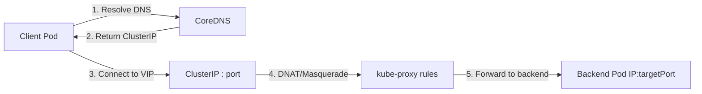

# Services - ClusterIP - Traffic Flow

## The Journey of a Single Request

When a Pod inside the cluster calls a Service (e.g., `curl http://web-service`), the request passes through **five layers** before reaching a healthy backend Pod. Understanding each layer is critical for debugging latency, connection refused errors, and unexpected routing behavior.



---

## Step 1: DNS Resolution

### What Happens
CoreDNS creates an `A` record for every Service:
```
<service-name>.<namespace>.svc.cluster.local
```
This resolves to the Service's ClusterIP (a virtual IP).

### Example
A Pod in the `default` namespace calls the `web-service` in the `api` namespace.

```bash
# From inside a client pod:
nslookup web-service.api.svc.cluster.local
# Output:
# Name:    web-service.api.svc.cluster.local
# Address: 10.96.0.1
```

**Best Practice:** Always use the FQDN (`service.namespace.svc.cluster.local`) in manifests to avoid resolution failures when namespace differs. Short names (`web-service`) only work if the Pod is in the same namespace.

### Community Tip
If DNS is slow or failing, check CoreDNS latency and the cluster's `ndots` configuration. A common gotcha is `ndots: 5` (default in some distros), which causes the resolver to append search domains aggressively and can add ~10ms per lookup.

---

## Step 2: Connect to the ClusterIP (VIP)

### What Happens
The client sends traffic to the ClusterIP on the Service port. The ClusterIP is **virtual** — no interface or host owns it. The packet hits the host network stack and is intercepted by kube-proxy rules.

### Key Concept: Conntrack
Linux connection tracking (`conntrack`) tracks the original connection tuple `(clientIP, clientPort, ClusterIP, ServicePort)`. If the backend Pod restarts mid-request, the connection may break unless session affinity is configured.

**Best Practice:** Always configure appropriate `readinessProbe`s on Pods. Without them, Endpoints may include Pods that cannot handle traffic, leading to TCP resets.

---

## Step 3: kube-proxy Intercepts Traffic

kube-proxy runs on **every node** and installs networking rules. It supports three modes:

| Mode | Mechanism | Pros | Cons |
|------|-----------|------|------|
| **iptables** | Random iptables rules | Simple, deterministic | `O(n)` rule scaling |
| **nftables** | nftables sets (K8s 1.25+) | Better performance, cleaner | Newer, less tooling |
| **IPVS** | L4 load balancer | L7 scheduling, real health checks | Extra dependency, more complex |

### iptables / nftables Flow
```
Client -> ClusterIP:80
  -> DNAT to Pod1:8080 (random selection)
  -> Route to Node hosting Pod1
  -> Pod1 responds to Client
```

### IPVS Flow
```
Client -> ClusterIP:80
  -> IPVS selects backend via scheduler (rr, lc, wlc, etc.)
  -> Direct routing or NAT to Pod1:8080
  -> Pod1 responds
```

### Example: Inspecting iptables rules
```bash
# List iube-proxy chains
sudo iptables -t nat -L -n -v | grep -A5 "KUBE-SVC-"

# Find the rule matching your Service ClusterIP
sudo iptables -t nat -L KUBE-SERVICES -n -v
```

### Best Practice
For clusters with **> 1000 Services**, prefer **IPVS** or **nftables** mode. iptables mode creates a rule per endpoint per Service per port; at scale this causes slow kube-proxy syncs and noisy `iptables-restore` calls.

**Community Knowledge:** In managed Kubernetes (EKS, GKE, AKS), iptables is often still the default. Check your kube-proxy configmap:
```bash
kubectl -n kube-system get configmap kube-proxy -o yaml
```

---

## Step 4: Endpoint Selection

### EndpointSlice Controller
Modern Kubernetes (1.21+) uses `EndpointSlices` instead of the legacy `Endpoints` object. Each EndpointSlice contains up to 100 backend Pods.

```bash
# View EndpointSlices for a Service
kubectl get endpointslices -l kubernetes.io/service-name=web-service
```

### Load Balancing
Without `sessionAffinity`, kube-proxy selects a backend **randomly** (iptables) or via the configured scheduler (IPVS). This is **L4 round-robin**.

**Best Practice:** Do not rely on IPVS for true L7 load balancing. For path-based routing, headers-based routing, or retries, add an Ingress or Service Mesh (e.g., Istio, Linkerd).

### Session Affinity
Set `sessionAffinity: ClientIP` to pin a client to a specific backend for the duration of `sessionAffinityConfig.clientIP.timeoutSeconds`.

```yaml
apiVersion: v1
kind: Service
metadata:
  name: web-service
spec:
  sessionAffinity: ClientIP
  sessionAffinityConfig:
    clientIP:
      timeoutSeconds: 10800  # 3 hours
```

**Warning:** `ClientIP` affinity is not sticky across Pod restarts. If the backend Pod dies, the next request will hit a new Pod.

---

## Step 5: Packet Forwarding to Pod

### Two Common Routing Paths

#### Path A: Node-local Pod
If the backend Pod runs on the **same node** as kube-proxy:
1. DNAT changes destination to Pod IP
2. Local routing delivers packet directly to Pod network namespace

#### Path B: Remote-node Pod
If the backend Pod runs on a **different node**:
1. DNAT changes destination to Pod IP
2. Routing forwards packet to the other node
3. The receiving node routes it to the Pod network namespace

### Hairpin / Hairpin NAT
When a Pod connects to its **own** Service IP, hairpin NAT ensures the packet loops back correctly.

```bash
# Test hairpin from inside a backend pod
kubectl exec -it <pod-name> -- curl -s http://web-service.default.svc.cluster.local
```

**Troubleshooting:** If hairpin fails, the CNI plugin may not support it. Check with:
```bash
# Should return the CNI config
cat /etc/cni/net.d/*.conf | jq .
```

### Best Practice
Always test traffic from a Pod in a **different namespace** and **different node** to ensure full path functionality.

---

## Debugging Traffic Flow

A systematic approach to diagnosing Service issues:

```bash
# 1. Verify Service exists and ClusterIP is allocated
kubectl get svc web-service

# 2. Verify EndpointSlices are populated
kubectl get endpointslices -l kubernetes.io/service-name=web-service -o wide

# 3. Check if a backend Pod is ready
kubectl get pods -l app=web-service
kubectl describe pod <pod-name> | grep -A5 "Conditions"

# 4. Test DNS resolution from another Pod
kubectl run debug --image=busybox -it --rm -- nslookup web-service

# 5. Test TCP connectivity from another Pod
kubectl run debug --image=busybox -it --rm -- wget -qO- http://web-service

# 6. Check kube-proxy logs on the node
kubectl -n kube-system logs -l k8s-app=kube-proxy --tail=100

# 7. Verify iptables rules
sudo iptables-save | grep <cluster-ip>
```

### Common Pitfalls

| Symptom | Likely Cause |
|---------|--------------|
| `connection refused` | Endpoints empty (selector mismatch, no ready Pods) |
| `connection timed out` | NetworkPolicy blocking, or kube-proxy not syncing |
| `no endpoints found` | Service selector labels don't match Pod labels |
| DNS resolves but TCP fails | CNI misconfiguration, or firewall blocking node-to-node traffic |
| 503 from external LB | All backends are unhealthy (readinessProbe failing) |

---

## Performance Considerations

1. **Service Topology Awareness**: Use `topologyKeys` to prefer backends in the same zone/region, reducing latency.
   ```yaml
   spec:
     topologyKeys:
       - "topology.kubernetes.io/zone"
       - "topology.kubernetes.io/region"
       - "*"
   ```

2. **External Traffic Policy**: Set `externalTrafficPolicy: Local` on NodePort/LoadBalancer to preserve client source IP and avoid extra hop.

3. **Avoid headless Services for normal load balancing**: Headless Services (`clusterIP: None`) bypass kube-proxy and return all Pod IPs directly to the client. Use only for StatefulSets or custom load balancing logic.

4. **Monitor kube-proxy sync latency**: Slow syncs cause stale Endpoints and dropped traffic during rolling updates.
