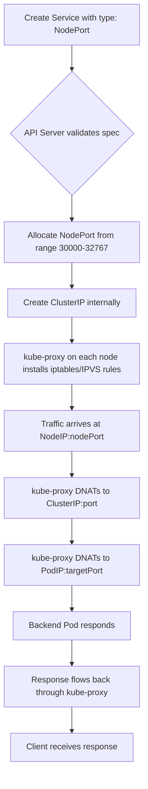
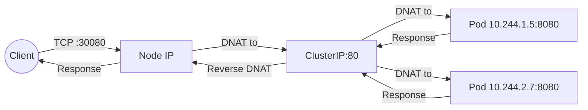
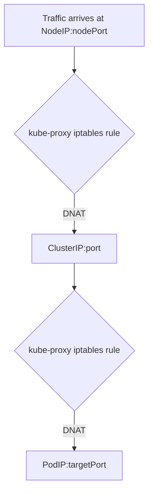
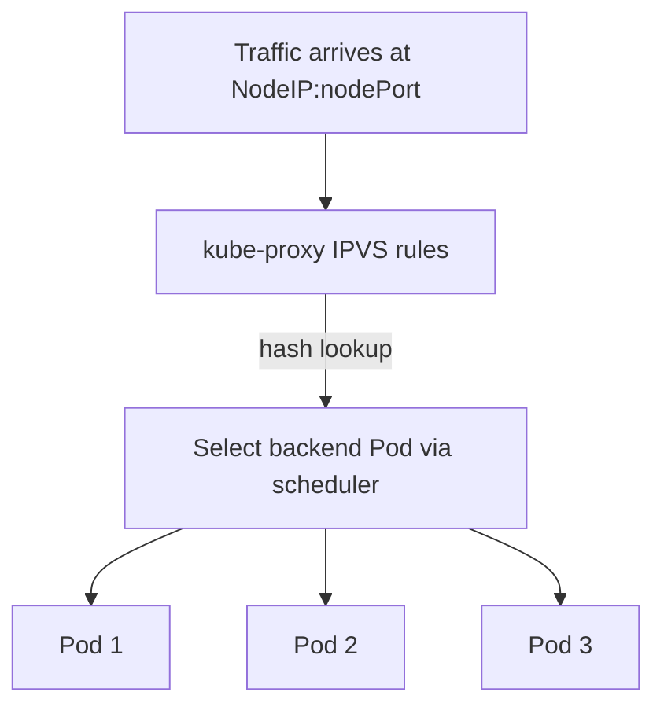

# Services - NodePort - Core Mechanics

NodePort is the simplest Kubernetes Service type for exposing a workload externally. It works by opening a specific port on every node in the cluster and forwarding traffic to the backend Pods through kube-proxy.

## How NodePort Works

When you create a Service of type `NodePort`, the Kubernetes control plane performs the following steps in order:



## The Three Ports

Every NodePort Service has three distinct port numbers that serve different roles:

| Port Field | Description | Example |
|---|---|---|
| `port` | The port exposed on the Service's ClusterIP | `80` |
| `targetPort` | The port on the backend Pod container | `8080` |
| `nodePort` | The port opened on every node's IP address | `30080` |

The relationship is: **Client → NodeIP:nodePort → ClusterIP:port → PodIP:targetPort**



## Port Range Configuration

The default NodePort range is **30000-32767**, controlled by the `--service-node-port-range` flag on the kube-apiserver and kube-controller-manager.

```bash
# Check the current nodePort range on the API server
ps aux | grep service-node-port-range

# Or check the kube-controller-manager manifest
cat /etc/kubernetes/manifests/kube-controller-manager.yaml | grep service-node-port-range
```

To change the range, you must modify the API server and controller manager flags and restart the components. This is rarely done in practice and is generally discouraged in managed clusters.

## Protocol Support

NodePort supports both **TCP** (default) and **UDP**:

```yaml
apiVersion: v1
kind: Service
metadata:
  name: udp-service
spec:
  type: NodePort
  selector:
    app: udp-app
  ports:
    - protocol: UDP
      port: 53
      targetPort: 53
      nodePort: 30053
```

When using UDP, kube-proxy creates separate DNAT rules for UDP traffic. The health checking behavior differs for UDP services, and not all cloud providers support UDP load balancing for their managed LoadBalancer services.

## kube-proxy Modes and NodePort

NodePort traffic is handled by kube-proxy, which operates in one of three modes:

### iptables Mode (default)



- kube-proxy installs iptables rules on every node.
- Rules are applied synchronously at rule creation time.
- Simple and reliable, but does not support connection-level balancing.

### IPVS Mode



- Uses Linux IPVS (IP Virtual Server) kernel module.
- Supports multiple scheduling algorithms (rr, lc, dh, sh, sed, nq).
- Better performance at scale with large numbers of Services and endpoints.
- Requires the `ip_vs` kernel modules to be loaded.

### userspace Mode (legacy)

- kube-proxy runs in userspace and proxies traffic itself.
- Deprecated since Kubernetes 1.22 and removed in later versions.
- Do not use in production.

## Session Affinity

NodePort Services support `sessionAffinity`, which controls whether repeated requests from the same client are routed to the same backend Pod:

```yaml
apiVersion: v1
kind: Service
metadata:
  name: web-nodeport
spec:
  type: NodePort
  sessionAffinity: ClientIP
  selector:
    app: web
  ports:
    - protocol: TCP
      port: 80
      targetPort: 8080
      nodePort: 30080
```

- `None` (default): Round-robin across all healthy backend Pods.

## Health Checking

For NodePort Services, kube-proxy does not perform active health checks on the nodePort itself. Instead, health checking is handled at the endpoint level through the Kubernetes readiness probes. If a Pod fails its readiness probe, it is removed from the endpoints list, and kube-proxy stops forwarding traffic to it.

```yaml
apiVersion: apps/v1
kind: Deployment
metadata:
  name: web
spec:
  selector:
    matchLabels:
      app: web
  template:
    metadata:
      labels:
        app: web
    spec:
      containers:
        - name: nginx
          image: nginx:1.25
          ports:
            - containerPort: 8080
          readinessProbe:
            httpGet:
              path: /healthz
              port: 8080
            initialDelaySeconds: 5
            periodSeconds: 10
```

## Key Takeaways

- NodePort opens a port on **every node** in the cluster, not just nodes running Pods.
- Traffic is DNATed twice: once to ClusterIP, then to PodIP.
- The nodePort range is configurable but defaults to 30000-32767.
- kube-proxy handles the forwarding in iptables or IPVS mode.
- Readiness probes determine which Pods receive traffic, not the nodePort itself.

## externalTrafficPolicy

The `externalTrafficPolicy` field controls how traffic from external clients is routed to backend Pods. It affects the source IP address preserved in the request and the routing behavior.

### Values

| Value | Behavior | Source IP Preserved |
|-------|----------|---------------------|
| `Cluster` (default) | Traffic is routed to any node, then forwarded to the backend Pod. | No — the source IP is replaced with the node's IP. |
| `Local` | Traffic is routed only to nodes that have at least one healthy backend Pod. | Yes — the original client source IP is preserved. |

### externalTrafficPolicy: Cluster (Default)

With the default `Cluster` policy, external traffic can arrive at any node in the cluster. kube-proxy on that node forwards the traffic to a backend Pod, which may be on a different node. The source IP is replaced with the node's IP.

```yaml
apiVersion: v1
kind: Service
metadata:
  name: web-nodeport
spec:
  type: NodePort
  externalTrafficPolicy: Cluster
  selector:
    app: web
  ports:
    - protocol: TCP
      port: 80
      targetPort: 8080
      nodePort: 30080
```

**Behavior:**
- Traffic can arrive at any node.
- kube-proxy forwards to any healthy Pod, regardless of which node it runs on.
- The source IP seen by the Pod is the node's IP, not the original client IP.
- Health checks from the cloud LB are only to the nodePort (not the Pod).

### externalTrafficPolicy: Local

With `Local`, traffic is only sent to nodes that have at least one healthy backend Pod running on them. The source IP is preserved end-to-end.

```yaml
apiVersion: v1
kind: Service
metadata:
  name: web-nodeport
spec:
  type: NodePort
  externalTrafficPolicy: Local
  selector:
    app: web
  ports:
    - protocol: TCP
      port: 80
      targetPort: 8080
      nodePort: 30080
```

**Behavior:**
- Traffic is sent only to nodes running healthy Pods for this Service.
- The source IP seen by the Pod is the original client IP.
- If a node has no healthy Pods, it is removed from the cloud LB's backend pool.
- Health checks from the cloud LB may target the Pod's readiness endpoint directly (depending on the cloud provider).

### When to Use Each Policy

| Scenario | Recommended Policy | Reason |
|----------|-------------------|--------|
| General web serving, no IP preservation needed | `Cluster` | Simpler, distributes load across all nodes |
| Need client IP in application logs/firewall rules | `Local` | Preserves source IP |
| High throughput with many nodes | `Cluster` | Better distribution across all nodes |
| Few nodes, need precise health checks | `Local` | Cloud LB only targets nodes with healthy Pods |
| Using a Service Mesh (Istio, Linkerd) | `Cluster` | The mesh handles source IP preservation |

### Internal Traffic Policy

The `internalTrafficPolicy` field controls how traffic from within the cluster is routed:

| Value | Behavior |
|-------|----------|
| `Cluster` (default) | Traffic is routed to any node with healthy Pods |
| `Local` | Traffic is routed only to nodes with healthy Pods running locally |

```yaml
spec:
  internalTrafficPolicy: Local
```

**When to use `internalTrafficPolicy: Local`:**
- You want to avoid extra network hops for intra-cluster traffic.
- You want Pods to prefer backends on the same node.

### Common Pitfalls

1. **`externalTrafficPolicy: Local` with too few nodes**: If you have fewer nodes than the cloud LB's minimum backend count, the LB may report no healthy backends.
2. **`externalTrafficPolicy: Local` and DaemonSets**: If a DaemonSet Pod is the backend, every node has a healthy Pod, so `Local` behaves similarly to `Cluster`.
3. **Source IP loss with `Cluster` policy**: The Pod sees the node's IP, not the client's IP. Use `Local` or a Service Mesh if you need the real client IP.
4. **Health check failures with `Local`**: If a node has no healthy Pods, the cloud LB may mark it unhealthy and stop sending traffic. This is expected behavior, not a bug.