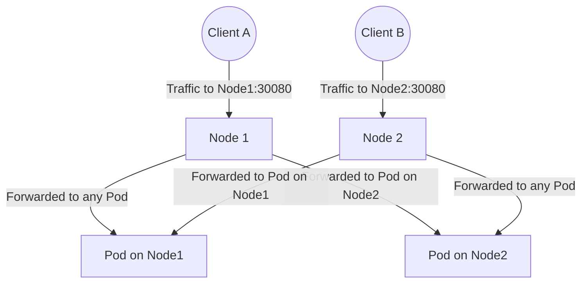
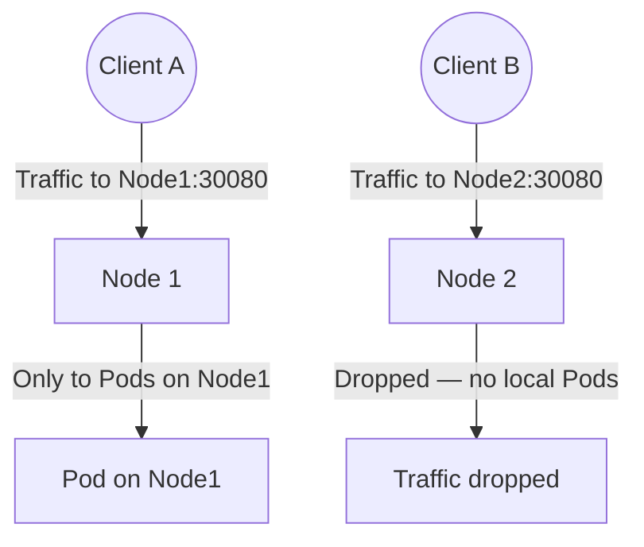

# Services - NodePort - Human-Friendly Notes

This file provides intuitive mental models and analogies to help you understand NodePort Services deeply, rather than just memorizing facts.

## Mental Model: The Building Analogy

Think of a Kubernetes cluster as a large office building:

| Concept | Building Analogy |
|---|---|
| **ClusterIP** | An internal extension number (e.g., "ext. 100") that only works inside the building. |
| **NodePort** | The same extension number, but also opened as a phone line on the **exterior wall** of the building. Anyone outside can dial it. |
| **kube-proxy** | The receptionist who answers the external phone line and transfers the call to the right desk (Pod). |
| **nodePort** | The specific external phone line number (e.g., line 30080). |
| **targetPort** | The extension number on the desk phone (e.g., ext. 8080). |
| **Pod** | A desk where an employee (application) sits and handles calls. |

With this analogy:
- **ClusterIP** = internal extension only
- **NodePort** = internal extension + external phone line on every floor
- **LoadBalancer** = NodePort + a dedicated external phone number assigned by the phone company (cloud provider)

## The Two External Traffic Policies

### `externalTrafficPolicy: Cluster` (default)



- Traffic arriving at **any node** can be forwarded to **any Pod**, even if that Pod is on a different node.
- The client's **source IP is lost** — the Pod sees the node's IP instead.
- Traffic is load-balanced across all Pods regardless of which node they run on.
- **Use when**: Source IP preservation is not needed and you want even distribution.

### `externalTrafficPolicy: Local`



- Traffic arriving at a node is **only forwarded to Pods on that same node**.
- The client's **source IP is preserved**.
- If a node has **no backend Pods**, traffic to that node's nodePort is **dropped**.
- **Use when**: You need source IP preservation or want to avoid double-hop traffic.

## When to Use NodePort

NodePort is the right choice when:

1. **You need quick, temporary external access** to a service for debugging or testing.
2. **You are running on bare-metal or on-premises** infrastructure without a cloud provider's load balancer.
3. **You are using a bare-metal load balancer** like MetalLB that assigns an external IP to the NodePort Service.
4. **You are building a foundation** for a LoadBalancer Service (which uses NodePort internally).
5. **You need a stable, predictable port** for a service that does not require a full cloud load balancer.

## When NOT to Use NodePort

- **Production HTTP/HTTPS applications** — Use Ingress instead, which provides host-based routing, TLS termination, and path-based routing.
- **When you need a static external IP** — Use LoadBalancer (or MetalLB on bare metal).
- **When you need advanced routing** (URL paths, host headers) — Use Ingress.
- **When security is a concern** — NodePort exposes a port on every node, which increases the attack surface. Use NetworkPolicies to restrict access.

## Common Gotchas

1. **NodePort is open on ALL nodes**, even nodes with no backend Pods. This means traffic can arrive at a node that has nothing to serve it (unless `externalTrafficPolicy: Local` is set).

2. **Firewall rules may block NodePort traffic.** If nodes are behind a firewall, you must explicitly allow traffic on the nodePort range (30000-32767).

3. **The nodePort is per-Service, not per-Pod.** If you create two NodePort Services that select different Pods, each gets its own nodePort. They do not share ports.

4. **DNS resolution for NodePort Services** does not work like ClusterIP Services. You cannot use `<svc-name>.<ns>.svc.cluster.local` to reach a NodePort Service from outside the cluster. You must use the node's IP address and the nodePort number.

5. **NodePort does not perform health checks on the nodePort itself.** If a node goes down, traffic is not automatically redirected to healthy nodes. You need an external load balancer or DNS-based failover for high availability.

## Quick Reference Card

```text
NodePort Service Anatomy:
┌─────────────────────────────────────────────┐
│  Client → NodeIP:30080 (nodePort)          │
│       ↓                                     │
│  kube-proxy on that node                    │
│       ↓                                     │
│  ClusterIP:80 (port) → Pod IP:8080         │
│       (targetPort)                          │
│       ↓                                     │
│  Backend Pod responds                       │
│       ↓                                     │
│  Response flows back through kube-proxy     │
│       ↓                                     │
│  Client receives response                   │
└─────────────────────────────────────────────┘
```