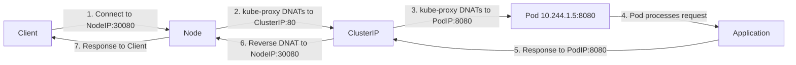

# Services - NodePort - Port Relationships Explained

Understanding the relationship between `port`, `targetPort`, and `nodePort` is fundamental to working with NodePort Services. Each port field serves a distinct role in the traffic path from the client to the backend Pod.

## The Three Ports in Detail

### `port` — The Service Port

The `port` field defines the port that the Service exposes on its internal ClusterIP address. This is the port that other Pods inside the cluster use to reach the Service.

```yaml
apiVersion: v1
kind: Service
metadata:
  name: web
spec:
  type: NodePort
  selector:
    app: web
  ports:
    - protocol: TCP
      port: 80        # ← The Service port (ClusterIP:80)
      targetPort: 8080 # ← The Pod container port
      nodePort: 30080  # ← The port on each node's IP
```

When a Pod inside the cluster connects to `web:80`, it is connecting to the ClusterIP address on port 80. kube-proxy then DNATs this to one of the backend Pods.

### `targetPort` — The Pod Port

The `targetPort` field defines the port on the backend Pod container that the application is actually listening on. This is the port that the container's process binds to.

```yaml
# Pod spec snippet
containers:
  - name: nginx
    image: nginx:1.25
    ports:
      - containerPort: 8080  # The app listens on 8080 inside the container
```

The `targetPort` must match the `containerPort` (or the port the application is actually listening on). If they do not match, traffic will be forwarded to a port where nothing is listening, and connections will fail.

### `nodePort` — The External Port

The `nodePort` field defines the port that is opened on **every node's IP address**. External clients connect to `<NodeIP>:<nodePort>` to reach the Service.

```yaml
ports:
  - protocol: TCP
    port: 80
    targetPort: 8080
    nodePort: 30080  # External clients use this
```

The `nodePort` must be within the range configured by `--service-node-port-range` (default 30000-32767). If omitted, Kubernetes auto-assigns an available port from this range.

## Traffic Flow: The Complete Path



### Step-by-step breakdown:

1. **Client connects** to `NodeIP:30080` (the nodePort).
2. **kube-proxy on the node** intercepts the traffic (via iptables or IPVS) and DNATs the destination to `ClusterIP:80`.
3. **kube-proxy performs a second DNAT** to select a backend Pod and changes the destination to `PodIP:8080` (the targetPort).
4. **The Pod receives the request** and processes it.
5. **The Pod sends the response** back to `ClusterIP:80`.
6. **kube-proxy reverses the DNAT** so the response leaves via the node's `nodePort`.
7. **The client receives the response**.

## Port Mapping Scenarios

### Same port for all three fields

```yaml
ports:
  - protocol: TCP
    port: 8080
    targetPort: 8080
    nodePort: 30080
```

The Service port, Pod port, and nodePort are all different numbers. This is the most common pattern when the application listens on a non-standard port inside the container.

### port and targetPort are the same, nodePort is different

```yaml
ports:
  - protocol: TCP
    port: 80
    targetPort: 80
    nodePort: 30080
```

The application listens on port 80 inside the container, and the Service exposes it on port 80 internally and 30080 externally.

### All three ports are different

```yaml
ports:
  - protocol: TCP
    port: 8080
    targetPort: 3000
    nodePort: 30080
```

The application listens on port 3000 inside the container. The Service exposes it as port 8080 internally and 30080 externally.

### Multiple ports on the same Service

```yaml
ports:
  - name: http
    protocol: TCP
    port: 80
    targetPort: 8080
    nodePort: 30080
  - name: metrics
    protocol: TCP
    port: 9090
    targetPort: 9090
    nodePort: 30090
  - name: dns
    protocol: UDP
    port: 53
    targetPort: 53
    nodePort: 30053
```

Each port entry gets its own nodePort. The `name` field is required when exposing multiple ports.

## Auto-Assignment of nodePort

If you omit `nodePort`, Kubernetes automatically assigns an available port from the configured range:

```bash
# Create a NodePort Service without specifying nodePort
kubectl expose deployment web --type=NodePort --port=80 --target-port=8080

# Check what nodePort was assigned
kubectl get svc web -o jsonpath='{.spec.ports[0].nodePort}'
```

The auto-assignment is atomic — the API server ensures no two Services get the same nodePort. However, if the range is exhausted, Service creation will fail.

## Practical Example: Full Workflow

```bash
# 1. Create a deployment
kubectl create deployment web --image=nginx:1.25 --replicas=2

# 2. Create a NodePort Service with explicit ports
cat <<EOF | kubectl apply -f -
apiVersion: v1
kind: Service
metadata:
  name: web-nodeport
spec:
  type: NodePort
  selector:
    app: web
  ports:
    - protocol: TCP
      port: 80
      targetPort: 8080
      nodePort: 30080
EOF

# 3. Verify the Service
kubectl get svc web-nodeport

# Expected output:
# NAME            TYPE       CLUSTER-IP      EXTERNAL-IP   PORT(S)        AGE
# web-nodeport    NodePort   10.96.123.45    <none>        80:30080/TCP   5s

# 4. Test connectivity from inside the cluster
kubectl run -it --rm test-pod --image=curlimages/curl -- sh
curl http://web-nodeport:80

# 5. Test connectivity from outside the cluster (using node IP)
curl http://<NodeIP>:30080
```

## Key Points to Remember

- `port` is the Service port (ClusterIP level).
- `targetPort` is the Pod container port.
- `nodePort` is the port on each node's IP for external access.
- All three can be the same or different numbers.
- `nodePort` must be in the range 30000-32767 (unless overridden).
- If `nodePort` is omitted, Kubernetes auto-assigns one.