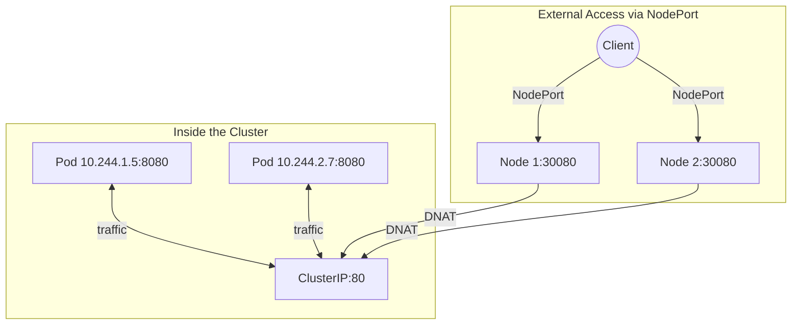
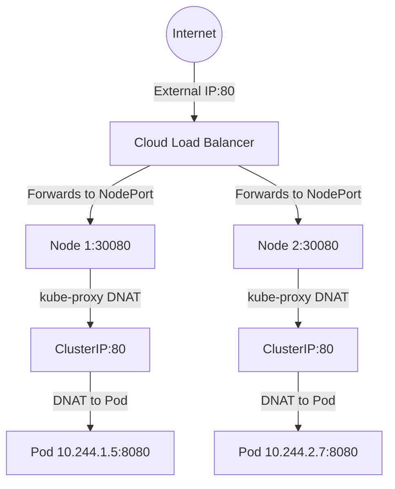
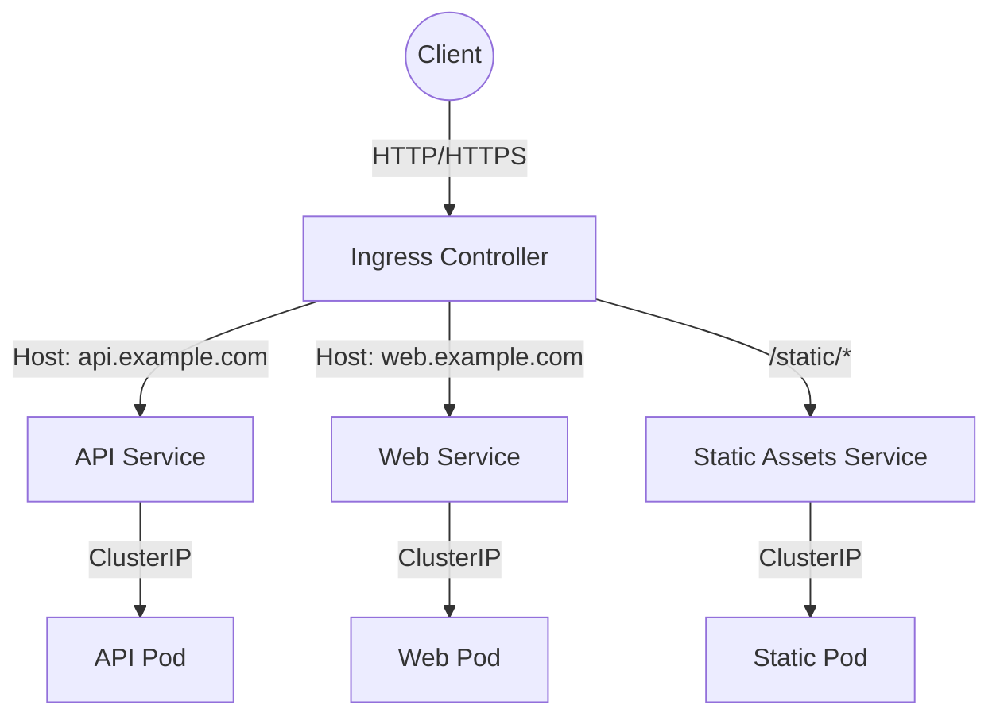

# Services - NodePort - Related Concepts

NodePort does not exist in isolation. It is part of a family of Kubernetes Service types and networking concepts that work together to provide connectivity. Understanding how NodePort relates to these other concepts is essential for designing robust Kubernetes networking architectures.

## Relationship with ClusterIP

ClusterIP is the **foundation** of all Service types. Every Service, including NodePort, gets a ClusterIP address. NodePort simply adds an additional entry point on each node's IP address.



Key insight: **ClusterIP is always created first**, even for NodePort Services. The NodePort is an additional layer on top of the ClusterIP infrastructure.

```bash
# Verify that a NodePort Service has a ClusterIP
kubectl get svc web-nodeport -o jsonpath='{.spec.clusterIP}'
# Output: 10.96.123.45

# The ClusterIP is used for internal cluster traffic
kubectl exec -it some-pod -- curl http://web-nodeport:80
```

## Relationship with LoadBalancer

LoadBalancer is essentially **NodePort with a cloud-managed external IP on top**. When you create a LoadBalancer Service, Kubernetes:

1. Creates a NodePort Service internally (allocating a nodePort from 30000-32767).
2. Asks the cloud provider's load balancer controller to create an external load balancer.
3. Configures the external load balancer to forward traffic to the nodePort on each node.



```bash
# Compare NodePort and LoadBalancer
kubectl get svc web-nodeport -o wide
kubectl get svc web-loadbalancer -o wide

# NodePort: EXTERNAL-IP is <none>
# LoadBalancer: EXTERNAL-IP is assigned by the cloud provider
```

### When to use NodePort vs LoadBalancer

| Criteria | NodePort | LoadBalancer |
|---|---|---|
| Cost | Free (no cloud LB cost) | Costs money (cloud LB hourly) |
| External IP | Node IP (dynamic) | Cloud-assigned static IP |
| High availability | Single node (or any node) | Cloud LB distributes across nodes |
| Use case | Dev/test, bare-metal, internal | Production workloads in cloud |
| Source IP | Lost (Cluster policy) or preserved (Local) | Depends on cloud LB config |

## Relationship with Ingress

Ingress is the **preferred way** to expose HTTP/HTTPS applications in Kubernetes. It operates at Layer 7 (application layer) and provides host-based and path-based routing.



Ingress typically uses a NodePort or LoadBalancer Service internally to expose the ingress controller itself. The Ingress then handles routing to backend Services.

```bash
# Example: Ingress controller exposed via NodePort
kubectl get svc ingress-nginx-controller -n ingress-nginx
# NAME                       TYPE       CLUSTER-IP      EXTERNAL-IP   PORT(S)
# ingress-nginx-controller   NodePort   10.96.0.50      <none>        80:30080/TCP,443:30443/TCP
```

### When to use NodePort directly vs Ingress

- **Use NodePort directly** when you need simple TCP/UDP exposure without Layer 7 routing.
- **Use Ingress** when you need HTTP/HTTPS routing with hostnames, paths, TLS termination, or rewrites.
- **Use LoadBalancer** when you need a dedicated external IP for a non-HTTP service (e.g., database, game server).

## Relationship with EndpointSlices and Endpoints

NodePort Services rely on the Kubernetes **endpoint** model to know which Pods to forward traffic to. The `Endpoints` or `EndpointSlices` objects are automatically populated based on the Service's `selector`.

```bash
# Check the endpoints for a NodePort Service
kubectl get endpoints web-nodeport

# Check the EndpointSlice
kubectl get endpointslices -o wide

# If endpoints are empty, the selector does not match any Pods
kubectl describe svc web-nodeport | grep Endpoints
```

If the selector does not match any Pods, the Service will have no endpoints, and traffic will fail even though the nodePort is open.

## Relationship with ExternalName

ExternalName is a fundamentally different Service type. Instead of routing to Pods via ClusterIP, it returns a CNAME record pointing to an external DNS name.

| Feature | NodePort | ExternalName |
|---|---|---|
| Routing target | Pods (via ClusterIP) | External DNS name (CNAME) |
| kube-proxy involvement | Yes (iptables/IPVS rules) | No (DNS only) |
| Ports defined | Yes (port, targetPort, nodePort) | No |
| Selector used | Yes | No |
| Health checks | Via readiness probes | None |

```bash
# ExternalName Service example
kubectl get svc my-db -o yaml
# spec:
#   type: ExternalName
#   externalName: mydb.example.com
```

## Community Knowledge

### MetalLB: Bringing LoadBalancer to Bare Metal

MetalLB is a popular open-source load balancer implementation for bare-metal Kubernetes clusters. It provides two modes:

- **Layer 2 mode**: One node responds to ARP requests for the external IP with its own MAC address. NodePort is used as the backend.
- **BGP mode**: Nodes announce the external IP via BGP to upstream routers, allowing direct routing to the correct node.

```bash
# Install MetalLB
kubectl apply -f https://raw.githubusercontent.com/metallb/metallb/v0.13.12/config/manifests/metallb-native.yaml

# Configure an IP address pool
cat <<EOF | kubectl apply -f -
apiVersion: metallb.io/v1beta1
kind: L2Advertisement
metadata:
  name: example
spec:
  ipAddressPools:
    - default
EOF
```

With MetalLB, a NodePort Service can get a stable external IP, effectively becoming a LoadBalancer on bare-metal infrastructure.

### kubectl port-forward as an Alternative

For development and debugging, `kubectl port-forward` is often simpler than NodePort:

```bash
# Forward local port 8080 to the Service's ClusterIP:80
kubectl port-forward svc/web-nodeport 8080:80

# Forward local port 8080 to a specific Pod
kubectl port-forward pod/web-pod-abc123 8080:8080
```

Port-forwarding creates a tunnel through the API server, so it does not require any node-level configuration and works even in restricted network environments.