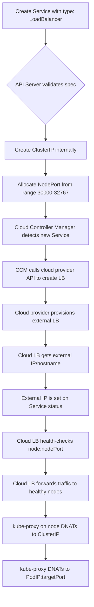
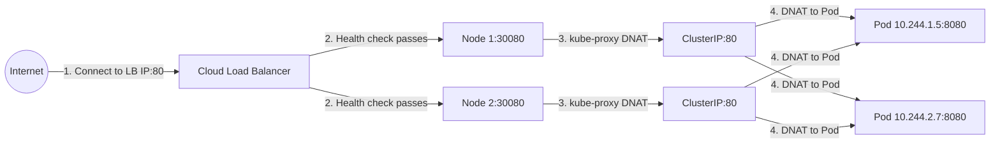
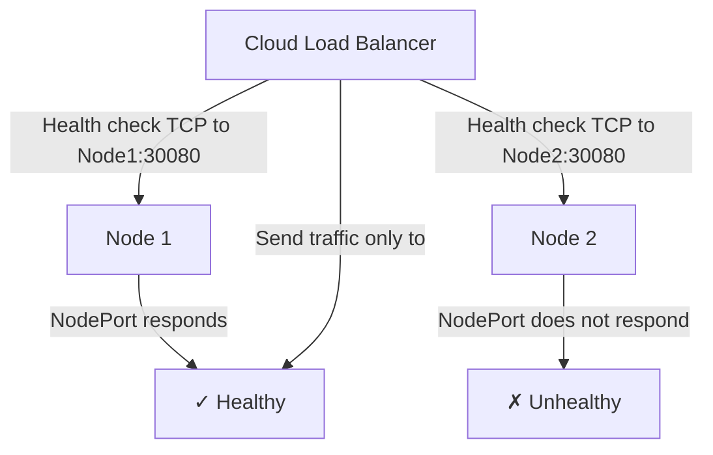

# Services - LoadBalancer - Core Mechanics
%comment make esplicit that the lb is essentially a way to balance the traffic among the nodes, it is better than nodeport cause you can use usual port like 8080 (nodeport goes 30000+) it is cloud managed so if a node goes down you dont loose the ip customer and DNS use, it does tcp connection healthcheck with eternalTrafficPolicy local avoiding the nodeport no-response in case of no matching pod.
usually at creation you get an ip that is somewhat stable till the cloud recycles it, but you can request a static one from cloud console or with lb k8s annotations.

say that it is essentially a service so can only route towards a set of pods with labels matching the selector, meaning in theory one lb per deployment, but since it is espensive the usual way is to attach it to an ingress controller deployment.
so the wholechain of events become
[External LoadBalancer]
  │
  ├─ (Random healty Entry Node in the cluster - one that can TCP connect)
  │   └─ nodeport > kube-proxy intercepts (creating a nodeport sets the kubeproxy to interceptall packets tothatport as if they where for the relative ClusterIP) and DNAT with EndpointSlices lookup to POD IP (unique per cluster each node gets a slice like 10.1.1.0/24) 
  |      └─> cni set routing table (records of (destination pod ip, next hop node ip if eth, interface eth0/cni0(pod ip, veth[tunnel to containers virtuel network] table)) decides where to send the packets 
  │
  ├─ (Node with Ingress Controller Pod)
  │   └─ cni set routing table > cni0 > veth > Ingress Controller Pod
  │       └─ checks routing rules > redirects to App Service ClusterIP 
  |         └─ kube-proxy intercepts ClusterIP, DNAT with EndpointSlices lookup 
  |           └─ cni set routing table > eth0/cni0 (cross-node tunnel or local veth)
  │
  └─ (Node with App Pod)
      └─ cni set routing table > cni0 > veth > App Pod
%endcomment


The LoadBalancer Service type extends NodePort by asking the cloud provider to provision an external load balancer that forwards traffic to the nodePort on each node. This is the standard way to expose Kubernetes workloads in cloud environments.

## How LoadBalancer Works

When you create a Service of type `LoadBalancer`, the Kubernetes control plane performs the following steps:



## The Cloud Controller Manager (CCM)

The Cloud Controller Manager is the component responsible for integrating Kubernetes with cloud providers. It runs as a pod in the `kube-system` namespace and handles:

- **Node discovery**: Identifying nodes in the cloud and their properties.
- **Route management**: Setting up cloud networking routes.
- **Service management**: Creating and deleting cloud load balancers for LoadBalancer Services.

```bash
# Check if CCM is running
kubectl get pods -n kube-system | grep cloud-controller

# Check CCM logs for LoadBalancer-related activity
kubectl logs -n kube-system deployment/cloud-controller-manager | grep -i "loadbalancer\|service"

# Check the cloud provider configuration on the API server
ps aux | grep kube-apiserver | grep cloud-provider
```

## Step-by-Step Traffic Flow



### Step 1: Client connects to the cloud load balancer's external IP.
The cloud LB has a static (or ephemeral) external IP assigned by the cloud provider.

### Step 2: The cloud LB performs health checks on each node's nodePort.
If a node's nodePort is not responding (e.g., no healthy Pods on that node), the cloud LB stops sending traffic to that node.

### Step 3: The cloud LB forwards traffic to a healthy node's nodePort.
kube-proxy on that node intercepts the traffic and DNATs it to the ClusterIP.

### Step 4: kube-proxy DNATs the traffic to a backend Pod.
The Pod receives the request, processes it, and sends the response back through the same path.

## Health Checking

Cloud load balancers perform health checks on each node's nodePort to determine which nodes are healthy:



The health check is a simple TCP connection attempt to the nodePort. If the connection succeeds, the node is considered healthy. If it fails, the cloud LB stops routing traffic to that node.

**Important**: The health check does not verify that the application is healthy — only that something is listening on the nodePort. If kube-proxy is running and the nodePort is open, the health check passes even if the backend Pods are not ready.

## Layer 4 Operation

LoadBalancer Services operate at **Layer 4 (Transport Layer)** of the OSI model. This means:

- They load balance based on IP addresses and TCP/UDP ports.
- They do not inspect HTTP headers, URLs, or hostnames.
- They cannot perform path-based or host-based routing.
- TLS termination must happen at the backend Pods or at a Layer 7 proxy (like Ingress).

```yaml
# LoadBalancer is purely Layer 4
apiVersion: v1
kind: Service
metadata:
  name: tcp-service
spec:
  type: LoadBalancer
  selector:
    app: tcp-app
  ports:
    - protocol: TCP
      port: 443
      targetPort: 8443
```

For Layer 7 (HTTP/HTTPS) routing with host/path rules, use **Ingress** instead.

## Cloud Provider-Specific Behavior

### AWS

- Creates a **Network Load Balancer (NLB)** for TCP/UDP traffic (or an **Application Load Balancer (ALB)** when using the AWS Load Balancer Controller with Ingress).
- Supports annotations for internal LB, scheme, subnets, and security groups.
- The external IP is an DNS name (e.g., `k8s-web-abc123.elb.amazonaws.com`), not a static IP.

```bash
# Check the LoadBalancer status
kubectl get svc web-lb -o jsonpath='{.status.loadBalancer.ingress}'
# Output: [{"hostname": "k8s-web-abc123.elb.amazonaws.com"}]
```

### GCP

- Creates a **Google Cloud Load Balancer** (HTTP(S) LB for HTTP, Network LB for TCP/UDP).
- Supports annotations for internal LB, static IP, and backend config.
- The external IP is a static IP allocated from the GCP project.

```bash
# Check the LoadBalancer status
kubectl get svc web-lb -o jsonpath='{.status.loadBalancer.ingress}'
# Output: [{"ip": "203.0.113.50"}]
```

### Azure

- Creates an **Azure Load Balancer** (Standard SKU recommended).
- Supports annotations for internal LB, SKU, and frontend IP configuration.
- The external IP is a public IP resource allocated from the Azure subscription.

```bash
# Check the LoadBalancer status
kubectl get svc web-lb -o jsonpath='{.status.loadBalancer.ingress}'
# Output: [{"ip": "20.30.40.50"}]
```

## Key Takeaways

- LoadBalancer creates a NodePort internally and asks the cloud provider for an external LB.
- The cloud provider's CCM handles the provisioning and configuration.
- Health checks are performed on each node's nodePort.
- LoadBalancer operates at Layer 4 (TCP/UDP).
- For Layer 7 routing, use Ingress instead.
- Each LoadBalancer Service provisions a real cloud load balancer with associated costs.

## externalTrafficPolicy

The `externalTrafficPolicy` field controls how traffic from external clients is routed to backend Pods. It affects the source IP address preserved in the request and the routing behavior.

### Values

| Value | Behavior | Source IP Preserved |
|-------|----------|---------------------|
| `Cluster` (default) | Traffic is routed to any node, then forwarded to the backend Pod. | No — the source IP is replaced with the node's IP. |
| `Local` | Traffic is routed only to nodes that have at least one healthy backend Pod. | Yes — the original client source IP is preserved. |

### When to Use Local
%comment say that lb is node wise while cloudIP is pod wise, and that kubeproxy always tries to redirect to current node pods ("nodeport behavior" - with cluster it can redirect away changing source ip, with local it cant and eventually drops - no response back not event 5** code - the packet if no matching pods on the current node so source ip preserved). with local, tcp healthchecks are executed by lb against kubeproxy health api, and kubeproxy responds 503 if no matching pods in the node, so they result as not available and no lb request is sent to them.
but in local if a node has 3 matching pods and another has only 1, and the lb is node wise, then the two n9des have the same traffic with the single pod having the same as the other three together.

`externalTrafficPolicy: Local` is recommended when:
- You need the original client IP in your application (e.g., for logging, rate limiting, or firewall rules).
- You want to reduce network hops by keeping traffic on the same node.
- You are using a Service Mesh that needs source IP preservation.

```yaml
apiVersion: v1
kind: Service
metadata:
  name: web-lb
spec:
  type: LoadBalancer
  externalTrafficPolicy: Local
  selector:
    app: web
  ports:
    - protocol: TCP
      port: 80
      targetPort: 8080
```

### Common Pitfall: Local with Fewer Nodes Than Backends

If you set `externalTrafficPolicy: Local` and a node has no healthy Pods, the cloud LB may mark that node as unhealthy and stop sending traffic to it. In clusters with few nodes, this can reduce capacity significantly.

### Internal Traffic Policy

The `internalTrafficPolicy` field controls how traffic from within the cluster is routed:

| Value | Behavior |
|-------|----------|
| `Cluster` (default) | Traffic is routed to any node with healthy Pods |
| `Local` | Traffic is routed only to nodes with healthy Pods running locally |

```yaml
spec:
  internalTrafficPolicy: Local
```

**When to use `internalTrafficPolicy: Local`:**
- You want to avoid extra network hops for intra-cluster traffic.
- You want Pods to prefer backends on the same node.
