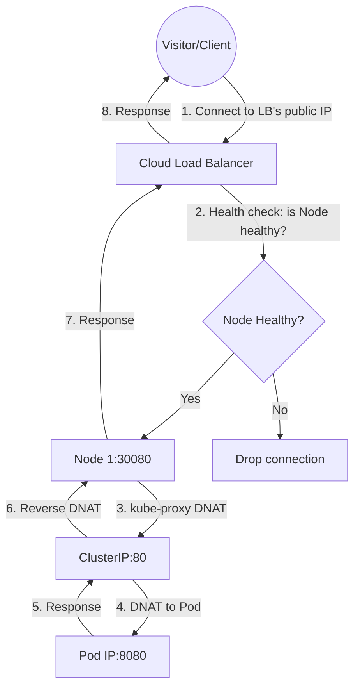
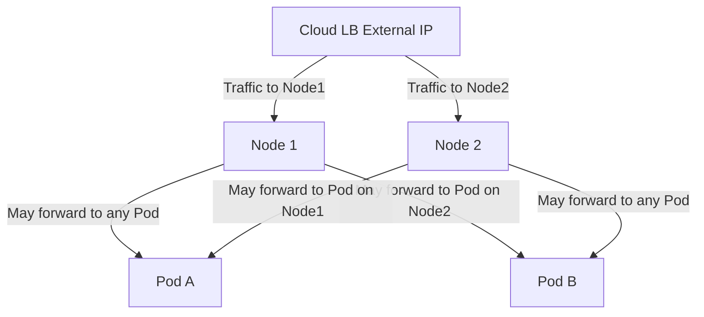
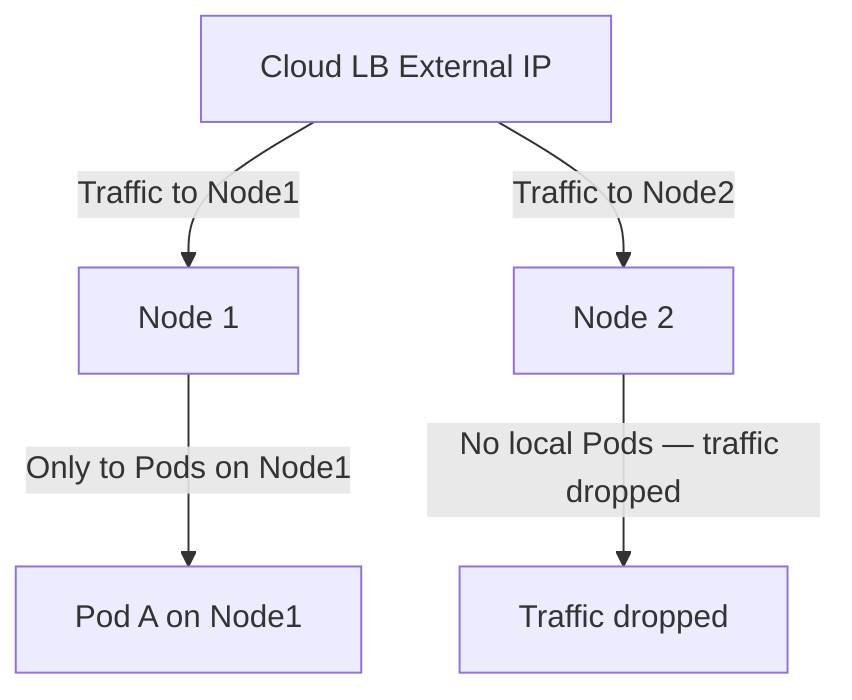

# Services - LoadBalancer - Human-Friendly Notes

This file provides intuitive mental models and analogies to help you understand LoadBalancer Services deeply.

## Mental Model: The Building with a Managed Entrance

Recall the building analogy from NodePort:

| Concept | Building Analogy |
|---|---|
| **ClusterIP** | Internal extension number (works inside the building only). |
| **NodePort** | Internal extension + external phone line on every floor. |
| **LoadBalancer** | NodePort + a **managed concierge desk** outside the building that routes visitors to the right floor. |

The LoadBalancer is like hiring a professional receptionist (the cloud load balancer) who stands outside the building, greets visitors, and directs them to the correct floor (node) where the internal receptionist (kube-proxy) takes over.

## The Complete Traffic Path



## When LoadBalancer Is the Right Choice

Use LoadBalancer when:

1. **You are running in a cloud environment** (AWS, GCP, Azure) and need a stable external IP.
2. **You need a dedicated external load balancer** for a non-HTTP service (e.g., database, game server, TCP service).
3. **You need high availability** — the cloud LB distributes traffic across multiple nodes automatically.
4. **You need source IP preservation** (with `externalTrafficPolicy: Local`).
5. **You are running a production workload** that requires a stable, managed external endpoint.

## When NOT to Use LoadBalancer

- **In bare-metal or on-premises clusters** without a cloud controller manager or MetalLB. The Service will stay in `Pending` forever.
- **For HTTP/HTTPS applications that need routing** — Use Ingress instead. Ingress provides host-based and path-based routing, TLS termination, and rewrites at a fraction of the cost.
- **For development/testing** — Use NodePort or `kubectl port-forward` instead. Provisioning a cloud LB for a dev environment is wasteful.
- **For internal-only services** — Use ClusterIP and expose via an internal Ingress or VPN.

## The Cost Factor

Cloud load balancers are not free. Understanding the cost implications is important for production workloads:

| Cloud Provider | LB Type | Approximate Monthly Cost |
|---|---|---|
| AWS | ALB | ~$22 + $0.008 per LCU hour |
| AWS | NLB | ~$22 + $0.006 per LCU hour |
| GCP | HTTP(S) LB | ~$18 + $0.008 per GB processed |
| GCP | Network LB | ~$18 + $0.008 per GB processed |
| Azure | Standard LB | ~$18 + $0.008 per GB processed |

**Rule of thumb**: If you create 10 LoadBalancer Services in AWS, you are paying for 10 ALBs — that is ~$220/month before any data processing fees. Use Ingress to consolidate HTTP traffic into a single LoadBalancer.

## externalTrafficPolicy Deep Dive

### `Cluster` (default)



- **Source IP is lost** — the Pod sees the node's internal IP, not the client's IP.
- **Traffic can hop between nodes** — a request to Node1 might be forwarded to a Pod on Node2.
- **Even distribution** — traffic is spread across all Pods regardless of which node they run on.

### `Local`



- **Source IP is preserved** — the Pod sees the real client IP.
- **No cross-node forwarding** — traffic stays on the node it arrives at.
- **Uneven distribution** — if one node has no Pods, traffic is dropped for clients routed to that node.
- **Cloud LB health checks** handle this by marking nodes without healthy Pods as unhealthy.

## Common Gotchas

1. **LoadBalancers in bare-metal clusters stay `Pending`**. This is expected behavior, not a bug. Install MetalLB to get LoadBalancer support on bare metal.

2. **The external IP may be ephemeral.** In some cloud providers, the external IP is released when the Service is deleted. Use a static IP annotation to preserve it.

3. **Health checks pass even if Pods are not ready.** The cloud LB checks if the nodePort is open, not if the application is healthy. Ensure your Pods have proper readiness probes.

4. **LoadBalancer does not support Layer 7 features.** No host-based routing, no path-based routing, no URL rewriting. Use Ingress for these features.

5. **Multiple LoadBalancers for HTTP apps are expensive.** If you have 5 HTTP microservices, each with its own LoadBalancer, you are paying for 5 cloud load balancers. Use Ingress with a single LoadBalancer instead.

## Quick Reference Card

```text
LoadBalancer Service Anatomy:
┌─────────────────────────────────────────────────┐
│  Internet → Cloud LB External IP:80          │
│       ↓                                             │
│  Cloud LB health-checks node:nodePort          │
│       ↓                                             │
│  Cloud LB forwards to healthy node:nodePort    │
│       ↓                                             │
│  kube-proxy on node DNATs to ClusterIP:80     │
│       ↓                                             │
│  kube-proxy DNATs to PodIP:8080                │
│       ↓                                             │
│  Pod processes request                             │
│       ↓                                             │
│  Response flows back through the same path     │
└─────────────────────────────────────────────────┘
```