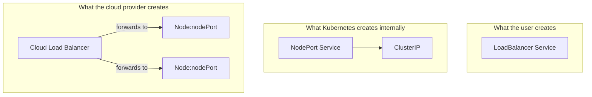
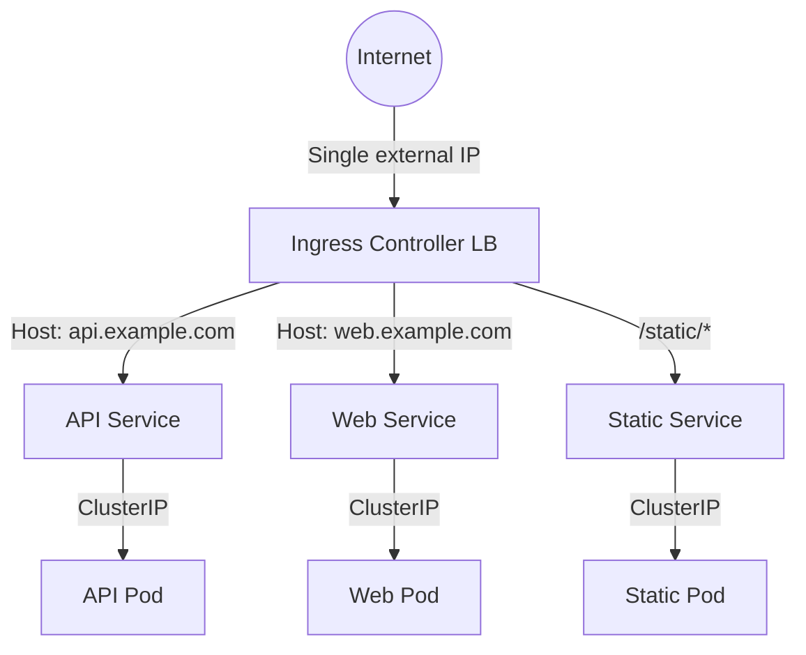

# Services - LoadBalancer - Related Concepts

LoadBalancer Services do not exist in a vacuum. They are part of a broader Kubernetes networking ecosystem that includes NodePort, Ingress, and the cloud provider infrastructure. Understanding these relationships is essential for designing effective exposure strategies.

## Relationship with NodePort

NodePort is the **internal foundation** of every LoadBalancer Service. When you create a LoadBalancer Service, Kubernetes automatically creates a NodePort Service underneath it. The cloud load balancer then forwards traffic to the nodePort on each node.



```bash
# Verify that a LoadBalancer Service has a nodePort
kubectl get svc web-lb -o jsonpath='{.spec.ports[0].nodePort}'
# Output: 31234

# Verify that it has a ClusterIP
kubectl get svc web-lb -o jsonpath='{.spec.clusterIP}'
# Output: 10.96.123.45
```

Key insight: **You can access a LoadBalancer Service internally via its ClusterIP, just like any other Service.** The LoadBalancer is only for external traffic.
%comment misleading, it seems loadbalancer is a deployment served throug a service. while in reality the served/accessded thing are pods matching the service selector

## Relationship with Ingress

Ingress and LoadBalancer serve different purposes and are often used together:

| Feature | LoadBalancer | Ingress |
|---|---|---|
| Layer | Layer 4 (TCP/UDP) | Layer 7 (HTTP/HTTPS) |
| Routing | IP/port based | Host/path based |
| TLS termination | At backend Pods | At Ingress controller |
| Cost | Cloud LB per Service | Single LB for all HTTP services |
| Use case | Non-HTTP services, databases | Web applications, APIs |
| Source IP | Preserved with `externalTrafficPolicy: Local` | Preserved via `X-Forwarded-For` |


%comment misleading, seems like ingress controller LB is the external LB and not a deployment of an nginx (or similar) working as lb that is exposed through externallb/nodeport/clusteriip.
### When to use each

- **Use LoadBalancer** for non-HTTP services (databases, message queues, gRPC services) or when you need a dedicated external IP.
- **Use Ingress** for HTTP/HTTPS web applications that need host-based or path-based routing.
- **Use both** when you have a mix of HTTP and non-HTTP services — one LoadBalancer for the Ingress controller, and LoadBalancers for non-HTTP services.

### Ingress with a LoadBalancer backend

The Ingress controller itself is typically exposed via a LoadBalancer Service:

```yaml
# Ingress controller Service
apiVersion: v1
kind: Service
metadata:
  name: ingress-nginx-controller
  namespace: ingress-nginx
spec:
  type: LoadBalancer
  selector:
    app.kubernetes.io/name: ingress-nginx
  ports:
    - name: http
      port: 80
      targetPort: http
    - name: https
      port: 443
      targetPort: https
```

```bash
# Check the Ingress controller's external IP
kubectl get svc -n ingress-nginx ingress-nginx-controller
```

## Relationship with EndpointSlices

LoadBalancers rely on the Kubernetes endpoint model to determine which Pods to forward traffic to. The cloud load balancer's health checks are independent of Kubernetes readiness probes, but the kube-proxy rules that forward traffic to Pods depend on the endpoint model.

```bash
# Check endpoints for a LoadBalancer Service
kubectl get endpoints web-lb

# Check EndpointSlices
kubectl get endpointslices -o wide

# If endpoints are empty, the cloud LB will health-check successfully
# but traffic will fail because there are no backend Pods
kubectl describe svc web-lb | grep Endpoints
```

## Relationship with ExternalName

ExternalName is fundamentally different from LoadBalancer:

| Aspect | LoadBalancer | ExternalName |
|---|---|---|
| Mechanism | Cloud-provisioned LB + nodePort | DNS CNAME record |
| kube-proxy involvement | Yes (iptables/IPVS rules) | No (DNS only) |
| Health checks | Cloud LB health checks | None |
| Ports | Defined (port, targetPort, nodePort) | None |
| Selector | Required | Not allowed |
| External IP | Yes (cloud-assigned) | No (resolves to external DNS) |

```bash
# LoadBalancer: external IP from cloud provider
kubectl get svc web-lb -o jsonpath='{.status.loadBalancer.ingress}'

# ExternalName: resolves via DNS to an external hostname
kubectl get svc my-db -o jsonpath='{.spec.externalName}'
# Output: mydb.example.com
```

## Community Knowledge: The Ingress + LoadBalancer Pattern

The most common production pattern for exposing Kubernetes workloads is:

1. **One LoadBalancer** for the Ingress controller (handles all HTTP/HTTPS traffic).
2. **ClusterIP Services** for all backend workloads.
3. **Additional LoadBalancers** only for non-HTTP services (databases, TCP services).

This pattern minimizes cloud costs by consolidating HTTP traffic through a single load balancer while still providing external access for non-HTTP services.

```yaml
# Example: Single Ingress with multiple backends
apiVersion: networking.k8s.io/v1
kind: Ingress
metadata:
  name: main-ingress
  annotations:
    nginx.ingress.kubernetes.io/rewrite-target: /
spec:
  ingressClassName: nginx
  rules:
    - host: api.example.com
      http:
        paths:
          - path: /
            pathType: Prefix
            backend:
              service:
                name: api-service
                port:
                  number: 80
    - host: web.example.com
      http:
        paths:
          - path: /
            pathType: Prefix
            backend:
              service:
                name: web-service
                port:
                  number: 80
```

## Best Practices

- **Use a single LoadBalancer for Ingress** to minimize costs and simplify management.
- **Use ClusterIP for all internal communication** between services.
- **Use LoadBalancer only for services that genuinely need external exposure** at the transport layer.
- **Set `externalTrafficPolicy: Local`** on LoadBalancer Services when source IP preservation is required.
- **Monitor cloud LB costs** — unexpected LoadBalancer Services can significantly increase your cloud bill.
