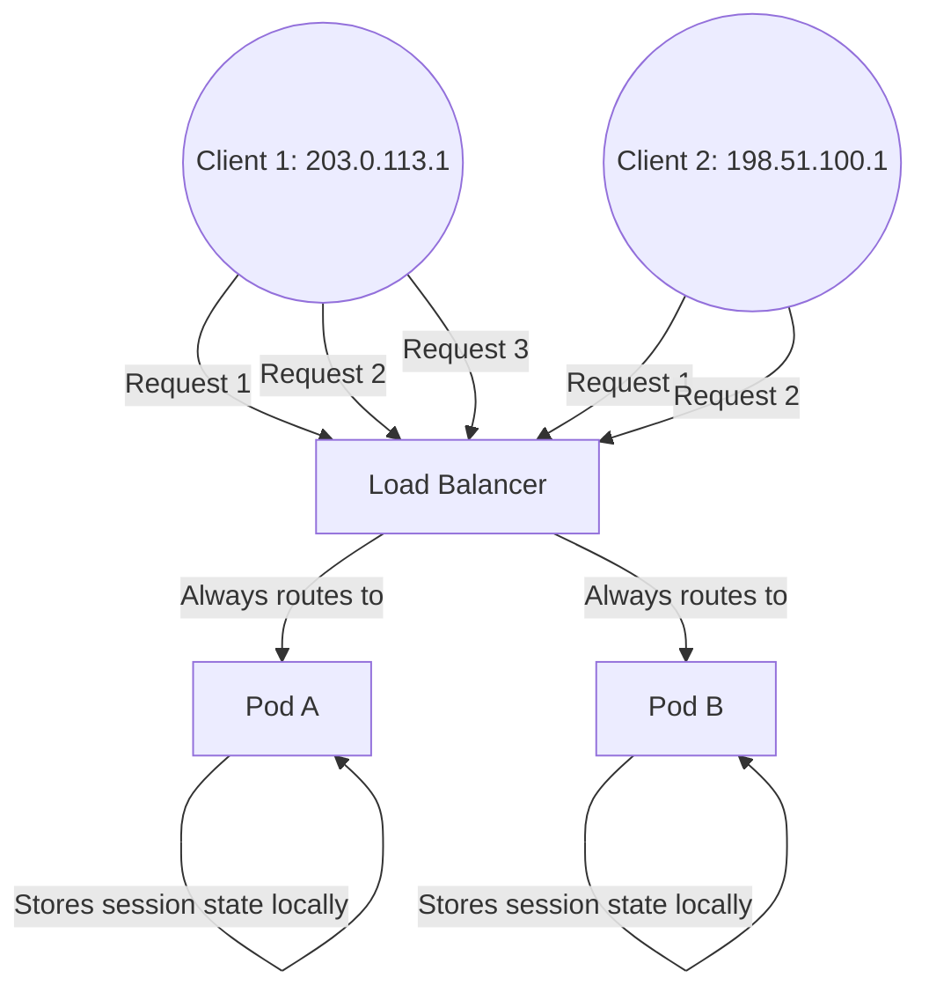
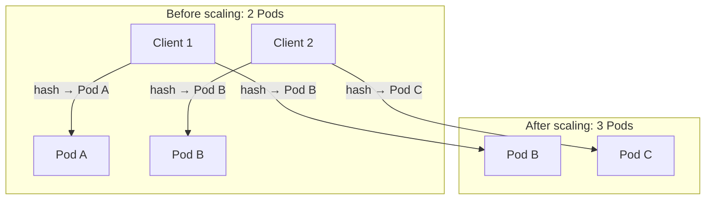

# Services - LoadBalancer - Session Affinity

Session affinity (also known as sticky sessions) ensures that requests from the same client are consistently routed to the same backend Pod. This is important for stateful applications that store session data locally rather than in a shared store.

## What Is Session Affinity?

Session affinity configures the Service to use the client's IP address as the basis for routing decisions. When affinity is enabled, all requests from the same client IP are directed to the same backend Pod.



## Configuration

### `sessionAffinity: ClientIP`

```yaml
apiVersion: v1
kind: Service
metadata:
  name: web-lb
spec:
  type: LoadBalancer
  sessionAffinity: ClientIP
  sessionAffinityConfig:
    clientIP:
      timeoutSeconds: 3600
  selector:
    app: web
  ports:
    - protocol: TCP
      port: 80
      targetPort: 8080
```

- **`ClientIP`**: Requests from the same client IP are routed to the same backend Pod.
- **`timeoutSeconds`**: The duration (in seconds) that affinity is maintained. Default is 10800 seconds (3 hours). After the timeout expires, the client may be routed to a different Pod.

### `sessionAffinity: None` (default)

```yaml
apiVersion: v1
kind: Service
metadata:
  name: web-lb
spec:
  type: LoadBalancer
  sessionAffinity: None
  selector:
    app: web
  ports:
    - protocol: TCP
      port: 80
      targetPort: 8080
```

- **`None`**: Requests are distributed across all healthy backend Pods using round-robin (or the cloud LB's scheduling algorithm).
- No client IP tracking is performed.

## How Session Affinity Works at Each Layer

### Kubernetes Level (kube-proxy)

When `sessionAffinity: ClientIP` is set, kube-proxy installs iptables or IPVS rules that hash the client IP to select a backend Pod:
%comment broken mermaid
```mermaid
flowchart TD
    Client[Client IP: 203.0.113.1] -->|arrives at NodePort| KubeProxy[kube-proxy]
    KubeProxy -->|hash(ClientIP) % NumPods| PodA[Pod A]
    Client2[Client IP: 198.51.100.1] -->|arrives at NodePort| KubeProxy
    KubeProxy -->|hash(ClientIP) % NumPods| PodB[Pod B]
```

The hash is consistent, so the same client IP always maps to the same Pod (as long as the number of Pods does not change).

### Cloud Load Balancer Level

Cloud load balancers also support session affinity independently of Kubernetes:

- **AWS ALB**: Supports application-based sticky sessions using cookies.
- **AWS NLB**: Supports static stickiness based on source IP (5-tuple hash).
- **GCP**: Supports client IP-based affinity with a configurable timeout.
- **Azure**: Supports client IP-based affinity.

When both Kubernetes session affinity and cloud LB affinity are configured, they interact:

1. The cloud LB routes the client to a node based on its affinity settings.
2. kube-proxy on that node routes the request to a Pod based on Kubernetes session affinity.

**Important**: If the cloud LB affinity and Kubernetes session affinity are misaligned, traffic may be routed inconsistently.

## When to Use Session Affinity

### Use `ClientIP` affinity when:

1. **The application stores session state locally** in memory and does not use a shared session store (e.g., Redis, database).
2. **The application requires client IP-based routing** for compliance or security reasons.
3. **WebSocket connections** need to stay pinned to a single Pod.
4. **gRPC streaming connections** require consistent routing.

### Use `None` (round-robin) when:

1. **The application is stateless** and can handle requests from any Pod.
2. **Even load distribution** is more important than session consistency.
3. **Pods are frequently scaled** — affinity mappings become stale when Pods are added or removed.
4. **The application uses a shared session store** (Redis, database, Memcached).

## Pitfalls and Troubleshooting

### Pitfall 1: Affinity breaks when Pods scale

When the number of backend Pods changes, the hash mapping changes, and clients may be routed to a different Pod:



**Solution**: Use a shared session store (Redis, database) instead of relying on session affinity for stateful applications.

### Pitfall 2: Source IP is not the real client IP

When `externalTrafficPolicy: Cluster` (default), the source IP seen by the Pod is the node's IP, not the client's IP. Session affinity based on this IP will group all clients behind the same node together:

```bash
# Check what source IP the Pod sees
kubectl logs <pod-name>
# The source IP will be the node's internal IP, not the client's IP
```

**Solution**: Use `externalTrafficPolicy: Local` to preserve the client's source IP.

### Pitfall 3: Timeout is too short or too long

- **Too short**: Clients are frequently re-routed to different Pods, causing session loss.
- **Too long**: If a Pod becomes unhealthy, clients are stuck trying to route to it until the timeout expires.

```bash
# Check the current timeout
kubectl get svc web-lb -o jsonpath='{.spec.sessionAffinityConfig.clientIP.timeoutSeconds}'
```

**Solution**: Set the timeout based on your application's session duration. For web applications, match it to your session cookie's max age.

### Pitfall 4: Cloud LB affinity and Kubernetes affinity conflict

If the cloud provider's LB also has affinity enabled, the two layers of affinity can interact in unexpected ways:

- The cloud LB may route Client A to Node 1.
- kube-proxy on Node 1 may route Client A to Pod B (based on its hash).
- If Node 1 goes down, the cloud LB routes Client A to Node 2.
- kube-proxy on Node 2 may route Client A to Pod C (different hash on different node).

**Solution**: Disable session affinity on the cloud LB and rely solely on Kubernetes session affinity, or vice versa. Do not enable both unless you understand the interaction.

## Debugging Session Affinity

```bash
# 1. Check if session affinity is enabled
kubectl get svc web-lb -o jsonpath='{.spec.sessionAffinity}'

# 2. Check the timeout
kubectl get svc web-lb -o jsonpath='{.spec.sessionAffinityConfig.clientIP.timeoutSeconds}'

# 3. Verify external traffic policy
kubectl get svc web-lb -o jsonpath='{.spec.externalTrafficPolicy}'

# 4. Test from the same client IP multiple times
# From a fixed IP, make multiple requests and check which Pod handles them
for i in $(seq 1 10); do
  curl -s -o /dev/null -w "%{remote_ip}\n" http://<LB-IP>:80
done

# 5. Check the cloud LB's affinity settings in the cloud console
# (AWS: Target Group attributes, GCP: Backend service settings)
```

## Best Practices

- **Prefer shared session stores** (Redis, database) over session affinity for stateful applications. This provides true high availability — if a Pod fails, the session is still available on another Pod.
- **Use `externalTrafficPolicy: Local`** with `sessionAffinity: ClientIP` to ensure the client's real IP is used for affinity hashing.
- **Set an appropriate timeout** that matches your application's session lifetime.
- **Monitor Pod health** — if a Pod with active sessions goes down, those sessions are lost unless you use a shared session store.
- **Document your affinity strategy** — session affinity can cause unexpected behavior during scaling events and Pod failures.
