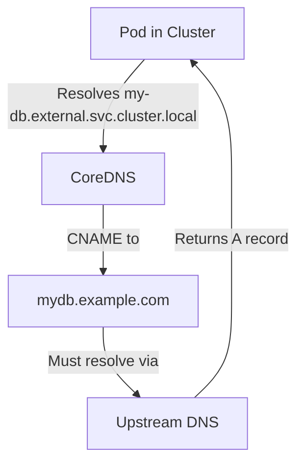
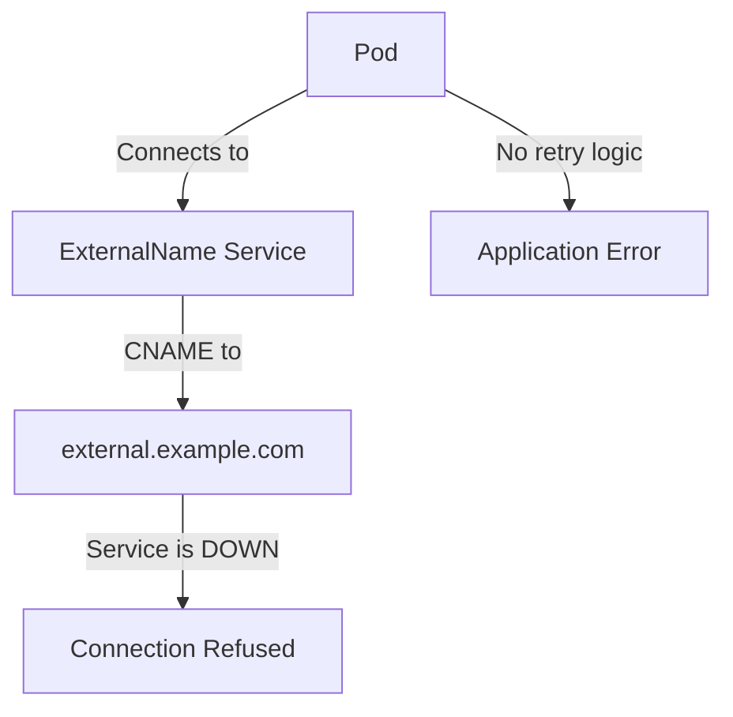
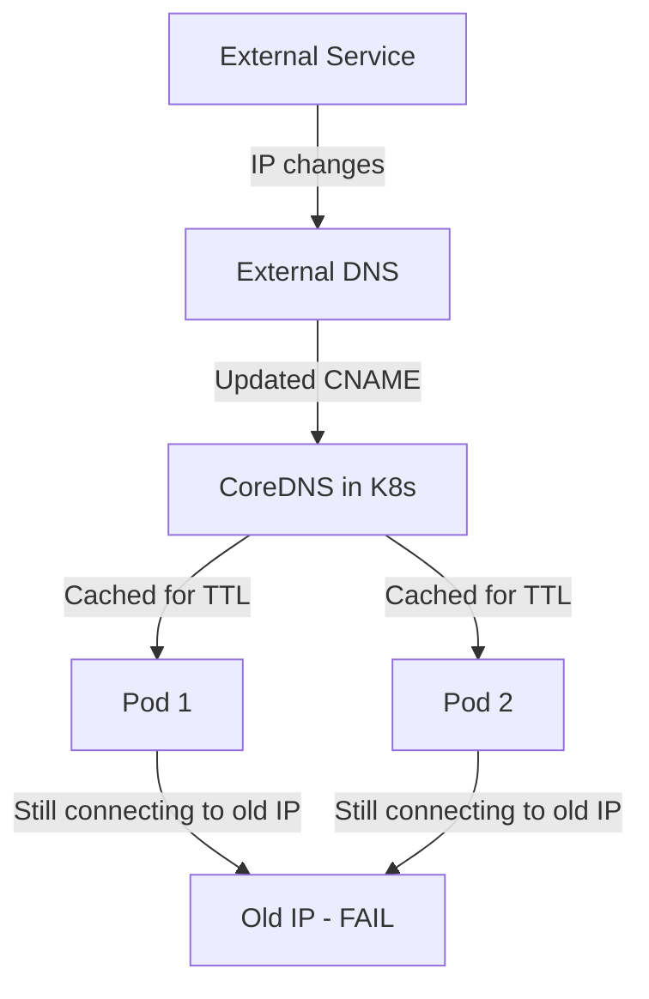

# Services - ExternalName - Common Pitfalls

ExternalName Services are unique among Kubernetes Service types. They do not route traffic to Pods — they return a DNS CNAME record that points to an external hostname. This fundamental difference creates several pitfalls that operators and developers frequently encounter.

## Pitfall 1: External Host Must Be Resolvable from Pods

An ExternalName Service returns a CNAME record via CoreDNS. For this to work, the external hostname must be resolvable from within the cluster.



If CoreDNS cannot reach the upstream DNS servers, or if the external hostname does not exist, resolution fails:

```bash
# Test DNS resolution from a Pod
kubectl run -it --rm dns-test --image=busybox:1.36 -- nslookup my-db.external.svc.cluster.local

# If resolution fails, check CoreDNS upstream configuration
kubectl get configmap coredns -n kube-system -o yaml

# Check if the cluster can reach external DNS
kubectl run -it --rm net-test --image=busybox:1.36 -- sh
nslookup google.com
```

**Common causes of resolution failure:**
- CoreDNS is not configured with upstream nameservers.
- Network policies block DNS traffic to external servers.
- The external hostname does not exist or has expired.
- The cluster's firewall blocks outbound UDP/TCP port 53.

## Pitfall 2: No Health Checks — Downstream Failures Are Silent

Unlike LoadBalancer or NodePort Services, ExternalName Services have **no health checks**. If the external service goes down, Pods will simply receive connection refused errors. There is no Kubernetes-level mechanism to detect or react to downstream failures.



**This means:**
- Your application must handle connection failures gracefully.
- There is no Kubernetes-side retry or circuit-breaking.
- You cannot use readiness probes to detect external service health (readiness probes only check the Pod itself).

**Mitigation strategies:**
- Implement retry logic with exponential backoff in your application.
- Use a service mesh (e.g., Istio, Linkerd) that provides circuit breaking and retry policies.
- Implement a sidecar proxy that can detect downstream failures and fail fast.
- Monitor the external service independently and alert when it is down.

## Pitfall 3: No TLS Termination or Path Rewriting

ExternalName Services are pure DNS indirection. They do not:
- Terminate TLS.
- Rewrite URL paths.
- Add or modify headers.
- Perform any Layer 7 processing.

```yaml
# This does NOT work for TLS termination
apiVersion: v1
kind: Service
metadata:
  name: external-api
spec:
  type: ExternalName
  externalName: api.example.com
  ports:
    - port: 443
      targetPort: 443
```

The `ports` field on an ExternalName Service is informational only — it does not configure any proxying or TLS termination. Traffic to the external service goes directly from the Pod to the external IP.

**If you need TLS termination or path rewriting, use:**
- An Ingress resource with an Ingress controller.
- A Service Mesh with a sidecar proxy.
- An application-level HTTP client with TLS configuration.

## Pitfall 4: No Load Balancing or Failover

ExternalName Services provide no load balancing. The DNS resolution returns a single CNAME record, and the external DNS server determines which IP(s) the client connects to. Kubernetes has no control over this.

```bash
# ExternalName resolves to a CNAME, not multiple A records managed by K8s
kubectl run -it --rm dns-test --image=busybox:1.36 -- nslookup -type=CNAME my-db.external.svc.cluster.local
# Output: mydb.example.com
```

If the external service has multiple IPs behind a DNS round-robin, that is the external DNS server's behavior — Kubernetes is not involved.

**Implications:**
- No Kubernetes-level health checking of the external service.
- No ability to distribute traffic across multiple external endpoints from within Kubernetes.
- If the external service's DNS returns a single IP, there is no redundancy.

## Pitfall 5: ExternalName Does Not Work with `kubectl port-forward`

You cannot use `kubectl port-forward` with an ExternalName Service because there is no ClusterIP to forward to:

```bash
# This will fail
kubectl port-forward svc/my-db 6379:6379
# Error: unable to listen on port 6379: no endpoints available
```

**Workaround:** Port-forward directly to a Pod that can reach the external service, or use `kubectl proxy` with a custom setup.

## Pitfall 6: DNS Caching Can Stale External IP Changes

Since ExternalName relies on DNS, changes to the external service's IP address may not propagate immediately due to DNS caching:



**Mitigation:**
- Set a low TTL on the external DNS records (e.g., 60 seconds).
- Use `ndots:5` in Pod DNS configuration to ensure proper resolution.
- Implement client-side DNS caching with a short TTL.

## Pitfall 7: ExternalName Cannot Be Used with `kubectl exec` Debugging

When debugging connectivity to an external service, you cannot simply exec into a Pod and test the connection using the Service name if the external hostname is not resolvable from the node:

```bash
# This works if the external hostname resolves
kubectl exec -it debug-pod -- nslookup my-db.external.svc.cluster.local

# This may fail if the node cannot reach external DNS
kubectl exec -it debug-pod -- curl -v my-db.external.svc.cluster.local
```

**Debugging strategy:**
- Test DNS resolution from within a Pod (not from the node).
- Test connectivity to the resolved IP directly.
- Check if network policies allow outbound DNS and HTTP/HTTPS traffic.

## Pitfall 8: Confusing ExternalName with LoadBalancer

ExternalName and LoadBalancer serve fundamentally different purposes:

| Aspect | ExternalName | LoadBalancer |
|---|---|---|
| Purpose | DNS alias for external service | Expose workload externally via cloud LB |
| Traffic path | Pod → external DNS → external IP | Internet → cloud LB → node → Pod |
| kube-proxy involvement | None | iptables/IPVS rules |
| Ports defined | No | Yes |
| Selector | Not allowed | Required |
| Health checks | None | Cloud LB health checks |
| Use case | Accessing external services | Exposing internal workloads |

## Troubleshooting Checklist

1. **DNS resolution fails**: Check CoreDNS upstream config, network policies, and firewall rules.
2. **Connection refused**: The external service may be down. Test connectivity from a Pod directly to the external hostname.
3. **Stale IP after external change**: Check TTL values and DNS caching.
4. **ExternalName Service shows no endpoints**: This is expected — ExternalName Services do not have endpoints.
5. **TLS errors**: ExternalName does not terminate TLS. Ensure the external service has a valid certificate and the Pod trusts the CA.
6. **Slow resolution**: Check if the external DNS server is slow or if there are network latency issues to the DNS resolver.