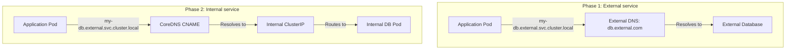

# Services - ExternalName - Common Use Cases

ExternalName Services are a specialized Kubernetes resource that provides DNS-based indirection to external services. While less commonly used than ClusterIP, NodePort, or LoadBalancer, they solve specific architectural problems elegantly.

## Use Case 1: Hybrid Migration (Cutover Pattern)

The most powerful use case for ExternalName is during a migration from an external service to an internal Kubernetes service. By pointing an ExternalName to the internal Service, you can cut over seamlessly without changing application code.

### Scenario: Migrating a Database from External to Internal



### Implementation

**Phase 1: Point ExternalName to the external service**

```yaml
apiVersion: v1
kind: Service
metadata:
  name: my-db
  namespace: production
spec:
  type: ExternalName
  externalName: db.external.com
```

```bash
# Verify DNS resolution
kubectl run -it --rm dns-test --image=busybox:1.36 -- sh
nslookup my-db.production.svc.cluster.local
# Output: db.external.com
```

**Phase 2: Deploy the internal database**

```yaml
apiVersion: apps/v1
kind: Deployment
metadata:
  name: internal-db
spec:
  selector:
    matchLabels:
      app: internal-db
  template:
    metadata:
      labels:
        app: internal-db
    spec:
      containers:
        - name: postgres
          image: postgres:15
          ports:
            - containerPort: 5432
---
apiVersion: v1
kind: Service
metadata:
  name: internal-db
spec:
  selector:
    app: internal-db
  ports:
    - protocol: TCP
      port: 5432
      targetPort: 5432
```

**Phase 3: Point ExternalName to the internal Service**

```yaml
apiVersion: v1
kind: Service
metadata:
  name: my-db
  namespace: production
spec:
  type: ExternalName
  externalName: internal-db.production.svc.cluster.local
```

```bash
# Verify the cutover
kubectl run -it --rm dns-test --image=busybox:1.36 -- sh
nslookup my-db.production.svc.cluster.local
# Output: internal-db.production.svc.cluster.local
# Resolves to ClusterIP of internal-db Service
```

**Key benefit**: The application never changes its connection string. It always connects to `my-db.production.svc.cluster.local`. The DNS record changes, and traffic is redirected transparently.

## Use Case 2: Third-Party API Integration

When your application needs to call a third-party API, hardcoding the external hostname in environment variables or config maps creates tight coupling. An ExternalName Service provides a stable internal name.

```yaml
apiVersion: v1
kind: Service
metadata:
  name: stripe-api
  namespace: payment
spec:
  type: ExternalName
  externalName: api.stripe.com
```

```yaml
# Application config uses the internal Service name
apiVersion: apps/v1
kind: Deployment
metadata:
  name: payment-processor
spec:
  template:
    spec:
      containers:
        - name: processor
          image: payment-processor:latest
          env:
            - name: STRIPE_API_URL
              value: "http://stripe-api.payment.svc.cluster.local/v1/charges"
```

**Benefits:**
- The application uses a stable internal DNS name.
- If the external API changes its hostname, you only update the ExternalName Service.
- You can mock the external API during testing by replacing the ExternalName with a ClusterIP Service.

## Use Case 3: Multi-Environment Service Discovery

ExternalName can point to different external services in different namespaces or environments, allowing the same internal name to resolve to different backends.

```yaml
# Namespace: staging
apiVersion: v1
kind: Service
metadata:
  name: payment-gateway
  namespace: staging
spec:
  type: ExternalName
  externalName: api.stripe.com
---
# Namespace: production
apiVersion: v1
kind: Service
metadata:
  name: payment-gateway
  namespace: production
spec:
  type: ExternalName
  externalName: api.stripe.com/v2
```

```bash
# In staging, resolves to Stripe's API
kubectl run -it --rm test --image=busybox:1.36 -n staging -- nslookup payment-gateway.staging.svc.cluster.local

# In production, resolves to Stripe's v2 API
kubectl run -it --rm test --image=busybox:1.36 -n production -- nslookup payment-gateway.production.svc.cluster.local
```

## Use Case 4: Service Mocking and Testing

During development and testing, you can use ExternalName to point to mock services or alternative endpoints:

```yaml
# Development: Point to a local mock service
apiVersion: v1
kind: Service
metadata:
  name: payment-gateway
  namespace: dev
spec:
  type: ExternalName
  externalName: mock-payment.local
---
# Testing: Point to a test environment
apiVersion: v1
kind: Service
metadata:
  name: payment-gateway
  namespace: test
spec:
  type: ExternalName
  externalName: api.stripe.com/test
```

## Use Case 5: Legacy System Integration

When integrating with legacy systems that have stable DNS names but are not running in Kubernetes, ExternalName provides a clean abstraction:

```yaml
apiVersion: v1
kind: Service
metadata:
  name: legacy-auth
  namespace: auth
spec:
  type: ExternalName
  externalName: auth.legacy.corp.local
```

## Use Case 6: CDN and External Service Aliasing

When you want to provide a consistent internal name for a CDN or external service that may change its DNS:

```yaml
apiVersion: v1
kind: Service
metadata:
  name: cdn-assets
  namespace: web
spec:
  type: ExternalName
  externalName: d12345678abcdef.cloudfront.net
```

## Best Practices for ExternalName Use Cases

1. **Use ExternalName for external service abstraction, not for exposing internal workloads.** If you need to expose a Pod externally, use NodePort, LoadBalancer, or Ingress.

2. **Keep the externalName FQDN short and stable.** Long or frequently changing external names make debugging harder.

3. **Use namespace-qualified names for internal Services.** When pointing ExternalName to an internal Service, use the full FQDN: `<svc-name>.<ns>.svc.cluster.local`.

4. **Document the purpose of each ExternalName Service.** Since ExternalName Services do not have selectors or endpoints, they can be easy to overlook during troubleshooting.

5. **Consider using a Helm chart or Kustomize overlay** to manage ExternalName Services across environments, so you can point the same Service name to different external endpoints in different environments.