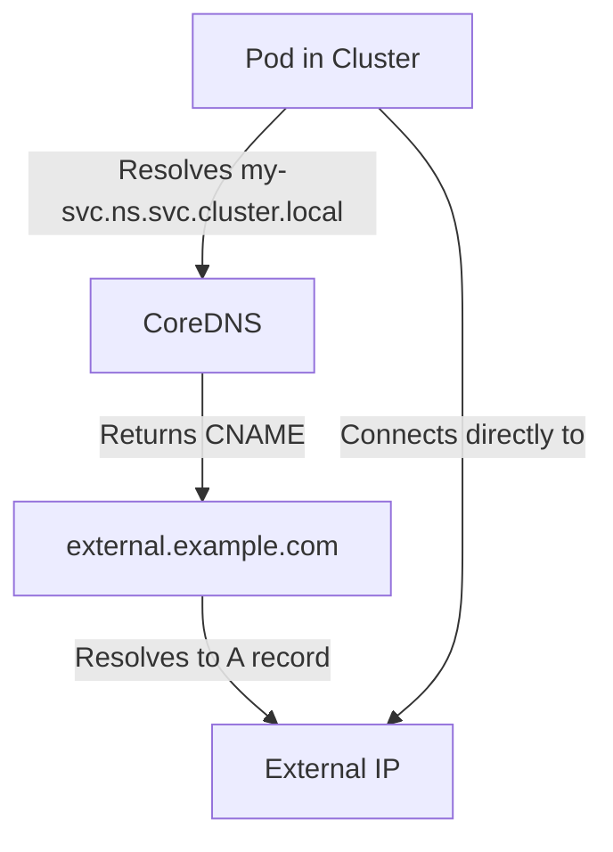
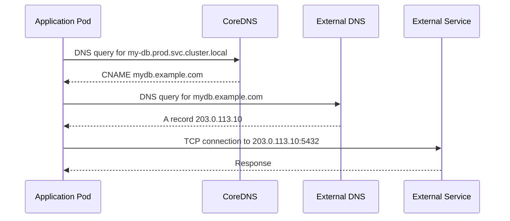

# Services - ExternalName - Core Mechanics

ExternalName is a unique Kubernetes Service type that maps a Service name to an external DNS name using a CNAME record. Unlike other Service types, it does not use selectors, ports, or endpoints — it operates purely at the DNS level.

## How ExternalName Works

When a Pod resolves the DNS name `<svc-name>.<ns>.svc.cluster.local` for an ExternalName Service, CoreDNS returns a CNAME record pointing to the `externalName` value.



### Key difference from other Service types

| Aspect | ClusterIP/NodePort/LoadBalancer | ExternalName |
|---|---|---|
| DNS record type | A record (ClusterIP) | CNAME record |
| Traffic path | Pod → ClusterIP → kube-proxy → Pod | Pod → resolved external IP |
| kube-proxy involvement | Yes (iptables/IPVS) | None |
| Endpoint controller | Yes | No |
| Selector required | Yes | No |
| Ports defined | Yes | Informational only; not used for proxying |

## The CNAME Resolution Process

### Step 1: Pod queries CoreDNS

When a Pod tries to connect to `my-db.production.svc.cluster.local`, it sends a DNS query to CoreDNS.

### Step 2: CoreDNS matches the Service

CoreDNS checks its records and finds that `my-db.production.svc.cluster.local` is an ExternalName Service.

### Step 3: CoreDNS returns a CNAME record

```
my-db.production.svc.cluster.local CNAME mydb.example.com
```

### Step 4: The Pod resolves the CNAME target

The Pod's resolver follows the CNAME to `mydb.example.com` and queries the external DNS server for the A/AAAA record.

### Step 5: The Pod connects directly to the external IP

The Pod establishes a connection directly to the resolved external IP address. Kubernetes is not involved in the actual data path.



## No Selector, No Ports, No Endpoints

ExternalName Services are fundamentally different from other Service types in what they do not have:

### No Selector

A selector is not allowed on an ExternalName Service because there are no Pods to select. The Service does not participate in the Kubernetes endpoint model.

```yaml
# This is INVALID for ExternalName
apiVersion: v1
kind: Service
metadata:
  name: my-db
spec:
  type: ExternalName
  selector:        # ← This field is not allowed
    app: my-db
```

### No Ports

The `ports` field is not used by ExternalName Services. It can be included for documentation purposes, but it has no effect on traffic routing.

```yaml
apiVersion: v1
kind: Service
metadata:
  name: my-db
spec:
  type: ExternalName
  externalName: mydb.example.com
  ports:
    - name: postgres
      port: 5432
      protocol: TCP
  # The ports above are informational only
```

### No Endpoints

ExternalName Services do not have endpoints. The `endpoints` and `endpointslices` controllers skip ExternalName Services entirely.

```bash
# ExternalName Services have no endpoints
kubectl get endpoints my-db
# No endpoints found

kubectl get endpointslices | grep my-db
# No results

# This is expected behavior
kubectl describe svc my-db | grep Endpoints
# Endpoints:         <none>
```

## DNS Configuration in CoreDNS

The CoreDNS `external` plugin handles ExternalName resolution. The default CoreDNS configuration includes a stub domain for the cluster domain that handles ExternalName Services.

```bash
# View the CoreDNS ConfigMap
kubectl get configmap coredns -n kube-system -o yaml
```

The relevant CoreDNS configuration typically looks like:

```
zone cluster.local {
    errors
    health
    kubernetes cluster.local in-addr.arpa ip6.arpa {
       pods insecure
       fallthrough in-addr.arpa ip6.arpa
    }
    prometheus :9153
    forward . /etc/resolv.conf
    cache 30
    loop
    reload
    loadbalance round_robin
}
```

When a query for an ExternalName Service is received, CoreDNS returns the CNAME record. The client's resolver then follows the CNAME to resolve the external hostname.

## Immediate DNS Propagation

Because ExternalName relies on DNS rather than kube-proxy rules, changes to the `externalName` field take effect immediately at the DNS level. There is no need to restart kube-proxy or wait for iptables/IPVS rule updates.
%comment say that kubeproxy is a daemonset and need to be restarted if kube-proxy configmap is modified (configmaps update the pods by themselves but some changes need a restart, like switching from iptables to IPVS, so it is good norm to restart in any case), or if it goes out of synch and there is node connectivity problems
with kubectl rollout restart daemonset kube-proxy -n kube-system

```bash
# Change the ExternalName target
kubectl patch svc my-db -p '{"spec":{"externalName":"new-db.example.com"}}'

# The new DNS resolution is immediate
kubectl run -it --rm dns-test --image=busybox:1.36 -- nslookup my-db.production.svc.cluster.local
# Output: new-db.example.com
```

This is useful for:
- **Blue/green migrations**: Point the ExternalName to a new service, then update the application.
- **Disaster recovery**: Point the ExternalName to a backup service.
- **Feature flags**: Switch between external services based on configuration.

## Key Takeaways

- ExternalName returns a CNAME record, not an A record.
- Traffic flows directly from the Pod to the external service — Kubernetes is not in the data path.
- ExternalName Services have no selector, no ports (functional), and no endpoints.
- DNS resolution is immediate — no kube-proxy involvement.
- CoreDNS handles the CNAME resolution transparently.
