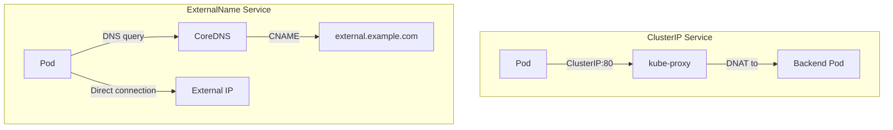

# Services - ExternalName - Human-Friendly Notes

This file provides intuitive mental models and analogies to help you understand ExternalName Services deeply.

## Mental Model: The DNS Shortcut

Think of ExternalName as a **DNS shortcut** inside the cluster. Instead of hardcoding an external hostname in every Pod's configuration, you create a stable internal name that resolves to the external service.

### The Analogy

Imagine your company has a internal phone directory:

| Without ExternalName | With ExternalName |
|---|---|
| Every employee has the external vendor's phone number written in their contacts. | Employees call "Vendor Support" — the receptionist (CoreDNS) redirects them to the vendor's actual number. |
| If the vendor changes their number, every employee's contacts must be updated. | Only the receptionist's redirect needs to be updated. |
| If the vendor moves to a new office, all contacts break. | The receptionist updates the redirect, and everything works. |

### Another Analogy: The Hotel Concierge

```mermaid
flowchart TD
    Guest[Guest in Hotel] -->|Asks concierge "Where is the museum?"| Concierge[Concierge Desk]
    Concierge -->|Gives directions to| Museum[External Museum]
    Guest -->|Goes directly to| Museum
```

The concierge (ExternalName Service) does not take the guest there themselves — they just provide directions (the CNAME record). The guest (Pod) walks there on their own (direct connection to the external IP).

## Why ExternalName Is Different

ExternalName is the only Service type that:

1. **Does not select Pods** — there is no selector.
2. **Does not create endpoints** — there are no backend Pods.
3. **Does not use kube-proxy** — no iptables or IPVS rules are created.
4. **Returns a CNAME** — not an A record.
5. **Has no ports** — the ports field is purely informational.



## When to Use ExternalName

Use ExternalName when:

1. **You want to abstract an external service** behind a stable internal DNS name.
2. **You are migrating an external service to internal** and want a seamless cutover.
3. **You want to avoid hardcoding external hostnames** in application configuration.
4. **You need different external endpoints per namespace** (e.g., staging vs. production).
5. **You want to mock external services** during testing by replacing the ExternalName with a ClusterIP Service.

## When NOT to Use ExternalName

- **When you need to expose internal workloads externally** — Use NodePort, LoadBalancer, or Ingress.
- **When you need load balancing across multiple external endpoints** — ExternalName does not provide load balancing.
- **When you need TLS termination** — ExternalName does not terminate TLS.
- **When you need health checks** — ExternalName has no health checking mechanism.
- **When you need to route traffic through kube-proxy** — ExternalName bypasses kube-proxy entirely.

## Common Misconceptions

### Misconception 1: ExternalName proxies traffic

ExternalName does **not** proxy traffic. It only provides a DNS CNAME record. The Pod connects directly to the external service.

```bash
# This does NOT proxy traffic
kubectl get svc my-db -o yaml
# spec:
#   type: ExternalName
#   externalName: mydb.example.com

# Traffic flows: Pod → DNS resolution → Direct TCP connection to external IP
```

### Misconception 2: ExternalName has ports that control routing

The `ports` field on an ExternalName Service is **informational only**. It does not configure any routing or proxying. The external service's port is determined by the external hostname's DNS resolution.

```yaml
# This port declaration does NOT configure any proxying
ports:
  - name: postgres
    port: 5432
    targetPort: 5432
```

### Misconception 3: ExternalName provides high availability

ExternalName does not provide any high availability or failover. If the external service goes down, the DNS resolution still succeeds, but the connection will fail. You need external mechanisms (DNS TTL, client-side retry logic) for resilience.

## Quick Reference Card

```text
ExternalName Service:
┌──────────────────────────────────────────────┐
│  Pod queries DNS for my-svc.ns.svc.cluster.local │
│       ↓                                                     │
│  CoreDNS returns CNAME to external.example.com    │
│       ↓                                                     │
│  Pod resolves external.example.com to IP       │
│       ↓                                                     │
│  Pod connects directly to external IP              │
│       ↓                                                     │
│  No kube-proxy, no endpoints, no selector      │
└──────────────────────────────────────────────┘
```