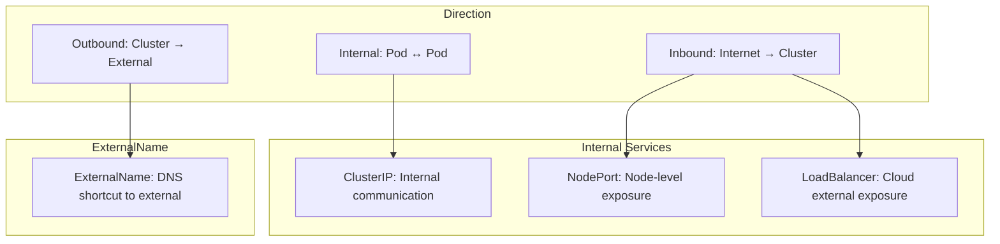
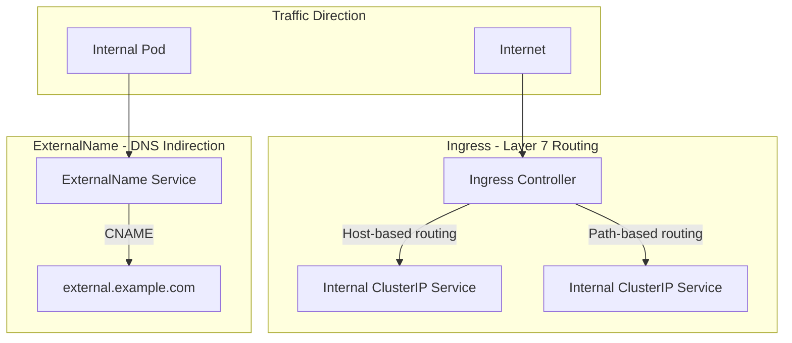
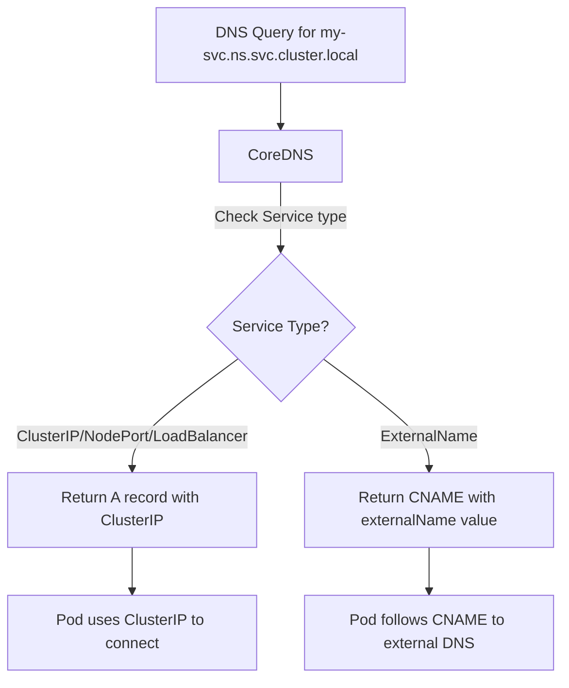

# Services - ExternalName - Related Concepts

ExternalName is a specialized Service type that operates fundamentally differently from ClusterIP, NodePort, and LoadBalancer. Understanding how it relates to these other concepts and to broader Kubernetes networking patterns is essential for using it effectively.

## Relationship with Other Service Types

### ExternalName vs ClusterIP

| Aspect | ClusterIP | ExternalName |
|---|---|---|
| DNS record | A record (ClusterIP address) | CNAME record (external hostname) |
| Traffic path | Pod → ClusterIP → kube-proxy → Pod | Pod → resolved external IP |
| kube-proxy | Yes | No |
| Endpoints | Yes | No |
| Selector | Required | Not allowed |
| Use case | Internal service communication | External service abstraction |

### ExternalName vs NodePort

| Aspect | NodePort | ExternalName |
|---|---|---|
| Exposes | Internal service on node port | External hostname via DNS |
| kube-proxy | Yes | No |
| Traffic flow | Pod ↔ ClusterIP ↔ kube-proxy ↔ Node ↔ Pod | Pod → external IP (direct) |
| Ports | port, targetPort, nodePort | None (informational only) |
| External access | Via NodeIP:nodePort | Via DNS resolution |

### ExternalName vs LoadBalancer

| Aspect | LoadBalancer | ExternalName |
|---|---|---|
| Purpose | Expose internal workloads externally | Abstract external services internally |
| Direction | Inbound (Internet → Cluster) | Outbound (Cluster → External) |
| Cloud LB | Provisions a cloud load balancer | None |
| External IP | Yes (cloud-assigned) | No |
| Health checks | Cloud LB health checks | None |
| kube-proxy | Yes | No |



## Relationship with Ingress

Ingress operates at Layer 7 (HTTP/HTTPS) and provides routing within the cluster. ExternalName operates at the DNS layer and provides indirection to external services. They serve complementary but distinct purposes.



**When to use each:**
- **Ingress**: When you need to expose HTTP/HTTPS services with host/path-based routing.
- **ExternalName**: When you need to provide a stable internal DNS name for an external service.
- **Both together**: When your application calls an external API and you also need to expose a web frontend.

## Relationship with EndpointSlices and Endpoints

ExternalName Services are explicitly excluded from the endpoint model:

```bash
# ExternalName Services have no endpoints
kubectl get endpoints my-external-name-svc
# No endpoints found

# The endpoints controller skips ExternalName Services
kubectl get endpointslices | grep my-external-name-svc
# No results
```

This is by design. Since ExternalName does not route to Pods, there are no endpoints to manage. The `endpoints` and `endpointslices` controllers filter out Services with `spec.type: ExternalName`.

```bash
# Check all Services and their types
kubectl get svc --all-namespaces -o wide

# Check which Services have endpoints
kubectl get endpoints --all-namespaces

# ExternalName Services will not appear in the endpoints list
```

## Relationship with DNS and CoreDNS

ExternalName is fundamentally a DNS concept. The entire mechanism depends on CoreDNS (or whatever DNS service is running in the cluster) returning a CNAME record.

### How CoreDNS Handles ExternalName



### DNS Configuration for ExternalName

The cluster's DNS domain is configured via the `--cluster-domain` flag on kubelet (default: `cluster.local`). The FQDN for an ExternalName Service follows the pattern:

```
<service-name>.<namespace>.svc.cluster.local
```

```bash
# Default cluster domain
kubectl get svc my-external-name -o jsonpath='{.metadata.namespace}'
# Output: default

# Full FQDN
# my-external-name.default.svc.cluster.local

# Test resolution
kubectl run -it --rm dns-test --image=busybox:1.36 -- nslookup my-external-name.default.svc.cluster.local
```

### Custom Cluster Domain

If the cluster uses a custom domain (e.g., `cluster.local` is changed to `k8s.example.com`):

```bash
# Check the cluster domain
kubectl get pods -n kube-system -l k8s-app=kube-dns -o jsonpath='{.items[0].spec.containers[0].args}'
# Look for --cluster-domain flag
```

## Relationship with Network Policies

Network Policies do not apply to ExternalName Services because there is no Kubernetes network path to control. Traffic to an external service goes directly from the Pod to the external IP, bypassing kube-proxy entirely.

```yaml
# This NetworkPolicy does NOT affect ExternalName traffic
apiVersion: networking.k8s.io/v1
kind: NetworkPolicy
metadata:
  name: allow-only-internal
spec:
  podSelector:
    matchLabels:
      app: web
  policyTypes:
    - Egress
  egress:
    - to:
        - podSelector:
            matchLabels:
              app: api
      ports:
        - protocol: TCP
          port: 80
```

The above NetworkPolicy controls egress to other Pods but does not restrict egress to external services resolved via ExternalName. To restrict external access, you need egress Network Policies based on IP blocks or use a service mesh.

```yaml
# To block external access, use IPBlock egress policy
apiVersion: networking.k8s.io/v1
kind: NetworkPolicy
metadata:
  name: deny-external
spec:
  podSelector:
    matchLabels:
      app: web
  policyTypes:
    - Egress
  egress:
    - to:
        - ipBlock:
            cidr: 10.0.0.0/8  # Allow only internal traffic
```

## Community Knowledge: ExternalName in Service Mesh

When using a service mesh like Istio or Linkerd, ExternalName Services interact with the mesh in specific ways:

- **Istio**: Istio's sidecar proxy can intercept DNS queries and handle ExternalName resolution. The proxy can apply retry policies, circuit breaking, and timeout rules to external services resolved via ExternalName.
- **Linkerd**: Linkerd's transparent proxy handles ExternalName Services by resolving the external hostname and routing traffic through the mesh's data plane.

```bash
# With Istio, you can apply a DestinationRule for ExternalName services
apiVersion: networking.istio.io/v1beta1
kind: DestinationRule
metadata:
  name: my-db-dr
spec:
  host: my-db.production.svc.cluster.local
  trafficPolicy:
    tls:
      mode: ISTIO_MUTUAL
    connectionPool:
      tcp:
        maxConnections: 100
      http:
        h2UpgradePolicy: DEFAULT
```

## Best Practices

- **Use ExternalName for external service abstraction only** — do not use it to expose internal workloads.
- **Document the purpose** of each ExternalName Service, since it has no selector or endpoints to provide context.
- **Use FQDNs** when pointing ExternalName to internal Services to avoid ambiguity.
- **Consider DNS TTL** — short TTLs on the external DNS allow faster failover if the external service changes.
- **Combine with a service mesh** for advanced traffic management (retries, circuit breaking, TLS) to external services.
- **Test DNS resolution** from within a Pod after creating or modifying an ExternalName Service.