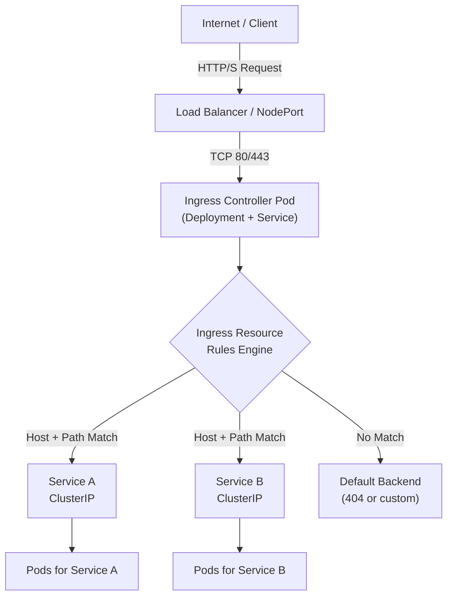
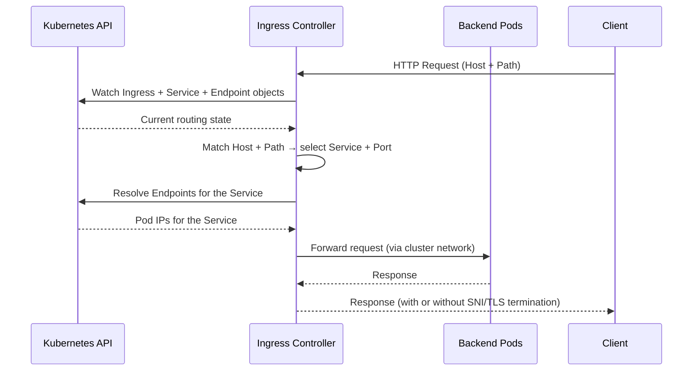
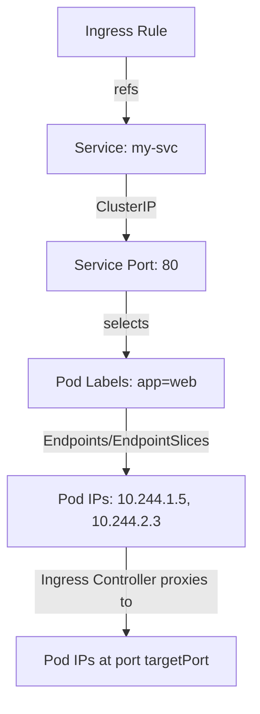

# Ingress - Core Mechanics

This document covers the fundamental internal mechanics of Kubernetes Ingress: how L7 routing works, the role of the Ingress Controller, IngressClass selection, and backend service references.

%comment somewhere in 04 ingress there should be a section on IngressClass, then say that ingress are configurations that the ingress controller polls from the api and autoapply on himeslf, while an ingressClass works as a label to make the controller poll only its ofn configs, while being a concern separation to avoid modifying all ingresses just to change the type of ingress controller. specify the default ingressclass k8s label.
one esterbal lb can only point to one internal ingress controller through its service, but another ingress controlle deployment, even if of different type like traefik for service discover, can also be acessible as normal internal service or externally with another lb


## How Ingress Routing Works at the Protocol Level

Ingress operates exclusively at **Layer 7 (Application Layer)** of the OSI model. Unlike a `NodePort` or `LoadBalancer` Service, which can proxy arbitrary TCP/UDP traffic, Ingress only understands HTTP and HTTPS. This is both a limitation (no non-HTTP protocols) and a strength (L7 awareness enables content-based routing).



### Key Insight: Ingress is a Routing Configuration, Not a Proxy Itself

An `Ingress` resource in the Kubernetes API is **declarative routing configuration**. It does not run any proxy code. The Ingress Controller (a separate Deployment) watches the Kubernetes API for Ingress resources and translates their rules into its own proxy configuration (e.g., NGINX `location` blocks, Traefik Middleware/routers, HAProxy frontends/backends).

## The Ingress Controller

The Ingress Controller is a **separate Deployment and Service** that implements the routing logic. Without it, Ingress resources are completely inert — the API server will accept them, but no traffic will be routed.

### Common Implementations

| Controller | Typical Use Case | Key Annotation Prefix |
|---|---|---|
| NGINX Ingress | General purpose, most popular | `nginx.ingress.kubernetes.io/` |
| Traefik | Cloud-native, auto-discovery | `traefik.ingress.kubernetes.io/` |
| GCE Ingress | Google Cloud GKE (managed) | `kubernetes.io/ingress.class: "gce"` |
| HAProxy Ingress | Enterprise, high-performance | `haproxy.ingress.kubernetes.io/` |
| ALB Ingress Controller | AWS Elastic Load Balancer | `alb.ingress.kubernetes.io/` |

### How the Controller Processes an Ingress Resource



## IngressClass Resource

`IngressClass` is a cluster-scoped resource that defines which controller should handle a given Ingress resource. It was introduced to replace the ambiguous `kubernetes.io/ingress.class` annotation with a typed, versioned API resource.

### Why IngressClass Matters

Before IngressClass, the annotation `kubernetes.io/ingress.class` was a string that every controller parsed. This caused problems when multiple controllers were installed, as each controller would act on the annotation if it matched. IngressClass adds:

- **Controller identity**: Each class specifies exactly which controller handles it.
- **Parameterization**: An `IngressClass` can reference an `IngressClassParameters` resource for controller-specific configuration.
- **Default class**: A controller can mark itself as the default, handling Ingress resources that omit `spec.ingressClassName`.

### Concrete Example

```yaml
apiVersion: networking.k8s.io/v1
kind: IngressClass
metadata:
  name: nginx
spec:
  controller: k8s.io/ingress-nginx
  parameters:
    apiVersion: networking.k8s.io/v1
    kind: IngressClassParameters
    name: nginx-config
```

```bash
# Create the IngressClass
kubectl apply -f ingressclass.yaml

# Verify the class exists and its controller reference
kubectl get ingressclass nginx -o jsonpath='{.spec.controller}'

# Reference it in an Ingress
kubectl get ingress example -o jsonpath='{.spec.ingressClassName}'

# Check which IngressResources reference which class
kubectl get ingress -o jsonpath='{range .items[*]}{.metadata.name}{"\t"}{.spec.ingressClassName}{"\n"}{end}'
```

### Default IngressClass

If an Ingress resource does not specify `spec.ingressClassName`, the cluster falls back to the controller's configured default class. Only one IngressClass should be marked as the default per cluster.

```bash
# Find which IngressClass is the default
kubectl get ingressclass -o jsonpath='{range .items[*]}{.metadata.name}{"\t"}{.spec.controller}{"\t"}{.metadata.annotations}{"\n"}{end}' | grep default
```

## Backend Reference Resolution

When an Ingress rule references a backend, it points to a `Service.name` and `Service.port.number`. The Ingress Controller is responsible for resolving these references to actual pod IPs via the Kubernetes Endpoint/EndpointSlice objects.

### How Backend Reference Works



### Critical Detail: `port.number` vs `targetPort`

The Ingress backend `spec.backends[].service.port.number` must match the **Service's port** (i.e., `spec.ports[].port`), **not** the `targetPort`. The Ingress Controller never sees `targetPort` — it sends traffic to the Service ClusterIP on the specified port, and the Service's `kube-proxy` iptables/ipvs rules handle the translation to `targetPort` on the pod IPs.

```yaml
apiVersion: v1
kind: Service
metadata:
  name: web-service
spec:
  ports:
    - port: 80          # <-- This is what Ingress references
      targetPort: 8080  # <-- This is the container port; Ingress never sees this
      protocol: TCP
      name: http
  selector:
    app: web
  type: ClusterIP
```

```bash
# Verify the Service port that Ingress will reference
kubectl get svc web-service -o jsonpath='{.spec.ports[0].port}'

# Check that Endpoints exist for the Service
kubectl get endpoints web-service
kubectl get endpointslices -l kubernetes.io/service-name=web-service -o wide

# If Endpoints are empty, the Service selector does not match any running pods
kubectl describe pod <pod-name> --show-labels
```

### Troubleshooting Backend Resolution

- **Empty Endpoints**: The Service selector does not match any pod labels. Verify `kubectl get pods --show-labels` and the Service's `spec.selector`.
- **Wrong port number**: The Ingress backend references a port that doesn't exist on the Service. Check with `kubectl get svc <name> -o yaml`.
- **Service type is not ClusterIP**: While Ingress can reference any Service type, ClusterIP is the standard. NodePort or LoadBalancer backends work but add unnecessary overhead.

## Best Practices and Community Knowledge

1. **Always use `IngressClass`** — It is future-proof and avoids annotation conflicts in multi-controller clusters.
2. **Keep the Ingress Controller highly available** — Deploy it with multiple replicas and use PodDisruptionBudgets. A single Ingress Controller instance is a single point of failure for all ingress traffic.
3. **Use separate IngressClasses for each controller** — Even if only one controller is in use now, defining explicit classes prevents accidental conflicts if another controller is added later.
4. **Leverage EndpointSlices, not Endpoints** — Modern Ingress Controllers use EndpointSlices for efficient endpoint watching. Ensure your controller version is recent enough to support them.
5. **Set resource limits on the Ingress Controller** — NGINX-based controllers can consume significant CPU/memory under heavy routing and TLS termination loads. Set `resources.requests` and `resources.limits` in the controller's Deployment.

## Common Pitfalls and Troubleshooting

- **Ingress created successfully but no traffic routes**: The Ingress Controller Deployment is likely not running. Verify with `kubectl get pods -n <ingress-namespace>`.
- **Host-based routing silently fails**: The client is not sending the correct `Host` header. Use `curl -v` to inspect request headers.
- **IngressClass name mismatch**: The `spec.ingressClassName` in the Ingress must exactly match the name of the IngressClass resource. YAML key names are case-sensitive.
- **Backend service port mismatch**: If the Service uses a named port and the Ingress references a numeric port, ensure the numbers match. If the Service port is `http` (named), the Ingress must reference `number: 80` (or whatever the numeric value is).
- **Controller is running but Ingress has no age/events**: The IngressClass controller string does not match. Check exact spelling including the `k8s.io/` prefix.

## Exam Tips

- On the CKAD exam, if a question involves exposing multiple services on a single IP with path or host-based routing, the answer is almost always an Ingress resource.
- You will likely need to create the Ingress Controller Service as a `LoadBalancer` or `NodePort` for external access — the Ingress resource alone is not sufficient.
- Always verify Endpoints exist for the referenced Service before troubleshooting the Ingress routing itself.
