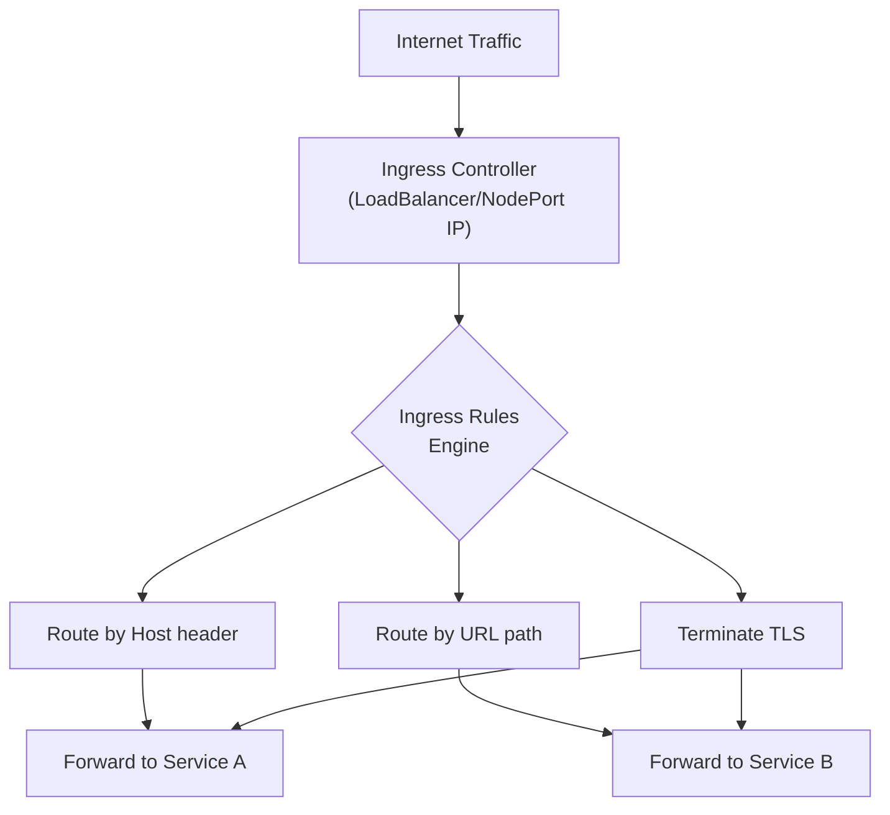
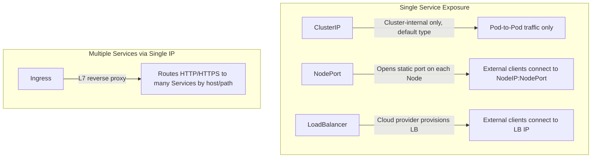
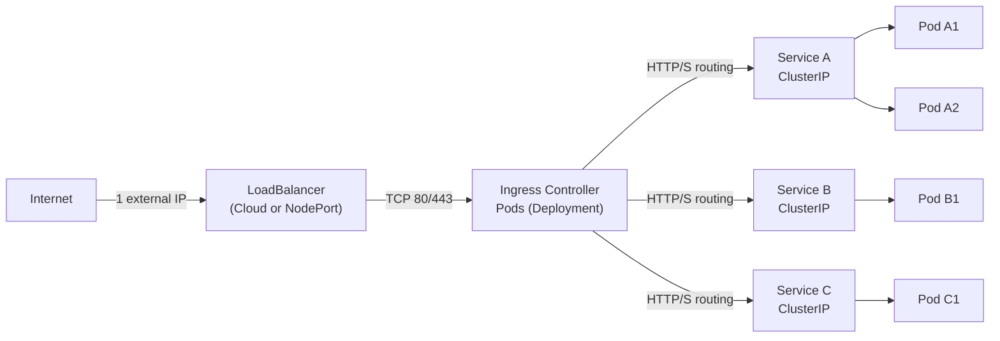

# Ingress - Human-Friendly Notes

A conceptual overview of Kubernetes Ingress — what it is, why it exists, and how it fits into the Service exposure landscape.

## What Is Ingress?

Ingress is a Kubernetes API resource that provides **HTTP/HTTPS-based routing from outside the cluster to internal Services**. Think of it as a **declarative reverse proxy configuration** — you define rules in YAML, and the Ingress Controller translates them into actual proxy configuration.



## Comparing Service Exposure Mechanisms

Kubernetes provides several mechanisms to expose Services externally. Understanding when to use each is critical.



### Key Distinction

| Mechanism | Scope | Protocol | How many Services? |
|---|---|---|---|
| ClusterIP | Internal only | TCP/UDP arbitrary | 1 |
| NodePort | External (per-node) | TCP/UDP arbitrary | 1 |
| LoadBalancer | External (cloud LB) | TCP/UDP arbitrary | 1 |
| Ingress | External | HTTP/HTTPS only | Many |

The crucial insight: **Ingress is the only mechanism that exposes multiple Services behind a single external IP address**. ClusterIP, NodePort, and LoadBalancer each expose exactly one Service.

## How Ingress Fits Into the Architecture



### The Traffic Flow in Plain Terms

1. A client sends an HTTP request to the Ingress Controller's external IP.
2. The Ingress Controller looks up which `Ingress` resource matches the request's `Host` header and URL path.
3. Based on the matched rule, the Controller selects a backend `Service`.
4. The Controller resolves the Service to its backing pod IPs (via Endpoints/EndpointSlices).
5. The Controller forwards the request to a pod (load-balanced across replicas).
6. The pod processes the request and returns a response through the same path.

## Typical Deployment Pattern

A standard Ingress setup involves three core components:

1. **Ingress Controller Deployment**: Runs the reverse proxy (NGINX, Traefik, etc.) as a Deployment with at least 2 replicas for HA. %comment tf is an HA dont spit acronyms
2. **Ingress Controller Service**: A `LoadBalancer` (cloud) or `NodePort` (bare metal) Service that exposes the controller pods externally.
3. **Ingress Resources**: One or more Ingress resources that define the routing rules.

### Text Diagram

```text
Internet
    |
    v
[ Load Balancer / NodePort IP ]
    |
    v
[ Ingress Controller Pod 1 ]  (Deployment, 2+ replicas)
[ Ingress Controller Pod 2 ]  ← watches K8s API for Ingress resources
    |
    +-- /web   -> web-service:80   (ClusterIP)
    +-- /api   -> api-service:8080 (ClusterIP)
    +-- /docs  -> docs-service:3000 (ClusterIP)
    |
    v
[ Backend Pods ]
```

## Best Practices and Community Knowledge

1. **Never expose raw pod IPs directly** — Services provide stable ClusterIPs and automatic endpoint management. Ingress routes to Services, not pods.
2. **Use a dedicated namespace for the Ingress Controller** — This isolates the controller from user workloads and simplifies RBAC.
3. **Enable connection pooling and keep-alive** — Most Ingress Controllers support upstream connection reuse. Configure it to reduce pressure on backend pods under high traffic.
4. **Set `proxy-buffer-size` and `proxy-buffers` in NGINX** — Large response headers or cookies can exceed default buffer sizes, causing truncated responses or 502 errors.
5. **Health checks are critical** — Configure the Ingress Controller to perform health checks on backend Services. Unhealthy pods are automatically excluded from the upstream pool.
6. **Use `IngressClass` from day one** — Even if only one controller exists, establishing the `ingressClassName` pattern early prevents technical debt.

## Common Pitfalls and Troubleshooting

- **"I created the Ingress but nothing works"**: Did you install an Ingress Controller? The Ingress resource alone does nothing — it requires a running controller implementation.
- **"I get a 404 for all paths"**: Check that the `host` in the Ingress rule matches the URL you are requesting (or remove the `host` field for IP-based access). Also verify `pathType` matches your URL structure.
- **"TLS handshake fails"**: The Secret must contain `tls.crt` and `tls.key` keys (not `cert.pem`/`key.pem`). Verify with `kubectl get secret <name> -o jsonpath='{.data}' | jq`.
- **"Traffic goes to the wrong backend"**: Path matching order can cause unexpected routing. Use `Exact` when precision matters; use `Prefix` with care for overlapping paths.
- **"Only one service is reachable"**: The Ingress Controller Service may be of type `NodePort` behind a firewall that only allows ports 80/443. Ensure the firewall rules or cloud LB configuration permits the correct ports.

## Quick Reference

| Question | Answer |
|---|---|
| Can Ingress expose TCP/UDP services? | No — only HTTP/HTTPS | 
| Can one Ingress route to Services in different namespaces? | No — backend Services must be in the same namespace as the Ingress (some controllers support cross-namespace via custom annotations) |
| Is Ingress a replacement for LoadBalancer? | For HTTP/S, yes. For non-HTTP protocols, use LoadBalancer or NodePort directly |
| Does Ingress do TLS termination? | Yes, if TLS is configured in `spec.tls` |
| Can I use Ingress without a cloud provider? | Yes — on-premises with NodePort or MetalLB + NGINX Ingress Controller |
