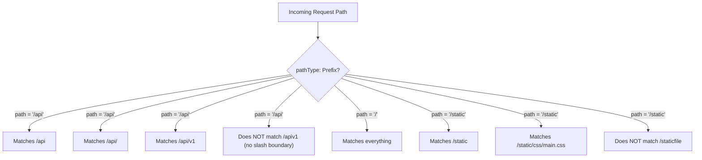
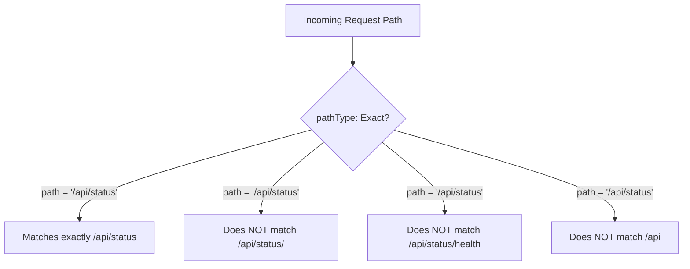
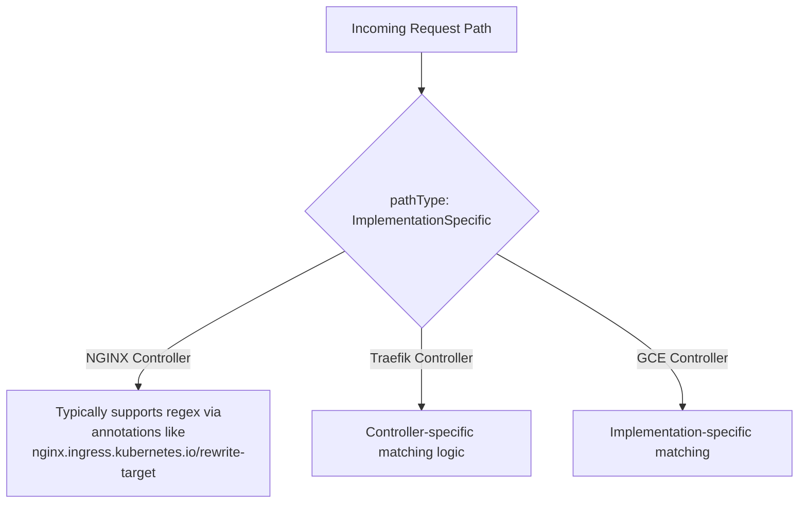
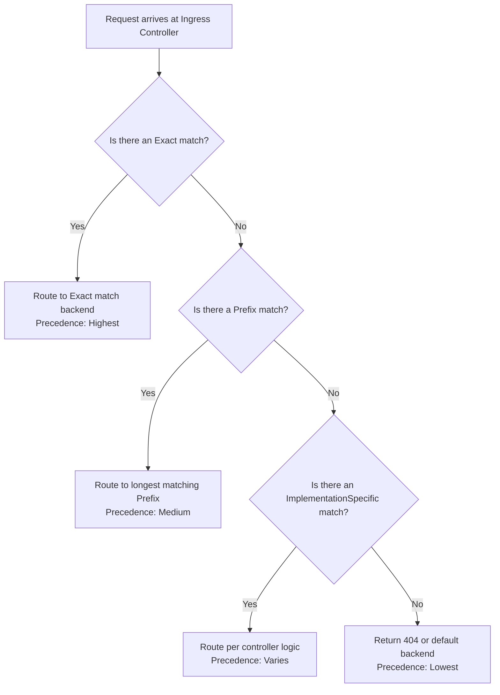

# Ingress - Path Types

Deep dive into the three `pathType` values that control how URL paths are matched against incoming HTTP requests in Kubernetes Ingress rules.

## Overview of Path Types

Every Ingress rule's `http.paths[].pathType` field determines how the URL path in a request is matched against the `path` value defined in the Ingress rule. There are exactly three valid values:

| Path Type | Behavior | When to Use |
|---|---|---|
| `Prefix` | Matches URL paths that start with the specified prefix | Default for most routing; root path `/` catches everything |
| `Exact` | Matches the URL path exactly, character-for-character, including trailing slashes | When a specific endpoint must not be accidentally matched by a broader prefix rule |
| `ImplementationSpecific` | Matching behavior is defined by the Ingress Controller implementation | When you need controller-specific behavior (e.g., regex matching in NGINX) |

## How Each PathType Works

### Prefix Matching

`Prefix` is the most commonly used path type. It matches any URL path that begins with the specified `path` value, split by `/` path elements. Matching is case sensitive and done on a path element by element basis. A path element refers to the list of labels in the path split by the `/` separator. If the last element of the path is a substring of the last element in request path, it is not a match (e.g. `/foo/bar` matches `/foo/bar/baz`, but does not match `/foo/barbaz`).



### Exact Matching

`Exact` matches the URL path precisely. The entire path must be identical, including any trailing slashes. This is useful for endpoints that should not be shadowed by broader Prefix rules.
%comment text not completely shown in mermaid


```bash
# Test exact matching
curl -v http://<ingress-ip>/api/status       # matches
curl -v http://<ingress-ip>/api/status/       # does NOT match (trailing slash)
curl -v http://<ingress-ip>/api/status/health # does NOT match
```

### ImplementationSpecific Matching

`ImplementationSpecific` delegates the matching logic entirely to the Ingress Controller implementation. For NGINX Ingress, this typically enables regular expression matching on paths. For Traefik, it may use different matching rules.



### Concrete Example with NGINX Regex

```yaml
apiVersion: networking.k8s.io/v1
kind: Ingress
metadata:
  name: regex-ingress
  annotations:
    nginx.ingress.kubernetes.io/rewrite-target: /$2
spec:
  ingressClassName: nginx
  rules:
    - host: example.com
      http:
        paths:
          - path: /(/.*)?
            pathType: ImplementationSpecific
            backend:
              service:
                name: catch-all-service
                port:
                  number: 80
```

> **Note**: Because `ImplementationSpecific` behavior is controller-dependent, it is generally recommended to avoid it unless you need controller-specific features like regex. Always document which controller you are relying on.

## Path Matching Precedence Rules

When multiple path rules exist in the same Ingress, the following precedence order applies (for NGINX Ingress controller, which is the most widely deployed):



1. **Exact** matches take the highest precedence.
2. **Prefix** matches are evaluated by longest path length — the longest matching prefix wins.
3. **ImplementationSpecific** rules are processed per the controller's own logic.
4. If no rule matches, the request is handled by the Ingress controller's **default backend** (if configured) or returns a 404/403 error.

**Critical**: An `Exact` rule for `/api/status` will NOT be overridden by a `Prefix` rule for `/api`. The Exact match always wins regardless of path length.

## Common Path Type Mistakes

### Mistake 1: Omitting `pathType` and Relying on Default

```yaml
# BAD: pathType is required in networking.k8s.io/v1; omitting it fails validation
paths:
  - path: /
    backend:
      service:
        name: web-svc
        port:
          number: 80
```

In Kubernetes 1.18+ (networking.k8s.io/v1), omitting `pathType` will fail validation; `"Exact"`, `"Prefix"`, or `"ImplementationSpecific"` must be specified explicitly. (In the older `networking.k8s.io/v1beta1` API, `ImplementationSpecific` was the default, but the v1beta1 API was removed in Kubernetes 1.22.)

```yaml
# GOOD: Explicit pathType
paths:
  - path: /
    pathType: Prefix
    backend:
      service:
        name: web-svc
        port:
          number: 80
```

### Mistake 2: Trailing Slash Confusion with Exact Matching

An `Exact` match for `/api` does NOT match `/api/`. This catches many people by surprise:

```bash
# If the Ingress has an Exact rule for /api:
curl http://<ingress-ip>/api     # ✅ 200 OK
curl http://<ingress-ip>/api/    # ❌ 404 Not Found (or routes elsewhere)
```

**Fix**: Either add both rules or use `Prefix` with a trailing slash for directory-like paths.

### Mistake 3: Overlapping Prefix Paths Without Considering Order

```yaml
# This configuration has a subtle bug
paths:
  - path: /api/longer-path
    pathType: Prefix
    backend:
      service:
        name: service-a
  - path: /api
    pathType: Prefix
    backend:
      service:
        name: service-b
```

In NGINX Ingress, the longest matching prefix wins, so `/api/longer-path` routes to `service-a` and `/api/other` routes to `service-b`. But this is controller-dependent and fragile. Make the hierarchy explicit.

## kubectl Examples

```bash
# Describe an Ingress to see the path types and matched rules
kubectl describe ingress example-ingress -n production

# Extract path and pathType for all rules
kubectl get ingress example-ingress -n production -o jsonpath='{.spec.rules[*].http.paths[*].path}'

# Extract path and pathType in a readable format
kubectl get ingress example-ingress -n production -o jsonpath='{range .spec.rules[*].http.paths[*]}{.path}{"\t"}{.pathType}{"\n"}{end}'

# Update an existing Ingress to change pathType
kubectl patch ingress example-ingress -n production --type=json -p='[{"op":"replace","path":"/spec/rules/0/http/paths/0/pathType","value":"Exact"}]'

# Validate an Ingress manifest before applying
kubectl apply --dry-run=client -f ingress.yaml
```

## Best Practices and Community Knowledge

1. **Prefer `Prefix` over `ImplementationSpecific`** — Prefix behavior is standardized and predictable across all Ingress Controller implementations.
2. **Use `Exact` for health check endpoints** — If you have a `/healthz` endpoint, use `Exact` to prevent it from accidentally matching a broader prefix rule meant for a different service.
3. **Test with and without trailing slashes** — The difference between `/api` and `/api/` in Prefix mode can be controller-specific. Test both cases.
4. **Use longest-prefix-first ordering in NGINX Ingress** — NGINX sorts Prefix paths by length internally, so you don't need to worry about rule order. But other controllers may not.

## Exam Tips for CKAD

- When asked to route `/` to one service and `/api` to another, use `Prefix` for both (as `/api` is longer and is evalauted first leaving tge rest to `/`).
- When asked to route only the exact path `/status`, use `Exact`.
- If the question mentions regex or complex path patterns, you'll need `ImplementationSpecific` plus controller-specific annotations.
- Always include `pathType` in your Ingress manifests on the CKAD exam. Omitting it may cause the grading system to flag it as incomplete.
