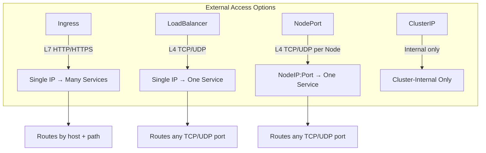
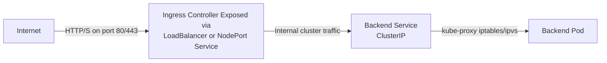
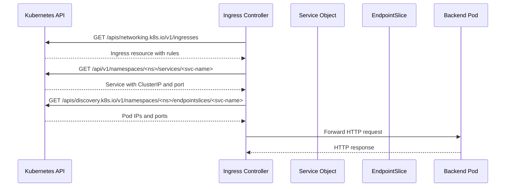
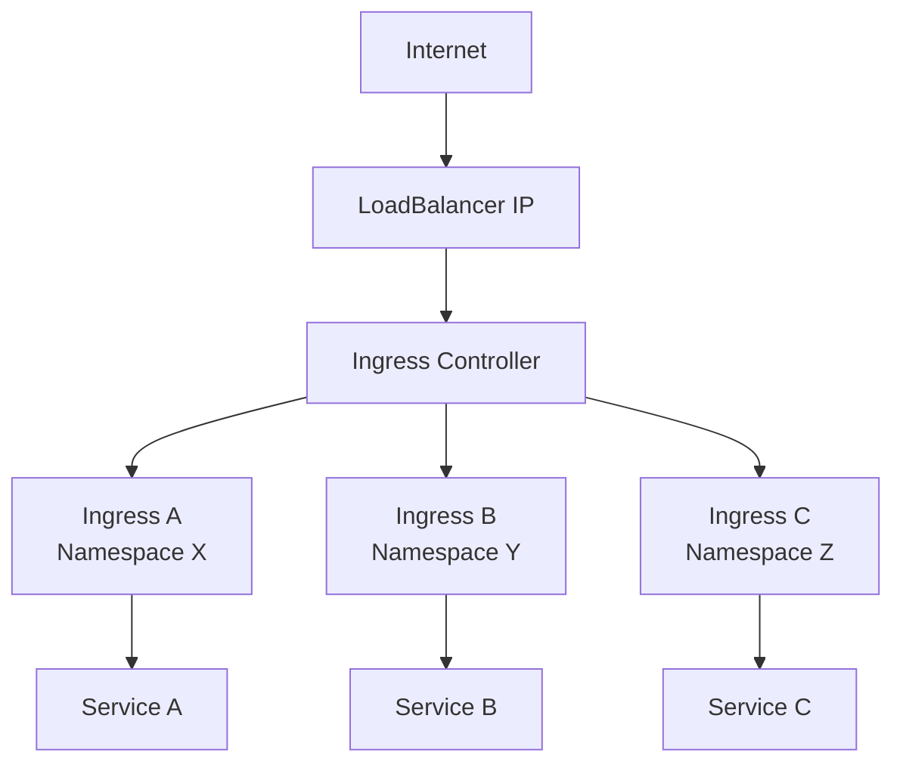
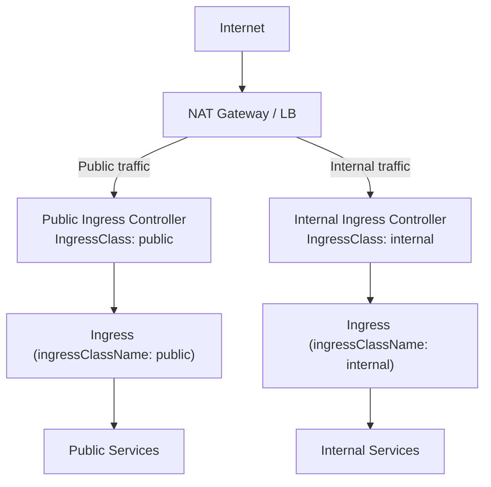

# Ingress - Related Concepts

This document covers the concepts related to Ingress, including how it compares to other Service exposure mechanisms and how backend Services connect to Ingress routing rules.

## Ingress vs. Service Types for External Access

Ingress is not the only way to expose workloads externally. Understanding the relationship between Ingress and Kubernetes Service types is essential for designing cluster networking.



### When to Use Ingress vs. LoadBalancer

| Criterion | Ingress | LoadBalancer |
|---|---|---|
| Protocol | HTTP/HTTPS only | Any TCP/UDP |
| Number of Services | Many behind one IP | One per Service |
| Cost | One controller + one LB | One LB per Service |
| L7 Features | Yes (path routing, TLS, rewrites) | No (L4 only) |
| Cloud Provider Required? | No (works on-prem with NodePort or MetalLB) | Typically yes (cloud LB) |
| Complexity | Higher (requires Ingress Controller) | Lower (just a Service) |

## Backend Services Must Be ClusterIP

Ingress routes traffic to backend **Services**, not directly to pods. The backend Services are almost always `ClusterIP` type — the internal cluster IP that is only reachable from within the cluster.



### Why ClusterIP for Backends?

1. **Security**: ClusterIP Services are not externally routable except through the Ingress Controller.
2. **Stability**: ClusterIP addresses are stable and managed by Kubernetes, unlike pod IPs which change on restart.
3. **Service Discovery**: The Ingress Controller uses the Kubernetes API to resolve Service → Endpoints → Pod IPs automatically.
4. **Port Abstraction**: The Service maps the external port (referenced by Ingress) to the container port (targetPort) transparently.

### Can Ingress Backends Be Non-ClusterIP?

Technically yes, but it is strongly discouraged:

- **NodePort backends**: The Ingress Controller would route to NodePort, which means traffic exits and re-enters the cluster. This adds latency and unnecessary network hops.
- **ExternalName backends**: These are CNAME aliases to external DNS names. Ingress Controllers generally cannot route to ExternalName services because they lack endpoints.
- **Headless Services** (ClusterIP: None): These return pod IPs directly instead of a ClusterIP. Some Ingress Controllers can handle these, but it bypasses kube-proxy load balancing.

```bash
# Verify the backend Service type
kubectl get svc web-service -o jsonpath='{.spec.type}'

# Verify the Service has endpoints
kubectl get endpoints web-service

# If endpoints are empty, the Service selector doesn't match any pods
kubectl describe svc web-service | grep -A5 Endpoints
```

## How Services Connect to Ingress

The connection between an Ingress rule and a Service works through Kubernetes' endpoint discovery mechanism. The Ingress Controller watches:

1. **Ingress resources** — to know which rules exist
2. **Service objects** — to resolve the backend service name and port
3. **Endpoint/EndpointSlice objects** — to find the actual pod IPs for the Service



## Common Architectures

### Architecture 1: Single Ingress Controller, Multiple Ingress Resources

The most common pattern. One Ingress Controller handles all ingress traffic; each team or application owns its own Ingress resource.



### Architecture 2: Multiple Ingress Controllers for Different Classes

When different teams or workloads need different controller configurations (e.g., internal vs. external, different performance profiles).



### Architecture 3: Ingress with Multiple TLS Certificates
%comment broken mermaid
```mermaid
flowgraph TD
    Internet -->|"HTTPS :443"| IC["Ingress Controller"]
    IC -->| Host: app1.example.com | TLS1["TLS Termination<br/>using secret-a"] --> SVC1["Service A"]
    IC -->| Host: app2.example.com | TLS2["TLS Termination<br/>using secret-b"] --> SVC2["Service B"]
    IC -->| Host: app1.example.com | TLS3["TLS Termination<br/>using secret-a"] --> SVC3["Service C (internal)"]
```

## Best Practices

1. **Always use ClusterIP for Ingress backends** — it is the only type designed for internal cluster communication.
2. **Avoid NodePort for Ingress backends** — it adds unnecessary network overhead and exposes ports on every node.
3. **Name Services consistently** — follow a convention like `<app-name>-svc` so that Ingress rules are easy to read and maintain.
4. **Use namespace selectors with IngressClass** — in multi-tenant clusters, ensure Ingress resources can only route to Services in allowed namespaces.
5. **Monitor Ingress Controller metrics** — track request rates, error rates, and latency at the controller level to detect routing issues early.

## Common Pitfalls

- **Referencing a non-existent Service**: The Ingress will be created, but traffic will fail with 502 or 503 errors. Always verify the Service exists first.
- **Referencing a Service with no endpoints**: If the Service selector doesn't match any pods, the Service has no endpoints, and the Ingress will return 503.
- **Using a LoadBalancer Service as an Ingress backend**: This creates a double-NAT situation (client → external LB → ClusterIP → pod). It works but is wasteful and adds latency.
- **Assuming Ingress handles gRPC or WebSocket natively**: Most Ingress Controllers support WebSocket proxying, but gRPC requires specific configuration (e.g., `nginx.ingress.kubernetes.io/backend-protocol: "GRPC"`).
- **Forgetting that Ingress is namespace-aware for Service references**: The Ingress references Services by name, and the Service must be in the same namespace as the Ingress resource (unless the controller supports cross-namespace backends via annotations).

## Exam Reference

On the CKAD exam:
- If asked to expose multiple apps on a single IP with path-based routing → use Ingress
- If asked to expose a single app on a specific port → use LoadBalancer or NodePort Service
- If asked to handle TLS termination for HTTP services → configure `spec.tls` in the Ingress
- Always verify Endpoints exist before troubleshooting Ingress routing issues
