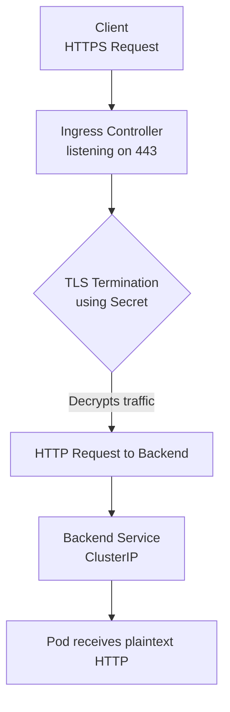
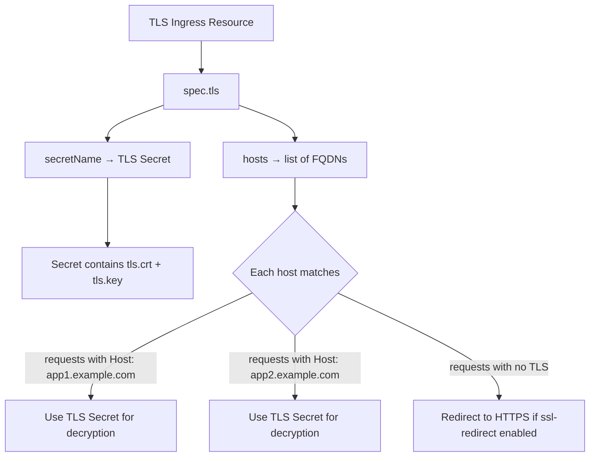
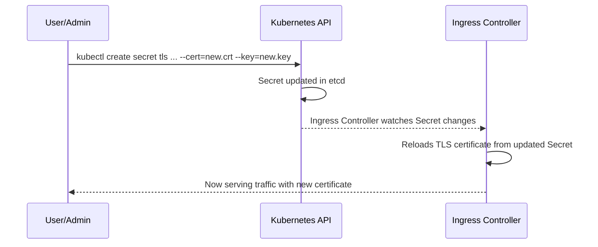

# Ingress - TLS Termination

Complete guide to configuring TLS/SSL termination on Kubernetes Ingress resources, including Secret management, certificate strategies, and common TLS pitfalls.

## How Ingress TLS Works

When a client connects to an Ingress route over HTTPS, the Ingress Controller terminates the TLS connection, decrypts the traffic, and forwards the plaintext HTTP request to the backend Service and pods. This means TLS happens at the Ingress layer, not at the pod level.



### The TLS Secret Requirement

The `spec.tls` block in an Ingress resource references a Kubernetes Secret that contains the TLS certificate and private key. The Secret must be in the same namespace as the Ingress resource.

```yaml
apiVersion: networking.k8s.io/v1
kind: Ingress
metadata:
  name: tls-ingress
  namespace: production
spec:
  ingressClassName: nginx
  tls:
    - hosts:
        - example.com
      secretName: example-com-tls-secret
  rules:
    - host: example.com
      http:
        paths:
          - path: /
            pathType: Prefix
            backend:
              service:
                name: web-service
                port:
                  number: 80
```

### Secret Key Requirements

The Secret referenced by `secretName` must be of type `kubernetes.io/tls` and contain exactly two data keys:

| Key | Content | Required |
|---|---|---|
| `tls.crt` | The TLS certificate (public key) | Yes |
| `tls.key` | The TLS private key | Yes |

```bash
# Verify the Secret exists and has the correct type
kubectl get secret example-com-tls-secret -n production -o jsonpath='{.type}'
# Expected output: kubernetes.io/tls

# Verify the data keys exist
kubectl get secret example-com-tls-secret -n production -o jsonpath='{.data}' | jq -r 'keys[]'
# Expected output: tls.crt and tls.key

# Decode and inspect the certificate expiration date
kubectl get secret example-com-tls-secret -n production -o jsonpath='{.data.tls\.crt}' | base64 -d | openssl x509 -noout -dates

# Decode and inspect the certificate subject
kubectl get secret example-com-tls-secret -n production -o jsonpath='{.data.tls\.crt}' | base64 -d | openssl x509 -noout -subject
```

## Creating TLS Secrets

### From Existing Certificate and Key Files

```bash
# Create a TLS Secret from .crt and .key files
kubectl create secret tls example-com-tls-secret \
  --cert=./tls.crt \
  --key=./tls.key \
  -n production
```

### Self-Signed Certificate (Testing Only)

```bash
# Generate a self-signed certificate and key with openssl
openssl req -x509 -nodes -days 365 \
  -newkey rsa:2048 \
  -keyout tls.key \
  -out tls.crt \
  -subj "/CN=example.com" \
  -addext "subjectAltName=DNS:example.com,DNS:www.example.com"

# Create the Kubernetes Secret
kubectl create secret tls example-com-tls-secret \
  --cert=tls.crt \
  --key=tls.key \
  -n production

# Clean up the temporary files
rm tls.crt tls.key
```

### Generating a CSR for a Let's Encrypt Certificate (Production)

In production, you typically use cert-manager to automate certificate issuance via Let's Encrypt. However, understanding the manual CSR process is valuable for CKAD exams and troubleshooting.

```bash
# Generate a private key
openssl genrsa -out example.com.key 2048

# Create a Certificate Signing Request (CSR)
openssl req -new -key example.com.key \
  -out example.com.csr \
  -subj "/CN=example.com" \
  -addext "subjectAltName=DNS:example.com,DNS:www.example.com"

# The CSR would be submitted to a CA (e.g., Let's Encrypt, internal CA)
# In Kubernetes, cert-manager automates this via Certificate resources
```

## TLS Termination with Multiple Hosts

A single TLS Secret can cover multiple hosts if the certificate includes all of them as Subject Alternative Names (SANs). You can reference the same Secret for multiple hosts in the `spec.tls` block.

```yaml
apiVersion: networking.k8s.io/v1
kind: Ingress
metadata:
  name: multi-host-tls
  namespace: production
spec:
  ingressClassName: nginx
  tls:
    - hosts:
        - app1.example.com
        - app2.example.com
      secretName: wildcard-example-com-tls-secret
  rules:
    - host: app1.example.com
      http:
        paths:
          - path: /
            pathType: Prefix
            backend:
              service:
                name: app1-service
                port:
                  number: 80
    - host: app2.example.com
      http:
        paths:
          - path: /
            pathType: Prefix
            backend:
              service:
                name: app2-service
                port:
                  number: 80
```

## HTTP to HTTPS Redirect

A common pattern is to redirect all HTTP traffic to HTTPS. This is configured at the Ingress Controller level, typically via annotations.

### NGINX Ingress Example

```yaml
apiVersion: networking.k8s.io/v1
kind: Ingress
metadata:
  name: https-redirect
  namespace: production
  annotations:
    nginx.ingress.kubernetes.io/ssl-redirect: "true"
    nginx.ingress.kubernetes.io/force-ssl-redirect: "true"
spec:
  ingressClassName: nginx
  tls:
    - hosts:
        - example.com
      secretName: example-com-tls-secret
  rules:
    - host: example.com
      http:
        paths:
          - path: /
            pathType: Prefix
            backend:
              service:
                name: web-service
                port:
                  number: 80
```

```bash
# Verify the annotation is present
kubectl get ingress https-redirect -n production -o jsonpath='{.metadata.annotations}' | jq

# Test HTTP → HTTPS redirect
curl -v http://example.com/
# Expected: HTTP 301 or 302 redirect to https://example.com/
```

## TLS and Path Types

TLS configuration applies per Ingress resource. Within a single Ingress, all rules share the same TLS settings. If you need different certificates for different hosts, use separate Ingress resources (one per host/namespace).



## Secret Lifecycle and Certificate Rotation

TLS certificates expire. In production, certificate rotation is automated with cert-manager. Understanding how to manually update a certificate is important for the CKAD exam and troubleshooting.

### How Rotation Works with Ingress



### Steps to Rotate a Certificate

```bash
# 1. Generate a new certificate (or obtain renewed one from CA)
openssl req -x509 -nodes -days 365 -newkey rsa:2048 \
  -keyout new-tls.key -out new-tls.crt \
  -subj "/CN=example.com"

# 2. Update the existing Secret in-place (same name, same namespace)
kubectl create secret tls example-com-tls-secret \
  --cert=new-tls.crt --key=new-tls.key \
  -n production --dry-run=client -o yaml | kubectl apply -f -

# 3. Verify the Secret was updated
kubectl get secret example-com-tls-secret -n development -o jsonpath='{.metadata.annotations}' | jq -r 'to_entries[] | select(.key | test("kubectl\\.kubernetes\\.io/last-applied-configuration")) | .key'

# 4. The Ingress Controller will pick up the new Secret automatically
#    (most controllers watch Secret resources for changes)
#    But the old connection may persist briefly until old cert expires

# 5. Clean up temporary files
rm new-tls.crt new-tls.key
```

### Forcing an Ingress Controller to Reload

After updating the Secret, most Ingress Controllers detect the change and reload automatically. If not, you can force a reload:

```bash
# NGINX Ingress: restart the controller pod (triggers graceful reload)
kubectl rollout restart deployment ingress-nginx-controller -n ingress-nginx

# Verify the controller picked up the new certificate
kubectl exec -n ingress-nginx deploy/ingress-nginx-controller -- \
  openssl s_client -connect :443 -servername example.com 2>/dev/null | \
  openssl x509 -noout -dates
```

## Best Practices for TLS with Ingress

1. **Use cert-manager for automated certificate management** — cert-manager automatically handles issuance, renewal, and Secret updates for Let's Encrypt and other ACME issuers.
2. **Use a single TLS Secret per host** — avoid mixing certificates across hosts in one Secret.
3. **Set up monitoring on certificate expiration** — alert when a certificate is within 30 days of expiry. A simple Prometheus rule can query `certmanager_certificates` metrics.
4. **Disable TLS 1.0 and 1.1** — configure the Ingress Controller to only accept TLS 1.2 and 1.3.
5. **Use strong cipher suites** — configure the Ingress Controller's SSL cipher suite configuration to exclude weak ciphers (RC4, DES, etc.).
6. **Keep private keys secure** — never commit TLS key files to version control. Use external secret management (Vault, Sealed Secrets) or Kubernetes Secrets with encryption at rest enabled.
7. **Use wildcard certificates sparingly** — a wildcard certificate (`*.example.com`) covers all subdomains but is a single point of compromise. Use per-service certificates in high-security environments.
8. **Always configure HTTP→HTTPS redirect** — never leave TLS-enabled routes accessible over plain HTTP in production.

## Common Pitfalls and Troubleshooting

### TLS Secret Does Not Exist

**Symptom**: Ingress is created but HTTPS requests return 502 Bad Gateway or connection reset.
**Diagnosis**: Check that the Secret exists and has the correct keys.

```bash
# Check if the Secret exists
kubectl get secret example-com-tls-secret -n production

# Check the Secret type
kubectl get secret example-com-tls-secret -n production -o jsonpath='{.type}'
# Must be: kubernetes.io/tls

# Check the data keys
kubectl get secret example-com-tls-secret -n production -o jsonpath='{.data}' | jq -r 'keys[]'
# Must contain: tls.crt and tls.key
```

### Certificate Expired or Not Yet Valid

**Symptom**: Browser shows a certificate error or connection is refused.
**Diagnosis**: Check the certificate dates.

```bash
# Decode and check the certificate dates
kubectl get secret example-com-tls-secret -n production -o jsonpath='{.data.tls\.crt}' | base64 -d | openssl x509 -noout -dates

# Check when the certificate was issued
kubectl get secret example-com-tls-secret -n production -o jsonpath='{.data.tls\.crt}' | base64 -d | openssl x509 -noout -dates -noout

# Compare with current date
date
```

### Hostname Mismatch

**Symptom**: Browser or client shows "certificate does not match the site domain".
**Diagnosis**: The `hosts` field in `spec.tls` must include the hostname the client is connecting to, and the certificate must contain that hostname as a CN or SAN.

```bash
# Check what hosts the certificate covers
kubectl get secret example-com-tls-secret -n production -o jsonpath='{.data.tls\.crt}' | base64 -d | openssl x509 -noout -text | grep -A1 "Subject Alternative"

# Verify the Ingress tls hosts match
kubectl get ingress tls-ingress -n production -o jsonpath='{.spec.tls[*].hosts}'
```

### Mixed HTTP/HTTPS Content (Mixed Content Warnings)

**Symptom**: The page loads over HTTPS but shows "mixed content" warnings for embedded resources loaded over HTTP.
**Diagnosis**: The backend application is generating absolute HTTP URLs in HTML or API responses.
**Fix**: Configure the application to use `X-Forwarded-Proto` header to determine if the original request was HTTPS, or set the `X-Forwarded-Proto` header in the Ingress annotation.

```yaml
annotations:
  nginx.ingress.kubernetes.io/configuration-snippet: |
    proxy_set_header X-Forwarded-Proto $scheme;
```

### TLS Termination Not Happening (Backend Sees Plaintext on HTTPS Port)

**Symptom**: The backend pod receives HTTP traffic on a port it expects to be HTTPS, or vice versa.
**Diagnosis**: The Ingress Controller is not configured to do TLS termination, or the backend protocol annotation is incorrect.
**Fix** (for NGINX Ingress with gRPC/HTTP2 backends):

```yaml
annotations:
  nginx.ingress.kubernetes.io/backend-protocol: "HTTPS"
```

### Ingress with TLS but No 443 Service Port Exposed

**Symptom**: HTTPS requests are refused, but HTTP works.
**Diagnosis**: The Ingress Controller's Service only exposes port 80 (HTTP) and not port 443 (HTTPS).
**Fix**: Ensure the Ingress Controller Service covers both ports.

```bash
# Check the Ingress Controller Service ports
kubectl get svc -n ingress-nginx ingress-nginx-controller -o jsonpath='{.spec.ports}' | jq
# Must include a port for 443/TCP
```

## Exam Tips for CKAD

1. When asked to enable HTTPS on an Ingress, you must:
   - Create a TLS Secret of type `kubernetes.io/tls` with `tls.crt` and `tls.key` keys
   - Add a `spec.tls` block to the Ingress with the correct `hosts` and `secretName`
   - Reference the correct `secretName` and `hosts` in the Ingress

2. If a question provides certificate and key files as arguments or configmaps, you need to know how to create a TLS Secret from them.

3. Remember that TLS Secrets contain base64-encoded data, not plaintext keys and certificates.

4. On the CKAD exam, if you need a quick test certificate, use `openssl req -x509 -nodes -days 365` with a self-signed approach. Exam graders typically accept self-signed certs for practical verification.