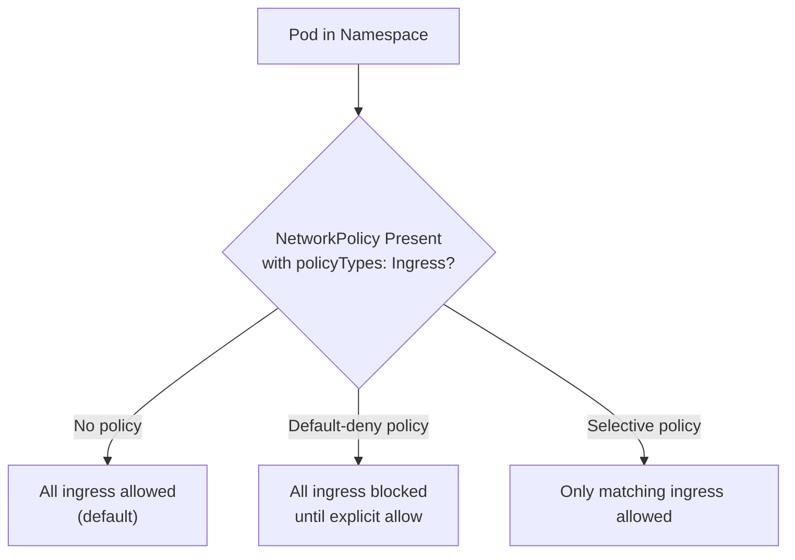
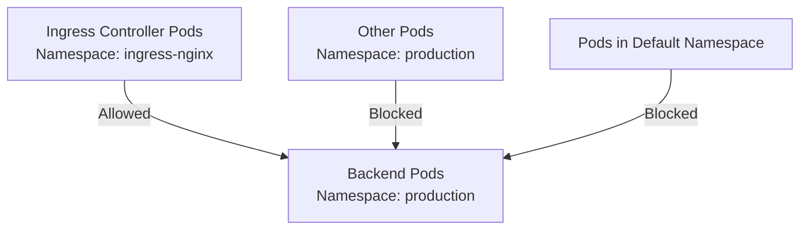

# NetworkPolicies - Common CKAD Patterns

This guide covers the most frequently tested NetworkPolicy patterns in the CKAD exam and real-world cluster administration scenarios.

## Pattern 1: Deny All Ingress by Default (Default-Deny)

The most fundamental NetworkPolicy pattern: block all incoming traffic to a namespace's pods unless explicitly allowed. This is the foundation of zero-trust networking in Kubernetes.

### How It Works



### Concrete Example

```yaml
apiVersion: networking.k8s.io/v1
kind: NetworkPolicy
metadata:
  name: default-deny-all-ingress
  namespace: production
spec:
  podSelector: {}
  policyTypes:
    - Ingress
```

### kubectl Commands

```bash
# Apply the default-deny policy
kubectl apply -f default-deny-ingress.yaml -n production

# Verify the policy was created
kubectl get networkpolicy default-deny-all-ingress -n production -o yaml

# Test connectivity from a pod in a different namespace
kubectl run -n default test-pod --image=curlimages/curl --rm -it --restart=Never -- \
  curl -s --connect-timeout 3 http://<production-pod-ip>:8080
# Expected: Connection timed out (blocked)

# Test connectivity from a pod within the same namespace (still blocked by default)
kubectl exec -n production $(kubectl get pods -n production -l app=web -o jsonpath='{.items[0].metadata.name}') -- \
  curl -s --connect-timeout 3 http://<another-pod-ip>:8080
# Expected: Connection timed out (blocked by default-deny)

# Verify the policy is applied to all pods in the namespace
kubectl get pods -n production -o jsonpath='{range .items[*]}{.metadata.name}{"\t"}{.metadata.labels}{"\n"}{end}'
```

### Why `podSelector: {}` (Empty Selector)

An empty selector `{}` matches **all pods** in the namespace. This is how you apply a default-deny policy namespace-wide. Without any selector, the NetworkPolicy would only apply to pods explicitly matched — which, with an empty selector, means no pods (not all pods). The empty JSON object `{}` is a valid selector that matches everything.

## Pattern 2: Allow Ingress from Same-Zone Pods (Backend Isolation)

Allow pods in a backend tier to receive traffic only from pods in the same namespace (e.g., frontend pods in the same namespace can talk to backend pods).

### Concrete Example

```yaml
apiVersion: networking.k8s.io/v1
kind: NetworkPolicy
metadata:
  name: allow-same-namespace-ingress
  namespace: production
spec:
  podSelector:
    matchLabels:
      app: backend
  policyTypes:
    - Ingress
  ingress:
    - from:
        - podSelector:
            matchLabels:
              app: frontend
```

### kubectl Commands

```bash
# Apply the policy
kubectl apply -f allow-backend-ingress.yaml -n production

# Verify the policy is applied to the correct pods
kubectl get pods -n production --show-labels | grep backend

# Test from a frontend pod (should succeed)
kubectl exec -n production <frontend-pod> -- curl -s http://<backend-pod-ip>:8080

# Test from a pod without frontend label (should be blocked)
kubectl exec -n production <other-pod> -- curl -s --connect-timeout 3 http://<backend-pod-ip>:8080
# Expected: Connection timed out
```

## Pattern 3: Allow Ingress from Specific Namespace (e.g., Ingress Controller)

Allow traffic from pods in a different namespace, often needed when an Ingress Controller runs in its own namespace and must reach backend pods.

### How It Works



### Concrete Example

```yaml
apiVersion: networking.k8s.io/v1
kind: NetworkPolicy
metadata:
  name: allow-ingress-controller
  namespace: production
spec:
  podSelector:
    matchLabels:
      app: backend
  policyTypes:
    - Ingress
  ingress:
    - from:
        - namespaceSelector:
            matchLabels:
              name: ingress-nginx
      podSelector:
        matchLabels:
          app: ingress-nginx
```

> **Note**: The combination of `namespaceSelector` + `podSelector` in the same `from` entry is a logical AND — both must match for traffic to be allowed. Multiple entries in the `from` list are OR conditions.

### kubectl Commands

```bash
# Verify the namespace has the expected labels
kubectl get namespace ingress-nginx --show-labels

# If the namespace doesn't have the 'name' label, add it
kubectl label namespace ingress-nginx name=ingress-nginx

# Apply the policy
kubectl apply -f allow-ingress-controller.yaml -n production

# Test from the ingress namespace
kubectl exec -n ingress-nginx <ingress-pod> -- curl -s http://<backend-pod-ip>:8080
# Expected: Success (200 OK)

# Test from the default namespace
kubectl run -n default test-from-default --image=curlimages/curl --rm -it --restart=Never -- \
  curl -s --connect-timeout 3 http://<backend-pod-ip>:8080
# Expected: Connection timed out (blocked)
```

## Pattern 4: Allow Egress to DNS (Port 53 UDP/TCP)

Without DNS egress, pods cannot resolve service names or external hostnames. This is one of the most common CKAD patterns and a very common real-world issue.

### Concrete Example

```yaml
apiVersion: networking.k8s.io/v1
kind: NetworkPolicy
metadata:
  name: allow-dns-egress
  namespace: production
spec:
  podSelector: {}
  policyTypes:
    - Egress
  egress:
    - ports:
        - protocol: UDP
          port: 53
        - protocol: TCP
          port: 53
```

### kubectl Commands

```bash
# Apply the DNS egress policy
kubectl apply -f allow-dns-egress.yaml -n production

# Test DNS resolution from a pod
kubectl exec -n production <pod-name> -- nslookup kubernetes.default

# If DNS resolution fails after applying the policy, the policy is blocking port 53
# Check which DNS service the cluster uses
kubectl get svc -n kube-system kube-dns -o wide
```

## Pattern 5: Allow Egress to Specific External IP/Range (API Servers, NTP)

When pods need to reach specific external endpoints (e.g., cloud APIs, NTP servers, monitoring endpoints).

### Concrete Example

```yaml
apiVersion: networking.k8s.io/v1
kind: NetworkPolicy
metadata:
  name: allow-external-api-egress
  namespace: production
spec:
  podSelector:
    matchLabels:
      app: backend
  policyTypes:
    - Egress
  egress:
    - to:
        - ipBlock:
            cidr: 203.0.113.0/24
      ports:
        - protocol: TCP
          port: 443
    - to:
        - ipBlock:
            cidr: 198.51.100.0/24
      ports:
        - protocol: TCP
          port: 8080
```

### kubectl Commands

```bash
# Apply the egress policy
kubectl apply -f allow-external-api-egress.yaml -n production

# Test connectivity to external IP
kubectl exec -n production <pod-name> -- curl -s --connect-timeout 3 https://203.0.113.50/api/health

# Test that other external IPs are blocked
kubectl exec -n production <pod-name> -- curl -s --connect-timeout 3 https://8.8.8.8/
# Expected: Connection timed out
```

## Best Practices and Community Knowledge

1. **Always apply a default-deny before adding allow rules** — Start with `podSelector: {}` and `policyTypes: [Ingress]` (or `Egress`) to block everything, then add specific allow rules. This ensures there are no accidental gaps.

2. **Namespace labels are required for namespaceSelector** — If you use `namespaceSelector` in a NetworkPolicy, the target namespace must have labels. Labels are not automatically applied to namespaces. Verify with `kubectl get namespaces --show-labels`.

3. **Egress policies are often forgotten** — NetworkPolicies only default to allowing egress. If you restrict ingress but forget egress, pods may still leak data or connect to unauthorized endpoints.

4. **DNS is the most commonly forgotten egress rule** — If you apply a default-deny egress policy before adding DNS allow rules, all DNS resolution breaks immediately. Add DNS rules first.

5. **NetworkPolicy does not apply to the `default` ServiceAccount** — In some configurations, the `default` ServiceAccount has elevated permissions. Always test with workload ServiceAccounts, not administrative accounts.

6. **CNI plugin matters** — NetworkPolicies are enforced by the CNI plugin (Calico, Cilium, Weave Net, etc.). Not all CNIs enforce NetworkPolicies the same way. Verify your CNI's NetworkPolicy support.

## Common Pitfalls and Troubleshooting

- **"NetworkPolicy doesn't seem to be working"**: Verify the CNI plugin supports NetworkPolicy enforcement. Check with `kubectl get pods -n kube-system | grep calico` or `cilium`.

- **"Egress is blocked but DNS doesn't work"**: You forgot to allow port 53 UDP/TCP to the DNS service IP or node IPs. This is the most common troubleshooting scenario with NetworkPolicies.

- **"namespaceSelector has no effect"**: The target namespace doesn't have the labels specified in the selector. NetworkPolicies evaluate namespaceSelector against the namespace's labels, not the pod's labels.

- **"Empty podSelector blocks everything instead of allowing everything"**: `podSelector: {}` does NOT mean "match nothing." It means "match all pods." To block all ingress to a namespace, use `podSelector: {}`. To allow ingress from all pods, you don't need a NetworkPolicy — that's the default behavior.

- **"Pod still receives traffic after applying default-deny"**: There might be another NetworkPolicy in the same namespace with a matching `from` rule that allows the traffic. Policies are additive — they do not override each other. A single allow rule is enough to permit traffic.

- **"Can't resolve pod IPs within namespace"**: If the cluster DNS service is blocked by egress NetworkPolicies, pod-to-pod communication via Service names will fail. Ensure DNS egress is allowed.

## Exam Strategy for CKAD

- If the question asks you to "isolate pods in a namespace" → create a default-deny Ingress policy with `podSelector: {}`.
- If the question asks you to "allow traffic only from a specific label" → add an ingress rule with `podSelector`.
- If the question mentions "pods in namespace A need to talk to pods in namespace B" → use `namespaceSelector` in the backend's NetworkPolicy.
- If the question mentions "pods need DNS" → always include the `allow-dns-egress` pattern as one of the first egress rules.
- Remember: NetworkPolicies are namespaced resources. They only apply to pods in their own namespace.
- Remember: There should be at least one `from` entry in the ingress rule for the selector to be meaningful — otherwise, all ingress is allowed (the default for the `Ingress` policyType when ingress rules are present).