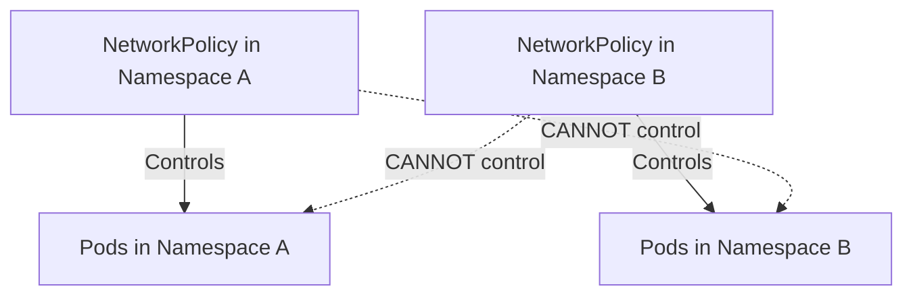
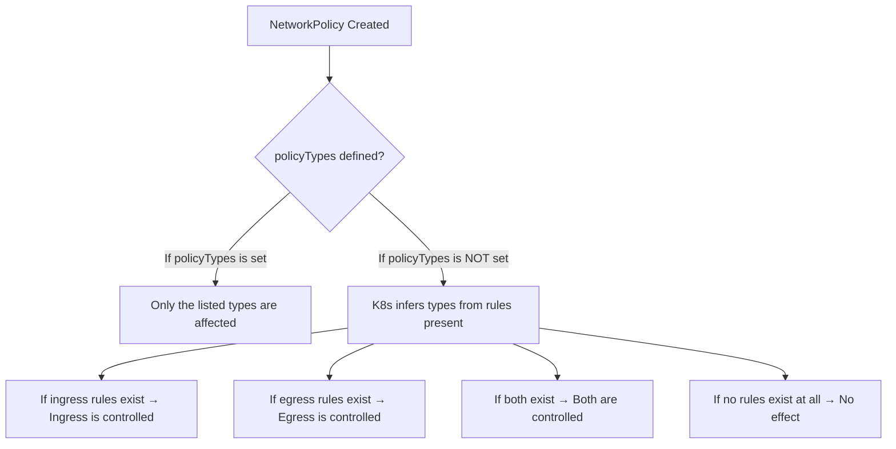
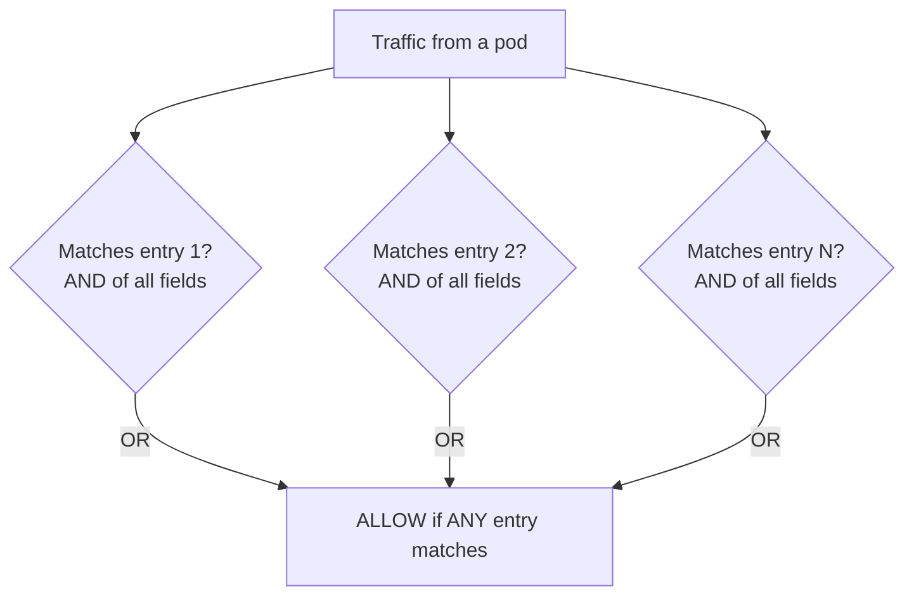

# NetworkPolicies - Core Concepts

Deep dive into the fundamental concepts underlying Kubernetes NetworkPolicies: namespace scoping, selectors, policy types, and how the logical AND/OR evaluation of selectors works.

## Namespace Requirement

NetworkPolicies are **namespaced resources**. They exist within a specific namespace and can only control traffic to pods in that same namespace.



### Why This Matters

A NetworkPolicy in `namespace-x` cannot apply rules to pods in `namespace-y`. To control cross-namespace traffic, you must create a NetworkPolicy in the **destination pod's namespace** — the namespace where the target pods live.

```bash
# Create a NetworkPolicy in the production namespace
# This affects pods in production, not in staging
kubectl apply -f deny-ingress.yaml -n production

# Verify the policy is in the correct namespace
kubectl get networkpolicy -n production
kubectl get networkpolicy -n staging  # should show nothing

# To control cross-namespace traffic, create the policy in the destination namespace
kubectl apply -f deny-ingress-from-other-ns.yaml -n production
```

## `podSelector`

The `podSelector` field defines **which pods the policy applies to**. It is a standard Kubernetes label selector with the same syntax as used in Deployments, Services, and other resources.

### Empty Selector (`{}`)

An empty selector `{}` matches **all pods** in the namespace. The `podSelector` field is **optional** — if it is omitted, Kubernetes defaults to an empty selector `{}` (which matches all pods). This means there is no valid way to write a NetworkPolicy that selects "no pods" via omission; you must use a selector that matches nothing (e.g., `matchLabels` with a non-existent key) to target zero pods.

```yaml
# Matches ALL pods in the namespace (explicit empty selector)
spec:
  podSelector: {}

# Also matches ALL pods in the namespace (selector omitted, defaults to {})
spec:

```bash
# See which pods in a namespace match a given selector
kubectl get pods -n production --show-labels

# Test a selector query
kubectl get pods -n production -l app=backend --show-labels

# Count pods matching empty selector (should be all)
kubectl get pods -n production -l '' --no-headers | wc -l
```

### Named Label Selector

```yaml
spec:
  podSelector:
    matchLabels:
      app: backend
      tier: api
```

This matches only pods that have **both** labels `app=backend` AND `tier=api`. The `matchLabels` map is a logical AND.

### Matching Expressions

```yaml
spec:
  podSelector:
    matchExpressions:
      - key: app
        operator: In
        values:
          - web
          - api
```

The `matchExpressions` field supports operators: `In`, `NotIn`, `Exists`, `DoesNotExist`.

```bash
# Find pods matching complex selectors
kubectl get pods -n production -l 'app in (web,api)'
kubectl get pods -n production -l 'tier notin (frontend)'
kubectl get pods -n production -l 'environment'  # pods that have the label, any value
```

## `policyTypes`

The `policyTypes` field declares which categories of traffic the policy controls: `Ingress`, `Egress`, or both.

### How policyTypes Affects Rule Interpretation



### Explicit vs. Inferred policyTypes

```yaml
# Explicit policyTypes — most common and recommended
policyTypes:
  - Ingress
  - Egress

# When policyTypes is omitted, K8s infers:
# ingress rules present → ingress is controlled
# egress rules present → egress is controlled
```

**Important**: If you define a `policyTypes` with only `Ingress` but your ingress section has no rules, the policy effectively does nothing for ingress (all ingress is allowed since there are no deny rules). Conversely, if you only list `Egress` but need ingress control, your ingress will remain fully open.
%comment not very clear

### kubectl Examples

```bash
# Check policyTypes of a NetworkPolicy
kubectl get networkpolicy default-deny -n production -o jsonpath='{.spec.policyTypes}'

# Verify the policy is correctly targeting ingress, egress, or both
kubectl describe networkpolicy default-deny -n production | grep -A5 Policy Types

# List all NetworkPolicies and their policyTypes in a namespace
kubectl get networkpolicies -n production -o jsonpath='{range .items[*]}{.metadata.name}{"\t"}{.spec.policyTypes}{"\n"}{end}'
```

## Selectors: `from` and `to`

The `from` (for ingress) and `to` (for egress) fields define which traffic is allowed. These fields contain lists of selector rules.

### Logical AND/OR Evaluation

This is one of the most important and frequently tested concepts:

- **Within a single `from` entry**: All fields are combined with logical **AND**.
- **Across multiple `from` entries in the list**: Each entry is combined with logical **OR**.



### Concrete Example: AND within a single entry

```yaml
ingress:
  - from:
      - podSelector:
          matchLabels:
            app: frontend
        namespaceSelector:
          matchLabels:
            name: frontend-ns
```

This single entry requires **both** conditions:
1. The source pod must have `app=frontend` label
2. The source pod must be in a namespace with `name=frontend-ns` label

Both must be true simultaneously (AND).

### Concrete Example: OR across multiple entries

```yaml
ingress:
  - from:
      - podSelector:
          matchLabels:
            app: frontend
  - from:
      - namespaceSelector:
          matchLabels:
            name: trusted-ns
      - namespaceSelector:
          matchLabels:
            name: admin-ns
```

This allows ingress if **ANY** of these conditions is true:
1. Source pod has `app=frontend` label (ANY namespace)
2. Source pod is in namespace with `name=trusted-ns` label
3. Source pod is in namespace with `name=admin-ns` label

### kubectl Examples

```bash
# Test ingress connectivity from a labeled pod
frontend_pod=$(kubectl get pods -n production -l app=frontend -o jsonpath='{.items[0].metadata.name}')
kubectl exec -n production "$frontend_pod" -- curl -s --connect-timeout 3 http://<backend-pod-ip>:8080

# Test ingress connectivity from an unlabeled pod (should be blocked)
kubectl run -n production test-unlabeled --image=curlimages/curl --rm -it --restart=Never -- \
  curl -s --connect-timeout 3 http://<backend-pod-ip>:8080
# Expected: Connection timed out (blocked)

# Test ingress connectivity from a pod in a different namespace
kubectl run -n default test-other-ns --image=curlimages/curl --rm -it --restart=Never -- \
  curl -s --connect-timeout 3 http://<backend-pod-ip>:8080
# Expected: Depends on namespaceSelector in the NetworkPolicy
```

## IPBlock Egress/Egress Restrictions

`ipBlock` allows or denies traffic based on source/destination IP ranges, which is useful for controlling access to external services or the node network.

### Concrete Example

```yaml
egress:
  - to:
      - ipBlock:
          cidr: 10.0.0.0/16
          except:
            - 10.0.1.0/24
    ports:
      - protocol: TCP
        port: 443
```

This allows egress to any IP in `10.0.0.0/16` except the `10.0.1.0/24` range, on TCP port 443. The `except` field further restricts within the CIDR.

### kubectl Examples

```bash
# Apply a policy with ipBlock
kubectl apply -f policy-ipblock.yaml -n production

# Verify the ipBlock configuration
kubectl get networkpolicy policy-with-ipblock -n production -o jsonpath='{.spec.egress[*].to[*].ipBlock}'

# Test egress to allowed IP range
kubectl exec -n production <pod> -- curl -s --connect-timeout 3 https://10.0.0.50/api

# Test egress to denied IP range (even within the CIDR, the except range is blocked)
kubectl exec -n production <pod> -- curl -s --connect-timeout 3 https://10.0.1.50/api
# Expected: Connection timed out
```

## Best Practices and Community Knowledge

1. **Start with default-deny, then add allow rules** — This white-list approach ensures only explicitly permitted traffic flows. It is the most secure starting point.

2. **Always include both `policyTypes` explicitly** — Relying on inference can lead to unexpected behavior, especially when policies are generated programmatically or by controllers.

3. **Label namespaces consistently** — If you plan to use `namespaceSelector`, ensure all target namespaces have the labels you reference. This is a common setup gap.

4. **Use `matchExpressions` for dynamic selectors** — `In`, `NotIn`, `Exists`, and `DoesNotExist` provide more flexible matching than `matchLabels`.

5. **Test with a temporary debugging pod** — Create a pod with `curlimages/curl` in different namespaces with different labels to verify policy behavior before rolling it out to production workloads.

6. **NetworkPolicy is not a firewall** — NetworkPolicies control pod-to-pod traffic within the cluster. They do not control traffic to external IPs (except via `ipBlock`) or traffic to/from the node itself.

## Common Pitfalls and Troubleshooting

- **"Policy has no effect"**: The `podSelector` doesn't match any pods. Verify labels on target pods with `kubectl get pods -n <ns> --show-labels`.

- **"Default-deny blocks DNS and breaks everything"**: When applying a default-deny egress policy, DNS (port 53 UDP/TCP) must be explicitly allowed, or no pod can resolve service names or external hostnames.

- **"namespaceSelector but namespace has no labels"**: NetworkPolicies evaluate `namespaceSelector` against namespace labels, not pod labels. If the namespace doesn't have the specified label, the selector matches nothing. Add labels with `kubectl label namespace <name> <key>=<value>`.

- **"Traffic is still allowed despite default-deny"**: Another NetworkPolicy in the same namespace with a matching `from` rule is allowing the traffic. NetworkPolicies are additive — any allow rule overrides a deny.

- **"ipBlock CIDR is too broad"**: Using `0.0.0.0/0` in an ipBlock allows access to literally all IPs, defeating the purpose of the NetworkPolicy. Be specific with CIDR ranges.

- **"Egress policy on a stateful application breaks it"**: Stateful applications often need egress to unexpected endpoints (monitoring endpoints, external APIs, service mesh control planes). Audit egress requirements before applying default-deny egress policies.

## Exam Strategy

- If a CKAD question mentions "isolate pods in a namespace" or "default deny all ingress", create a NetworkPolicy with `podSelector: {}` and `policyTypes: [Ingress]` with no ingress rules.
- If the question asks you to "allow traffic from pods with a specific label", add an ingress rule with the appropriate `podSelector`.
- If the question asks for cross-namespace traffic, use `namespaceSelector` in the `from` field of the NetworkPolicy in the **destination** namespace.
- Always test your answers by creating temporary pods and verifying connectivity with `curl`.
- Remember that `namespaceSelector` requires the target namespaces to have matching labels — this is a frequently tested detail.
