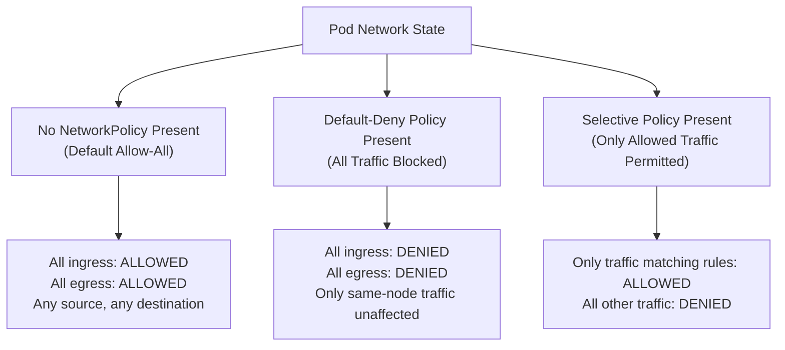
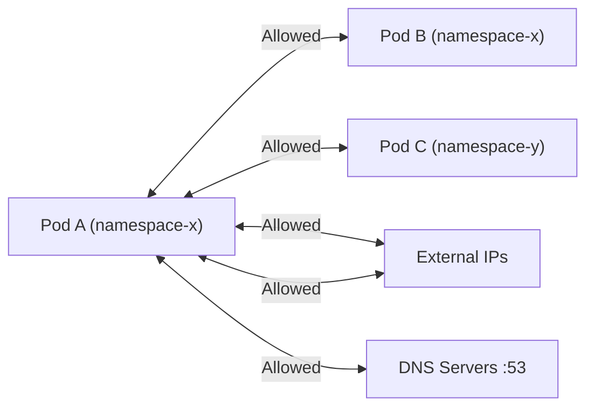
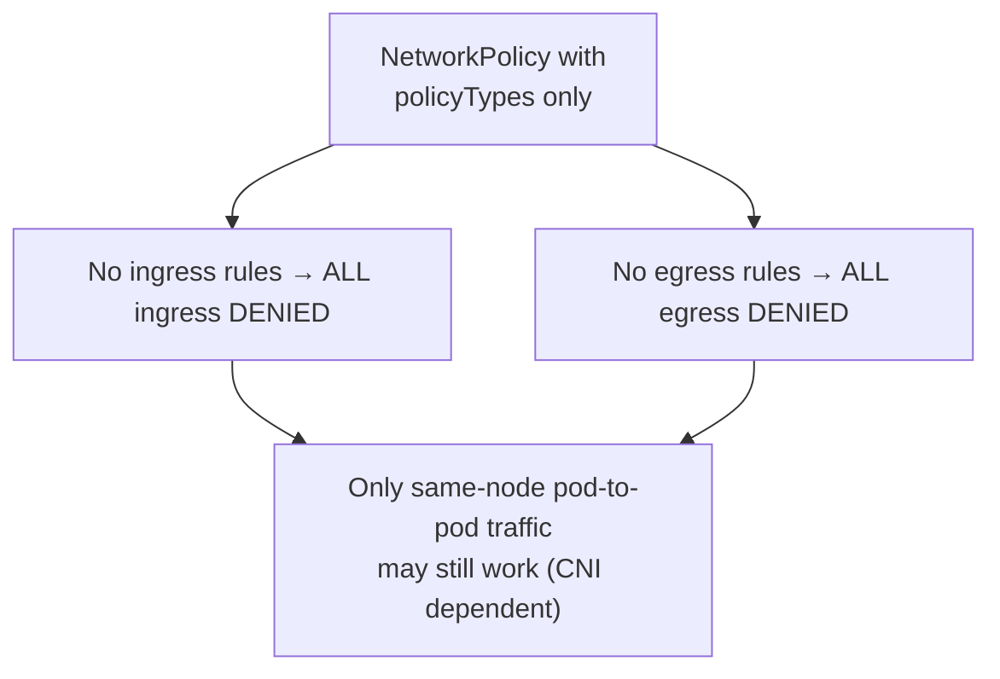
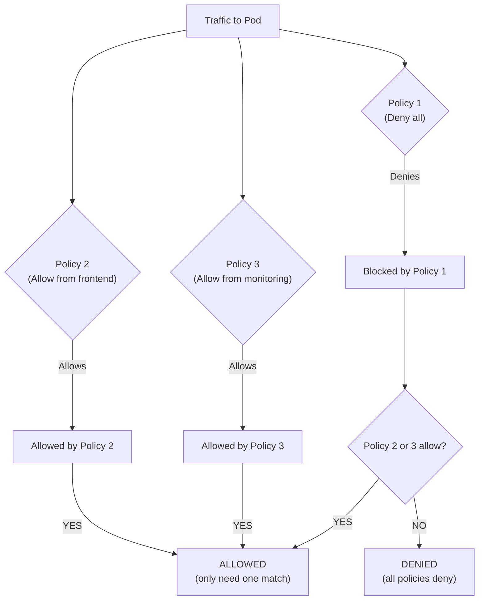

# NetworkPolicies - Default Behavior

Understanding the default network behavior in Kubernetes before and after applying NetworkPolicies is fundamental to network security and troubleshooting.

## The Three States of Pod Network Traffic

Kubernetes cluster networking has three distinct states that determine how traffic flows to and from pods:



## State 1: No NetworkPolicy (Default Allow-All)

When no NetworkPolicies exist in a namespace, **all pods can send and receive traffic from any source**. This is the Kubernetes default — networking is open until restricted.

### How This Works



In the default state:
- Pods in namespace `x` can receive ingress from any pod in any namespace
- Pods can make egress connections to any IP address
- Pods can resolve DNS names
- There are **no** restrictions

### kubectl Verification

```bash
# Check if any NetworkPolicies exist in a namespace
kubectl get networkpolicies -n production

# Expected output when no policies exist:
# No resources found in production namespace.

# Test full connectivity from a pod
kubectl run -n production connectivity-test --image=curlimages/curl --rm -it --restart=Never -- \
  curl -s http://<any-pod-ip>:8080 && echo "OK" && \
  curl -s --connect-timeout 3 https://google.com && echo "External OK" && \
  nslookup kubernetes.default && echo "DNS OK"
```

## State 2: Default-Deny Policy (Block All)

A NetworkPolicy can explicitly block all traffic by specifying `policyTypes` with no corresponding rules in `ingress` or `egress`.

### How Default-Deny Works



### Concrete Example

```yaml
apiVersion: networking.k8s.io/v1
kind: NetworkPolicy
metadata:
  name: deny-all-traffic
  namespace: production
spec:
  podSelector: {}
  policyTypes:
    - Ingress
    - Egress
```

### kubectl Verification

```bash
# Apply the default-deny policy
kubectl apply -f deny-all.yaml -n production

# Verify the policy exists
kubectl get networkpolicy deny-all-traffic -n production -o yaml

# Test ingress: traffic from other pods is now blocked
kubectl run -n default ingress-tester --image=curlimages/curl --rm -it --restart=Never -- \
  curl -s --connect-timeout 3 http://<production-pod-ip>:8080
# Expected: Connection timed out

# Test egress: the production pod cannot reach external services
kubectl exec -n production <production-pod> -- curl -s --connect-timeout 3 https://google.com
# Expected: Connection timed out

# Test egress: DNS resolution is also blocked
kubectl exec -n production <production-pod> -- nslookup kubernetes.default
# Expected: nslookup: timeout (DNS query fails)
```

## State 3: Allow-All with Explicit Policy

A NetworkPolicy can explicitly allow all traffic while still being an active policy. This is useful for documentation purposes or as a baseline that gets refined over time.

### Concrete Example

```yaml
apiVersion: networking.k8s.io/v1
kind: NetworkPolicy
metadata:
  name: allow-all-ingress
  namespace: production
spec:
  podSelector: {}
  policyTypes:
    - Ingress
  ingress:
    - from:
        - podSelector: {}
```

### kubectl Verification

```bash
kubectl apply -f allow-all-ingress.yaml -n production

# Confirm that pod-to-pod ingress still works
kubectl exec -n production <source-pod> -- curl -s http://<target-pod-ip>:8080
# Expected: Success (200 OK or expected response)

# Confirm that external ingress still works (e.g., from outside the cluster)
# Note: External-to-pod ingress depends on the cloud provider or network setup
```

## How Default-Deny Interacts with Multiple Policies

NetworkPolicies are **additive**. If multiple NetworkPolicies exist in a namespace, a pod is allowed traffic if **any** policy permits it. This means a default-deny policy does not override an explicit allow from another policy.



### Concrete Example: Multiple Policies on the Same Pods

```yaml
# Policy 1: Default-deny all ingress
apiVersion: networking.k8s.io/v1
kind: NetworkPolicy
metadata:
  name: deny-all-ingress
  namespace: production
spec:
  podSelector: {}
  policyTypes:
    - Ingress
---
# Policy 2: Allow from frontend pods
apiVersion: networking.k8s.io/v1
kind: NetworkPolicy
metadata:
  name: allow-frontend-ingress
  namespace: production
spec:
  podSelector:
    matchLabels:
      app: backend
  policyTypes:
    - Ingress
  ingress:
    - from:
        - podSelector:
            matchLabels:
              app: frontend
---
# Policy 3: Allow from monitoring namespace
apiVersion: networking.k8s.io/v1
kind: NetworkPolicy
metadata:
  name: allow-monitoring-ingress
  namespace: production
spec:
  podSelector:
    matchLabels:
      app: backend
  policyTypes:
    - Ingress
  ingress:
    - from:
        - namespaceSelector:
            matchLabels:
              name: monitoring
```

### kubectl Verification

```bash
# Apply all three policies
kubectl apply -f deny-all-ingress.yaml
kubectl apply -f allow-frontend-ingress.yaml
kubectl apply -f allow-monitoring-ingress.yaml

# Verify all three are active
kubectl get networkpolicies -n production
# Expected: deny-all-ingress, allow-frontend-ingress, allow-monitoring-ingress

# Frontend pod can reach backend (allowed by policy 2)
kubectl exec -n production <frontend-pod> -- curl -s http://<backend-pod-ip>:8080
# Expected: 200 OK

# Monitoring pod can reach backend (allowed by policy 3)
kubectl run -n monitoring test --image=curlimages/curl --rm -it --restart=Never -- \
  curl -s http://<backend-pod-ip>:8080
# Expected: 200 OK

# Random pod in production cannot reach backend (blocked by policy 1)
kubectl run -n production test-blocked --image=curlimages/curl --rm -it --restart=Never -- \
  curl -s --connect-timeout 3 http://<backend-pod-ip>:8080
# Expected: Connection timed out
```

## Best Practices and Community Knowledge

1. **Default-deny should be the starting point for production namespaces** — Apply a `deny-all` NetworkPolicy as the first policy in any production namespace. Add allow rules incrementally as needed.

2. **The `default-deny` pattern is a namespace-level concern** — Use `podSelector: {}` to apply the deny to all pods in the namespace. Do not scope it to a subset of pods unless you intend to leave the unscoped pods open.

3. **Monitor NetworkPolicy effects with connectivity tests** — Use temporary debug pods with `curlimages/curl` to test both allowed and denied connections after applying policies.

4. **Document your NetworkPolicies** — Since policies are additive and can be hard to reason about across multiple resources, maintain a NetworkPolicy inventory or diagram.

5. **Egress policies often have more impact than expected** — Blocking egress can break DNS, health checks, logging agents, metrics exporters, and external API calls. Always audit egress requirements.

6. **Not all CNIs enforce NetworkPolicies** — Verify with your cluster administrator that your CNI (Calico, Cilium, Weave, Romana, etc.) supports NetworkPolicy enforcement before assuming policies are active.

7. **`podSelector: {}` with `policyTypes: [Ingress]` only denies ingress, not egress** — If you need to deny both, you must explicitly include both policyTypes, or the egress remains open (which is a common mistake).

## Common Pitfalls and Troubleshooting

### All Traffic Still Works After Applying a Default-Deny Policy

- **Cause 1**: The CNI plugin does not enforce NetworkPolicies. Check with your cluster provider or admin.
- **Cause 2**: The NetworkPolicy is in a different namespace than the target pods. NetworkPolicies only apply to pods in their own namespace.
- **Cause 3**: The `podSelector` does not match the pods you're testing. Verify labels on both the policy and the pods.
- **Cause 4**: There is another NetworkPolicy in the same namespace that has an allow rule matching your test traffic.

```bash
# Debugging checklist:
# 1. Is the CNI enforcing NetworkPolicies?
kubectl get pods -n kube-system | grep -E 'calico|cilium|weave'

# 2. Is the NetworkPolicy in the right namespace?
kubectl get networkpolicy -n <target-namespace>

# 3. Does the podSelector match the target pods?
kubectl get pods -n <target-namespace> --show-labels

# 4. Are there any allow rules that might be overriding the deny?
kubectl get networkpolicies -n <target-namespace> -o jsonpath='{range .items[*]}{.metadata.name}{"\t"}{.spec.policyTypes}{"\n"}{end}'
```

### DNS Stops Working After Applying Egress Default-Deny

This is the most common troubleshooting scenario:

```bash
# Allow DNS egress immediately
kubectl apply -f allow-dns-egress.yaml -n <namespace>

# Verify DNS resolution is restored
kubectl exec -n <namespace> <pod> -- nslookup kubernetes.default
```

### Pods on the Same Node Can Communicate After Default-Deny

Some CNI implementations (especially on Linux with default iptables) allow same-node pod-to-pod traffic to bypass NetworkPolicy enforcement. This is an implementation detail of the CNI, not a guarantee. Do not rely on same-node traffic for security.

### Can't Tell if a NetworkPolicy is Actually Applied

```bash
# Use the 'networking' feature gate check (Kubernetes 1.21+)
kubectl api-resources | grep networkpolicy

# Check the NetworkPolicy status (if supported by the CNI)
kubectl describe networkpolicy <name> -n <namespace>

# Look at controller logs for policy processing
kubectl logs -n kube-system <cni-controller-pod> | grep -i networkpolicy
```

## Quick Reference

| Scenario | Default Behavior | After NetworkPolicy |
|---|---|---|
| No NetworkPolicy exists | All traffic allowed | — |
| `policyTypes: [Ingress]` with no rules | All ingress allowed | All ingress **denied** |
| `policyTypes: [Egress]` with no rules | All egress allowed | All egress **denied** |
| `podSelector: {}` | All pods in namespace affected | All pods in namespace affected |
| `podSelector: {matchLabels: {app: x}}` | Only labeled pods affected | Only labeled pods affected |
| Multiple policies on same pod | First policy applied | Union of all allow rules |