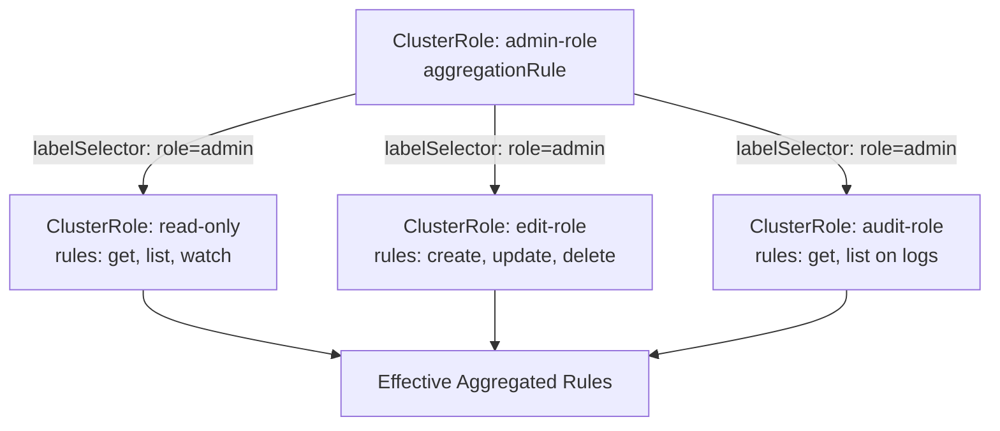
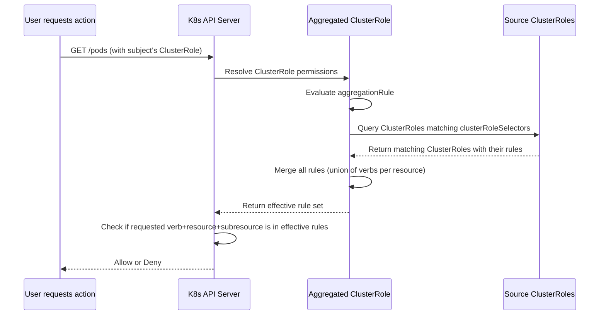

# RBAC & ServiceAccounts - Aggregation

In-depth guide to ClusterRole aggregation in Kubernetes RBAC, including how `aggregationRule` works, how rules are merged, and practical use cases.

## What Is Role Aggregation?

Role aggregation allows a `ClusterRole` to automatically collect and merge rules from other `ClusterRole` resources based on label selectors. When the aggregated ClusterRoles change, the resulting permissions are recomputed automatically — no manual updates to the aggregating ClusterRole are required.

### Core Concept

A `ClusterRole` with `aggregationRule` acts as a **computed union** of rules from other ClusterRoles that match the specified label selector. The aggregating ClusterRole itself has no static `rules` — its effective rules are the union of all matching source ClusterRoles' rules.



The effective permissions are the **union** of all source ClusterRole rules:
- `get`, `list`, `watch` (from read-only)
- `create`, `update`, `delete` (from edit-role)
- `get`, `list` on logs (from audit-role)

## How AggregationRule Works

### The `aggregationRule` Field

```yaml
apiVersion: rbac.authorization.k8s.io/v1
kind: ClusterRole
metadata:
  name: my-aggregated-role
  labels:
    rbac.authorization.kubernetes.io/aggregate-to-admin: "true"
aggregationRule:
  clusterRoleSelectors:
    - matchLabels:
        rbac.example.com/aggregate-to-admin: "true"
```

```mermaid
flowchart TL
    A["ClusterRole: my-aggregated-role"] --> B{"aggregationRule"}
    B --> C["clusterRoleSelectors"]
    C --> D["matchLabels query"]
    D --> E{"Find all ClusterRoles\nwhere labels match?"}
    E -->| Yes | F["Collect their `rules`"]
    E -->| No | G["No rules from this source"]
    F --> H["Merge all rules into\none effective rule set"]
    H --> I["Result: Union of ALL matching\nsource ClusterRole rules"]
```

### Key Rules of Aggregation

1. **Aggregation only works for `ClusterRole`** — `Role` resources cannot aggregate other roles. The `aggregationRule` field is only valid on `ClusterRole`.
2. **The aggregating ClusterRole can include both static `rules` and `aggregationRule`** — If you include both, Kubernetes applies both the static rules and the aggregated rules (union). The static rules are NOT ignored; they are combined with the aggregated rules to form the effective rule set.
3. **Aggregation happens automatically** — When a source ClusterRole's labels or rules change, the aggregated ClusterRole's effective rules are updated automatically. There is no manual re-sync needed.
4. **Rules are merged (union)** — If two source ClusterRoles define rules for the same API group and resource with overlapping verbs, the union of all verbs is taken. There is no conflict — more permissions are always added.
5. **Label matching is exact** — The `clusterRoleSelectors` use standard label selector syntax. Labels must match exactly (including casing).

### Concrete Example

```yaml
apiVersion: rbac.authorization.k8s.io/v1
kind: ClusterRole
metadata:
  name: aggregate-to-view
  labels:
    rbac.authorization.kubernetes.io/aggregate-to-view: "true"
aggregationRule:
  clusterRoleSelectors:
    - matchLabels:
        rbac.authorization.kubernetes.io/aggregate-to-view: "true"
---
apiVersion: rbac.authorization.k8s.io/v1
kind: ClusterRole
metadata:
  name: pod-viewer
  labels:
    rbac.authorization.kubernetes.io/aggregate-to-view: "true"
rules:
  - apiGroups: [""]
    resources: ["pods"]
    verbs: ["get", "list", "watch"]
---
apiVersion: rbac.authorization.k8s.io/v1
kind: ClusterRole
metadata:
  name: event-viewer
  labels:
    rbac.authorization.kubernetes.io/aggregate-to-view: "true"
rules:
  - apiGroups: [""]
    resources: ["events"]
    verbs: ["get", "list", "watch"]
```

### kubectl Commands

```bash
# Create the aggregation ClusterRole and source ClusterRoles
kubectl apply -f aggregate-roles.yaml

# Check the effective rules of the aggregated ClusterRole
# Note: aggregated rules may not always show in `get` — describe them
kubectl describe clusterrole aggregate-to-view

# Find which ClusterRoles contribute to the aggregation
kubectl get clusterroles -l rbac.authorization.kubernetes.io/aggregate-to-view=true

# Verify the labels on source ClusterRoles match the selector
kubectl get clusterroles pod-viewer event-viewer -o jsonpath='{range .items[*]}{.metadata.name}{": "}{.metadata.labels}{"\n"}{end}'

# Test the aggregated permissions with a RoleBinding
kubectl create rolebinding view-binding \
  --clusterrole=aggregate-to-view \
  --user=test-user \
  --dry-run=client -o yaml | kubectl apply -f -

# Verify the user can list pods (inherited from pod-viewer)
kubectl auth can-i list pods --as=test-user
# Expected: yes

# Verify the user can create pods (should be denied — not in pod-viewer rules)
kubectl auth can-i create pods --as=test-user
# Expected: no
```

## Aggregation Rule Evaluation Process



## Common Pitfalls and Troubleshooting

### Pitfall 1: Aggregation Labels Don't Match

The most common reason aggregation doesn't work is a label mismatch between the `aggregationRule.clusterRoleSelectors` and the source ClusterRoles' labels.

```bash
# Debug: List all ClusterRoles with the aggregate-to-view label
kubectl get clusterroles --show-labels | grep aggregate-to-view

# Debug: Check the exact label values
kubectl get clusterrole aggregate-to-view -o yaml | grep -A5 aggregationRule
kubectl get clusterrole pod-viewer -o yaml | grep labels

# The label key-value pairs must match EXACTLY, including quotes for boolean values
# "true" (with quotes) vs true (without quotes) — in YAML, label values are always strings
```

### Pitfall 2: Modifying a Source ClusterRole and Expecting Instant Results to `kubectl get`

Aggregation updates are asynchronous at the UI level. The effective rules may not reflect immediately in `kubectl get clusterrole`. Use `kubectl describe clusterrole` or `kubectl auth can-i` to verify actual effective permissions.

```bash
# This may show stale or incomplete rules
kubectl get clusterrole aggregate-to-view -o jsonpath='{.rules}'

# This shows the effective rules after aggregation
kubectl describe clusterrole aggregate-to-view | grep -A20 "Rules:"
```

### Pitfall 3: Confusing Aggregation with Static Rules

If a ClusterRole has both `rules` and `aggregationRule`, Kubernetes **combines** them — the effective rules are the union of the static rules AND the aggregated rules from matching source ClusterRoles. The static rules are NOT ignored.

```yaml
# This: static rules are COMBINED with aggregated rules
rules:
  - apiGroups: [""]
    resources: ["secrets"]
    verbs: ["get"]
aggregationRule:
  clusterRoleSelectors:
    - matchLabels:
        role: aggregator
# Effective rules: static rules [get on secrets] UNION aggregated rules from matching sources
```

### Pitfall 4: Overlapping Rules from Multiple Sources

If two source ClusterRoles define conflicting rules for the same resource, the verbs are merged (union). There is no priority or override — more permissions always win.

```yaml
# Source Role A: verbs [get]
# Source Role B: verbs [delete]
# Result: effective verbs [get, delete]
# There is no way to say "allow get but not delete" through aggregation alone
```

## Best Practices

1. **Use aggregation for permission tiers** — Create a set of granular ClusterRoles (viewer, editor, admin per resource), then aggregate them into higher-level roles. This avoids duplicating rule definitions.
2. **Label everything consistently** — Use a consistent label convention like `rbac.authorization.kubernetes.io/aggregate-to-` for all aggregation source ClusterRoles.
3. **Test aggregated permissions** — Use `kubectl auth can-i --as=<user-or-group>` to verify that aggregated permissions are what you expect, not just the sum of individual rules.
4. **Document the aggregation chain** — Since aggregated permissions are implicit, document which ClusterRoles contribute to each aggregating ClusterRole.
5. **Avoid circular aggregation** — A ClusterRole that aggregates itself (directly or indirectly) can cause undefined behavior. Ensure the aggregation graph is acyclic.
6. **Prefer aggregation over manual duplication** — When the same set of permissions needs to apply to multiple roles, aggregation reduces maintenance overhead and eliminates the risk of drift.

## Community Knowledge

- **`kubectl auth can-i` with `--list`** is the best tool for debugging aggregated permissions:
  ```bash
  kubectl auth can-i --list --as=test-user
  ```
  This shows all permissions the subject actually has, including those inherited through aggregation.

- **RBAC is the most commonly misconfigured authorization mechanism** in K8s. Many clusters have over-permissive ClusterRoles, and aggregation can silently widen permissions when source roles are modified.

- **In multi-tenant clusters**, use aggregation to create namespace-scoped admin roles that inherit cluster-admin-like permissions for specific CRDs, while keeping namespace isolation intact.

## Exam Tips for CKAD

- If a question asks you to "aggregate permissions from multiple ClusterRoles", use `aggregationRule` with `clusterRoleSelectors` matching labels.
- Remember that `aggregationRule` only applies to `ClusterRole`, never to `Role`.
- When asked to check if a user can perform an action, use `kubectl auth can-i` — it resolves aggregated, binding, and implicit permissions.
- Aggregation is **automatic** — no need to restart the API server or reapply the aggregating ClusterRole when source roles change.