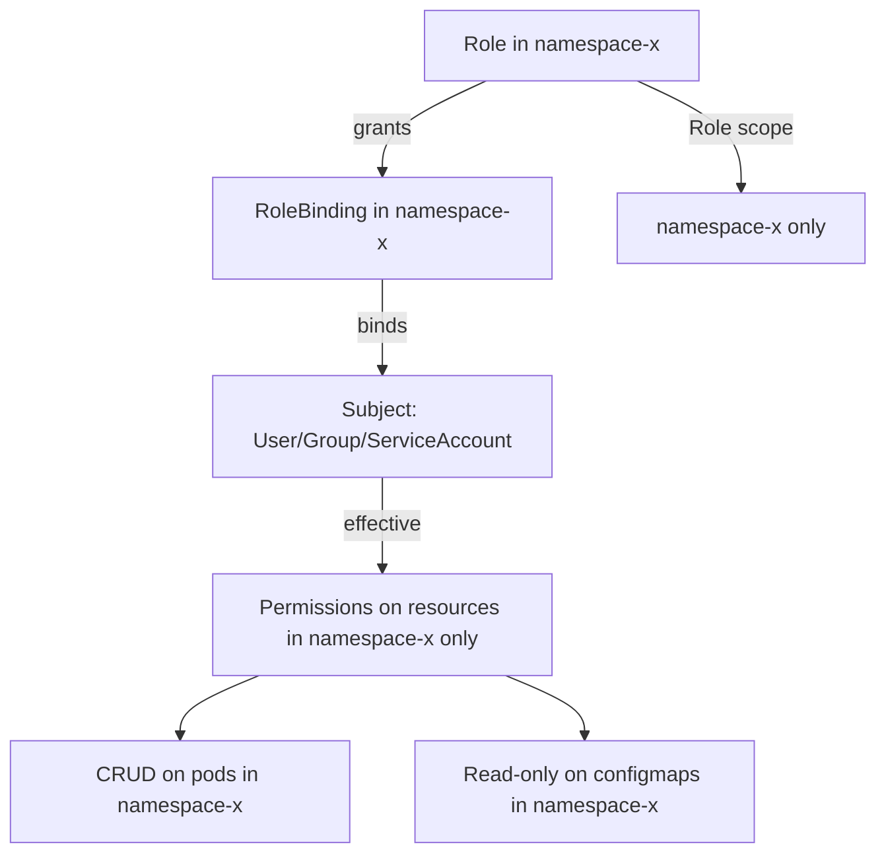
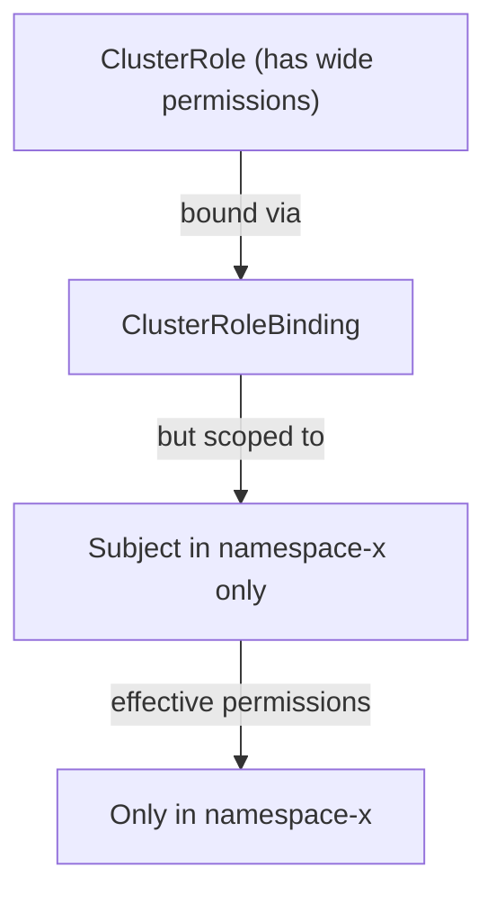
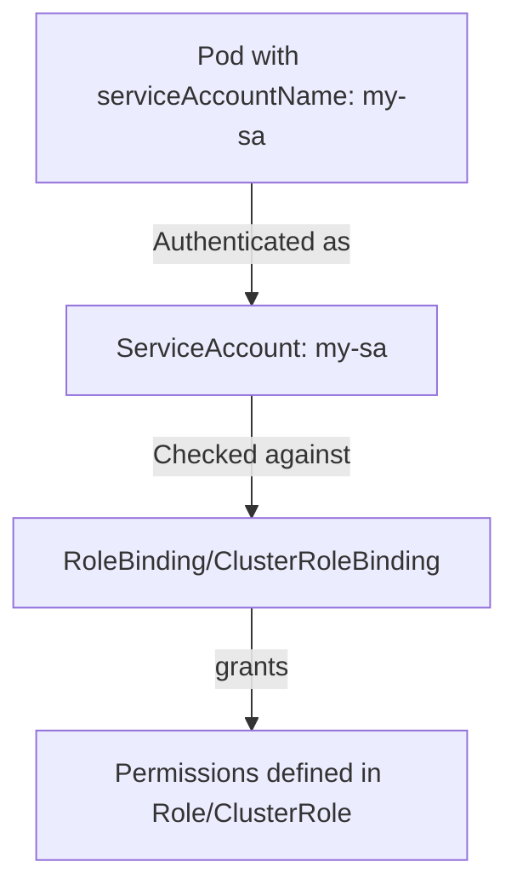

# RBAC & ServiceAccounts - Common Exam Patterns

This guide covers the most frequently tested RBAC patterns on the CKAD and CKS exams, including namespace-scoped vs cluster-wide access, ServiceAccount usage, and effective permission checking.

## Pattern 1: Namespace-Scoped Access with Role + RoleBinding

Use a `Role` (namespaced) with a `RoleBinding` to grant permissions within a single namespace. This is the most common RBAC pattern for application workloads.

### How It Works



### Concrete Example

```yaml
apiVersion: rbac.authorization.k8s.io/v1
kind: Role
metadata:
  name: pod-reader
  namespace: development
rules:
  - apiGroups: [""]
    resources: ["pods"]
    verbs: ["get", "list", "watch"]
---
apiVersion: rbac.authorization.k8s.io/v1
kind: RoleBinding
metadata:
  name: pod-reader-binding
  namespace: development
subjects:
  - kind: User
    name: dev-user
    apiGroup: rbac.authorization.k8s.io
roleRef:
  kind: Role
  name: pod-reader
  apiGroup: rbac.authorization.k8s.io
```

### kubectl Commands

```bash
# Apply the Role and RoleBinding
kubectl apply -f role-pod-reader.yaml -n development

# Verify the binding was created
kubectl get rolebinding pod-reader-binding -n development -o yaml

# Check what the subject can do
kubectl auth can-i list pods --as=dev-user -n development
# Expected: yes

# Check cross-namespace access (should be denied)
kubectl auth can-i list pods --as=dev-user -n production
# Expected: no

# Check if the subject can create pods (should be denied — only get/list/watch)
kubectl auth can-i create pods --as=dev-user -n development
# Expected: no

# List all permissions for the subject in a namespace
kubectl auth can-i --list --as=dev-user -n development
```

## Pattern 2: Cluster-Wide Access with ClusterRole + ClusterRoleBinding

Use a `ClusterRole` with a `ClusterRoleBinding` to grant permissions across all namespaces or cluster-wide (e.g., for cluster-admin, monitoring agents, or operators).

### How It Works

```mermaid
flowchart TD
    A["ClusterRole"] -->| grants | B["ClusterRoleBinding"]
    B -->| binds | C["Subject: User/Group/ServiceAccount"]
    C -->| effective | D[Permissions across ALL namespaces"]
    D --> E["CRUD on pods in any namespace"]
    D --> F["Get nodes cluster-wide"]
    D --> G["Read cluster-scoped resources\nDeployments, DaemonSets, etc.""]
```

### Concrete Example

```yaml
apiVersion: rbac.authorization.k8s.io/v1
kind: ClusterRole
metadata:
  name: secret-reader
rules:
  - apiGroups: [""]
    resources: ["secrets"]
    verbs: ["get", "list"]
---
apiVersion: rbac.authorization.k8s.io/v1
kind: ClusterRoleBinding
metadata:
  name: secret-reader-binding
subjects:
  - kind: User
    name: audit-user
    apiGroup: rbac.authorization.k8s.io
roleRef:
  kind: ClusterRole
  name: secret-reader
  apiGroup: rbac.authorization.k8s.io
```

### kubectl Commands

```bash
# Apply ClusterRole and ClusterRoleBinding
kubectl apply -f clusterrole-secret-reader.yaml

# Verify the binding exists cluster-wide
kubectl get clusterrolebinding secret-reader-binding -o yaml

# Check if the user can read secrets in any namespace
kubectl auth can-i list secrets --as=audit-user -n default
kubectl auth can-i list secrets --as=audit-user -n kube-system
# Expected: yes for all namespaces

# Check if the user can read other resources (should be denied by default)
kubectl auth can-i list pods --as=audit-user -n default
# Expected: no (not granted by the ClusterRole)

# List all cluster-wide permissions for the subject
kubectl auth can-i --list --as=audit-user
```

## Pattern 3: Namespace-Scoped Access via ClusterRoleBinding

A `ClusterRoleBinding` can grant permissions within a **single namespace** by using a RoleBinding-style subject but a ClusterRole. This is useful for testing or when a ClusterRole's rules are needed but should be scoped to one namespace.

### How It Works



**Important**: A `ClusterRoleBinding` is cluster-scoped, but the effective permissions are only as broad as the `ClusterRole` itself. However, the subject gets the role's permissions across all namespaces — you cannot scope a ClusterRoleBinding to a single namespace directly. Instead, use a `RoleBinding` that references a `ClusterRole` to scope cluster-permission rules to one namespace.

### Concrete Example (Correct Way: RoleBinding + ClusterRole)

```yaml
apiVersion: rbac.authorization.k8s.io/v1
kind: RoleBinding
metadata:
  name: scoped-cluster-role
  namespace: development
subjects:
  - kind: User
    name: dev-user
    apiGroup: rbac.authorization.k8s.io
roleRef:
  kind: ClusterRole
  name: secret-reader
  apiGroup: rbac.authorization.k8s.io
```

This creates a RoleBinding in namespace `development` that grants the `secret-reader` ClusterRole's permissions only within namespace `development`.

### kubectl Commands

```bash
# Apply the RoleBinding that scopes a ClusterRole to a namespace
kubectl apply -f scoped-rolebinding.yaml -n development

# Verify the binding exists in the namespace
kubectl get rolebinding scoped-cluster-role -n development -o yaml

# The user should be able to read secrets in development
kubectl auth can-i get secrets --as=dev-user -n development
# Expected: yes

# But not in other namespaces
kubectl auth can-i get secrets --as=dev-user -n production
# Expected: no
```

## Pattern 4: ServiceAccount as a Subject

When pod-to-pod or application-to-API interactions are involved, the pod's `ServiceAccount` is the subject for RBAC authorization.

### How It Works



### Concrete Example

```yaml
apiVersion: v1
kind: ServiceAccount
metadata:
  name: report-sa
  namespace: reporting
---
apiVersion: rbac.authorization.k8s.io/v1
kind: Role
metadata:
  name: report-reader
  namespace: reporting
rules:
  - apiGroups: [""]
    resources: ["pods", "configmaps"]
    verbs: ["get", "list"]
---
apiVersion: rbac.authorization.k8s.io/v1
kind: RoleBinding
metadata:
  name: report-reader-binding
  namespace: reporting
subjects:
  - kind: ServiceAccount
    name: report-sa
    namespace: reporting
roleRef:
  kind: Role
  name: report-reader
  apiGroup: rbac.authorization.k8s.io
```

### kubectl Commands

```bash
# Create all three resources
kubectl apply -f report-sa.yaml -n reporting

# Verify the ServiceAccount exists
kubectl get serviceaccount report-sa -n reporting
kubectl get serviceaccount report-sa -n reporting -o jsonpath='{.metadata.name}'

# Check permissions of the ServiceAccount
kubectl auth can-i list pods --as=system:serviceaccount:reporting:report-sa -n reporting
# Expected: yes

# Check cross-namespace access (should be denied)
kubectl auth can-i list pods --as=system:serviceaccount:reporting:report-sa -n default
# Expected: no

# Use the ServiceAccount in a Pod spec
kubectl run report-pod --image=curlimages/curl --rm -it --restart=Never \
  --serviceaccount=report-sa -n reporting -- \
  curl -s http://kubernetes.default.svc/api/v1/namespaces/reporting/pods
```

## How Subjects Are Expressed

| Subject Kind | Name Format | Example |
|---|---|---|
| `User` | Plain username | `"dev-user"` |
| `Group` | Prefix with `system:` (for built-in) or custom | `"system:authenticated"`, `"dev-team"` |
| `ServiceAccount` | `system:serviceaccount:<namespace>:<name>` | `"system:serviceaccount:dev:report-sa"` |

```bash
# Check effective permissions for a ServiceAccount (full form)
kubectl auth can-i --list --as=system:serviceaccount:reporting:report-sa

# Check effective permissions for a User
kubectl auth can-i --list --as=dev-user

# Check effective permissions for a Group
kubectl auth can-i --list --as=system:group:dev-team
```

## Best Practices and Community Knowledge

1. **Use ServiceAccounts for workloads, never User credentials** — Pods should authenticate as their ServiceAccount, not with static user credentials. This is more secure and easier to manage.

2. **Principle of least privilege** — Always grant the minimum set of verbs (`get`, `list`, `watch`) required. Avoid granting `create`, `update`, `patch`, or `delete` unless absolutely necessary.

3. **Use RoleBindings with ClusterRoles** when you need the full verb set of a ClusterRole but want to scope it to a single namespace.

4. **Use Groups for organizational access** — Bind groups (e.g., `dev-team`, `ops-team`) rather than individual users to Roles/ClusterRoles. This simplifies access management when team members change.

5. **Bind to special groups for built-in access levels**:
    - `system:authenticated` — All authenticated users
    - `system:unauthenticated` — All unauthenticated users
    - `system:serviceaccounts` — All ServiceAccounts
    - `system:masters` — Legacy superuser group

6. **Always use `--as` for testing** — `kubectl auth can-i --as=<subject>` is the best way to verify permissions before assigning them in production. It tests the authorization path end-to-end.

7. **Use `--list` to audit** — `kubectl auth can-i --list --as=<subject>` shows every permission the subject has, including those from aggregation, multiple bindings, and implicit permissions.

## Common Pitfalls and Troubleshooting

### The User Has No Permissions Despite Having a Binding

```bash
# 1. Check the RoleBinding references the correct Role
kubectl get rolebinding <name> -n <ns> -o jsonpath='{.roleRef}'

# 2. Check the Role's actual rules
kubectl get role <role-name> -n <ns> -o jsonpath='{.rules}'

# 3. Check the Binding's subject matches who you're authenticating as
kubectl get rolebinding <name> -n <ns> -o jsonpath='{.subjects}'

# 4. Test with kubectl auth can-i
kubectl auth can-i <verb> <resource> --as=<subject> -n <ns>
```

### ServiceAccount Authentication Format

When testing ServiceAccount permissions, the `--as` flag must use the full system username format: `system:serviceaccount:<namespace>:<name>`. Using just the ServiceAccount name will not work.

```bash
# WRONG
kubectl auth can-i list pods --as=report-sa -n reporting

# CORRECT
kubectl auth can-i list pods --as=system:serviceaccount:reporting:report-sa -n reporting
```

### ClusterRoleBinding Grants Too Many Permissions

ClusterRoleBindings are cluster-scoped and grant permissions across all namespaces. Before creating a ClusterRoleBinding, ask: "Do I really need this to apply cluster-wide?" If not, use a RoleBinding instead.

### Binding to a Non-Existent Role

If the `roleRef` in a RoleBinding or ClusterRoleBinding references a role that does not exist, the binding is created but has no effect. The subject will not receive any permissions.

```bash
# Check if a role referenced by a binding actually exists
kubectl get rolebinding <name> -n <ns> -o jsonpath='{.roleRef.name}'
kubectl get role <referenced-name> -n <ns>
# Expected: the role must exist
```

## Exam-Specific CKAD Patterns

1. **Task**: "Grant user X read-only access to pods in namespace Y"
   - Create a `Role` with `get`, `list`, `watch` on `pods` in namespace `Y`
   - Create a `RoleBinding` in namespace `Y` that binds the `Role` to user `X`

2. **Task**: "Allow ServiceAccount A to create deployments in its namespace"
   - Create a `Role` with `create`, `patch`, `update` on `deployments` (apiGroups: `apps`)
   - Create a `RoleBinding` in the namespace that binds the Role to ServiceAccount A

3. **Task**: "Grant user B cluster-wide read access"
   - Create a `ClusterRole` with `get`, `list`, `watch` on all resources
   - Create a `ClusterRoleBinding` that binds the ClusterRole to user B

4. **Task**: "Verify if a ServiceAccount can perform an action"
   - Use `kubectl auth can-i <verb> <resource> --as=system:serviceaccount:<ns>:<sa> -n <ns>`