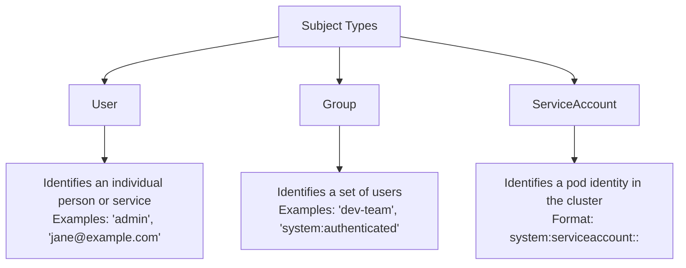
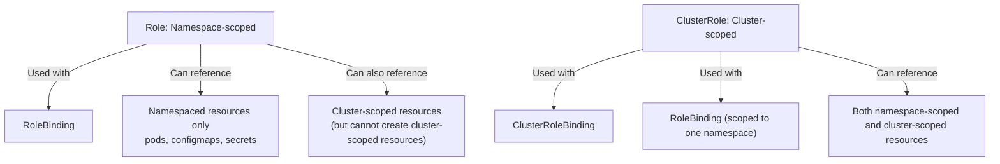
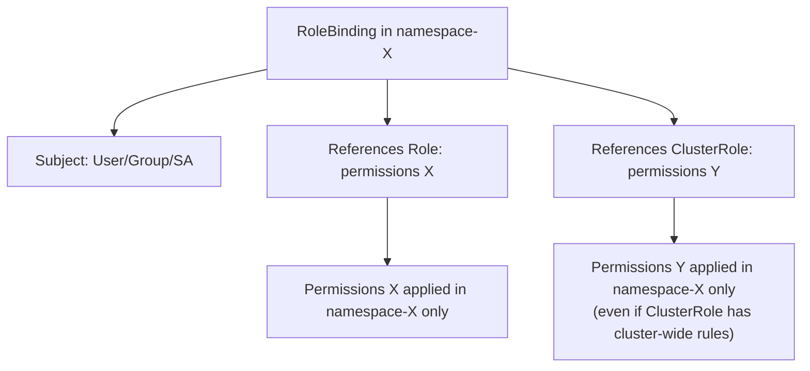
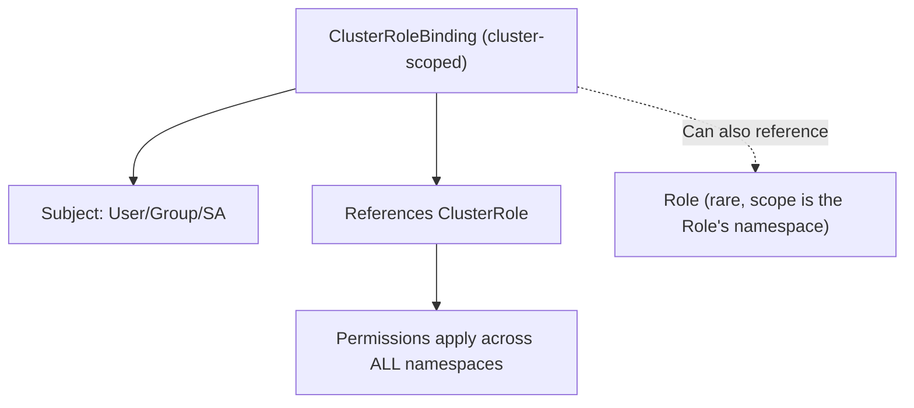
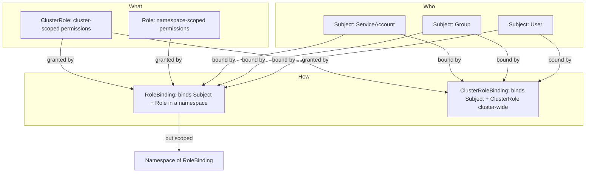

# RBAC & ServiceAccounts - Core Components

Detailed breakdown of the four core components of Kubernetes RBAC: Subjects (who), Roles (permissions), RoleBindings (grant mechanism), and ClusterRoleBindings (cluster-wide grant mechanism).

## Subjects: Who Receives Permissions

A Subject is the entity that receives permissions through a binding. There are exactly three kinds of Subjects in Kubernetes RBAC.



### User

A `User` subject represents an individual (human or service) in the system. User names are opaque strings — Kubernetes does not validate their format. They are typically used for human administrators or external service accounts.

### Group

A `Group` subject represents a collection of users. Groups are the most scalable way to manage RBAC because adding a new member only requires adding them to the group, not modifying RoleBindings.

The `system:` prefix is reserved for built-in groups. The most common built-in groups:

| Group | Members |
|---|---|
| `system:authenticated` | All authenticated users (including ServiceAccounts) |
| `system:unauthenticated` | All unauthenticated requests |
| `system:serviceaccounts` | All ServiceAccounts across all namespaces |
| `system:masters` | Legacy superuser group (deprecated in v1.23+) |

### ServiceAccount

A `ServiceAccount` is a special subject that represents the identity of a Pod. When a Pod makes API requests, the kubelet uses the ServiceAccount's credentials to authenticate.

```bash
# View all ServiceAccounts in a namespace
kubectl get serviceaccounts -n production

# View the ServiceAccount details
kubectl get serviceaccount default -n production -o yaml

# Check the ServiceAccount's secret (used for authentication)
kubectl get serviceaccount default -n production -o jsonpath='{.secrets}'

# Create a ServiceAccount
kubectl create serviceaccount app-sa -n production

# Delete a ServiceAccount
kubectl delete serviceaccount app-sa -n production
```

## Roles and ClusterRoles: What Permissions Are Available

A `Role` defines a set of permissions scoped to a **single namespace**. A `ClusterRole` defines permissions that are **cluster-scoped** (can apply cluster-wide or be scoped to a namespace via a RoleBinding).



### Role Example

```yaml
apiVersion: rbac.authorization.k8s.io/v1
kind: Role
metadata:
  name: pod-reader
  namespace: development
rules:
  - apiGroups: [""]
    resources: ["pods"]
    verbs: ["get", "list", "watch"]
```

### ClusterRole Example

```yaml
apiVersion: rbac.authorization.k8s.io/v1
kind: ClusterRole
metadata:
  name: cluster-secret-reader
rules:
  - apiGroups: [""]
    resources: ["secrets"]
    verbs: ["get", "list", "watch"]
  - apiGroups: ["apps"]
    resources: ["deployments"]
    verbs: ["get", "list", "watch"]
```

### Key Differences Between Role and ClusterRole

| Aspect | Role | ClusterRole |
|---|---|---|
| Scope | Namespace | Cluster |
| Binding | RoleBinding only | RoleBinding or ClusterRoleBinding |
| Resource access | Namespace-scoped resources | Both scoped and cluster resources |
| Reusability | Only within its namespace | Across any namespace |

### kubectl Commands

```bash
# List all Roles in a namespace
kubectl get roles -n development

# Describe a Role to see its rules
kubectl describe role pod-reader -n development

# List all ClusterRoles
kubectl get clusterroles

# Describe a ClusterRole
kubectl describe clusterrole cluster-secret-reader

# Check if a Role or ClusterRole exists
kubectl get role pod-reader -n development
kubectl get clusterrole cluster-secret-reader

# Get effective rules of a Role
kubectl get role pod-reader -n development -o jsonpath='{.rules[*].verbs}'

# Test permissions against a Role
kubectl auth can-i create deployments --as=dev-user -n development
# Expected: no (Role only grants get/list/watch on pods)
```

## RoleBindings and ClusterRoleBindings: Granting Permissions

A **Binding** connects a Subject (who) to a Role or ClusterRole (what permissions). The type of binding determines the scope of the granted permissions.

### RoleBinding Details

A `RoleBinding` grants the permissions of a `Role` or `ClusterRole` to a Subject **within a specific namespace**. Even if the `ClusterRole` has cluster-scoped rules, the RoleBinding restricts the effective scope to its namespace.



### ClusterRoleBinding Details

A `ClusterRoleBinding` is a cluster-scoped resource that grants the permissions of a `ClusterRole` to a Subject across the entire cluster. It can also use a `Role` as reference (effectively granting it cluster-wide, though Roles are typically namespace-scoped).



### Concrete Examples

#### RoleBinding Example

```yaml
apiVersion: rbac.authorization.k8s.io/v1
kind: RoleBinding
metadata:
  name: pod-reader-binding
  namespace: development
subjects:
  - kind: User
    name: dev-user
    apiGroup: rbac.authorization.k8s.io
roleRef:
  kind: Role
  name: pod-reader
  apiGroup: rbac.authorization.k8s.io
```

#### ClusterRoleBinding Example

```yaml
apiVersion: rbac.authorization.k8s.io/v1
kind: ClusterRoleBinding
metadata:
  name: secret-reader-global
subjects:
  - kind: Group
    name: audit-team
    apiGroup: rbac.authorization.k8s.io
roleRef:
  kind: ClusterRole
  name: cluster-secret-reader
  apiGroup: rbac.authorization.k8s.io
```

### kubectl Commands

```bash
# Create a RoleBinding
kubectl create rolebinding dev-reader-binding \
  --role=pod-reader \
  --user=dev-user \
  -n development

# Create a ClusterRoleBinding
kubectl create clusterrolebinding audit-reader-binding \
  --clusterrole=cluster-secret-reader \
  --group=audit-team

# List RoleBindings in a namespace
kubectl get rolebindings -n development

# List ClusterRoleBindings cluster-wide
kubectl get clusterrolebindings

# Check a RoleBinding's subject and role reference
kubectl get rolebinding pod-reader-binding -n development -o jsonpath='{
  .subjects[*].kind":"{.subjects[*].name}
}\n{
  .roleRef.kind":"{.roleRef.name}
}'

# Check a ClusterRoleBinding
kubectl get clusterrolebinding secret-reader-global -o jsonpath='{
  .subjects[*].kind":"{.subjects[*].name}
}\n{
  .roleRef.kind":"{.roleRef.name}
}'
```

## The Four-Component Relationship



## Best Practices

1. **Prefer Group subjects over User subjects** — Group bindings are easier to manage and audit. Add/remove users from groups instead of modifying RoleBindings.

2. **Always check what `roleRef` references** — A common mistake is creating a ClusterRoleBinding that references a Role (which only grants namespace-scoped permissions) instead of the intended ClusterRole.

3. **Use `--as` to test permissions before granting** — `kubectl auth can-i` is your best friend for verification. Always test what the binding actually grants.

4. **Avoid granting `cluster-admin` unless absolutely necessary** — The `cluster-admin` ClusterRole grants unrestricted access to the entire cluster, including the ability to modify RBAC itself.

5. **Review bindings regularly** — RBAC drift is common. Use `kubectl auth can-i --list` to audit current permissions for each subject.

## Common Pitfalls

### Subject Kind Mismatch

The `subjects[].kind` field must match the actual resource kind. Using `kind: User` for a ServiceAccount, or `kind: Group` for a User, will create a binding that grants no permissions because the subject does not exist as specified.

```bash
# Check subject kind
kubectl get rolebinding <name> -n <ns> -o jsonpath='{.subjects[*].kind}'
# Must be one of: User, Group, ServiceAccount
```

### Wrong Namespace in Subject

For `ServiceAccount` subjects, the `namespace` field in the `subjects` list must match the ServiceAccount's namespace. A `ServiceAccount` named `app-sa` in namespace `production` is a different subject from the same-named SA in `default`.

```json
"subjects": [
  {
    "kind": "ServiceAccount",
    "name": "app-sa",
    "namespace": "production"
  }
]
```

### ClusterRoleBinding with ClusterRole But Wrong Scope Expectation

A ClusterRoleBinding always grants cluster-wide permissions (across all namespaces). Even though you can reference a `Role` via a ClusterRoleBinding, it is a rare and confusing pattern that scopes the Role to the RoleBinding's namespace. Avoid it.

### apiGroup Omissions

Many Kubernetes resources belong to API groups other than the core group (`""`). Forgetting to specify the correct `apiGroup` is a common mistake:

| Resource | API Group |
|---|---|
| Pods, Secrets, ConfigMaps, Services | `""` (core) |
| Deployments, DaemonSets, ReplicaSets | `"apps"` |
| Roles, ClusterRoles, RoleBindings | `"rbac.authorization.k8s.io"` |
| NetworkPolicies, Ingresses | `"networking.k8s.io"` |
| Custom Resources | Varies (e.g., `"app.example.com"`) |