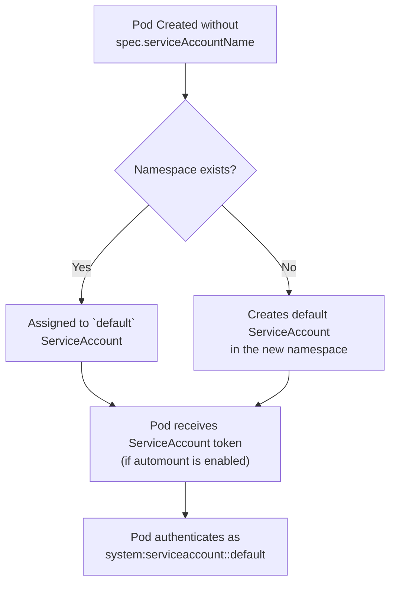
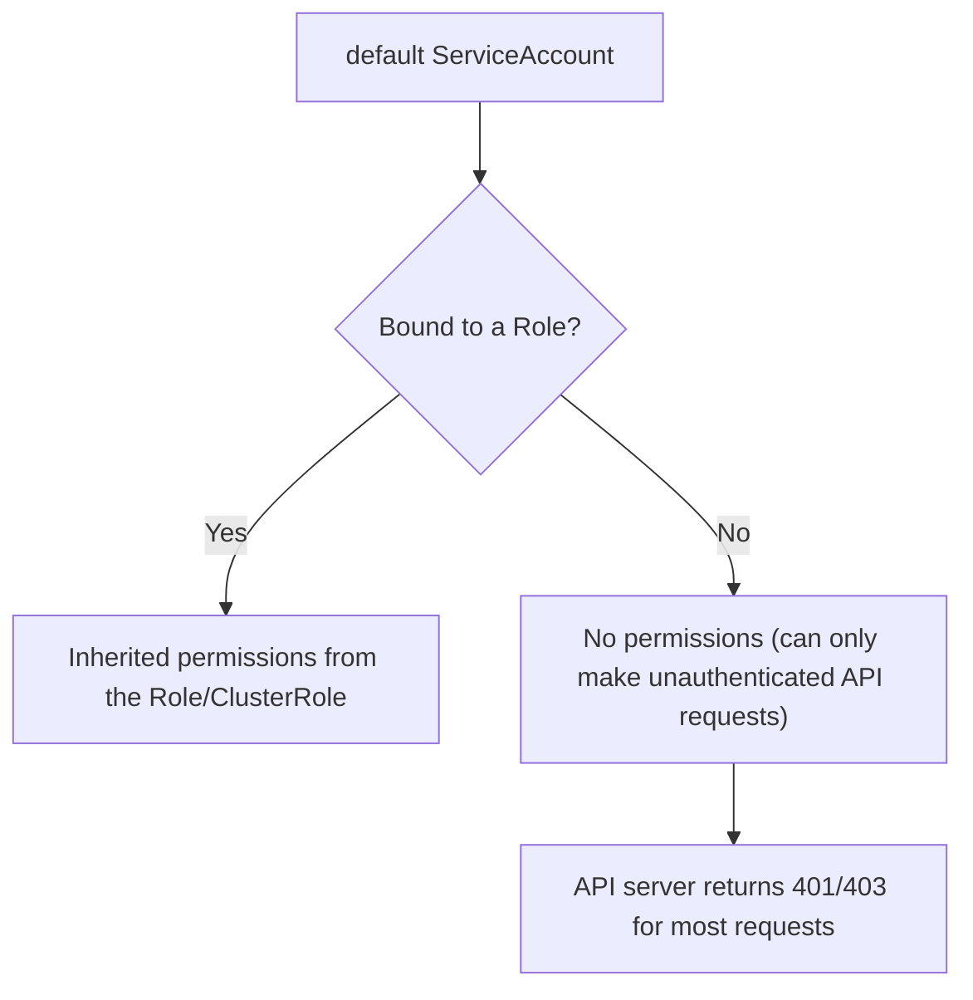
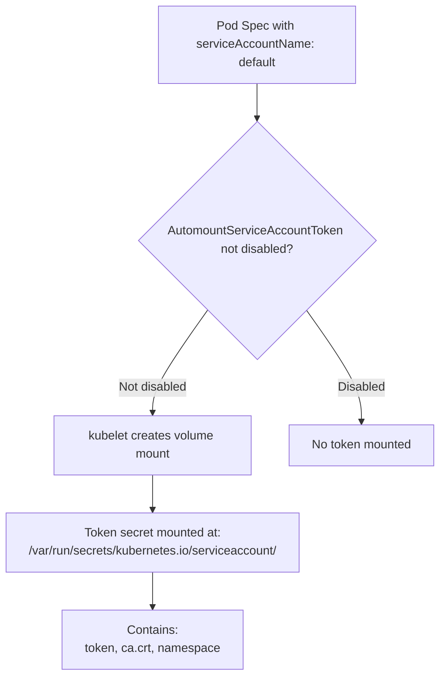

# RBAC & ServiceAccounts - Default ServiceAccount Behavior

Complete guide to the default ServiceAccount behavior in Kubernetes, including its permissions, token mounting, and security implications.

## What Is the Default ServiceAccount?

Every namespace in a Kubernetes cluster automatically gets a `default` ServiceAccount. When a Pod is created without explicitly specifying a `serviceAccountName`, it is assigned the `default` ServiceAccount of its namespace.



## Every Pod Gets the Default ServiceAccount

Unless you explicitly override it, every Pod runs with the `default` ServiceAccount. This means the `default` ServiceAccount's permissions apply to the Pod.

### kubectl Examples

```bash
# Check which ServiceAccount a Pod uses
kubectl get pod my-pod -n production -o jsonpath='{.spec.serviceAccountName}'
# Expected output: default (if not explicitly set)

# Check the default ServiceAccount in a namespace
kubectl get serviceaccount default -n production -o yaml

# List all ServiceAccounts in a namespace
kubectl get serviceaccounts -n production

# Check if a Pod's ServiceAccount has a token secret
kubectl get serviceaccount default -n production -o jsonpath='{.secrets}'
```

### Verifying a Pod's ServiceAccount

```bash
# Get the ServiceAccount of a running Pod
kubectl get pod <pod-name> -n production -o jsonpath='{.spec.serviceAccountName}'

# Check the ServiceAccount's secrets (automounted tokens)
kubectl get serviceaccount default -n production
kubectl get secrets -n production | grep default-token

# Inspect the token contents
kubectl get secret default-token-xxxxx -n production -o jsonpath='{.data.token}' | base64 -d
```

## Default ServiceAccount Permissions

The `default` ServiceAccount itself has **no inherent permissions** — it has the same permissions as any other ServiceAccount unless explicitly bound to a Role or ClusterRole via a RoleBinding or ClusterRoleBinding.

### Common Misconception

Many people believe the `default` ServiceAccount has elevated permissions. It does not. However, it is common practice to grant the `default` ServiceAccount additional permissions via a RoleBinding in the namespace, which can lead to over-permissioning.



### The Pod's Perspective

When a Pod runs with the `default` ServiceAccount, the kubelet attaches the ServiceAccount's token to the Pod's API requests:

| Request Type | Behavior |
|---|---|
| API call with token | Authenticated as `system:serviceaccount:<ns>:default` |
| API call without token | Unauthenticated (subject is `system:unauthenticated`) |
| API call with --as flag | Overrides the default authentication (e.g., for testing) |

```bash
# See what identity the Pod uses
kubectl exec -n production <pod> -- curl -s -H "Authorization: Bearer $(cat /var/run/secrets/kubernetes.io/serviceaccount/token)" \
  https://KUBERNETES_SERVICE_HOST:443/apis/rbac.authorization.k8s.io/v1/selfsubjectaccessreviews \
  --cacert /var/run/secrets/kubernetes.io/serviceaccount/ca.crt

# Check the namespace the token belongs to
kubectl exec -n production <pod> -- cat /var/run/secrets/kubernetes.io/serviceaccount/namespace
```

## Token Automounting

By default, Kubernetes automatically mounts a ServiceAccount token into every Pod at `/var/run/secrets/kubernetes.io/serviceaccount/`. This token is used for API authentication.

### How Token Automounting Works



### Disabling Token Automounting

```yaml
apiVersion: v1
kind: Pod
metadata:
  name: no-auth-pod
  namespace: production
spec:
  automountServiceAccountToken: false
  containers:
    - name: app
      image: nginx
```

```bash
# Verify the token is not mounted
kubectl exec no-auth-pod -n production -- ls /var/run/secrets/kubernetes.io/serviceaccount/
# Expected: No such file or directory

# Verify the pod's automount setting
kubectl get pod no-auth-pod -n production -o jsonpath='{.spec.automountServiceAccountToken}'
# Expected: false
```

### Disabling at the ServiceAccount Level (Recommended)

Rather than disabling token automounting per Pod, you can disable it at the ServiceAccount level. This applies to all Pods using that ServiceAccount.

```yaml
apiVersion: v1
kind: ServiceAccount
metadata:
  name: default
  namespace: production
automountServiceAccountToken: false
```

```bash
# Apply the ServiceAccount modification
kubectl apply -f serviceaccount-no-token.yaml -n production

# Verify the ServiceAccount has automount disabled
kubectl get serviceaccount default -n production -o jsonpath='{.automountServiceAccountToken}'
# Expected: false

# New Pods using this ServiceAccount will not have tokens mounted
```

## Overriding the Default ServiceAccount

You can specify a different ServiceAccount for a Pod to grant it specific permissions.

### Concrete Example

```yaml
apiVersion: v1
kind: ServiceAccount
metadata:
  name: app-sa
  namespace: production
---
apiVersion: rbac.authorization.k8s.io/v1
kind: Role
metadata:
  name: app-role
  namespace: production
rules:
  - apiGroups: [""]
    resources: ["pods", "configmaps"]
    verbs: ["get", "list", "watch"]
---
apiVersion: rbac.authorization.k8s.io/v1
kind: RoleBinding
metadata:
  name: app-role-binding
  namespace: production
subjects:
  - kind: ServiceAccount
    name: app-sa
    namespace: production
roleRef:
  kind: Role
  name: app-role
  apiGroup: rbac.authorization.k8s.io
---
apiVersion: v1
kind: Pod
metadata:
  name: my-app
  namespace: production
spec:
  serviceAccountName: app-sa
  automountServiceAccountToken: false
  containers:
    - name: app
      image: nginx
```

### kubectl Commands

```bash
# Apply the ServiceAccount, Role, RoleBinding, and Pod
kubectl apply -f app-sa-full.yaml -n production

# Verify the Pod uses the correct ServiceAccount
kubectl get pod my-app -n production -o jsonpath='{.spec.serviceAccountName}'
# Expected: app-sa

# Check the Pod's automount setting
kubectl get pod my-app -n production -o jsonpath='{.spec.automountServiceAccountToken}'
# Expected: false

# Test the Pod's permissions (should only have get/list/watch on pods and configmaps)
kubectl auth can-i create pods --as=system:serviceaccount:production:app-sa -n production
# Expected: no

kubectl auth can-i list pods --as=system:serviceaccount:production:app-sa -n production
# Expected: yes
```

## Security Implications

### Why Default SA with Token Automounting Is Risky

1. **Over-permissioned by accident** — If a RoleBinding grants the `default` ServiceAccount broader permissions, all Pods using the default SA inherit them.
2. **Token theft** — The mounted token file is readable by the container process. If an attacker gains access to a container, they can use the token to make unauthorized API calls.
3. **Cross-namespace access** — If a ClusterRoleBinding binds the `default` ServiceAccount cluster-wide, all Pods using the `default` SA gain those permissions in every namespace.

### Security Best Practices

| Practice | Configuration |
|---|---|
| Disable token automounting | `automountServiceAccountToken: false` on ServiceAccount or Pod |
| Use dedicated ServiceAccounts per workload | Create one SA per application, not the `default` SA |
| Scope permissions to the minimum required | Use `Role` (not `ClusterRole`) with minimal `verbs` |
| Never bind `default` SA to ClusterRoleBindings except for cluster-admin | Review all ClusterRoleBindings for `default` SA references |
| Rotate tokens regularly | Delete and recreate ServiceAccount tokens or use projected volumes |

### Checking for Over-Permissioned Default SA

```bash
# Find all ClusterRoleBindings that grant permissions to the default SA
kubectl get clusterrolebindings -o json | jq -r '.items[] | select(.subjects[]?.name == "default") | .metadata.name'

# Find all RoleBindings in a namespace that grant permissions to the default SA
kubectl get rolebindings -n production -o json | jq -r '.items[] | select(.subjects[]?.name == "default") | .metadata.name'

# Check what permissions the default SA has in a namespace
kubectl auth can-i --list --as=system:serviceaccount:<ns>:default -n <ns>
```

## Common Pitfalls and Troubleshooting

### "Pods can access the API but I didn't grant them permissions"

The `default` ServiceAccount may have been bound to a wide-permission Role or ClusterRole without the team realizing it. Check all bindings for the `default` ServiceAccount.

### "Token automounting is on even when I don't need it"

By default, tokens are always automounted unless explicitly disabled. This means every Pod has a service account token in its filesystem, even if it doesn't make API calls. Disable this to reduce the attack surface.

### "My Pod can't reach the API server"

If the ServiceAccount has `automountServiceAccountToken: false` and the Pod needs API access, the Pod will not have a token. You must either enable automounting or use a projected volume for the token.

### "ServiceAccount created but Pod still uses default"

If a Pod explicitly declares `serviceAccountName` but that ServiceAccount doesn't exist yet, Kubernetes creates it automatically. However, if the ServiceAccount name has a typo, the Pod will use the non-existent SA name and fail to start. Always verify the SA name matches exactly.

```bash
# Check if the specified ServiceAccount exists
kubectl get serviceaccount <name> -n <ns>

# If it doesn't exist, Kubernetes will create it automatically
# BUT it will have NO permissions

# Fix: Create the ServiceAccount explicitly or correct the name
```

## Exam Tips

- When a CKAD question asks you to grant a Pod specific API access, create a dedicated ServiceAccount, grant it a Role with the minimum permissions, and set `serviceAccountName` on the Pod spec.
- The `default` ServiceAccount is the answer when a question asks "what ServiceAccount are Pods assigned to by default."
- Disabling `automountServiceAccountToken` is a security best practice but is not strictly required for RBAC functionality.
- If a Pod runs with a ServiceAccount that has no bindings, the Pod can still make API requests as an unauthenticated user (subject: `system:unauthenticated`), which typically means no access.