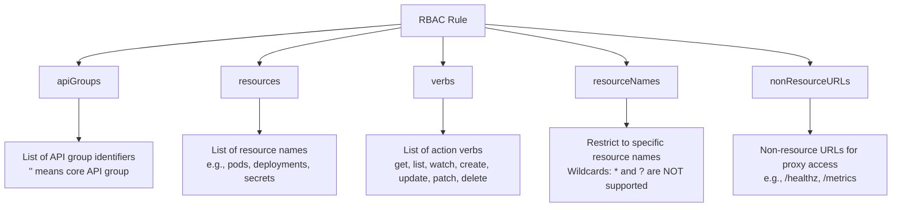

# RBAC & ServiceAccounts - Rules Structure

Complete reference for the `rules` field structure in Kubernetes Roles and ClusterRoles, covering `apiGroups`, `resources`, `verbs`, and advanced rule patterns.

## The Anatomy of a Rule

Every RBAC rule is defined as a YAML mapping with three or more possible fields. Understanding each field's syntax and behavior is essential for writing correct RBAC configurations.



## Field-by-Field Breakdown

### `apiGroups`

The `apiGroups` field specifies which Kubernetes API groups the rule applies to. The API group determines how resources are grouped and accessed in the Kubernetes API.

| API Group Value | Meaning | Resources |
|---|---|---|
| `""` (empty string) | Core (legacy) API group | pods, services, configmaps, secrets, events, serviceaccounts, nodes, namespaces |
| `"apps"` | Apps API group | deployments, daemonsets, statefulsets, replicasets, controllerrevisions |
| `"batch"` | Batch API group | jobs, cronjobs |
| `"extensions"` | Extensions API group (deprecated) | ingresses, podsecuritypolicies |
| `"rbac.authorization.k8s.io"` | RBAC API group | roles, clusterroles, rolebindings, clusterrolebindings |
| `"networking.k8s.io"` | Networking API group | ingresses, networkpolicies, ingressclasses |
| `"policy"` | Policy API group | podsecuritypolicies |
| `"autoscaling"` | Autoscaling API group | horizontalpodautoscalers |
| `"apiextensions.k8s.io"` | API extensions | customresourcedefinitions |
| `"storage.k8s.io"` | Storage API group | storageclasses, persistentvolumes, persistentvolumeclaims |
| `"admissionregistration.k8s.io"` | Admission API group | validatingwebhookconfigurations, mutatingwebhookconfigurations |
| `"certificates.k8s.io"` | Certificates API group | certificatesigningrequests |
| `"<any custom>"` | Custom/third-party CRDs | Any CRD resource defined in the cluster |

```yaml
# Rule targeting core API group resources
rules:
  - apiGroups: [""]
    resources: ["pods", "configmaps"]
    verbs: ["get", "list", "watch"]

# Rule targeting apps API group resources
rules:
  - apiGroups: ["apps"]
    resources: ["deployments", "daemonsets"]
    verbs: ["get", "list", "watch", "create", "update", "patch", "delete"]

# Rule targeting multiple API groups
rules:
  - apiGroups: ["", "apps", "batch"]
    resources: ["pods", "deployments", "jobs"]
    verbs: ["get", "list", "watch", "create", "update", "patch", "delete"]

# Rule that explicitly denies everything (wildcard API group)
# Note: This pattern is used in admission control, not in standard RBAC rules
rules:
  - apiGroups: ["*"]
    resources: ["*"]
    verbs: ["*"]
```

### `resources`

The `resources` field specifies which Kubernetes resources the rule applies to. It uses plural resource names as defined by the Kubernetes API.

```bash
# List all core API resources
kubectl api-resources --api-group= | grep -E '^pods|^services|^secrets'

# List all API resources across all groups
kubectl api-resources

# Find the API group for a specific resource
kubectl api-resources | grep deployments
# Expected output: deployments  deployments.apps
```

### `verbs`

The `verbs` field specifies which actions the rule permits. The available verbs are:

| Verb | Description | Affects Write Operations? |
|---|---|---|
| `get` | Read a single resource by name | No |
| `list` | List all resources in a collection | No |
| `watch` | Watch for changes to resources (streaming) | No |
| `create` | Create new resources | Yes |
| `update` | Replace an existing resource entirely | Yes |
| `patch` | Partially modify an existing resource | Yes |
| `delete` | Delete a resource | Yes |
| `deletecollection` | Delete a collection of resources | Yes |
| `impersonate` | Impersonate other users/groups/SAs | Yes |
| `use` | Use a resource (e.g., for CSI, pod security) | Context-dependent |
| `bind` | Bind a ClusterRole to a subject | Yes |
| `escalate` | Elevate own permissions | Yes |
| `proxy` | Proxy requests to subresources | No |
| `exec` | Execute commands in a container (subresource) | Yes |

```yaml
# ReadOnly access
rules:
  - apiGroups: [""]
    resources: ["pods", "services"]
    verbs: ["get", "list", "watch"]

# ReadWrite access (no delete)
rules:
  - apiGroups: [""]
    resources: ["pods", "configmaps"]
    verbs: ["get", "list", "watch", "create", "update", "patch"]

# Full Admin access
rules:
  - apiGroups: [""]
    resources: ["pods"]
    verbs: ["*"]
```

### `resourceNames` (Resource-Level Scoping)

The `resourceNames` field restricts the rule to specific resource instances by their exact names. This allows fine-grained control over which individual resources a subject can access.

```yaml
rules:
  - apiGroups: [""]
    resources: ["pods"]
    verbs: ["get", "update", "patch", "delete"]
    resourceNames: ["my-pod", "my-other-pod"]
```

With this rule, the subject can only `get`, `update`, `patch`, or `delete` pods named exactly `my-pod` or `my-other-pod`. All other pod operations are denied.

**Important constraints with `resourceNames`**:
- `resourceNames` is only valid when the `verbs` list is not empty (it must contain at least one verb).
- `resourceNames` does NOT support wildcard patterns (`*`, `?`). You must list exact resource names.
- If `resourceNames` is specified but a verb is not listed, that verb is denied even for the named resources.

```bash
# Test if a user can access a specific resource by name
kubectl auth can-i get pods/my-pod --as=dev-user -n development
# Expected: yes (if the Role has resourceNames for "my-pod" and includes "get")

# Test access to a different pod (should be denied)
kubectl auth can-i get pods/other-pod --as=dev-user -n development
# Expected: no
```

### `nonResourceURLs` (URL-Level Access)

The `nonResourceURLs` field allows access to non-resource URLs such as health checks, metrics endpoints, or the API server's `/openapi` path. This is a special case used for proxy access.

```yaml
rules:
  - nonResourceURLs: ["/healthz", "/metrics", "/openapi"]
    verbs: ["get"]
```

This is a low-level feature mostly relevant for monitoring proxies and ingress controllers. It is rarely used in standard workload RBAC.

## Subresources

Many Kubernetes resources have subresources — separate API endpoints that provide specific operations on a resource. Subresource rules use the syntax `<resource>/<subresource>`.

### Common Subresources

| Parent Resource | Subresource | Purpose |
|---|---|---|
| `pods` | `log` | Access pod logs |
| `pods` | `exec` | Execute commands in a pod |
| `pods` | `attach` | Attach to a pod (deprecated in favor of exec) |
| `pods` | `portforward` | Port-forward to a pod |
| `pods` | `status` | Read/write the pod's status subresource |
| `pods` | `ephemeralcontainers` | Manage ephemeral containers |
| `deployments` | `scale` | Read/write deployment scale subresource |
| `nodes` | `proxy` | Proxy requests through a node |
| `nodes` | `metrics` | Access node metrics (via metrics server) |
| `secrets` | `token` | Request tokens for ServiceAccounts |

### Subresource Rules in Practice

```yaml
rules:
  # Can read pod logs and exec into pods
  - apiGroups: [""]
    resources: ["pods/log", "pods/exec"]
    verbs: ["get", "create"]

  # Can read and update deployment scale
  - apiGroups: ["apps"]
    resources: ["deployments/scale"]
    verbs: ["get", "update"]

  # Can read pod status but not modify the full pod object
  - apiGroups: [""]
    resources: ["pods/status"]
    verbs: ["get", "update"]
```

```bash
# Check if a subject can exec into pods
kubectl auth can-i create pods/exec --as=my-user -n development
# Expected: yes (if the rule includes pods/exec with the create verb)

# Check if a subject can read pod logs
kubectl auth can-i get pods/log --as=my-user -n development
# Expected: yes (if the rule includes pods/log with the get verb)
```

## Common Rule Patterns

### ReadOnly Pattern

```yaml
rules:
  - apiGroups: ["*"]
    resources: ["*"]
    verbs: ["get", "list", "watch"]
```

### Full Access to Core Resources

```yaml
rules:
  - apiGroups: [""]
    resources: ["*"]
    verbs: ["*"]
```

### Access to a Specific CRD

```yaml
rules:
  - apiGroups: ["app.example.com"]
    resources: ["myresources"]
    verbs: ["get", "list", "watch", "create", "update", "patch", "delete"]
```

### Deny All with Explicit Allow for Specific Resources

Since NetworkPolicies handle network-level denial and RBAC handles permission-level denial, the combination of both provides a strong security posture:

```yaml
# NetworkPolicy: deny all ingress/egress at the network layer
# Role: deny all permissions at the RBAC layer (by not granting any)
# Explicitly allow only the minimum required permissions
rules:
  - apiGroups: ["apps"]
    resources: ["deployments"]
    verbs: ["get", "list", "watch"]
  - apiGroups: [""]
    resources: ["pods"]
    verbs: ["get", "list", "watch"]
```

## Putting It All Together: Complete Role Examples

### Example 1: Developer Role (ReadWrite for App Resources)

```yaml
apiVersion: rbac.authorization.k8s.io/v1
kind: Role
metadata:
  name: developer
  namespace: development
rules:
  - apiGroups: ["apps"]
    resources: ["deployments", "replicasets"]
    verbs: ["get", "list", "watch", "update", "patch"]
  - apiGroups: [""]
    resources: ["pods", "configmaps", "pods/log"]
    verbs: ["get", "list", "watch", "create"]
```

### Example 2: Database Operator Role (No Delete)

```yaml
apiVersion: rbac.authorization.k8s.io/v1
kind: Role
metadata:
  name: db-operator
  namespace: production
rules:
  - apiGroups: ["apps"]
    resources: ["statefulsets", "deployments"]
    verbs: ["get", "list", "watch", "update", "patch"]
  - apiGroups: [""]
    resources: ["pods"]
    verbs: ["get", "list", "watch", "exec"]
  - apiGroups: [""]
    resources: ["secrets"]
    verbs: ["get", "list", "watch"]
```

### Example 3: Auditor Role (Read-Only Across All Resources)

```yaml
apiVersion: rbac.authorization.k8s.io/v1
kind: ClusterRole
metadata:
  name: cluster-auditor
rules:
  - apiGroups: ["*"]
    resources: ["*"]
    verbs: ["get", "list", "watch"]
  - nonResourceURLs: ["/metrics", "/healthz"]
    verbs: ["get"]
```

## kubectl Commands for RBAC Rule Inspection

```bash
# View the rules of a Role or ClusterRole
kubectl get role my-role -n development -o jsonpath='{.rules}' | jq '.[] | .verbs, .resources, .apiGroups'

# Check if a specific subject can perform an action on a specific resource
kubectl auth can-i create deployments --as=dev-user -n development

# Check all permissions for a subject
kubectl auth can-i --list --as=dev-user -n development

# Check if the current user can create deployments
kubectl auth can-i create deployments

# Check all permissions the current authenticated user has
kubectl auth can-i --list --as=$(whoami)

# Check permissions using impersonation
kubectl auth can-i --list --as=system:serviceaccount:production:app-sa

# Test a specific verb on a specific subresource
kubectl auth can-i create pods/exec --as=system:serviceaccount:production:app-sa -n production
kubectl auth can-i get pods/log --as=system:serviceaccount:production:app-sa -n production

# Find all RoleBindings that reference a specific ClusterRole
kubectl get rolebindings --all-namespaces -o json | jq -r '.items[] | select(.roleRef.name=="cluster-secret-reader") | "\(.metadata.namespace)/\(.metadata.name)"'

# Find all ClusterRoleBindings that reference a specific ClusterRole
kubectl get clusterrolebindings -o json | jq -r '.items[] | select(.roleRef.name=="cluster-secret-reader") | .metadata.name'
```

## Best Practices and Community Knowledge

1. **Use the principle of least privilege** — Grant only the verbs and resources required. Avoid `*` in both `verbs` and `resources` unless explicitly intentional (e.g., cluster-admin).

2. **Separate read and write permissions** — Define distinct RBAC for readers and writers. This makes auditing and rotation easier.

3. **Use `resourceNames` for sensitive resources** — If a user only needs to manage specific secrets or configmaps, scope the rule with `resourceNames` instead of granting access to all secrets.

4. **Remember subresources are separate resources** — Need pod log access? You need `pods/log` in the resources list, NOT just `pods`. The `pods/log` is a separate API endpoint.

5. **Test with `kubectl auth can-i --list`** — This command shows the cumulative effective permissions, including those from aggregations and multiple bindings.

6. **Document your RBAC rules** — Since RBAC configurations can become complex quickly, maintain documentation of who has access to what and why.

7. **Use `impersonate` verb carefully** — The `impersonate` verb allows a subject to act as another subject. This creates an escalation vector — never grant `impersonate` on `users` or `groups` to untrusted subjects.

## Common Pitfalls and Troubleshooting

### "Verb is Missing from the Rule"

The most common RBAC issue is forgetting to list a required verb. For example, a pod trying to `exec` into another pod needs the `create` verb on the `pods/exec` subresource, not the `exec` verb on `pods`.

```bash
# Debug: Check what verbs a subject has on a subresource
kubectl auth can-i create pods/exec --as=my-user -n production
kubectl auth can-i get pods/log --as=my-user -n production
```

### "API Group is Wrong"

Trying to access resources from the wrong API group silently fails. For example, `deployments` is in the `apps` group, not the core group.

```yaml
# WRONG
rules:
  - apiGroups: [""]
    resources: ["deployments"]
    verbs: ["*"]

# CORRECT
rules:
  - apiGroups: ["apps"]
    resources: ["deployments"]
    verbs: ["*"]
```

### "resourceNames with Too Few Verbs"

Listing resource names but only granting `get` verb means the subject cannot `update`, `patch`, or `delete` those resources.

### "Subresource Not Specified"

Granting `pods` access does NOT grant `pods/log` or `pods/exec` access. You must explicitly list each subresource you want to permit.

### "ClusterRole Binding Not Scoped as Expected"

A `ClusterRoleBinding` grants permissions across all namespaces. If you only want permissions in one namespace, use a `RoleBinding` (even one that references a `ClusterRole`).

```bash
# Check the scope of a binding
kubectl get clusterrolebinding <name> -o jsonpath='{.subjects}'
kubectl get rolebinding <name> -n <ns> -o jsonpath='{.subjects}'
```