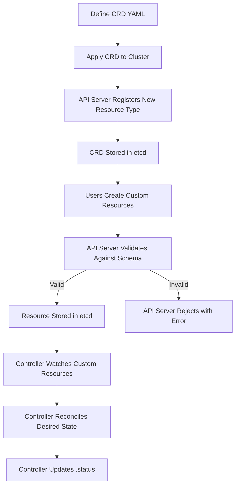

# Custom Resource Definitions (CRDs)

Custom Resource Definitions extend the Kubernetes API by defining new resource types. A CRD makes a new name available in Kubernetes — registering a resource kind with the API server so users can create, read, update, and delete instances of that type. A CRD is a schema definition. Nothing runs. CRDs are the foundation of the Kubernetes extensibility model and the first step in building an Operator (a CRD plus a custom controller).

## What is a CRD?

A CRD registers a new resource type with the Kubernetes API server. Once registered, the API server accepts and serves resources of that type just like native resources (Pods, Services, etc.). CRDs are stored in `etcd` and are managed by the API server's aggregation layer.

### Key Concepts

- **Schema/Contract**: The CRD defines the structure (OpenAPI v3 schema) that all instances of the custom resource must conform to.
- **API Group**: CRDs belong to an API group (e.g., `database.example.com`), which separates custom resources from the core API groups (`core`, `apps`, `batch`, etc.).
- **Plural Name**: The resource name used in URLs (e.g., `mysqls` for a `MySQL` kind).
- **Singular Name**: The name used in `kubectl` commands (e.g., `mysql`).

## CRD Structure

```yaml
apiVersion: apiextensions.k8s.io/v1
kind: CustomResourceDefinition
metadata:
  name: mysqls.database.example.com
spec:
  group: database.example.com
  versions:
    - name: v1
      served: true
      storage: true
      schema:
        openAPIV3Schema:
          type: object
          properties:
            spec:
              type: object
              properties:
                engine:
                  type: string
                  enum: ["mysql", "mariadb"]
                version:
                  type: string
                storage:
                  type: object
                  properties:
                    size:
                      type: string
                      pattern: "^[0-9]+(Gi|Mi|Ki)$"
            status:
              type: object
              properties:
                phase:
                  type: string
                ready:
                  type: boolean
  scope: Namespaced
  names:
    plural: mysqls
    singular: mysql
    kind: MySQL
    shortNames:
      - my
```

### CRD Spec Fields

| Field | Required | Description |
|---|---|---|
| `spec.group` | Yes | API group for the custom resource |
| `spec.versions` | Yes | List of API versions with schema and serving config |
| `spec.scope` | Yes | `Namespaced` or `Cluster` |
| `spec.names` | Yes | Plural, singular, kind, and shortNames |
| `spec.validation` | No | OpenAPI v3 schema for validation |
| `spec.subresources` | No | Exposes `/status` and/or `/scale` subresources |
| `spec.printColumn` | No | Additional columns in `kubectl get` output |

## Validation (OpenAPI v3 Schema)

CRDs can define a validation schema that the API server enforces when creating or updating custom resources. This ensures that custom resources conform to the expected structure.

```yaml
spec:
  versions:
    - name: v1
      served: true
      storage: true
      schema:
        openAPIV3Schema:
          type: object
          properties:
            spec:
              type: object
              required: ["engine", "version"]
              properties:
                engine:
                  type: string
                  enum: ["mysql", "mariadb"]
                version:
                  type: string
                  minLength: 1
                storage:
                  type: object
                  properties:
                    size:
                      type: string
                      pattern: "^[0-9]+(Gi|Mi|Ki)$"
```

> **Best practice**: Always define `required` fields and use `enum` for fields with a finite set of valid values. This prevents misconfiguration at the API server level before the controller even sees the resource.

## Subresources

Subresources expose specific endpoints for custom resources:

### `/status` Subresource

The `/status` subresource separates status updates from spec updates. This is critical for Operator patterns because it allows the controller to update the resource's status without triggering a reconciliation of the spec.

```yaml
spec:
  versions:
    - name: v1
      served: true
      storage: true
      subresources:
        status: {}
```

When `subresources.status` is enabled, updates to `.status` do not increment the `resourceVersion` and do not trigger webhooks that watch for spec changes.

### `/scale` Subresource

The `/scale` subresource enables horizontal scaling via `kubectl scale` and the Horizontal Pod Autoscaler.

```yaml
spec:
  versions:
    - name: v1
      served: true
      storage: true
      subresources:
        status: {}
        scale:
          specReplicasPath: .spec.replicas
          statusReplicasPath: .status.replicas
          labelSelectorPath: .status.labelSelector
```

## Multiple Versions

CRDs can serve multiple API versions simultaneously. This enables smooth migration between versions.

```yaml
spec:
  versions:
    - name: v1beta1
      served: true
      storage: false
      schema:
        openAPIV3Schema:
          # ... v1beta1 schema
    - name: v1
      served: true
      storage: true
      schema:
        openAPIV3Schema:
          # ... v1 schema
```

- **`served: true`**: The version is available via the API server.
- **`storage: true`**: This version is the persistent storage format in etcd (exactly one version must have `storage: true`). It is set by whoever authors the CRD (the operator developer), not by end users. Once set to `true` for a GA version like `v1`, the API server uses that as the canonical internal format.
- **Migration**: When `storage` is changed from one version to another, the API server converts stored data to the new version.

> **Pitfall**: Changing `storage: true` from one version to another triggers a conversion. If no conversion webhook is configured, the stored data may be incompatible with the new schema, causing read errors.

## Print Columns

Custom columns can be added to `kubectl get` output for better readability.

```yaml
spec:
  versions:
    - name: v1
      served: true
      storage: true
      additionalPrinterColumns:
        - name: Engine
          type: string
          jsonPath: .spec.engine
        - name: Version
          type: string
          jsonPath: .spec.version
        - name: Ready
          type: boolean
          jsonPath: .status.ready
```

## Mermaid: CRD Lifecycle



## Best Practices

1. **Always define a validation schema**: Without it, any YAML structure is accepted, leading to runtime errors that are hard to debug.
2. **Use subresources for status**: Prevents status updates from triggering unnecessary reconciliation loops.
3. **Version your CRDs**: Plan for schema evolution by supporting multiple versions with a conversion webhook.
4. **Use `additionalPrinterColumns`**: Makes `kubectl get` output useful for operators and developers.
5. **Keep CRD schemas minimal**: Only validate what is necessary. Overly strict schemas make it harder to extend resources later.
6. **Use `kubectl explain`**: After applying a CRD, `kubectl explain mysql` shows the schema, which is invaluable for debugging.

## Troubleshooting

- **`no matches for kind "MySQL"`**: The CRD has not been applied or is not yet available. Check `kubectl get crd mysqls.database.example.com`.
- **`schema is empty`**: The CRD was created without a validation schema. This allows any structure but provides no type safety.
- **`stored object is too large`**: The custom resource's stored data exceeds the `maxRequestBytes` limit on the API server. Reduce the size of the resource or increase the API server limit.
- **Conversion webhook errors**: When migrating between CRD versions, the conversion webhook must be available and correctly configured. If it is down, the API server cannot serve the new version.
- **`spec` changes not triggering reconciliation**: If the controller only watches `.spec` and the CRD uses subresources, ensure the controller is watching the correct resource version.

## Commands

```bash
# Apply a CRD
kubectl apply -f mysql-crd.yaml

# Verify CRD is established
kubectl get crd mysqls.database.example.com

# Describe CRD schema
kubectl explain mysql

# Create a custom resource
kubectl apply -f mysql-instance.yaml

# Get custom resources with custom columns
kubectl get mysql -o wide

# Check CRD conditions
kubectl get crd mysqls.database.example.com -o jsonpath='{.status.conditions[*].type}'

# Delete a CRD (also deletes all custom resources of that type)
kubectl delete crd mysqls.database.example.com
```