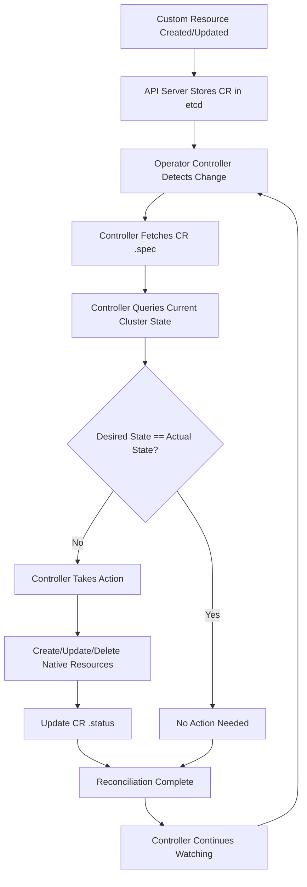

# Operators

An Operator is a controller packaged with a CRD to automate the full lifecycle of a complex application. It encodes operational knowledge (how to deploy, configure, backup, scale, and recover an application) into software. The controller code runs inside a Pod—a Kubernetes compute unit that holds the container executing the reconciliation loop. An Operator is not a new mechanism; it is the name given to the bundle of a CRD plus a custom controller written to manage it.

## What is an Operator?

An Operator is a controller packaged with a CRD that watches Custom Resources and automates the full lifecycle of a complex application. It encodes operational knowledge (how to deploy, configure, backup, scale, and recover an application) into software. The controller code runs inside a Pod—a Kubernetes compute unit that holds the container executing the reconciliation loop.

### Operator Pattern

The Operator pattern is based on the idea that humans who operate software can encode that operational knowledge into software that runs alongside Kubernetes. The Operator acts as a domain-specific controller that knows how to manage a particular application type.

## Reconciliation Loop

The core of every Operator is the reconciliation loop. This is a continuous process that ensures the actual state of the cluster matches the desired state defined in Custom Resources.

### Steps in the Reconciliation Loop

1. **Watch**: The controller watches for changes to Custom Resources (create, update, delete).
2. **Reconcile**: When a change is detected, the controller fetches the current state of the Custom Resource.
3. **Compare**: The controller compares the desired state (`.spec`) with the actual state (running resources in the cluster).
4. **Act**: The controller makes the necessary changes (create pods, update services, configure networking, etc.).
5. **Report**: The controller updates `.status` to reflect the current state.
6. **Repeat**: The controller continues watching for changes and reconciles again.

```go
func (r *MySQLReconciler) Reconcile(ctx context.Context, req ctrl.Request) (ctrl.Result, error) {
    // 1. Fetch the MySQL CR
    mysql := &databasev1.MySQL{}
    err := r.Get(ctx, req.NamespacedName, mysql)
    if err != nil {
        return ctrl.Result{}, client.IgnoreNotFound(err)
    }

    // 2. Check if the StatefulSet already exists
    found := &appsv1.StatefulSet{}
    err = r.Get(ctx, types.NamespacedName{Name: mysql.Name, Namespace: mysql.Namespace}, found)
    if err != nil && errors.IsNotFound(err) {
        // 3. Create the StatefulSet if it doesn't exist
        dep := r.deploymentForMySQL(mysql)
        err = r.Create(ctx, dep)
        return ctrl.Result{Requeue: true}, err
    } else if err != nil {
        return ctrl.Result{}, err
    }

    // 4. Update the StatefulSet if needed
    if !reflect.DeepEqual(found.Spec, mysql.Spec) {
        found.Spec = mysql.Spec
        err = r.Update(ctx, found)
        return ctrl.Result{Requeue: true}, err
    }

    // 5. Update status
    mysql.Status.Phase = "Running"
    mysql.Status.Ready = true
    err = r.Status().Update(ctx, mysql)
    return ctrl.Result{}, err
}
```

## Common Operator Use Cases

### Databases
Operators for PostgreSQL, MySQL, MongoDB, Cassandra, and Redis automate:
- Provisioning persistent storage
- Setting up replication and failover
- Creating users and databases
- Performing backups and restores
- Upgrading database versions

### Messaging Systems
Operators for Kafka, RabbitMQ, and NATS automate:
- Creating topics and queues
- Configuring replication and partitioning
- Managing consumer groups
- Handling broker failover

### CI/CD
Operators for Jenkins, GitLab, and Argo CD automate:
- Managing pipeline configurations
- Scaling build agents
- Managing secrets for credentials
- Handling build artifact storage

### Networking
Operators for Istio, Linkerd, and Contour automate:
- Managing service mesh configuration
- Applying traffic policies
- Configuring mTLS certificates
- Managing ingress rules

## Operator Frameworks

### Kubebuilder
Kubebuilder is the most widely used framework for building Operators. It uses `controller-runtime` and provides scaffolding for CRDs, controllers, and webhooks.

```bash
# Create a new Operator project
kubebuilder init --domain example.com --repo github.com/example/mysql-operator

# Create a new API (CRD + Controller)
kubebuilder create api --group database --version v1 --kind MySQL
```

### Operator SDK
The Operator SDK (now part of the Operator Framework) provides a higher-level abstraction for building Operators. It supports Go, Ansible, and Helm-based Operators.

```bash
# Create a Go-based Operator
operator-sdk init --domain example.com --repo github.com/example/mysql-operator

# Create a new API
operator-sdk create api --group database --version v1 --kind MySQL --resource --controller
```

### Helm-Based Operators
Helm-based Operators use Helm charts as the deployment mechanism and the Operator SDK to manage the lifecycle. They are simpler to build but less flexible than Go-based Operators.

## Operator vs Plain Controller

| Aspect | Plain Controller | Operator |
|---|---|---|
| Scope | Manages native K8s resources | Manages CRDs and native resources |
| Domain Knowledge | Generic (e.g., Deployment controller) | Application-specific (e.g., MySQL backup) |
| Complexity | Simple reconciliation logic | Complex operational logic |
| Use Case | General workload management | Application lifecycle management |

## Mermaid: Operator Reconciliation Loop



## Best Practices

1. **Separate spec and status**: Use the `/status` subresource so that status updates do not trigger unnecessary reconciliation.
2. **Make reconciliation idempotent**: The reconciliation loop may run multiple times for the same change. Ensure that applying the same desired state multiple times produces the same result.
3. **Use finalizers for cleanup**: When a CR is deleted, use finalizers to ensure that external resources (e.g., cloud databases, DNS records) are cleaned up before the CR is removed from `etcd`.
4. **Implement health checks**: The Operator itself should have liveness and readiness probes.
5. **Use leader election**: When running multiple Operator replicas, use leader election to ensure only one instance performs reconciliation at a time.
6. **Log and metric everything**: Emit structured logs and Prometheus metrics for reconciliation events, errors, and durations.
7. **Handle cascading deletions**: When a CR is deleted, the Operator should delete all the resources it created (Pods, Services, PVCs, etc.).

## Troubleshooting

- **Operator not reconciling**: Check if the Operator pod is running. Look at operator logs for errors. Verify the controller's RBAC permissions.
- **CR created but no resources appear**: The Operator controller may not be watching the correct CRD. Check the controller's `watches` configuration.
- **Status not updating**: The Operator may not have permission to update `.status`. Check RBAC for the `update` verb on the `status` subresource.
- **Infinite reconciliation loop**: The Operator is updating `.status` in a way that triggers another reconciliation. Use the `/status` subresource to prevent this.
- **Finalizer not being removed**: The Operator's cleanup logic may be failing. Check operator logs for errors during deletion.

## Commands

```bash
# Check Operator pod status
kubectl get pods -l control-plane=controller-manager -n mysql-operator

# View Operator logs
kubectl logs -l control-plane=controller-manager -n mysql-operator -f

# Check CR status
kubectl get mysql my-mysql -n production -o jsonpath='{.status}'

# Force a reconciliation by annotating the CR
kubectl annotate mysql my-mysql -n production kubectl.kubernetes.io/last-applied-configuration='{}' --overwrite

# Check Operator events
kubectl get events -n mysql-operator --sort-by='.lastTimestamp'
```