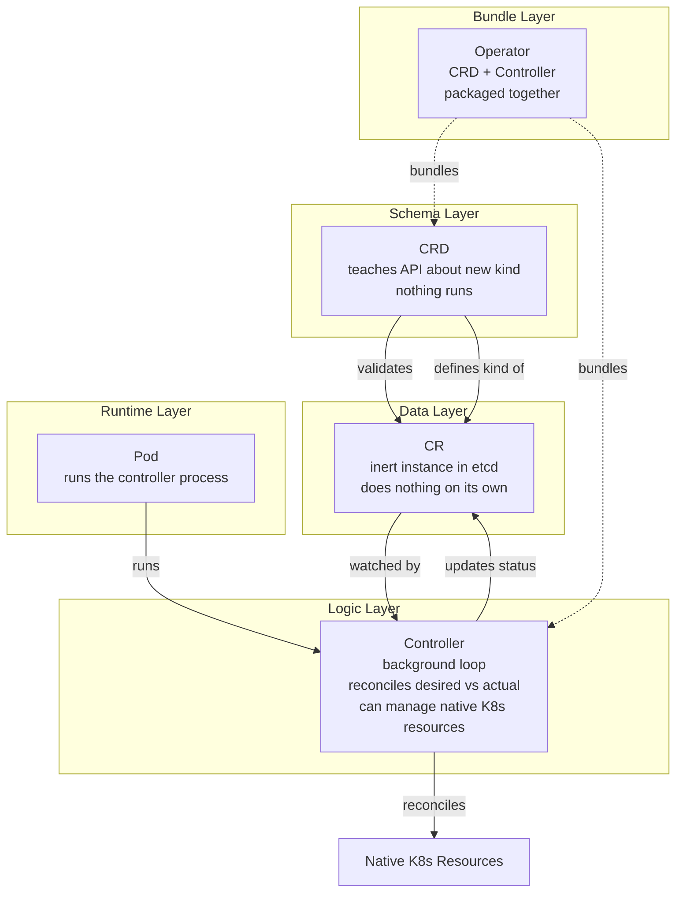

# CRDs, CRs, Controllers, Operators, and Pods: The Relationship

The four terms sit at different levels. Explanations often flatten them into one plane, which is why one always seems to vanish or merge with another. Here is the layered version:

## Layered Model

### CRD (CustomResourceDefinition) — Schema
A CRD teaches the Kubernetes API "there's a new object kind called X, and here's what its fields look like." Nothing runs. It is the equivalent of a class definition.

### CR (Custom Resource) — Inert Data
A CR is an instance of that schema. When you write a YAML file of kind X and apply it, that's a CR. It is just a record sitting in etcd — inert, like a row in a table. On its own it does nothing.

### Controller — Background Logic Loop
A controller watches some resource type and keeps reality in sync with what is declared. This is the generic concept: Kubernetes ships built-in controllers for Pods, Deployments, ReplicaSets, etc. that have nothing to do with CRDs at all. So "controller" is a much older, broader concept than "operator."

### Operator — The Bundle
An Operator is not a new mechanism. It is just a name for a bundle: a CRD plus a custom Controller written to manage it, packaged together to encode the operational know-how for one specific piece of software (a Postgres operator, a cert-manager operator, etc.).

> **"Operator" is not a Kubernetes API object.** You will not find `kind: Operator` anywhere. It is just the name people give to a CRD + a purpose-built controller shipped together, usually via tools like the Operator SDK or kubebuilder, to bake in operational knowledge a human would otherwise apply by hand (failover, backups, scaling rules).

## Where Confusion Comes From

1. **A controller doesn't need a CRD.** Kubernetes already has controllers for Deployments, Jobs, ReplicaSets — none of those involve custom resources at all.
2. **An Operator isn't a Kubernetes API object.** It's a packaging/convention, not a new kind of API server object.
3. **CRDs don't run anything.** A CRD without a controller is just a schema definition with no behavior.

## Concrete Example: cert-manager

cert-manager is an Operator. It installs a CRD (`Certificate`), you create CRs of that kind for each cert you want, and its controller watches those CRs and does the actual work — talking to Let's Encrypt, creating the TLS secret, renewing before expiry.

## Quick Reference

| Term | What It Is | Runs? | In etcd? |
|---|---|---|---|
| **CRD** | Schema / class definition | No | Yes |
| **CR** | Instance / inert data record | No | Yes |
| **Controller** | Background reconciliation loop | Yes (in a Pod) | No |
| **Operator** | CRD + Controller bundled | Yes (in a Pod) | No |

## Mermaid: The Four Layers



## How They Work Together

1. **Apply the CRD** — the API server registers the new resource type.
2. **Create a CR** — the user creates an instance of the custom resource.
3. **Controller detects the CR** — the controller watches for new CRs.
4. **Controller reconciles** — reads `.spec`, compares with actual state, takes action.
5. **Controller updates status** — updates `.status` to reflect progress.
6. **User monitors** — uses `kubectl get <kind>` to check the CR's status.

```bash
# Step 1: Apply CRD
kubectl apply -f mysql-crd.yaml

# Step 2: Create CR
kubectl apply -f mysql-instance.yaml

# Step 3: Operator creates resources
kubectl get pods -n production -l app=mysql

# Step 4: Check CR status
kubectl get mysql my-mysql -n production -o jsonpath='{.status.phase}'
```

## Commands

```bash
# Verify CRD exists
kubectl get crd mysqls.database.example.com

# Create a CR
kubectl apply -f mysql-instance.yaml

# Check if Operator is running
kubectl get pods -n mysql-operator

# Describe CR to see spec and status
kubectl describe mysql my-mysql -n production

# Delete CR (Operator should clean up associated resources)
kubectl delete mysql my-mysql -n production

# Delete CRD (also deletes all CRs of that type)
kubectl delete crd mysqls.database.example.com
```
