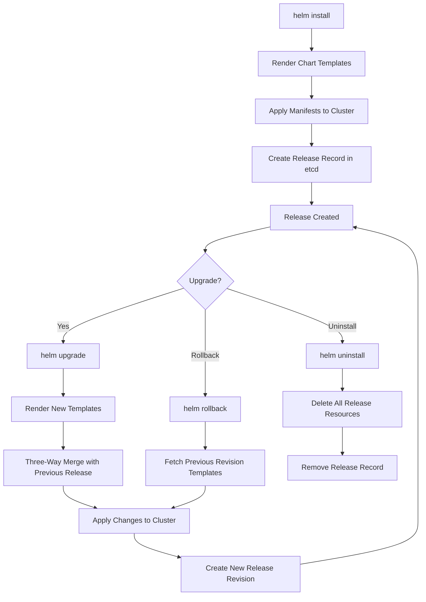

# Common Helm Commands

Helm is the standard package manager for Kubernetes. It uses charts to define, install, and upgrade Kubernetes applications. Understanding the core Helm commands is essential for managing deployments at scale.

## `helm install`

Installs a chart as a new release in a cluster. A release is an instance of a chart running in a cluster.

```bash
# Basic install
helm install my-release ./my-chart

# Install with custom values
helm install my-release ./my-chart -f custom-values.yaml

# Install with inline values
helm install my-release ./my-chart --set replicaCount=3 --set image.tag=1.2.3

# Install in a specific namespace (creates namespace if it does not exist)
helm install my-release ./my-chart -n production --create-namespace

# Install with a specific release name
helm install my-release ./my-chart

# Dry run (shows what would be installed without actually installing)
helm install my-release ./my-chart --dry-run --debug

# Install with a timeout
helm install my-release ./my-chart --timeout 5m0s

# Install with a specific version of the chart
helm install my-release ./my-chart --version 1.2.3

# Install from a remote repository
helm install my-release myrepo/mychart --version 1.2.3
```

### Install Behavior

- Helm creates a `Release` object in the release namespace (by default) that tracks the release state.
- Helm renders the chart templates and sends the resulting manifests to the Kubernetes API server.
- Resources are created in the order they appear in the rendered YAML (or in dependency order for charts with dependencies).

> **Pitfall**: Helm does not wait for resources to be fully ready before marking the release as successful. Use `--wait` to block until all resources are ready.

```bash
# Wait for resources to be ready
helm install my-release ./my-chart --wait --timeout 10m0s
```

## `helm upgrade`

Upgrades an existing release with new values or a new chart version.

```bash
# Upgrade with new values
helm upgrade my-release ./my-chart -f new-values.yaml

# Upgrade with a new chart version
helm upgrade my-release myrepo/mychart --version 2.0.0

# Upgrade with inline values
helm upgrade my-release ./my-chart --set replicaCount=5

# Install if not present, otherwise upgrade
helm upgrade --install my-release ./my-chart -n production --create-namespace

# Dry run to see what changes would be made
helm upgrade my-release ./my-chart --dry-run --debug

# Wait for upgrade to complete
helm upgrade my-release ./my-chart --wait --timeout 10m0s

# Atomic upgrade (rolls back on failure)
helm upgrade my-release ./my-chart --atomic --timeout 10m0s

# Cleanup failed release history
helm upgrade my-release ./my-chart --cleanup-on-fail
```

### Upgrade Behavior

- Helm performs a three-way merge between the previous release, the new release, and the current cluster state.
- Resources that are removed from the chart are deleted from the cluster (unless `--keep-history` is used with `--atomic`).
- Helm uses `kubectl` under the hood to apply the rendered manifests.

> **Best practice**: Use `--atomic` for production upgrades. This ensures that if the upgrade fails, Helm automatically rolls back to the previous release.

> **Pitfall**: `--atomic` with a long timeout can leave the release in a failed state for an extended period. Set a reasonable timeout based on the application's startup time.

## `helm rollback`

Rolls back a release to a previous revision.

```bash
# List release history
helm history my-release -n production

# Rollback to revision 3
helm rollback my-release 3 -n production

# Dry run rollback
helm rollback my-release 3 --dry-run

# Wait for rollback to complete
helm rollback my-release 3 --wait --timeout 5m0s
```

### How Rollback Works

- Helm stores each release revision in the release namespace as a Secret (Helm v3 default).
- A rollback creates a new release revision that uses the templates and values from the specified revision.
- The rollback is itself an upgrade operation, so it goes through the same rendering and application process.

## `helm get values`

Retrieves the merged values for a release (including defaults and overrides).

```bash
# Get all values for a release
helm get values my-release -n production

# Get all values as YAML
helm get values my-release -n production -o yaml

# Get the manifest for a release
helm get manifest my-release -n production

# Get the hooks for a release
helm get hooks my-release -n production

# Get the notes for a release
helm get notes my-release -n production

# Get all information about a release
helm get all my-release -n production
```

## `helm list`

Lists releases in a cluster.

```bash
# List all releases in all namespaces
helm list -A

# List releases in a specific namespace
helm list -n production

# List with output in YAML format
helm list -n production -o yaml

# List with short output
helm list -n production -o short
```

## `helm uninstall`

Uninstalls a release and removes all associated resources.

```bash
# Uninstall a release
helm uninstall my-release -n production

# Keep release history
helm uninstall my-release -n production --keep-history
```

> **Pitfall**: Uninstalling a release does not delete CRDs defined by the chart. CRDs created by the chart persist in the cluster. This can cause issues when reinstalling the chart.

## `helm template`

Renders chart templates locally without installing them. Useful for CI/CD pipelines and debugging.

```bash
# Render templates to stdout
helm template my-release ./my-chart

# Render with custom values
helm template my-release ./my-chart -f custom-values.yaml

# Render with a specific values file and set values
helm template my-release ./my-chart -f custom-values.yaml --set replicaCount=3

# Render with a specific release name and namespace
helm template my-release ./my-chart --release-name my-release --namespace production

# Render with a specific chart version
helm template my-release ./my-chart --version 1.2.3
```

> **Best practice**: Use `helm template` in CI/CD pipelines to validate rendered manifests before applying them. Combine with `kubectl apply --dry-run=server` for server-side validation.

```bash
# Validate rendered templates server-side
helm template my-release ./my-chart | kubectl apply --dry-run=server -f -
```

## `helm repo`

Manages Helm chart repositories.

```bash
# Add a repository
helm repo add stable https://charts.helm.sh/stable

# Update repository cache
helm repo update

# List repositories
helm repo list

# Search for charts
helm search repo mychart

# Remove a repository
helm repo remove stable
```

## Mermaid: Helm Release Lifecycle



## Best Practices

1. **Use `--atomic` for production upgrades**: Ensures automatic rollback on failure.
2. **Use `--wait` with a timeout**: Prevents Helm from marking the release as successful before resources are ready.
3. **Use `helm template` in CI/CD**: Validate rendered manifests before applying.
4. **Pin chart versions**: Always specify `--version` in production to ensure reproducible deployments.
5. **Use a values file per environment**: `values.yaml` for defaults, `values-production.yaml` for production overrides.
6. **Keep release history**: Do not use `--cleanup-on-fail` unless you understand the implications.
7. **Use `helm diff` plugin**: See what changes an upgrade will make before applying it.
8. **Store values in version control**: Values files should be committed to Git alongside the chart.

## Troubleshooting

- **`release already exists`**: The release name is already in use. Use a different name or uninstall the existing release first.
- **`chart not found`**: The chart path or repository is incorrect. Run `helm repo update` to refresh the cache.
- **`rendered manifests contain a resource that already exists`**: The chart is trying to create a resource that already exists in the cluster. Use `--replace` or check for conflicting resources.
- **Upgrade hangs**: Resources may be stuck in a pending state. Check `kubectl get pods` and `kubectl describe` for issues.
- **Rollback fails**: The previous revision's templates may reference resources that no longer exist. Check the revision history with `helm history`.
- **`helm template` output differs from cluster state**: Helm templates only render the chart; it does not reflect existing cluster state or values overrides applied during install.

## Commands Reference

```bash
# Complete install with all flags
helm install my-release ./my-chart \
  -n production \
  --create-namespace \
  -f values.yaml \
  --set replicaCount=3 \
  --version 1.2.3 \
  --wait \
  --timeout 10m0s \
  --atomic \
  --dry-run

# Complete upgrade with all flags
helm upgrade my-release ./my-chart \
  -n production \
  -f values.yaml \
  --set replicaCount=5 \
  --version 2.0.0 \
  --wait \
  --timeout 10m0s \
  --atomic \
  --dry-run

# Complete rollback with all flags
helm rollback my-release 3 \
  -n production \
  --wait \
  --timeout 5m0s \
  --dry-run
```