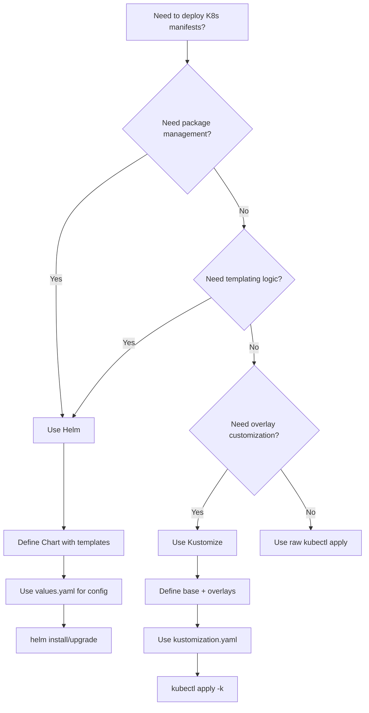

# Helm vs Kustomize

Helm and Kustomize are both tools for managing Kubernetes manifests, but they take fundamentally different approaches. Understanding when to use each is a key operational decision.

## Helm: Package Management with Templating

Helm is a package manager for Kubernetes. It uses Go templates to generate Kubernetes manifests from parameterized charts.

### Key Characteristics

- **Templating engine**: Uses Go templates with a rich expression language.
- **Packaging**: Charts are versioned packages that can be shared via repositories.
- **Release management**: Tracks installed versions and supports rollback.
- **Values system**: Configuration is injected via `values.yaml` files and `--set` overrides.
- **Dependency management**: Charts can depend on other charts (subcharts).

```yaml
# values.yaml
replicaCount: 3
image:
  repository: myapp
  tag: "1.0"
  pullPolicy: IfNotPresent
service:
  type: ClusterIP
  port: 80
resources:
  requests:
    memory: "128Mi"
    cpu: "250m"
  limits:
    memory: "256Mi"
    cpu: "500m"
```

```yaml
# deployment.yaml (template)
apiVersion: apps/v1
kind: Deployment
metadata:
  name: {{ .Release.Name }}-app
spec:
  replicas: {{ .Values.replicaCount }}
  selector:
    matchLabels:
      app: {{ .Release.Name }}-app
  template:
    metadata:
      labels:
        app: {{ .Release.Name }}-app
    spec:
      containers:
        - name: app
          image: "{{ .Values.image.repository }}:{{ .Values.image.tag }}"
          imagePullPolicy: {{ .Values.image.pullPolicy }}
          ports:
            - containerPort: {{ .Values.service.port }}
          resources:
            requests:
              memory: {{ .Values.resources.requests.memory }}
              cpu: {{ .Values.resources.requests.cpu }}
            limits:
              memory: {{ .Values.resources.limits.memory }}
              cpu: {{ .Values.resources.limits.cpu }}
```

```bash
# Install with Helm
helm install myapp ./mychart -f production-values.yaml

# Upgrade with new values
helm upgrade myapp ./mychart -f production-values.yaml --set image.tag=2.0
```

### Helm Strengths

- **Parameterization**: Go templates allow complex logic (conditionals, loops, functions).
- **Chart ecosystem**: Thousands of charts available in public repositories.
- **Release tracking**: Full history of installations and upgrades.
- **Dependency management**: Charts can include and manage subcharts.

### Helm Weaknesses

- **Template complexity**: Go templates can become difficult to debug.
- **Not built into kubectl**: Requires separate installation.
- **Release namespace**: Helm v3 stores release state as Secrets in the release namespace (where the app is installed), not in a separate namespace.
- **Template rendering surprises**: `helm template` may not perfectly represent what Helm will apply.

## Kustomize: Pure YAML Overlay System

Kustomize is a built-in `kubectl` plugin that uses pure YAML overlays to customize Kubernetes manifests. It does not use templates.

### Key Characteristics

- **No templating**: Uses YAML patches and transformations instead of Go templates.
- **Built into kubectl**: Available as `kubectl kustomize` since Kubernetes 1.14.
- **Overlay model**: Base configurations are customized through overlays.
- **Declarative**: All customization is declared in a `kustomization.yaml` file.

```yaml
# kustomization.yaml (overlay)
resources:
  - ../../base
namePrefix: prod-
namespace: production
commonLabels:
  environment: production
images:
  - name: myapp
    newTag: "2.0"
replicas:
  - name: myapp
    count: 5
patchesStrategicMerge:
  - patch-deployment.yaml
```

```yaml
# patch-deployment.yaml
apiVersion: apps/v1
kind: Deployment
metadata:
  name: myapp
spec:
  template:
    spec:
      containers:
        - name: app
          resources:
            requests:
              memory: "256Mi"
              cpu: "500m"
            limits:
              memory: "512Mi"
              cpu: "1"
```

```bash
# Preview rendered manifests
kubectl kustomize ./overlays/production

# Apply directly
kubectl apply -k ./overlays/production
```

### Kustomize Strengths

- **No templating**: Pure YAML is easier to understand and debug.
- **Built into kubectl**: No additional installation required.
- **Git-friendly**: YAML overlays are easy to diff and review in pull requests.
- **Predictable**: What you see in the overlay is what you get.

### Kustomize Weaknesses

- **No packaging**: No built-in versioning or sharing mechanism (though OCI registries are now supported).
- **Limited logic**: Cannot do conditionals or loops in the same way as Go templates.
- **No release management**: Kustomize does not track release history or support rollback.

## Mermaid: Helm vs Kustomize Comparison



## When to Use Each

### Use Helm When

- You need to share and distribute charts across teams or organizations.
- Your application has complex configuration that benefits from templating.
- You need release management (rollback, history, versioning).
- You want to leverage the Helm chart ecosystem.
- You are deploying third-party applications (e.g., Prometheus, Grafana, Istio).

### Use Kustomize When

- You want to avoid the complexity of Go templates.
- You prefer pure YAML for better Git diff and review experience.
- You need simple overlay-based customization (e.g., dev/staging/production environments).
- You want zero additional tooling (Kustomize is built into `kubectl`).
- You are managing internal applications with straightforward configuration.

### Use Both Together

Helm and Kustomize can be used together. You can use Helm to render templates and Kustomize to apply overlays to the rendered output. However, this adds complexity and is generally not recommended unless you have a specific need.

```bash
# Render Helm chart and pipe to Kustomize
helm template myapp ./mychart -f production-values.yaml | kubectl kustomize -
```

> **Pitfall**: Combining Helm and Kustomize can lead to confusing behavior. Kustomize patches are applied after Helm rendering, which can result in unexpected output if patches reference template-generated names.

## Best Practices

1. **Choose one tool per project**: Mixing Helm and Kustomize in the same project adds unnecessary complexity.
2. **Use Kustomize for environment overlays**: Base config in one place, environment-specific patches in overlays.
3. **Use Helm for packaged applications**: If you are building a chart to share, Helm is the right choice.
4. **Keep `kustomization.yaml` in version control**: It is the source of truth for the overlay.
5. **Use `kubectl kustomize` to preview**: Always preview rendered output before applying.
6. **Use Helm's `--dry-run` and `--debug`**: Understand what Helm will render before installing.

## Troubleshooting

- **`kubectl apply -k` fails with `not a directory`**: The path to the `kustomization.yaml` is incorrect or the file is missing.
- **Helm template output has wrong values**: The `values.yaml` file may not be in the expected location or the `--set` flags may override incorrectly.
- **Kustomize patch not applied**: The patch file path in `kustomization.yaml` may be incorrect, or the patch may not match the target resource.
- **Helm release stuck in `pending-install`**: The chart templates may reference resources that cannot be created (e.g., CRDs not yet installed).
- **Kustomize namePrefix conflicts**: If a patch references a resource by its original name (without prefix), the patch will not match.

## Commands

```bash
# Helm: Install and wait
helm install myapp ./mychart -n production --create-namespace --wait --timeout 10m0s

# Helm: Upgrade with dry run
helm upgrade myapp ./mychart -n production --dry-run --debug

# Helm: Rollback
helm rollback myapp 3 -n production --wait

# Kustomize: Preview rendered output
kubectl kustomize ./overlays/production

# Kustomize: Apply
kubectl apply -k ./overlays/production

# Kustomize: Build and pipe to kubectl
kubectl kustomize ./overlays/production | kubectl apply -f -

# Kustomize: Diff against running cluster
kubectl diff -k ./overlays/production
```