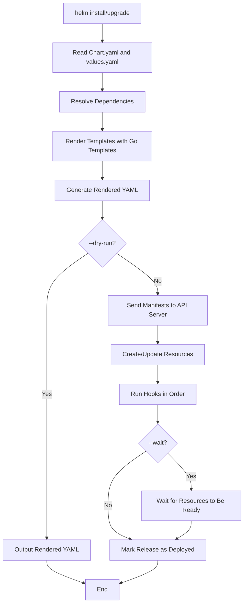

# Helm Deep Dive

Helm is the de facto package manager for Kubernetes. It organizes Kubernetes resources into reusable, versioned packages called charts.

## Chart Structure

A Helm chart is a collection of files that describe a set of Kubernetes resources. Every chart has a specific directory structure.

```
mychart/
├── Chart.yaml          # Chart metadata (name, version, dependencies)
├── values.yaml         # Default configuration values
├── charts/             # Subcharts (dependencies)
├── templates/          # Kubernetes manifest templates
│   ├── deployment.yaml
│   ├── service.yaml
│   ├── ingress.yaml
│   ├── _helpers.tpl    # Helper templates
│   └── NOTES.txt       # Post-installation notes
└── templates/
    └── tests/          # Test templates
```

### Chart.yaml

Contains metadata about the chart.

```yaml
apiVersion: v2
name: mychart
description: A Helm chart for my application
type: application
version: 1.2.3
appVersion: "2.0.0"
dependencies:
  - name: redis
    version: "17.0.0"
    repository: https://charts.bitnami.com/bitnami
```

### values.yaml

Contains default configuration values that can be overridden during installation.

```yaml
replicaCount: 2
image:
  repository: myapp
  tag: "1.0"
  pullPolicy: IfNotPresent
service:
  type: ClusterIP
  port: 8080
resources:
  requests:
    memory: "128Mi"
    cpu: "250m"
  limits:
    memory: "256Mi"
    cpu: "500m"
```

## Release Concepts

### Chart

A chart is a package of pre-configured Kubernetes resources. It is the unit of distribution. A chart can be:
- **Versioned**: Each release of the chart has a semantic version.
- **Shared**: Charts can be published to repositories (e.g., Artifact Hub, Helm Hub).
- **Composable**: Charts can depend on other charts (subcharts).

### Release

A release is an instance of a chart running in a cluster. When you run `helm install`, Helm creates a release. Each release has:
- A name (e.g., `my-release`)
- A revision number (incremented on each upgrade)
- A status (`deployed`, `failed`, `superseded`, `uninstalled`, `uninstalling`, `pending-install`, `pending-upgrade`, `pending-rollback`)

```bash
# List releases
helm list -n production

# Check release status
helm status my-release -n production

# Get release revision history
helm history my-release -n production
```

### Values

Values are the configuration data injected into chart templates. They come from multiple sources in a specific order of precedence (later sources override earlier ones):

1. `values.yaml` in the chart directory (lowest priority)
2. `--set` command-line flags
3. `-f` / `--values` flag pointing to a custom values file
4. `--set-string`, `--set-file`, `--set-json` flags

```bash
# Override values via --set
helm install my-release ./mychart --set replicaCount=5 --set image.tag=2.0

# Override values via -f flag
helm install my-release ./mychart -f custom-values.yaml

# Override values via --set-json for complex values
helm install my-release ./mychart --set-json 'resources={"requests":{"memory":"256Mi"}}'
```

## Template Functions and Variables

Helm templates use Go template syntax with a set of built-in functions and objects.

### Built-in Objects

| Object | Description |
|---|---|
| `.Release.Name` | The name of the release |
| `.Release.Namespace` | The namespace of the release |
| `.Release.Time` | The time of the release |
| `.Release.Revision` | The revision number of the release |
| `.Release.Service` | Always set to `Helm` |
| `.Chart.Name` | The name of the chart |
| `.Chart.Version` | The version of the chart |
| `.Chart.AppVersion` | The application version |
| `.Values` | The values from `values.yaml` and overrides |
| `.Capabilities` | Information about the Kubernetes cluster |
| `.Template` | Information about the template being rendered |
| `.Release.IsUpgrade` | True if this is an upgrade operation |
| `.Release.IsInstall` | True if this is an install operation |
| `.Root` | Reference to the root context (useful in nested templates) |

### Common Template Functions

| Function | Description |
|---|---|
| `toYaml` | Converts a value to YAML |
| `toJson` | Converts a value to JSON |
| `include` | Includes and renders another template |
| `required` | Returns the value or throws an error if empty |
| `default` | Returns the default value if the value is empty |
| `contains` | Checks if a string contains a substring |
| `hasKey` | Checks if a map has a key |
| `trim` | Trims whitespace from a string |
| `upper` | Converts a string to uppercase |
| `lower` | Converts a string to lowercase |
| `indent` | Indents a block of text |
| `nindent` | Indents a block with a newline prefix |
| `tpl` | Processes a string as a template |

### Example: Helper Templates

```yaml
# _helpers.tpl
{{- define "mychart.fullname" -}}
{{- printf "%s-%s" .Release.Name .Chart.Name | trunc 63 | trimSuffix "-" -}}
{{- end -}}

{{- define "mychart.chart" -}}
{{- printf "%s-%s" .Chart.Name .Chart.Version | replace "+" "_" | trunc 63 | trimSuffix "-" -}}
{{- end -}}
```

```yaml
# deployment.yaml
apiVersion: apps/v1
kind: Deployment
metadata:
  name: {{ include "mychart.fullname" . }}
  labels:
    app.kubernetes.io/name: {{ include "mychart.name" . }}
    helm.sh/chart: {{ include "mychart.chart" . }}
```

## Hooks

Helm hooks allow you to run Kubernetes resources at specific points in the release lifecycle.

### Hook Annotations

| Annotation | When It Runs |
|---|---|
| `helm.sh/hook: pre-install` | Before the release is installed |
| `helm.sh/hook: post-install` | After the release is installed |
| `helm.sh/hook: pre-upgrade` | Before the release is upgraded |
| `helm.sh/hook: post-upgrade` | After the release is upgraded |
| `helm.sh/hook: pre-delete` | Before the release is deleted |
| `helm.sh/hook: post-delete` | After the release is deleted |
| `helm.sh/hook: pre-rollback` | Before the release is rolled back |
| `helm.sh/hook: post-rollback` | After the release is rolled back |

### Hook Example

```yaml
apiVersion: batch/v1
kind: Job
metadata:
  name: db-migration
  annotations:
    "helm.sh/hook": pre-install,pre-upgrade
    "helm.sh/hook-weight": "-5"
    "helm.sh/hook-delete-policy": hook-succeeded
spec:
  template:
    spec:
      restartPolicy: Never
      containers:
        - name: migrate
          image: mydb-migrator:1.0
          command: ["./migrate.sh"]
```

### Hook Weight

Hooks with a lower `helm.sh/hook-weight` run first. This is useful for ordering hooks (e.g., run a database migration before the application starts).

### Hook Delete Policy

- `hook-succeeded`: The hook resource is deleted after it succeeds.
- `hook-failed`: The hook resource is deleted after it fails.
- Default is neither (the hook resource remains in the cluster).

## Mermaid: Helm Rendering and Installation Flow



## Best Practices

1. **Use `_helpers.tpl` for common names**: Avoid duplicating naming logic across templates.
2. **Use `required` for mandatory values**: Fail fast if a required value is missing.
3. **Use `default` for optional values**: Provide sensible defaults.
4. **Keep templates simple**: Complex Go template logic is hard to debug. Use `_helpers.tpl` for reusable logic.
5. **Use `helm template` to debug**: Always preview rendered output before installing.
6. **Pin chart versions in production**: Never use `latest` or no version in production.
7. **Use `helm diff` plugin**: See what changes an upgrade will make.
8. **Use `helm.sh/resource-policy: keep`**: Keep resources that should not be deleted on uninstall.

## Troubleshooting

- **`template: ... undefined variable`**: A template references a value that does not exist in `values.yaml`. Use `default` or `required` to handle missing values.
- **`rendering template failed`**: A Go template syntax error. Run `helm template` with `--debug` to see the error location.
- **`failed to download chart`**: The chart repository is unreachable or the chart name/version is incorrect. Run `helm repo update`.
- **`release already exists`**: A release with that name already exists in the namespace. Use `helm upgrade` or uninstall first.
- **`hook timed out`**: A hook job did not complete within the timeout. Check the hook job logs.
- **`rendered manifests contain a resource that already exists`**: The chart is trying to create a resource that already exists. This can happen when upgrading a chart that was previously installed with different templates.

## Commands

```bash
# Render templates locally
helm template my-release ./mychart

# Render with values
helm template my-release ./mychart -f values.yaml

# Render with --set overrides
helm template my-release ./mychart --set replicaCount=5

# Lint the chart
helm lint ./mychart

# Package the chart
helm package ./mychart

# Push to a repository
helm push mychart-1.2.3.tgz myrepo

# Install with debug output
helm install my-release ./mychart --dry-run --debug

# Get the rendered manifest for a release
helm get manifest my-release -n production

# Get the values for a release
helm get values my-release -n production -o yaml

# Verify the release is installed
kubectl get pods -n production -l app.kubernetes.io/name=myapp

# Check the release status
kubectl get pods -n production -l helm.sh/chart=mychart

# Describe the release's resources
kubectl describe deployment my-release-myapp -n production

# Check events related to the release
kubectl get events -n production --field-selector involvedObject.name=my-release-myapp --sort-by='.lastTimestamp'

# Validate rendered templates server-side
helm template my-release ./mychart | kubectl apply --dry-run=server -f -
```