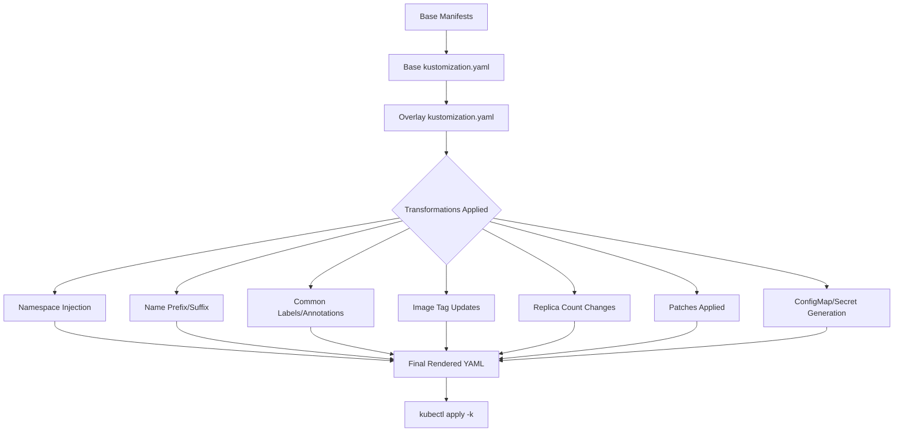

# Kustomize Deep Dive

Kustomize is a Kubernetes-native configuration management tool that uses pure YAML overlays to customize Kubernetes manifests. It is built into `kubectl` and does not require a templating engine.

## Core Concepts

### Base

A base is a set of raw Kubernetes manifests that serve as the foundation for customization. A base contains the "canonical" configuration that can be shared across multiple overlays.

```
base/
├── kustomization.yaml
├── deployment.yaml
├── service.yaml
└── configmap.yaml
```

```yaml
# base/kustomization.yaml
apiVersion: kustomize.config.k8s.io/v1beta1
kind: Kustomization
resources:
  - deployment.yaml
  - service.yaml
  - configmap.yaml
commonLabels:
  app: myapp
```

### Overlay

An overlay is a directory that references a base and applies customizations on top of it. Overlays can reference other overlays, creating a chain of customization.

```
overlays/
├── development/
│   ├── kustomization.yaml
│   └── patch-deployment.yaml
├── staging/
│   ├── kustomization.yaml
│   └── patch-deployment.yaml
└── production/
    ├── kustomization.yaml
    └── patch-deployment.yaml
```

```yaml
# overlays/production/kustomization.yaml
apiVersion: kustomize.config.k8s.io/v1beta1
kind: Kustomization
resources:
  - ../../base
namespace: production
commonLabels:
  environment: production
images:
  - name: myapp
    newTag: "2.0"
replicas:
  - name: myapp
    count: 5
patchesStrategicMerge:
  - patch-deployment.yaml
```

## Built-in Transformations

### Namespace Injection

Kustomize automatically injects the `namespace` field into all resources that do not already have one.

```yaml
namespace: production
```

### Name Prefix/Suffix

Adds a prefix or suffix to the name of every resource.

```yaml
namePrefix: prod-
nameSuffix: -backend
```

### Common Labels and Annotations

Adds labels and annotations to all resources.

```yaml
commonLabels:
  app: myapp
  environment: production
  team: backend

commonAnnotations:
  description: "Production deployment of myapp"
```

### Image Tag Updating

Updates container image tags across all resources.

```yaml
images:
  - name: myapp
    newTag: "2.0"
  - name: sidecar
    newName: mysidecar
    newTag: "1.5"
```

### Replica Count

Scales deployments by updating the replica count.

```yaml
replicas:
  - name: myapp
    count: 5
```

## Patches

### Strategic Merge Patch

Applies a strategic merge patch to a resource. Strategic merge patches understand the structure of Kubernetes resources and merge fields intelligently.

```yaml
# patch-deployment.yaml
apiVersion: apps/v1
kind: Deployment
metadata:
  name: myapp
spec:
  template:
    spec:
      containers:
        - name: app
          resources:
            requests:
              memory: "256Mi"
              cpu: "500m"
            limits:
              memory: "512Mi"
              cpu: "1"
```

### JSON Patch

Applies a JSON Patch (RFC 6902) to a resource. JSON patches use operations like `add`, `remove`, and `replace`.

```yaml
patchesJson6902:
  - path: patch-json.json
    target:
      kind: Deployment
      name: myapp
      namespace: production
```

```json
// patch-json.json
[
  { "op": "replace", "path": "/spec/replicas", "value": 5 },
  { "op": "add", "path": "/spec/template/spec/containers/0/resources", "value": { "requests": { "memory": "256Mi" }, "limits": { "memory": "512Mi" } } }
]
```

### Kustomize Config Patch

Uses a `kustomization.config.k8s.io` patch to apply changes via the Kustomize config API.

```yaml
patches:
  - patch: |
      apiVersion: apps/v1
      kind: Deployment
      metadata:
        name: myapp
      spec:
        template:
          spec:
            containers:
              - name: app
                env:
                  - name: ENV
                    value: production
    target:
      kind: Deployment
      name: myapp
```

## ConfigMap and Secret Generation

Kustomize can generate ConfigMaps and Secrets from files or literals.

```yaml
configMapGenerator:
  - name: app-config
    files:
      - config.properties
    env: config.env
    envs:
      - config.env
      - config2.env
    literals:
      - LOG_LEVEL=info
      - CACHE_SIZE=128
    namespace: production

secretGenerator:
  - name: app-secret
    literals:
      - username=admin
      - password=s3cret
    files:
      - tls.crt=tlscert.pem
      - tls.key=tlskey.pem
    type: Opaque
```

> **Pitfall**: Kustomize adds a hash suffix to ConfigMap and Secret names based on their content. This causes the Deployment to pick up the new name and trigger a rollout. If you want a stable name, use `namePrefix` or `nameSuffix` in the generator.

## Kustomize Transformers

Transformers modify resources in ways that patches cannot. They operate on the entire set of resources and can add, modify, or remove fields.

### Name Prefix Transformer

```yaml
transformers:
  - |
    apiVersion: kustomize.config.k8s.io/v1beta1
    kind: Namespaced
    namePrefix: prod-
```

### Label Transformer

```yaml
transformers:
  - |
    apiVersion: kustomize.config.k8s.io/v1beta1
    kind: LabelTransformer
    labels:
      team: backend
    fieldSpecs:
      - kind: Deployment
        path: /metadata/labels
```

## Mermaid: Kustomize Overlay Chain



## Best Practices

1. **Use a shared base**: Define the canonical configuration once and customize per environment.
2. **Keep overlays minimal**: Only override what differs between environments.
3. **Use `kustomize build` to preview**: Always preview the rendered output before applying.
4. **Use `kustomize edit` to modify**: The `kustomize edit` command modifies `kustomization.yaml` programmatically.
5. **Version control the base and overlays**: The `kustomization.yaml` files are the source of truth.
6. **Use `secretGenerator` for sensitive data**: Never commit raw secrets to version control.
7. **Use `commonAnnotations` for metadata**: Add annotations like `description` or `team` consistently across all resources.
8. **Chain overlays for complex hierarchies**: Development → Staging → Production overlays can share common customization.

## Troubleshooting

- **`resource not found`**: A resource referenced in `kustomization.yaml` does not exist at the specified path. Check the relative path from the `kustomization.yaml` file.
- **`field is immutable`**: A patch is trying to modify an immutable field (e.g., `spec.template.spec` in a Deployment). You must delete and recreate the resource.
- **`name already exists`**: Two resources in the same namespace have the same name after transformations. Check for conflicting name prefixes/suffixes.
- **`ConfigMap/Secret hash changed unexpectedly`**: A file referenced in `configMapGenerator` or `secretGenerator` changed, causing a new hash and a rollout. Pin file contents or use `env` files that are stable.
- **`kustomize build` produces empty output**: The `kustomization.yaml` may not reference any resources. Check the `resources` field.
- **`patch not applied`**: The patch file path is incorrect, or the patch does not match the target resource (wrong kind, name, or namespace).

## Commands

```bash
# Build and preview rendered output
kubectl kustomize ./overlays/production

# Apply using kustomize
kubectl apply -k ./overlays/production

# Diff against running cluster
kubectl diff -k ./overlays/production

# Edit kustomization.yaml programmatically
kustomize edit set image myapp=myapp:2.0
kustomize edit set namespace production
kustomize edit set common-labels environment=production
kustomize edit add patch --path patch-deployment.yaml --kind Deployment --name myapp

# Build with a specific output format
kustomize build ./overlays/production -o rendered.yaml

# Create a new kustomization
kustomize create --name myapp --resources deployment.yaml,service.yaml
```