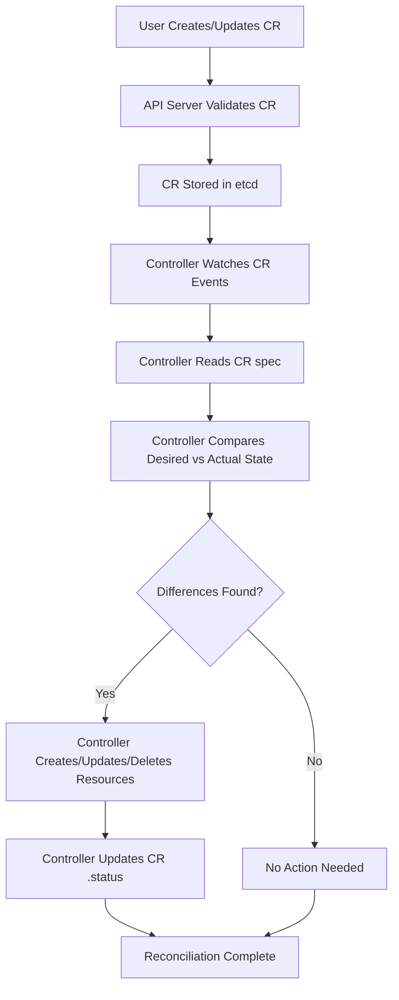

# Custom Resources (CRs)

Custom Resources (CRs) are instances of Custom Resource Definitions (CRDs). They are Kubernetes API objects stored in `etcd` just like native resources (Pods, Services, etc.), but their schema is defined by a CRD rather than by the Kubernetes core API.

## CRs vs Native Resources

From the API server's perspective, a CR is indistinguishable from a native resource. It has:
- `apiVersion` (e.g., `database.example.com/v1`)
- `kind` (e.g., `MySQL`)
- `metadata` (name, namespace, labels, annotations)
- `spec` (desired state)
- `status` (observed state, if the CRD exposes the `/status` subresource)

The key difference is that without a controller watching the CR, it is inert data. The API server will store it, but nothing will act on it.

## Creating a Custom Resource

Once a CRD is applied, you can create instances of that custom resource just like any other Kubernetes resource.

```yaml
apiVersion: database.example.com/v1
kind: MySQL
metadata:
  name: my-mysql
  namespace: production
spec:
  engine: mysql
  version: "8.0"
  storage:
    size: "10Gi"
  credentials:
    username: admin
    passwordRef:
      name: mysql-secret
      key: password
```

```bash
kubectl apply -f mysql-instance.yaml
```

## CR Lifecycle Without a Controller

Without a controller, a CR goes through the standard Kubernetes object lifecycle:

1. **Created**: The API server validates the CR against the CRD schema and stores it in `etcd`.
2. **Observed**: `kubectl get mysql` shows the resource. The `.status` field is empty or unset.
3. **Updated**: Users can modify `.spec` via `kubectl edit` or `kubectl apply`.
4. **Deleted**: The resource is removed from `etcd`.

> **Key insight**: The CR itself does nothing. It is purely declarative configuration data. The controller is what makes the data actionable.

## The Controller's Role

A controller watches for CRs and reconciles the actual cluster state to the desired state defined in the CR's `.spec`. This is the core of the Operator pattern.

### Reconciliation Loop

1. **Watch**: The controller watches for CR create/update/delete events via the API server's watch API.
2. **Compare**: The controller compares the desired state (`.spec`) with the actual state (currently running resources).
3. **Act**: The controller creates, updates, or deletes Kubernetes resources (Pods, Services, PVCs, etc.) to match the desired state.
4. **Report**: The controller updates `.status` to reflect the current state of the system.

```yaml
apiVersion: database.example.com/v1
kind: MySQL
metadata:
  name: my-mysql
  namespace: production
spec:
  engine: mysql
  version: "8.0"
  storage:
    size: "10Gi"
status:
  phase: Running
  ready: true
  endpoint: my-mysql.production.svc.cluster.local
  replicas: 1
```

## CR as Inert Data

A CR without a controller is like a configuration file sitting on disk. It describes what you want, but nothing acts on it. This is a common mistake when learning about CRDs.

```bash
# Create a CRD but no controller
kubectl apply -f mysql-crd.yaml

# Create a custom resource
kubectl apply -f mysql-instance.yaml

# The resource exists but nothing happens
kubectl get mysql
# NAME        ENGINE   VERSION   STATUS
# my-mysql    mysql    8.0       <empty>
```

The resource sits in `etcd` with no pods created, no services configured, and no actual database running.

## CR Immutability

Some fields in a CR can be marked as immutable, meaning they cannot be changed after the resource is created. This is defined in the CRD schema.

```yaml
spec:
  versions:
    - name: v1
      served: true
      storage: true
      schema:
        openAPIV3Schema:
          type: object
          properties:
            spec:
              type: object
              properties:
                engine:
                  type: string
                  x-kubernetes-preserve-unknown-fields: false
                # Immutable field
                clusterID:
                  type: string
                  x-kubernetes-preserve-unknown-fields: false
```

> **Pitfall**: If a field is immutable and you try to change it via `kubectl edit` or `kubectl apply`, the API server rejects the update. You must delete and recreate the resource (or use a migration strategy).

## CR Status Subresource

When the CRD exposes the `/status` subresource, the controller updates `.status` independently of `.spec`. This separation is important because:

- Status updates do not trigger spec reconciliation loops.
- The API server does not require the user to have permission to update `.status` (it can be granted separately via RBAC).
- The `resourceVersion` does not change on status updates, preventing unnecessary watch events.

```bash
# Check if a CRD has the status subresource
kubectl get crd mysqls.database.example.com -o jsonpath='{.spec.versions[0].subresources.status}'
```

## Mermaid: CR and Controller Interaction



## Best Practices

1. **Always deploy a controller with your CRD**: A CRD without a controller is just a schema definition with no behavior.
2. **Use the `/status` subresource**: It prevents status updates from triggering unnecessary reconciliation loops.
3. **Make immutable fields explicit**: Use `x-kubernetes-preserve-unknown-fields: false` and mark fields that should not change after creation.
4. **Use `kubectl get <kind> -o yaml`** to inspect both `.spec` and `.status` together.
5. **Add `additionalPrinterColumns`** to the CRD so `kubectl get` shows useful information without requiring `-o yaml`.
6. **Use `kubectl explain <kind>`** to understand the schema of a custom resource.

## Troubleshooting

- **CR not showing up in `kubectl get`**: The CRD may not be established yet. Check `kubectl get crd` and look for `Established=True` in the conditions.
- **`no matches for kind "X"`**: The CRD is not applied, or the `apiVersion` in the CR does not match the CRD's group/version.
- **Controller not reacting to CR changes**: The controller's watch may be broken. Check controller logs and verify it is watching the correct API group and resource.
- **`forbidden: spec is immutable`**: An immutable field was changed. You must delete and recreate the resource.
- **Status not updating**: The controller may not have permission to update `.status`. Check RBAC roles for the controller's ServiceAccount.

## Commands

```bash
# List all custom resources of a kind
kubectl get mysql -A

# Get a custom resource with full details
kubectl get mysql my-mysql -n production -o yaml

# Edit a custom resource
kubectl edit mysql my-mysql -n production

# Delete a custom resource
kubectl delete mysql my-mysql -n production

# Watch for CR events
kubectl get mysql -n production --watch

# Explain the CR schema
kubectl explain mysql
kubectl explain mysql.spec
kubectl explain mysql.status

# Check CRD conditions
kubectl get crd mysqls.database.example.com -o jsonpath='{.status.conditions}'
```