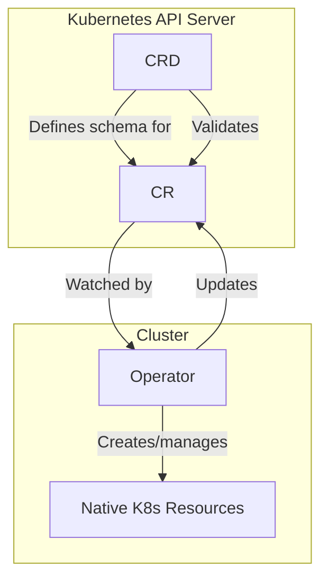

# CRDs, CRs, and Operators: The Relationship

Understanding the relationship between Custom Resource Definitions (CRDs), Custom Resources (CRs), and Operators is fundamental to extending Kubernetes. Each component plays a distinct role in the extensibility ecosystem.

## The Three Components

### CRD = Schema / Contract

A CRD defines the structure, validation rules, and API group for a new resource type. It is the schema that the API server enforces.

- Defines what fields a custom resource can have.
- Specifies which API versions are served and which is stored.
- Optionally exposes subresources (`/status`, `/scale`).
- Does not define any behavior or logic.

```yaml
apiVersion: apiextensions.k8s.io/v1
kind: CustomResourceDefinition
metadata:
  name: mysqls.database.example.com
spec:
  group: database.example.com
  versions:
    - name: v1
      served: true
      storage: true
  scope: Namespaced
  names:
    plural: mysqls
    kind: MySQL
```

### CR = Instance of Configuration Data

A CR is an instance of a custom resource. It is a Kubernetes API object stored in `etcd` that conforms to the CRD schema.

- Contains `.spec` (desired state) and optionally `.status` (observed state).
- Is inert without a controller — it is just data.
- Can be created, read, updated, and deleted like any other Kubernetes resource.

```yaml
apiVersion: database.example.com/v1
kind: MySQL
metadata:
  name: my-mysql
  namespace: production
spec:
  engine: mysql
  version: "8.0"
  storage:
    size: "10Gi"
```

### Operator = Logic Executing Against CRs

An Operator is a controller that watches CRs and reconciles the actual cluster state to the desired state defined in the CR's `.spec`.

- Implements the reconciliation loop (watch → compare → act → report).
- Creates and manages native Kubernetes resources (Pods, Services, PVCs, etc.).
- Encodes operational knowledge (backups, failover, upgrades).
- Updates `.status` to reflect the current state.

## Relationship Diagram



### Analogy

Think of the relationship as a database schema and application:

- **CRD** = Database schema (table definition, column types, constraints)
- **CR** = A row in that table (actual data)
- **Operator** = The application that reads and writes to that table, enforcing business logic

Without the schema (CRD), there is no structure. Without the data (CR), there is nothing to manage. Without the application (Operator), the data is inert.

## How They Work Together

1. **CRD is applied**: The API server registers the new resource type.
2. **CR is created**: The user creates an instance of the custom resource.
3. **Operator detects the CR**: The Operator's controller watches for new CRs.
4. **Operator reconciles**: The Operator reads the CR's `.spec`, compares it with the actual state, and takes action.
5. **Operator updates status**: The Operator updates `.status` to reflect progress.
6. **User monitors**: The user uses `kubectl get mysql` to check the CR's status.

```bash
# Step 1: Apply CRD
kubectl apply -f mysql-crd.yaml

# Step 2: Create CR
kubectl apply -f mysql-instance.yaml

# Step 3: Operator creates resources
kubectl get pods -n production -l app=mysql
# NAME       READY   STATUS    RESTARTS   AGE
# my-mysql-0 1/1     Running   0          30s

# Step 4: Check CR status
kubectl get mysql my-mysql -n production -o jsonpath='{.status.phase}'
# Running
```

## Versioning and Migration

CRDs can serve multiple API versions. When a CR is created with one version and the storage version changes, the API server converts the CR.

```yaml
spec:
  versions:
    - name: v1beta1
      served: true
      storage: false
    - name: v1
      served: true
      storage: true
```

- A CR created as `v1beta1` is stored internally as `v1`.
- When `kubectl get mysql my-mysql` is called, the API server returns the CR in the requested version.
- A conversion webhook can transform the data between versions.

## Best Practices

1. **Always deploy the Operator alongside the CRD**: A CRD without an Operator is just a schema with no behavior.
2. **Use the `/status` subresource**: Prevents status updates from triggering unnecessary reconciliation.
3. **Version your CRDs**: Plan for schema evolution by supporting multiple versions.
4. **Use `kubectl explain`** to understand the CRD schema after applying it.
5. **Test the Operator independently**: Ensure the Operator can reconcile CRs even when the cluster is in a partially broken state.

## Common Pitfalls

- **CRD applied but Operator not running**: The CR will exist but nothing will happen. Verify the Operator pod is running.
- **Operator running but not watching the CRD**: The controller's watch may be configured for the wrong API group or resource name.
- **CR created with wrong apiVersion**: The API server rejects the CR if the `apiVersion` does not match a served version of the CRD.
- **Status subresource not enabled**: If the CRD does not expose `/status`, the Operator cannot update `.status` independently of `.spec`.
- **CRD deletion cascades**: Deleting a CRD also deletes all CRs of that type and all resources the Operator created.

## Troubleshooting

- **CR not showing up in `kubectl get`**: The CRD may not be established yet. Check `kubectl get crd` and look for `Established=True` in the conditions.
- **`no matches for kind "X"`**: The CRD is not applied, or the `apiVersion` in the CR does not match the CRD's group/version.
- **Operator not reacting to CR changes**: The controller's watch may be broken. Check controller logs and verify it is watching the correct API group and resource.
- **Status not updating**: The Operator may not have permission to update `.status`. Check RBAC roles for the controller's ServiceAccount.
- **CRD deletion cascades**: Deleting a CRD also deletes all CRs of that type and all resources the Operator created. Always delete CRs first, then the CRD.
- **Conversion webhook errors**: When migrating between CRD versions, the conversion webhook must be available and correctly configured. If it is down, the API server cannot serve the new version.

## Commands

```bash
# Verify CRD exists
kubectl get crd mysqls.database.example.com

# Create a CR
kubectl apply -f mysql-instance.yaml

# Watch for CR events
kubectl get mysql -n production --watch

# Check if Operator is running
kubectl get pods -n mysql-operator

# Describe CR to see spec and status
kubectl describe mysql my-mysql -n production

# Check CRD conditions
kubectl get crd mysqls.database.example.com -o jsonpath='{.status.conditions}'

# Delete CR (Operator should clean up associated resources)
kubectl delete mysql my-mysql -n production

# Delete CRD (also deletes all CRs of that type)
kubectl delete crd mysqls.database.example.com
```