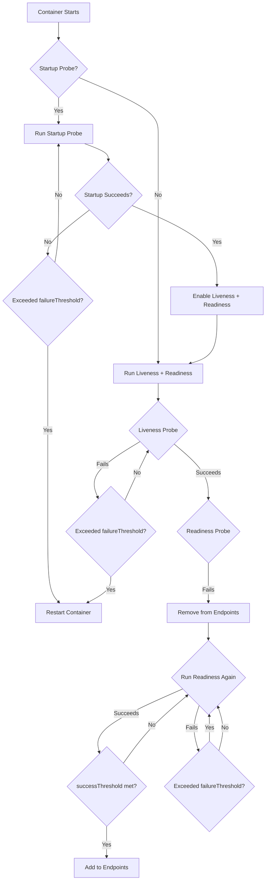

# Health Probes Recap

This document recaps the Kubernetes probe types and their mechanics in detail. Probes are the primary mechanism for Kubernetes to determine container health and manage traffic routing.

## Probe Types Overview

| Probe | Purpose | Action on Failure |
|---|---|---|
| **Startup Probe** | Detects slow-starting containers | Disables liveness/readiness until it succeeds; if it fails failureThreshold times, container is restarted |
| **Liveness Probe** | Detects deadlocked or hung containers | Container is killed and restarted |
| **Readiness Probe** | Detects containers not ready for traffic | Pod removed from Service endpoints |

## Startup Probe

The startup probe is designed for containers that take a long time to start. It disables the liveness and readiness probes until the startup probe succeeds.

```yaml
spec:
  containers:
    - name: java-app
      image: my-java-app:1.0
      startupProbe:
        httpGet:
          path: /actuator/health/readiness
          port: 8080
        failureThreshold: 30
        periodSeconds: 10
```

### Key Behavior

- While the startup probe is running, liveness and readiness probes are disabled.
- Once the startup probe succeeds, liveness and readiness probes are enabled.
- If the startup probe fails `failureThreshold` times, the container is restarted.
- `failureThreshold` defaults to 3. For startup probes, set it high enough to allow the container to start (e.g., `failureThreshold: 30` with `periodSeconds: 10` allows up to 5 minutes of startup time).

> **Best practice**: Use startup probes for Java applications, applications with large dependency graphs, or any container that takes more than 10 seconds to become ready.

## Liveness Probe

The liveness probe detects when a container is not functioning correctly and needs to be restarted.

```yaml
spec:
  containers:
    - name: app
      image: myapp:1.0
      livenessProbe:
        httpGet:
          path: /healthz
          port: 8080
        initialDelaySeconds: 15
        periodSeconds: 10
        timeoutSeconds: 5
        failureThreshold: 3
```

### Key Behavior

- The kubelet periodically runs the liveness probe.
- If the probe fails `failureThreshold` times consecutively, the container is killed and restarted.
- The restart follows the pod's `restartPolicy` (`Always` for Deployments, `OnFailure` for Jobs).

> **Pitfall**: A liveness probe that checks a dependency (e.g., database connection) can cause unnecessary restarts when the dependency is temporarily unavailable. The liveness probe should check the application's internal state, not external dependencies.

## Readiness Probe

The readiness probe determines whether a container is ready to serve traffic.

```yaml
spec:
  containers:
    - name: app
      image: myapp:1.0
      readinessProbe:
        httpGet:
          path: /ready
          port: 8080
        initialDelaySeconds: 5
        periodSeconds: 5
        timeoutSeconds: 3
        failureThreshold: 3
```

### Key Behavior

- If the readiness probe fails, the pod is removed from all matching Service endpoints.
- The pod continues running; it is not restarted.
- When the readiness probe succeeds again, the pod is added back to the endpoints after `successThreshold` consecutive successes.

> **Best practice**: Use the readiness probe to check dependency health (database, cache, message queue). This prevents traffic from being routed to pods that cannot serve requests due to missing dependencies.

## Probe Parameters

| Parameter | Default | Description |
|---|---|---|
| `initialDelaySeconds` | 0 | Seconds to wait before the first probe |
| `periodSeconds` | 10 | Interval between probes |
| `timeoutSeconds` | 1 | Seconds before the probe times out |
| `successThreshold` | 1 | Consecutive successes for success (must be 1 for liveness and startup probes) |
| `failureThreshold` | 3 | Consecutive failures before the probe is considered failed |

### Parameter Interactions

- **Startup probe**: `failureThreshold * periodSeconds` = total time allowed for startup.
- **Liveness probe**: `failureThreshold * periodSeconds` = time between first failure and container restart.
- **Readiness probe**: `failureThreshold * periodSeconds` = time before pod is removed from endpoints.

## Probe Action Types

### httpGet
Sends an HTTP GET request. Succeeds if the response status code is 200–399.

```yaml
httpGet:
  path: /healthz
  port: 8080
  scheme: HTTP
```

### tcpSocket
Opens a TCP connection. Succeeds if the connection is established.

```yaml
tcpSocket:
  port: 3306
```

### exec
Executes a command inside the container. Succeeds if the command exits with code 0.

```yaml
exec:
  command:
    - sh
    - -c
    - "cat /tmp/healthy"
```

### grpc
Performs a gRPC health check. Succeeds if the gRPC response status is `SERVING`.

```yaml
grpc:
  port: 50051
```

## Mermaid: Probe Decision Flow



## Best Practices

1. **Use startup probes for slow-starting apps**: Prevents premature liveness failures.
2. **Separate liveness and readiness**: Liveness checks internal health; readiness checks dependency health.
3. **Keep probes lightweight**: Probes should be fast and not consume significant resources.
4. **Set appropriate timeouts**: A probe that hangs indefinitely blocks the kubelet.
5. **Monitor probe failure rates**: High failure rates indicate application or dependency issues.
6. **Use `httpGet` for web services**: The most common and reliable probe type.
7. **Avoid checking external dependencies in liveness probes**: Use readiness probes for dependency checks.

## Troubleshooting

- **`CrashLoopBackOff` with liveness probe failures**: The liveness probe is killing the container repeatedly. Increase `initialDelaySeconds` or `failureThreshold`.
- **Pod not receiving traffic**: The readiness probe is failing. Check `kubectl get pod` for `READY` status.
- **Probe timeout errors**: The application is not responding to the probe endpoint. Increase `timeoutSeconds` or optimize the health endpoint.
- **Startup probe never succeeds**: The `failureThreshold` is too low or the startup endpoint is incorrect.
- **`kubectl get pods` shows `0/1` ready**: The readiness probe is failing. Check the probe configuration and the application's dependency health.

## Commands

```bash
# Check probe status in pod description
kubectl describe pod myapp-abc123 -n production | grep -A 20 'Liveness\|Readiness\|Startup'

# Check probe results from kubelet logs
journalctl -u kubelet | grep -i 'probe\|liveness\|readiness' | tail -50

# Test a probe endpoint manually
kubectl exec myapp-abc123 -n production -- curl -s http://localhost:8080/healthz

# Check events related to probe failures
kubectl get events -n production --field-selector reason=Unhealthy --sort-by='.lastTimestamp'
```