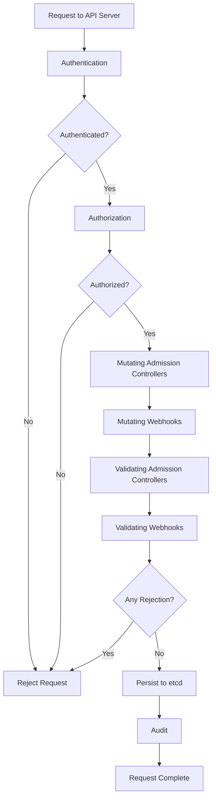

# Admission Controllers

Admission controllers are plugins that intercept requests to the Kubernetes API server before they are persisted to `etcd`. They enforce policies, validate resources, and mutate objects.

## How Admission Controllers Work

When a request arrives at the API server, it passes through the admission control chain. Each controller in the chain can either accept the request, reject it, or modify it.

### Request Flow

1. **Authentication**: The API server identifies the user or service account making the request.
2. **Authorization**: The API server checks whether the user has permission to perform the requested action.
3. **Admission Control**: Admission controllers intercept the request and apply policies.
4. **Persistence**: The request is written to `etcd`.
5. **Audit**: The request is logged for auditing purposes.

## Built-in Admission Controllers

Kubernetes includes several built-in admission controllers. The ones **enabled by default** in v1.35 are:

CertificateApproval, CertificateSigning, CertificateSubjectRestriction, DefaultIngressClass, DefaultStorageClass, DefaultTolerationSeconds, LimitRanger, MutatingAdmissionWebhook, NamespaceLifecycle, PersistentVolumeClaimResize, PodSecurity, Priority, ResourceQuota, RuntimeClass, ServiceAccount, StorageObjectInUseProtection, TaintNodesByCondition, ValidatingAdmissionPolicy, ValidatingAdmissionWebhook

### NamespaceLifecycle

Enforces lifecycle rules for namespaces. Prevents the creation of new namespaces if the limit has been reached, and prevents the deletion of namespaces that have active resources.

### LimitRanger

Enforces `LimitRange` constraints. Injects default resource requests and limits into pods that do not specify them, and rejects pods that violate min/max constraints.

### ServiceAccount

Automatically creates and attaches a `ServiceAccount` to pods that do not specify one. Populates `ServiceAccount` tokens and credentials.

### ResourceQuota

Enforces `ResourceQuota` constraints. Rejects pod creation if the namespace has exceeded its quota.

### DefaultStorageClass

Sets the `storageClassName` for PersistentVolumeClaims that do not specify one.

### DefaultTolerationSeconds

Sets default tolerations for `node.kubernetes.io/not-ready:NoExecute` and `node.kubernetes.io/unreachable:NoExecute` on pods that do not already tolerate them.

### PodSecurity

Enforces Pod Security Standards (PSS) at the pod level. Replaces the deprecated `PodSecurityPolicy` admission controller.

### NodeRestriction

Restricts kubelets to only modifying their own node resources. Prevents a compromised kubelet from modifying other nodes. **Enabled by default**.

### AlwaysPullImages

Forces all containers to always pull images from the registry, even if the image is already present on the node. **Not enabled by default**.

## Mutating Admission Webhooks

Mutating webhooks modify the object before it is persisted. They can inject sidecars, modify labels, add default configurations, or enforce organizational standards.

### How Mutating Webhooks Work

1. The API server receives a request to create/modify a resource.
2. The request is sent to the mutating webhook service.
3. The webhook receives the object in its current state.
4. The webhook modifies the object (or leaves it unchanged).
5. The modified object is returned to the API server.
6. The API server continues processing the request with the modified object.

```yaml
apiVersion: admissionregistration.k8s.io/v1
kind: MutatingWebhookConfiguration
metadata:
  name: sidecar-injector
webhooks:
  - name: sidecar-injector.example.com
    rules:
      - operations: ["CREATE"]
        apiGroups: [""]
        apiVersions: ["v1"]
        resources: ["pods"]
    clientConfig:
      service:
        name: sidecar-injector
        namespace: injection-system
        path: "/inject"
      caBundle: LS0t...
    admissionReviewVersions: ["v1", "v1beta1"]
    sideEffects: None
    timeoutSeconds: 5
```

### Common Mutating Webhook Use Cases

- **Sidecar injection**: Automatically inject a logging or monitoring sidecar into pods.
- **Label injection**: Add standard labels to resources.
- **Default resource limits**: Inject resource requests and limits for pods that do not specify them.
- **Image policy enforcement**: Reject or rewrite images that do not match organizational policies.

## Validating Admission Webhooks

Validating webhooks reject requests that do not conform to organizational policies. They do not modify the object.

### How Validating Webhooks Work

1. The API server receives a request to create/modify a resource.
2. The request is sent to the validating webhook service.
3. The webhook receives the object in its current state.
4. The webhook validates the object.
5. If validation fails, the webhook returns an error and the request is rejected.
6. If validation passes, the webhook returns success and the request proceeds.

```yaml
apiVersion: admissionregistration.k8s.io/v1
kind: ValidatingWebhookConfiguration
metadata:
  name: policy-enforcer
webhooks:
  - name: policy.enforcer.example.com
    rules:
      - operations: ["CREATE", "UPDATE"]
        apiGroups: [""]
        apiVersions: ["v1"]
        resources: ["pods"]
    clientConfig:
      service:
        name: policy-enforcer
        namespace: policy-system
        path: "/validate"
      caBundle: LS0t...
    admissionReviewVersions: ["v1", "v1beta1"]
    sideEffects: None
    timeoutSeconds: 5
    failurePolicy: Fail
```

### Failure Policy

- **`Fail`**: If the webhook is unreachable or returns an error, the request is rejected. This is the recommended policy for production.
- **`Ignore`**: If the webhook is unreachable or returns an error, the request is allowed. This can lead to policy violations if the webhook is down.

> **Best practice**: Use `failurePolicy: Fail` for validating webhooks to ensure policies are always enforced. Use `failurePolicy: Fail` for mutating webhooks only if the webhook is critical for security.

## Webhook Configuration Options

| Option | Description |
|---|---|
| `rules` | Which resources and operations the webhook applies to |
| `clientConfig` | The webhook service URL or CA bundle |
| `admissionReviewVersions` | Supported AdmissionReview versions |
| `sideEffects` | Whether the webhook has side effects (`None`, `NoneOnDryRun`) |
| `timeoutSeconds` | Webhook timeout (1-30 seconds) |
| `failurePolicy` | `Fail` or `Ignore` |
| `matchPolicy` | `Exact` or `Equivalent` |
| `namespaceSelector` | Selects which namespaces the webhook applies to |
| `objectSelector` | Selects which objects the webhook applies to |

## Mermaid: Admission Control Flow



## Best Practices

1. **Use webhooks for organizational policies**: Built-in controllers handle basic constraints; webhooks handle custom policies.
2. **Set `failurePolicy: Fail`**: Prevents policy bypass when webhooks are unavailable.
3. **Use `namespaceSelector` and `objectSelector`**: Limit webhooks to only the resources they need to process.
4. **Keep webhooks fast**: Webhooks add latency to every API request. Optimize webhook response times.
5. **Use `sideEffects: None`**: Indicates the webhook has no side effects, allowing the API server to retry safely.
6. **Monitor webhook availability**: Webhook outages can block all API requests if `failurePolicy: Fail`.
7. **Use OPA/Gatekeeper or Kyverno**: These tools provide policy-as-code capabilities for admission control.

## Troubleshooting

- **`webhook timeout`**: The webhook service is not responding within the timeout. Check the webhook pod status and logs.
- **`webhook not found`**: The webhook service or CA bundle is misconfigured. Verify the `clientConfig` in the webhook configuration.
- **`request rejected by admission controller`**: A webhook or built-in controller rejected the request. Check the API server logs for the specific rejection reason.
- **`webhook has side effects`**: The webhook is configured with `sideEffects: NoneOnDryRun`, which prevents retries for dry-run requests. Set `sideEffects: None` if possible (only `None` and `NoneOnDryRun` are valid for v1 webhooks).
- **`failurePolicy: Ignore` allowing bad requests**: When the webhook is down, requests bypass the policy. Consider switching to `failurePolicy: Fail`.
- **Webhook causing high API server latency**: The webhook is too slow. Optimize the webhook service or increase `timeoutSeconds`.

## Commands

```bash
# List all admission controllers
kubectl get pods -n kube-system -l component=kube-apiserver

# Check API server flags for admission controllers
ps aux | grep kube-apiserver | grep admission-control

# Get webhook configurations
kubectl get mutatingwebhookconfigurations
kubectl get validatingwebhookconfigurations

# Describe a webhook configuration
kubectl describe mutatingwebhookconfiguration sidecar-injector

# Test a webhook by creating a resource
kubectl apply -f test-pod.yaml -v 6  # Verbose output shows admission chain

# Check API server audit logs for admission decisions
kubectl logs -n kube-system kube-apiserver-<node> | grep -i 'admission\|webhook'
```