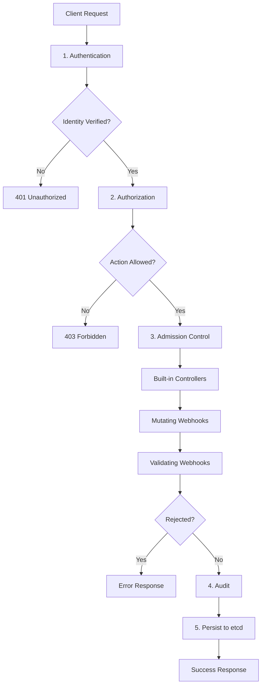

# Admission Control Flow

Every request to the Kubernetes API server passes through a well-defined security and validation pipeline. Understanding this flow is essential for debugging access issues and designing admission policies.

## The Request Pipeline

The admission control pipeline consists of five stages, executed in order:

### 1. Authentication

The API server identifies the principal (user or service account) making the request. This is the first gate in the pipeline.

- **Methods**: x509 client certificates, bearer tokens, OIDC tokens, webhook authentication.
- **Result**: The request is associated with a user identity and any groups the user belongs to.

### 2. Authorization

The API server checks whether the authenticated principal has permission to perform the requested action on the specified resource.

- **Methods**: RBAC, ABAC (deprecated), Node authorization, webhook authorization.
- **Result**: Allow or deny the request.

### 3. Admission Control

Admission controllers and webhooks intercept the request to enforce policies, validate resources, and mutate objects.

- **Built-in controllers**: `NamespaceLifecycle`, `LimitRanger`, `ResourceQuota`, `PodSecurity`, etc.
- **Mutating webhooks**: Modify the object (e.g., inject sidecars, add labels).
- **Validating webhooks**: Reject the object if it violates policies.
- **Result**: The object may be modified or rejected.

### 4. Audit

The request is logged for auditing purposes. Audit logs capture who did what, when, and to what resource.

### 5. Persistence

The request is written to `etcd`, making the change permanent.

## Mermaid: Complete Request Pipeline



## Detailed Admission Control Flow

The admission control stage is further divided into two sub-stages:

### Sub-stage 1: Built-in Controllers

Built-in admission controllers run first. They are compiled into the API server and handle fundamental cluster operations.

1. **NamespaceLifecycle**: Validates namespace operations.
2. **LimitRanger**: Enforces `LimitRange` defaults and constraints.
3. **ServiceAccount**: Populates `ServiceAccount` tokens.
4. **ResourceQuota**: Enforces `ResourceQuota` limits.
5. **PodSecurity**: Enforces Pod Security Standards.
6. **DefaultStorageClass**: Sets default storage class for PVCs.

### Sub-stage 2: Webhooks

Webhooks run after built-in controllers. They are external HTTP services that can mutate or validate requests.

1. **MutatingWebhooks**: All mutating webhooks run in a chain. Each webhook can modify the object.
2. **ValidatingWebhooks**: All validating webhooks run in a chain. Each webhook can reject the object.

> **Important**: Mutating webhooks run before validating webhooks. This ensures that the object is in its final form before validation occurs.

## Webhook Ordering

Mutating and validating webhooks are processed in a specific order:

1. Webhooks are sorted by their `name` field alphabetically.
2. Each webhook is called in order.
3. If a mutating webhook modifies the object, subsequent webhooks see the modified object.
4. If a validating webhook rejects the object, the request is immediately denied.

## Timeout and Failure Handling

### Timeout

Each webhook has a `timeoutSeconds` setting (default 10, maximum 30). If the webhook does not respond within the timeout, the failure policy determines the outcome.

### Failure Policy

| Policy | Behavior |
|---|---|
| `Fail` | Reject the request if the webhook is unreachable or errors |
| `Ignore` | Allow the request if the webhook is unreachable or errors |

> **Best practice**: Use `failurePolicy: Fail` for validating webhooks to ensure policies are always enforced. Use `failurePolicy: Fail` for mutating webhooks only if the mutation is critical for security.

## Dry Run

Requests can be marked as `dryRun`, which causes them to pass through the admission pipeline but not be persisted to `etcd`.

```bash
# Dry run a pod creation
kubectl apply -f pod.yaml --dry-run=server

# Dry run with server-side validation
kubectl apply -f pod.yaml --dry-run=server -v 6
```

Dry run requests still go through the full admission control chain, including webhooks. This allows you to validate requests without making changes.

## Best Practices

1. **Understand the full pipeline**: Know which stage each security mechanism operates at.
2. **Use webhooks for custom policies**: Built-in controllers handle basic constraints; webhooks handle custom policies.
3. **Order webhooks carefully**: Mutating webhooks should run before validating webhooks.
4. **Set appropriate timeouts**: Webhooks should respond quickly to avoid blocking API requests.
5. **Monitor webhook health**: Webhook outages can block all API requests if `failurePolicy: Fail`.
6. **Use dry run for validation**: Test changes before applying them for real.

## Troubleshooting

- **Request passes authentication but fails authorization**: Check RBAC bindings and roles. The user may not have the required permissions.
- **Request passes authorization but fails admission**: A webhook or built-in controller rejected the request. Check the API server logs for the specific admission controller that rejected the request.
- **Webhook timeout**: The webhook service is not responding. Check the webhook pod status, logs, and network connectivity.
- **Webhook causing infinite loops**: A mutating webhook modifies an object, which triggers another webhook call, which modifies the object again, etc. Ensure webhooks are idempotent.
- **`dry-run` request fails admission**: The webhook may not handle dry-run requests correctly. Check that the webhook supports dry-run.
- **Admission controller not loaded**: The admission controller may not be enabled in the API server configuration. Check the API server flags.

## Commands

```bash
# Check API server admission controller flags
ps aux | grep kube-apiserver | grep admission-control

# List all webhook configurations
kubectl get mutatingwebhookconfigurations
kubectl get validatingwebhookconfigurations

# Describe a webhook
kubectl describe mutatingwebhookconfiguration sidecar-injector

# Dry run a resource creation
kubectl apply -f pod.yaml --dry-run=server -v 6

# Check API server audit logs
kubectl logs -n kube-system kube-apiserver-<node> | grep -i 'admission\|webhook'

# Trace admission decisions with verbose logging
kubectl apply -f pod.yaml -v 6 2>&1 | grep -i 'admission\|webhook'
```