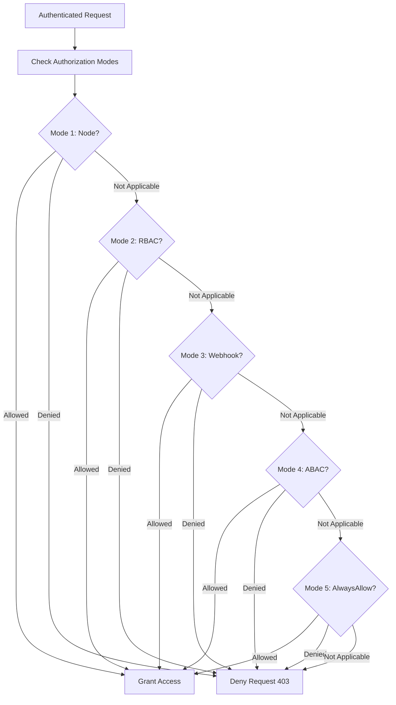

# Authorization Mechanisms

Authorization determines what actions an authenticated principal is allowed to perform on Kubernetes resources. Kubernetes supports multiple authorization modes that can be used simultaneously.

## How Authorization Works

After authentication identifies the principal, authorization checks whether that principal has permission to perform the requested action on the specified resource.

### Authorization Request

```
User: alice
Action: create
Resource: pods
Namespace: production
```

Each enabled authorization mode is checked in sequence. If any authorizer approves or denies the request, that decision is immediately returned and no other authorizer is consulted. If all modules have no opinion, the request is denied.

## RBAC (Role-Based Access Control)

RBAC is the primary authorization mechanism in Kubernetes. It uses roles and role bindings to grant permissions.

### Roles and ClusterRoles

A `Role` defines a set of permissions within a namespace. A `ClusterRole` defines permissions that are either namespace-scoped or cluster-scoped.

```yaml
# Role (namespace-scoped)
apiVersion: rbac.authorization.k8s.io/v1
kind: Role
metadata:
  name: pod-reader
  namespace: production
rules:
  - apiGroups: [""]
    resources: ["pods"]
    verbs: ["get", "list", "watch"]

# ClusterRole (cluster-scoped or namespace-scoped)
apiVersion: rbac.authorization.k8s.io/v1
kind: ClusterRole
metadata:
  name: node-reader
rules:
  - apiGroups: [""]
    resources: ["nodes"]
    verbs: ["get", "list", "watch"]
  - apiGroups: [""]
    resources: ["pods"]
    verbs: ["get", "list", "watch"]
```

### RoleBindings and ClusterRoleBindings

A `RoleBinding` grants the permissions defined in a `Role` to a user or group within a namespace. A `ClusterRoleBinding` grants the permissions defined in a `ClusterRole` cluster-wide.

```yaml
# RoleBinding (namespace-scoped)
apiVersion: rbac.authorization.k8s.io/v1
kind: RoleBinding
metadata:
  name: read-pods
  namespace: production
subjects:
  - kind: User
    name: alice
    apiGroup: rbac.authorization.k8s.io
roleRef:
  kind: Role
  name: pod-reader
  apiGroup: rbac.authorization.k8s.io

# ClusterRoleBinding (cluster-scoped)
apiVersion: rbac.authorization.k8s.io/v1
kind: ClusterRoleBinding
metadata:
  name: admin-access
subjects:
  - kind: User
    name: bob
    apiGroup: rbac.authorization.k8s.io
roleRef:
  kind: ClusterRole
  name: cluster-admin
  apiGroup: rbac.authorization.k8s.io
```

### RBAC Verb Reference

| Verb | Description |
|---|---|
| `create` | Create the resource |
| `delete` | Delete the resource |
| `deletecollection` | Delete a collection of resources |
| `get` | Get a specific resource |
| `list` | List all resources |
| `patch` | Modify part of a resource |
| `update` | Replace a resource |
| `watch` | Watch for changes to resources |
| `*` | All verbs |

### RBAC Resource Groups

| API Group | Resources |
|---|---|
| `""` (core) | pods, services, configmaps, secrets, persistentvolumes, persistentvolumeclaims, namespaces, nodes, events, etc. |
| `apps` | deployments, daemonsets, statefulsets, replicasets, etc. |
| `batch` | jobs, cronjobs |
| `rbac.authorization.k8s.io` | roles, clusterroles, rolebindings, clusterrolebindings |
| `admissionregistration.k8s.io` | validatingwebhookconfigurations, mutatingwebhookconfigurations |
| `storage.k8s.io` | storageclasses, volumeattachments |
| `networking.k8s.io` | ingresses, networkpolicies |
| `policy` | poddisruptionbudgets |
| `autoscaling` | horizontalpodautoscalers |

### Checking RBAC Permissions

```bash
# Check what actions a user can perform on a resource
kubectl auth can-i create pods -n production --as=alice

# Check all possible actions on pods
kubectl auth can-i '*' pods -n production --as=alice

# Check actions as a service account
kubectl auth can-i get pods -n production --as=system:serviceaccount:production:app-sa

# Check actions as a group
kubectl auth can-i get pods -n production --as=system:masters

# Check actions on cluster-scoped resources
kubectl auth can-i get nodes --as=bob

# Check actions on all resources
kubectl auth can-i '*' '*' -n production --as=alice
```

> **Community knowledge**: `kubectl auth can-i` is one of the most useful commands for debugging RBAC issues. It is the fastest way to verify whether a user or service account has the expected permissions.

## ABAC (Attribute-Based Access Control)

ABAC is a deprecated authorization mode that uses policy files to define access rules based on attributes of the request and the object.

```json
{
  "apiVersion": "abac.authorization.kubernetes.io/v1beta1",
  "kind": "Policy",
  "spec": {
    "user": "alice",
    "namespace": "production",
    "resource": "pods",
    "readonly": true
  }
}
```

> **Pitfall**: ABAC is deprecated and should not be used in new clusters. It does not support dynamic policy updates and is difficult to manage at scale.

## Node Authorization

The Node authorizer grants kubelets permission to perform actions required to run pods on their node. It is enabled by default and is critical for node operation.

- Kubelets can only modify resources related to their own node.
- Kubelets can create/modify pods, pods/log, pods/exec, pods/attach, pods/portforward.
- Kubelets cannot access resources on other nodes.

> **Pitfall**: If the Node authorizer is disabled, kubelets will not be able to function correctly. This is a critical component for node operation.

## Webhook Authorization

Webhook authorization delegates authorization decisions to an external HTTP service.

```yaml
apiVersion: v1
kind: ConfigMap
metadata:
  name: webhook-auth-config
  namespace: kube-system
data:
  config.yaml: |
    apiVersion: v1
    kind: Config
    clusters:
    - cluster:
        certFile: /etc/webhook/ca.crt
        server: https://webhook.example.com/authorize
      name: webhook
    users:
    - name: webhook
      user:
        token: <webhook-token>
```

```bash
# API server flag
--authorization-mode=RBAC,Webhook
--authorization-webhook-config-file=/etc/kubernetes/webhook-auth-config.yaml
```

### Webhook Response

```json
{
  "apiVersion": "authorization.k8s.io/v1",
  "kind": "SubjectAccessReview",
  "status": {
    "allowed": true
  }
}
```

## AlwaysAllow and AlwaysDeny

- **AlwaysAllow**: Allows all requests. Used for testing or in clusters with no authorization.
- **AlwaysDeny**: Denies all requests. Used to block all access.

> **Pitfall**: `AlwaysAllow` should never be used in production clusters. It disables all authorization and allows any authenticated user to perform any action.

## Authorization Mode Order

Authorization modes are checked in order. If any mode approves or denies the request, that decision is immediately returned and no other mode is consulted. If all modes return no opinion, the request is denied.

```bash
# Configure multiple authorization modes
--authorization-mode=Node,RBAC,Webhook
```

In this configuration:
1. Node authorization is checked first.
2. If Node authorization does not decide, RBAC is checked.
3. If RBAC does not decide, Webhook authorization is checked.
4. If none allow the request, it is denied.

## Mermaid: Authorization Decision Flow



## Best Practices

1. **Use RBAC as the primary authorization mechanism**: It is the most flexible and widely supported.
2. **Follow least privilege**: Grant only the minimum permissions required.
3. **Use groups for role assignments**: Assign roles to groups rather than individual users for easier management.
4. **Use ClusterRoles for cluster-wide permissions**: Use RoleBindings to bind ClusterRoles to specific namespaces.
5. **Review RBAC bindings regularly**: Audit who has access to what resources.
6. **Use `kubectl auth can-i` for debugging**: Quickly verify permissions without reading all RBAC rules.
7. **Enable webhook authorization for custom policies**: Use an external authorization service for complex policies.
8. **Never use AlwaysAllow in production**: It disables all access control.

## Troubleshooting

- **`forbidden: User "alice" cannot create resource "pods" in API group "" in the namespace "production"`**: The user does not have the required RBAC permissions. Check RoleBindings and ClusterRoleBindings.
- **`forbidden: User cannot impersonate`**: The user is trying to impersonate another user or service account but does not have the `impersonate` verb.
- **`forbidden: User "system:node:worker-1" cannot get resource "pods" in API group ""`**: The Node authorizer may not be enabled or the kubelet is trying to access a resource outside its scope.
- **Webhook authorization timeout**: The webhook service is not responding. Check `failurePolicy` (use `Fail` for security).
- **RBAC changes not taking effect**: RBAC changes are immediate, but cached credentials may take a few seconds to refresh.

## Commands

```bash
# Check permissions
kubectl auth can-i create pods -n production --as=alice
kubectl auth can-i get pods -n production --as=system:serviceaccount:production:app-sa

# List all roles in a namespace
kubectl get roles -n production

# List all role bindings in a namespace
kubectl get rolebindings -n production

# List all cluster roles
kubectl get clusterroles

# List all cluster role bindings
kubectl get clusterrolebindings

# Describe a role
kubectl describe role pod-reader -n production

# Describe a role binding
kubectl describe rolebinding read-pods -n production

# Check who can delete pods in a namespace
kubectl auth can-i delete pods -n production

# Check who can impersonate a user
kubectl auth can-i impersonate users -n production
```