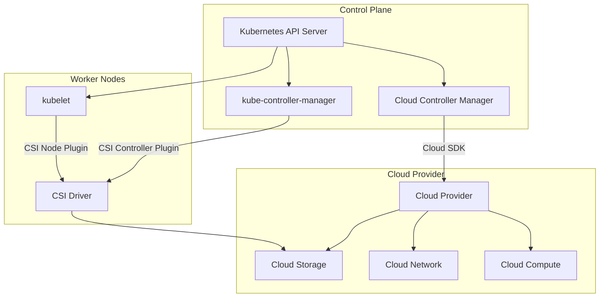

# CSI and Cloud Controller Manager

The Container Storage Interface (CSI) and Cloud Controller Manager (CCM) are Kubernetes components that decouple storage and cloud provider logic from the core Kubernetes codebase.

## CSI (Container Storage Interface)

CSI is a standard interface that allows storage providers to expose their storage systems to Kubernetes without modifying the core Kubernetes codebase. Before CSI, storage drivers had to be compiled into the Kubernetes codebase.

### CSI Architecture

CSI defines a gRPC-based protocol between the Kubernetes components and the storage driver. The architecture consists of three main components:

1. **CSI Controller**: Runs outside the Kubernetes control plane (typically as a Deployment). It handles volume lifecycle operations (create, delete, attach, detach, publish, unpublish).
2. **CSI Node**: Runs as a DaemonSet on each node. It handles node-specific operations (mount, unmount, stage, unstage).
3. **Kubernetes Components**: The kubelet and kube-controller-manager communicate with the CSI driver via the CSI protocol.

```
┌─────────────────────────┐
│   Kubernetes Control    │
│   Plane                 │
│                         │
│  kube-controller-manager│
│  kubelet                │
└───────────┬─────────────┘
            │ gRPC (CSI Protocol)
            ▼
┌─────────────────────────┐
│   CSI Driver            │
│                         │
│  ┌───────────────────┐  │
│  │ CSI Controller    │  │  (Deployment, runs on control plane)
│  └───────────────────┘  │
│  ┌───────────────────┐  │
│  │ CSI Node          │  │  (DaemonSet, runs on each worker node)
│  └───────────────────┘  │
└─────────────────────────┘
```

### CSI Plugin Types

| Plugin Type | Component | Responsibility |
|---|---|---|
| **Controller Service** | CSI Controller | Volume lifecycle (create, delete, attach, detach) |
| **Node Service** | CSI Node | Mount/unmount, stage/unstage on nodes |
| **Identity Service** | CSI Controller | Probe, get plugin info |

### CSI in Kubernetes

CSI drivers are deployed as DaemonSets (for node plugins) and Deployments (for controller plugins). They use a special `csi` volume type in pods.

```yaml
apiVersion: v1
kind: Pod
metadata:
  name: csi-test-pod
spec:
  containers:
    - name: test
      image: busybox
      command: ["sleep", "3600"]
      volumeMounts:
        - name: csi-vol
          mountPath: /data
  volumes:
    - name: csi-vol
      csi:
        driver: ebs.csi.aws.com
        volumeHandle: vol-12345678
        readOnly: false
```

### CSI and StorageClasses

CSI drivers register themselves as `StorageClass` provisioners. When a PVC requests a dynamically provisioned volume, the StorageClass uses the CSI driver to create the volume.

```yaml
apiVersion: storage.k8s.io/v1
kind: StorageClass
metadata:
  name: fast
provisioner: ebs.csi.aws.com
parameters:
  type: gp3
  iopsPerGB: "10"
reclaimPolicy: Delete
volumeBindingMode: WaitForFirstConsumer
```

### CSI Migration

CSI migration allows in-tree cloud provider plugins (e.g., `aws-ebs`, `gce-pd`) to be transparently redirected to their CSI driver equivalents. This enables the removal of in-tree plugins from Kubernetes.

```bash
# CSI migration is enabled by default in Kubernetes 1.25+ and later.
# The CSIMigration and CSIMigration<Provider> feature gates were removed in Kubernetes 1.27.
# Migration is now controlled automatically — no feature-gate configuration is needed.
# To verify migration status:
kubectl get nodes -o jsonpath='{.items[0].status.nodeInfo}' | grep -i csi
```

> **Best practice**: Use CSI drivers for all storage needs. In-tree cloud provider plugins have been removed from Kubernetes. CSI migration is enabled by default and the feature gates are no longer configurable.

## CCM (Cloud Controller Manager)

The Cloud Controller Manager (CCM) separates cloud-specific controller logic from the kube-controller-manager. This allows cloud providers to develop and release their controllers independently of the Kubernetes release cycle.

### CCM Architecture

The CCM runs as a Deployment in the `kube-system` namespace and contains cloud-specific controllers:

1. **Node Controller**: Manages node lifecycle (register nodes, update node status, handle node deletion).
2. **Route Controller**: Manages cloud network routes (for clusters that use route-based networking).
3. **Service Controller**: Manages cloud load balancers for Kubernetes Services.
4. **Volume Controller**: Manages cloud volumes (attach, detach, create, delete).

```
┌─────────────────────────────────┐
│   Cloud Controller Manager      │
│                                 │
│  ┌─────────────┐                │
│  │ Node          │               │
│  │ Controller    │               │
│  └─────────────┘                │
│  ┌─────────────┐                │
│  │ Route         │               │
│  │ Controller    │               │
│  └─────────────┘                │
│  ┌─────────────┐                │
│  │ Service       │               │
│  │ Controller    │               │
│  └─────────────┘                │
│  ┌─────────────┐                │
│  │ Volume        │               │
│  │ Controller    │               │
│  └─────────────┘                │
│                                 │
│  + Cloud Provider SDK           │
└─────────────────────────────────┘
```

### Why CCM Was Introduced

Before CCM, the kube-controller-manager contained cloud-specific code for all major cloud providers (AWS, GCP, Azure). This created several problems:

- **Tight coupling**: Cloud provider code was tightly coupled to the Kubernetes release cycle.
- **Slow releases**: Cloud provider changes required Kubernetes releases.
- **Code bloat**: The kube-controller-manager binary became very large.
- **Security concerns**: Cloud credentials were embedded in the control plane.

CCM solves these problems by running cloud-specific controllers as a separate component.

### CCM and In-Tree Plugins

CCM replaces the in-tree cloud provider controllers in the kube-controller-manager. When CCM is running, the kube-controller-manager does not run cloud-specific controllers.

```bash
# Check if CCM is running
kubectl get pods -n kube-system -l component=cloud-controller-manager

# Check kube-controller-manager flags
ps aux | grep kube-controller-manager | grep cloud-provider
```

### CCM Configuration

```bash
# CCM flags
--cloud-provider=aws
--cloud-config=/etc/kubernetes/cloud-config
# On kube-controller-manager, use --cloud-provider=external to disable cloud-specific controllers
```

> **Pitfall**: When using CCM, the `--controllers` flag must exclude cloud-specific controllers that are now handled by CCM (e.g., `service`, `route`, `cloud-node-lifecycle`). The `node` lifecycle controller is a core Kubernetes controller and is not handled by CCM.

## Mermaid: CSI and CCM Architecture



## Best Practices

1. **Use CSI drivers for all storage**: In-tree cloud provider plugins have been removed from Kubernetes.
2. **Enable CSI migration**: When migrating from in-tree plugins to CSI drivers, enable CSI migration for a transparent transition.
3. **Use CCM for cloud providers**: CCM allows cloud providers to release independently of Kubernetes.
4. **Secure cloud credentials**: Use IAM roles for service accounts (IRSA) instead of embedding credentials in config files.
5. **Monitor CSI driver health**: CSI driver failures can prevent volume operations. Monitor CSI driver pods and logs.
6. **Use StorageClasses with CSI drivers**: Dynamic provisioning requires a StorageClass that references the CSI driver.

## Troubleshooting

- **`CSI driver not found`**: The CSI driver is not installed or not running. Check `kubectl get pods -n kube-system` for the CSI driver pods.
- **`volume is not attached`**: The CSI node plugin may not be running on the node. Check the DaemonSet status.
- **`failed to mount volume`**: The CSI driver may not be responding. Check CSI driver logs.
- **`cloud provider not configured`**: CCM requires a cloud provider configuration. Check the `--cloud-config` flag and the cloud config file.
- **`CCM not running`**: CCM may not be deployed or may have crashed. Check CCM pod status and logs.
- **`in-tree plugin conflict`**: Both the in-tree plugin and CSI driver may be trying to manage the same volume. Disable the in-tree plugin or enable CSI migration.

## Commands

```bash
# Check CSI driver pods
kubectl get pods -n kube-system -l app=csi-driver

# Check CSI driver logs
kubectl logs -n kube-system -l app=csi-driver -f

# Check CCM pods
kubectl get pods -n kube-system -l component=cloud-controller-manager

# Check CCM logs
kubectl logs -n kube-system -l component=cloud-controller-manager -f

# Check StorageClasses and their provisioners
kubectl get storageclass -o custom-columns=NAME:.metadata.name,PROVISIONER:.provisioner

# Check PVC status
kubectl get pvc -n production

# Describe a PVC to see CSI driver details
kubectl describe pvc my-pvc -n production

# Check if CSI migration is enabled
kubectl get nodes -o jsonpath='{.items[0].status.nodeInfo}' | grep -i csi

# Check cloud provider configuration
kubectl get configmaps -n kube-system cloud-provider-config -o yaml
```