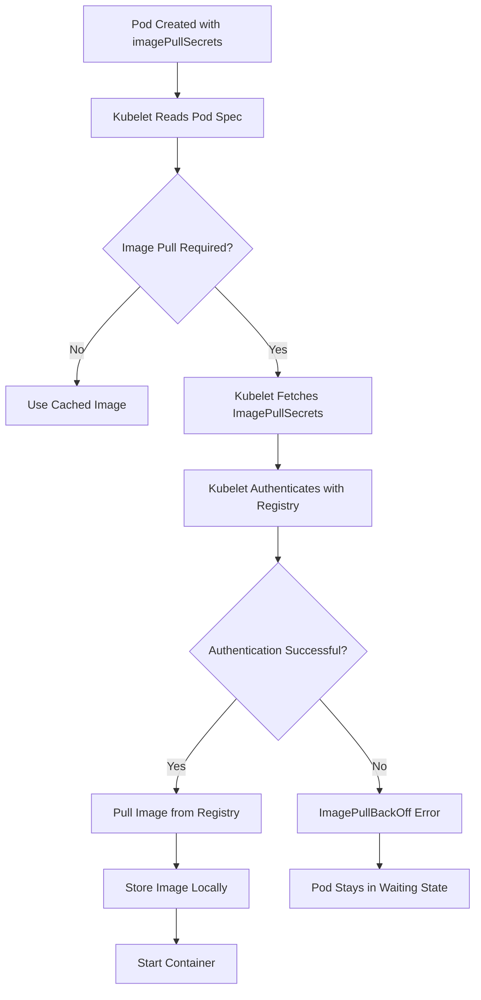

# ImagePullSecrets

ImagePullSecrets allow Kubernetes to authenticate with private container registries when pulling images for pods. They are essential for deploying workloads from private registries.

## What Are ImagePullSecrets?

ImagePullSecrets are Kubernetes Secrets of type `kubernetes.io/dockerconfigjson` that contain credentials for private container registries. When a pod references an ImagePullSecret, the kubelet uses the credentials to authenticate with the registry and pull the image.

### How ImagePullSecrets Work

1. A Secret of type `kubernetes.io/dockerconfigjson` is created with registry credentials.
2. The Secret is referenced by the pod's `imagePullSecrets` field.
3. When the kubelet needs to pull the container image, it uses the credentials from the referenced Secret.
4. The credentials are passed to the container runtime for authentication with the registry.

```yaml
apiVersion: v1
kind: Secret
metadata:
  name: regcred
  namespace: production
type: kubernetes.io/dockerconfigjson
data:
  .dockerconfigjson: eyJhdXRocyI6IHt9fQ==
```

```yaml
apiVersion: v1
kind: Pod
metadata:
  name: myapp
  namespace: production
spec:
  imagePullSecrets:
    - name: regcred
  containers:
    - name: app
      image: myregistry.example.com/myapp:1.0
```

## Creating ImagePullSecrets

### From a Docker Config File

The most common way to create an ImagePullSecret is from a Docker config file (`~/.docker/config.json`).

```bash
# Create a secret from Docker config
kubectl create secret docker-registry regcred \
  --docker-server=myregistry.example.com \
  --docker-username=myuser \
  --docker-password=mypassword \
  --docker-email=user@example.com \
  -n production
```

### From a Docker Config JSON File

```bash
# Create a secret from a Docker config file
kubectl create secret docker-registry regcred \
  --dockerconfigjson=/path/to/.docker/config.json \
  -n production
```

### Manually Creating a Secret

```bash
# Create the dockerconfigjson content
echo '{"auths":{"myregistry.example.com":{"username":"myuser","password":"mypassword","email":"user@example.com"}}}' > docker-config.json

# Create the secret from the file
kubectl create secret docker-registry regcred \
  --from-file=.dockerconfigjson=docker-config.json \
  -n production
```

### Verify the Secret

```bash
# Check the secret type
kubectl get secret regcred -n production -o jsonpath='{.type}'
# kubernetes.io/dockerconfigjson

# Decode the secret to see the credentials (base64)
kubectl get secret regcred -n production -o jsonpath='{.data.\.dockerconfigjson}' | base64 -d
```

## Using ImagePullSecrets at Different Levels

### Pod Level

The most common approach is to reference the secret at the pod level.

```yaml
spec:
  imagePullSecrets:
    - name: regcred
  containers:
    - name: app
      image: myregistry.example.com/myapp:1.0
```

### Service Account Level

Referencing the secret at the Service Account level means all pods using that Service Account will automatically have access to the registry credentials.

```bash
# Add the secret to the default Service Account
kubectl patch serviceaccount default -n production -p '{"imagePullSecrets": [{"name": "regcred"}]}'

# Verify the patch
kubectl get serviceaccount default -n production -o jsonpath='{.imagePullSecrets}'
```

```yaml
# Service Account with ImagePullSecrets
apiVersion: v1
kind: ServiceAccount
metadata:
  name: my-sa
  namespace: production
imagePullSecrets:
  - name: regcred
```

### Namespace Level (via ServiceAccount)

For all pods in a namespace to be able to pull images from a private registry, patch the default Service Account in that namespace.

```bash
# Patch the default Service Account in all namespaces
kubectl patch serviceaccount default -n production -p '{"imagePullSecrets": [{"name": "regcred"}]}'
```

## Multiple Registry Credentials

A pod can reference multiple ImagePullSecrets for different registries.

```yaml
spec:
  imagePullSecrets:
    - name: regcred-aws
    - name: regcred-gcp
    - name: regcred-dockerhub
  containers:
    - name: app
      image: myregistry.example.com/myapp:1.0
```

## Mermaid: ImagePullSecret Flow



## Best Practices

1. **Use Service Account-level secrets**: Patching the default Service Account ensures all pods in the namespace can pull images without per-pod configuration.
2. **Use dedicated Service Accounts**: Create a dedicated Service Account for workloads that need registry access, and patch only that Service Account.
3. **Rotate credentials regularly**: Update ImagePullSecrets when registry credentials are rotated.
4. **Use short-lived credentials**: Where possible, use temporary credentials (e.g., AWS IAM roles for service accounts) instead of static username/password.
5. **Restrict secret access**: Use RBAC to limit who can read ImagePullSecrets.
6. **Use `kubectl create secret docker-registry`**: This is the simplest and most reliable way to create registry secrets.
7. **Verify secret type**: Ensure the Secret is of type `kubernetes.io/dockerconfigjson`, not `Opaque`.

## Troubleshooting

- **`ImagePullBackOff`**: The kubelet cannot pull the image. Check `kubectl describe pod <name>` for the specific error message.
- **`ErrImagePull`**: The registry credentials are incorrect or the secret is not referenced correctly. Verify the secret exists and is referenced in the pod spec.
- **`unauthorized: authentication required`**: The registry credentials are invalid. Check the username, password, and server URL in the secret.
- **`manifest unknown`**: The image does not exist in the registry. Verify the image name and tag.
- **`secret not found`**: The ImagePullSecret does not exist in the pod's namespace. Create the secret in the correct namespace.
- **`no secrets match`**: The pod does not reference any ImagePullSecrets, or the secrets do not contain credentials for the registry. Check the pod's `imagePullSecrets` field.
- **`secret is not of type dockerconfigjson`**: The Secret is of type `Opaque` instead of `kubernetes.io/dockerconfigjson`. Recreate the secret with the correct type.

## Common Errors and Solutions

| Error | Cause | Solution |
|---|---|---|
| `ImagePullBackOff` | Invalid credentials or unreachable registry | Verify secret credentials and registry connectivity |
| `ErrImagePull` | Registry authentication failure | Check username/password and server URL |
| `unauthorized` | Invalid or expired credentials | Update the secret with new credentials |
| `manifest unknown` | Image tag does not exist | Verify the image tag in the registry |
| `secret not found` | Secret not in the pod's namespace | Create the secret in the correct namespace |
| `no secrets match` | Pod does not reference the secret | Add `imagePullSecrets` to the pod spec |

## Commands

```bash
# Create a docker-registry secret
kubectl create secret docker-registry regcred \
  --docker-server=myregistry.example.com \
  --docker-username=myuser \
  --docker-password=mypassword \
  --docker-email=user@example.com \
  -n production

# Verify the secret type
kubectl get secret regcred -n production -o jsonpath='{.type}'

# Decode the secret to verify credentials
kubectl get secret regcred -n production -o jsonpath='{.data.\.dockerconfigjson}' | base64 -d | jq

# Patch the default Service Account
kubectl patch serviceaccount default -n production -p '{"imagePullSecrets": [{"name": "regcred"}]}'

# Check pod events for image pull errors
kubectl describe pod myapp -n production | grep -A 5 'Events:'

# Check pod status
kubectl get pod myapp -n production -o wide

# Delete an ImagePullSecret
kubectl delete secret regcred -n production
```