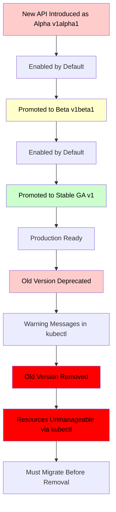

# API Version Deprecation and Migration

Kubernetes APIs evolve over time. Understanding the deprecation lifecycle and how to migrate resources between API versions is essential for maintaining cluster stability.

## API Version Lifecycle

Kubernetes promotes APIs through a well-defined lifecycle:

1. **Alpha**: Internal name `v1alpha1`. Not stable. May be removed without notice. Not enabled by default.
2. **Beta**: Internal name `v1beta1`. More stable. Enabled by default. May be deprecated in future releases.
3. **Stable (GA)**: Internal name `v1` (or `v1beta2`, `v1beta3` before reaching stable). Production-ready. Will not be removed for at least one full minor version after graduation.

### Timeline Example

```
v1.14  v1.15  v1.16  v1.17  v1.18  v1.19  v1.20  v1.21  v1.22  v1.23  v1.24  v1.25
  |      |      |      |      |      |      |      |      |      |      |
  |---- Beta (v1beta1) -----------------------------|
  |                                                    |---- GA (v1) ------->
  |                                                          |---- Deprecated -->|
  |                                                                    |---- Removed -->
```

> **Pitfall**: When an API version is removed, resources created with that version are no longer manageable by `kubectl`. This can cause cluster operations to fail.

## Identifying Deprecated APIs

### Check Available API Versions

```bash
# List all available API versions
kubectl api-versions

# Check if a specific API version is available
kubectl api-versions | grep apps/v1
```

### Check for Deprecated APIs in Manifests

```bash
# Check a manifest for deprecated APIs
kubectl apply --dry-run=server -f my-manifest.yaml 2>&1 | grep -i "deprecated\|deprecated"

# Use kubectl convert to check for deprecated APIs
kubectl convert -f my-manifest.yaml --output-version apps/v1
```

### Check Cluster API Resources

```bash
# List all resources with their API versions
kubectl get all -A -o json | jq -r '.items[] | .apiVersion + " " + .kind' | sort -u

# Find resources using deprecated API versions
kubectl get pods --all-namespaces -o json | jq -r '.items[] | select(.apiVersion != "v1") | .apiVersion + " " + .kind + " " + .metadata.name'
```

## Migration Pattern

### Step 1: Identify Deprecated APIs

```bash
# Check which API versions are available
kubectl api-versions

# Check for deprecated APIs in a manifest
kubectl apply --dry-run=server -f deployment.yaml
```

### Step 2: Update the YAML

Change the `apiVersion` field to the new version. Update any fields that have changed in the schema.

```yaml
# Before (deprecated)
apiVersion: extensions/v1beta1
kind: Deployment
metadata:
  name: myapp
spec:
  replicas: 3
  template:
    spec:
      containers:
        - name: app
          image: myapp:1.0

# After (current)
apiVersion: apps/v1
kind: Deployment
metadata:
  name: myapp
spec:
  replicas: 3
  selector:
    matchLabels:
      app: myapp
  template:
    metadata:
      labels:
        app: myapp
    spec:
      containers:
        - name: app
          image: myapp:1.0
```

> **Important**: When migrating from `extensions/v1beta1` or `apps/v1beta1` to `apps/v1`, you must add the `selector` field and `metadata.labels` to the pod template. These were optional in the beta versions but are required in `apps/v1`.

### Step 3: Apply the Updated Manifest

```bash
# Apply the updated manifest
kubectl apply -f deployment.yaml

# Verify the resource is using the new API version
kubectl get deployment myapp -o jsonpath='{.apiVersion}'
# apps/v1
```

### Step 4: Verify and Monitor

```bash
# Check for deprecation warnings
kubectl get deployment myapp

# Monitor events for migration issues
kubectl get events -n production --field-selector reason=FailedCreate
```

## Common API Migrations

| Old API Version | New API Version | Resource Type |
|---|---|---|
| `extensions/v1beta1` | `apps/v1` | Deployment, DaemonSet, ReplicaSet |
| `apps/v1beta1` | `apps/v1` | Deployment, DaemonSet, ReplicaSet |
| `apps/v1beta2` | `apps/v1` | Deployment, DaemonSet, ReplicaSet |
| `batch/v1beta1` | `batch/v1` | CronJob |
| `policy/v1beta1` | `policy/v1` | PodSecurityPolicy |
| `networking.k8s.io/v1beta1` | `networking.k8s.io/v1` | Ingress |
| `autoscaling/v2beta1` | `autoscaling/v2` | HorizontalPodAutoscaler |
| `autoscaling/v2beta2` | `autoscaling/v2` | HorizontalPodAutoscaler |
| `storage.k8s.io/v1beta1` | `storage.k8s.io/v1` | StorageClass |
| `admissionregistration.k8s.io/v1beta1` | `admissionregistration.k8s.io/v1` | ValidatingWebhookConfiguration, MutatingWebhookConfiguration |

## Using kubectl convert

`kubectl convert` can automatically migrate resources between API versions.

```bash
# Convert a manifest to apps/v1
kubectl convert -f deployment.yaml --output-version apps/v1 -o yaml > deployment-v1.yaml

# Convert all resources in a directory
kubectl convert -f ./manifests/ --output-version apps/v1 -o yaml > converted.yaml

# Convert a running resource
kubectl get deployment myapp -o yaml | kubectl convert --output-version apps/v1 -o yaml
```

> **Pitfall**: `kubectl convert` may not handle all schema changes correctly. Always review the converted output before applying.

## Mermaid: API Deprecation Lifecycle



## Best Practices

1. **Monitor deprecation warnings**: Check `kubectl` output for deprecation warnings regularly.
2. **Migrate before removal**: Plan migrations well before the removal version.
3. **Use `kubectl apply --dry-run=server`**: Validates manifests against the current API server.
4. **Automate migration checks**: Use tools like `pluto` or `kube-no-trouble` to scan for deprecated APIs.
5. **Keep manifests updated**: Regularly update manifests to use the latest stable API versions.
6. **Test migrations in non-production**: Always test API migrations in a staging environment first.
7. **Use `kubectl convert` with caution**: Review the converted output before applying.

## Troubleshooting

- **`the server could not find the requested resource`**: The API version has been removed from the cluster. Migrate to the current API version immediately.
- **`field is immutable`**: A field that was mutable in the old API version is immutable in the new version. You must delete and recreate the resource.
- **`required field not found`**: The new API version requires fields that were optional in the old version (e.g., `selector` in `apps/v1` Deployments).
- **`no matches for kind`**: The CRD or resource type may have been removed or renamed. Check `kubectl api-resources`.
- **`conversion not supported`**: The API server cannot convert between the requested versions. The target version may not be served.

## Tools for API Migration

### pluto
`pluto` is a CLI tool that detects deprecated Kubernetes API versions in YAML files.

```bash
# Install pluto
brew install pluto

# Check a directory for deprecated APIs
pluto detect .

# Check a specific file
pluto detect -f deployment.yaml
```

### kube-no-trouble
`kube-no-trouble` (formerly `kubent`) checks clusters for deprecated APIs.

```bash
# Install kube-no-trouble
brew install kube-no-trouble

# Check the cluster for deprecated APIs
kubent

# Check a manifest file
kubent deployment.yaml
```

## Commands

```bash
# List all API versions
kubectl api-versions

# Check for deprecated APIs in a manifest
kubectl apply --dry-run=server -f deployment.yaml

# Convert a manifest to a new API version
kubectl convert -f deployment.yaml --output-version apps/v1 -o yaml

# Get the API version of a resource
kubectl get deployment myapp -o jsonpath='{.apiVersion}'

# Get all resources and their API versions
kubectl get all -A -o json | jq -r '.items[] | .apiVersion + " " + .kind' | sort -u

# Check API resources
kubectl api-resources --verbs=list --namespaced -o name | xargs -n1 kubectl get --show-kind --ignore-not-found -A
```