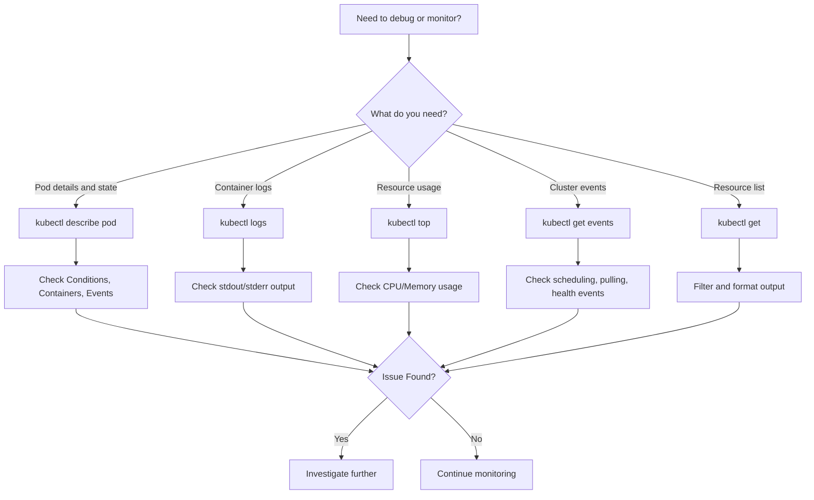

# Observability Tools

Kubernetes provides several built-in tools for observing cluster state, pod health, and resource usage. These tools are essential for debugging and monitoring workloads.

## kubectl describe

`kubectl describe` aggregates detailed information about a resource, including its spec, status, conditions, events, and container states.

### Key Sections

- **Conditions**: The current state of the pod (e.g., `PodScheduled`, `Initialized`, `Ready`, `ContainersReady`).
- **Containers**: The state of each container (waiting, running, terminated).
- **Events**: A chronological list of events that occurred during the pod's lifecycle.

```bash
# Describe a pod
kubectl describe pod myapp-abc123 -n production

# Describe a node
kubectl describe node worker-1

# Describe a service
kubectl describe service myapp-service -n production

# Describe a deployment
kubectl describe deployment myapp -n production
```

### Understanding Pod Conditions

| Condition | Description |
|---|---|
| `PodScheduled` | The pod has been scheduled onto a node |
| `Initialized` | All init containers have completed |
| `Ready` | The pod is ready to serve traffic |
| `ContainersReady` | All containers are ready |

### Understanding Container States

| State | Description |
|---|---|
| `Waiting` | The container is not yet running (e.g., `CrashLoopBackOff`, `ImagePullBackOff`) |
| `Running` | The container is executing |
| `Terminated` | The container has exited |

```bash
# Check container state
kubectl describe pod myapp-abc123 -n production | grep -A 10 'State:'

# Check why a container is waiting
kubectl describe pod myapp-abc123 -n production | grep -A 5 'Reason:'
```

## kubectl logs

`kubectl logs` retrieves the text logs from stdout/stderr of containers.

```bash
# Get current logs
kubectl logs myapp-pod-abc123 -n production

# Get logs from a previous crashed container instance
kubectl logs myapp-pod-abc123 -n production -p

# Stream logs in real-time
kubectl logs myapp-pod-abc123 -n production -f

# Get logs from a specific container
kubectl logs myapp-pod-abc123 -n production -c app-container

# Get logs since a specific time
kubectl logs myapp-pod-abc123 -n production --since=1h

# Get the last N lines
kubectl logs myapp-pod-abc123 -n production --tail=100
```

> **Pitfall**: `kubectl logs -p` only retrieves logs from the most recent previous container instance. If the container has been restarted multiple times, older log instances are lost due to log rotation.

## kubectl top

`kubectl top` displays resource usage (CPU and memory) for nodes and pods. It requires the `metrics-server` to be installed and running in the cluster.

```bash
# Check if metrics-server is running
kubectl get deployment metrics-server -n kube-system

# Get node resource usage
kubectl top nodes

# Get pod resource usage
kubectl top pods -n production

# Get resource usage sorted by memory
kubectl top pods -n production --sort-by=memory

# Get resource usage for a specific pod
kubectl top pod myapp-abc123 -n production
```

### metrics-server Installation

```bash
# Install metrics-server
kubectl apply -f https://github.com/kubernetes-sigs/metrics-server/releases/latest/download/components.yaml

# Verify metrics-server is working
kubectl top nodes
```

> **Pitfall**: `kubectl top` may return no data if `metrics-server` is not installed or if the API server cannot scrape metrics from the kubelets. Check `kubectl logs -n kube-system deployment/metrics-server` for errors.

## kubectl events

`kubectl get events` shows cluster-level events, which are records of things that happen in the cluster (e.g., pod scheduling, image pulls, health check failures).

```bash
# Get all events sorted by timestamp
kubectl get events --sort-by='.metadata.creationTimestamp'

# Get events for a specific namespace
kubectl get events -n production

# Get events for a specific pod
kubectl get events -n production --field-selector involvedObject.name=myapp-abc123

# Get events with a specific reason
kubectl get events -n production --field-selector reason=FailedCreate

# Watch events in real-time
kubectl get events -n production -w
```

### Event Types

| Type | Description |
|---|---|
| `Normal` | Normal operation (e.g., `Scheduled`, `Pulled`, `Created`) |
| `Warning` | Something unexpected happened (e.g., `Failed`, `BackOff`, `Unhealthy`) |

### Understanding Events

Events are objects with a `reason`, `message`, `type`, and `involvedObject`. They are emitted by various Kubernetes components (kubelet, scheduler, controller manager).

```bash
# Get events in JSON format for detailed inspection
kubectl get events -n production -o json | jq '.items[] | {reason, message, type, involvedObject}'

# Get the last 10 events
kubectl get events -n production --sort-by='.metadata.creationTimestamp' | tail -10
```

## kubectl get with Output Formats

`kubectl get` supports multiple output formats for different use cases.

```bash
# Wide output (includes node name, etc.)
kubectl get pods -n production -o wide

# YAML output
kubectl get pods -n production -o yaml

# JSON output
kubectl get pods -n production -o json

# Custom columns
kubectl get pods -n production -o custom-columns=NAME:.metadata.name,STATUS:.status.phase,NODE:.spec.nodeName

# JSONPath output
kubectl get pods -n production -o jsonpath='{.items[*].metadata.name}'

# Go template output
kubectl get pods -n production -o template --template='{{range .items}}{{.metadata.name}}{{"\n"}}{{end}}'
```

## Mermaid: Observability Tool Decision Flow



## Best Practices

1. **Use `kubectl describe` first**: It provides the most comprehensive view of a resource's state and recent events.
2. **Use `-p` flag for crashed containers**: `kubectl logs -p` retrieves logs from the previous container instance.
3. **Monitor events proactively**: Events provide early warning of issues like failed image pulls or scheduling failures.
4. **Install metrics-server**: Required for `kubectl top` to work.
5. **Use `-o json` for scripting**: JSON output is easier to parse programmatically than text output.
6. **Use custom columns for readability**: `kubectl get -o custom-columns` shows only the fields you care about.
7. **Combine tools**: Use `kubectl describe` to find the pod name, then `kubectl logs` to check the logs, then `kubectl top` to check resource usage.

## Troubleshooting

- **`kubectl top` shows no data**: `metrics-server` is not installed or not working. Check `kubectl get deployment metrics-server -n kube-system`.
- **`kubectl describe` shows no events**: The resource may not have any events yet, or the event TTL has expired. Events are retained for 1 hour by default.
- **`kubectl logs` returns nothing**: The container may not have started yet, or it may be writing to a file instead of stdout/stderr.
- **`kubectl logs -p` returns nothing**: The previous container instance may have been rotated and deleted.
- **Events show `FailedCreate`**: The controller is failing to create resources. Check RBAC permissions and resource quotas.
- **Events show `FailedScheduling`**: The scheduler cannot find a node for the pod. Check node resources, taints, and tolerations.
- **Events show `ImagePullBackOff`**: The image cannot be pulled. Check the image name, tag, and registry credentials.

## Commands

```bash
# Describe a pod (comprehensive overview)
kubectl describe pod myapp-abc123 -n production

# Get logs from current container
kubectl logs myapp-abc123 -n production

# Get logs from previous container instance
kubectl logs myapp-abc123 -n production -p

# Stream logs
kubectl logs myapp-abc123 -n production -f

# Get resource usage
kubectl top nodes
kubectl top pods -n production

# Get events sorted by time
kubectl get events -n production --sort-by='.metadata.creationTimestamp'

# Get events for a specific pod
kubectl get events -n production --field-selector involvedObject.name=myapp-abc123

# Get pod names only
kubectl get pods -n production -o jsonpath='{.items[*].metadata.name}'

# Get pod status and node
kubectl get pods -n production -o custom-columns=NAME:.metadata.name,STATUS:.status.phase,NODE:.spec.nodeName
```