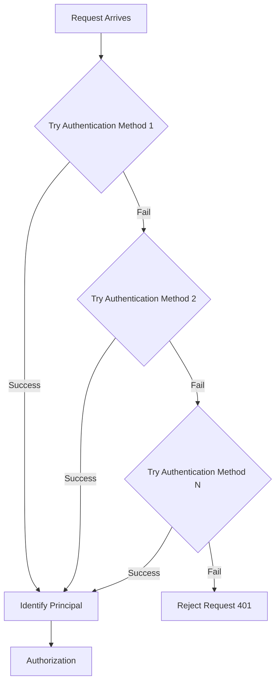
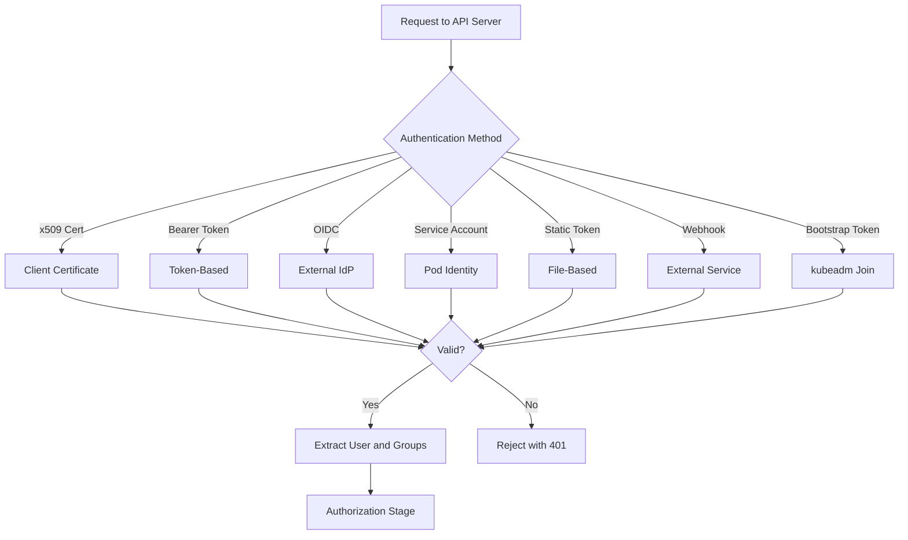

# Authentication Mechanisms

Authentication is the first stage of the Kubernetes API server request pipeline. It identifies the principal (user or service account) making the request. Kubernetes does not manage native user objects; it relies on external identity providers.

## How Authentication Works

The API server receives a request and attempts to identify the principal using one of several authentication mechanisms. If authentication succeeds, the request is associated with a user identity and any groups the user belongs to.

### Authentication Flow



## Authentication Methods

### x509 Client Certificates

The API server authenticates requests using client certificates presented by the user or application.

```bash
# Generate a client certificate
openssl req -new -key user.key -out user.csr -subj "/CN=admin/O=system:masters"
openssl x509 -req -in user.csr -CA ca.crt -CAkey ca.key -CAcreateserial -out user.crt -days 365

# Use the certificate with kubectl
kubectl --client-certificate=user.crt --client-key=user.key --certificate-authority=ca.crt get pods
```

- The `CN` (Common Name) becomes the username.
- The `O` (Organization) becomes the group name(s).
- This is commonly used for cluster admin access (`O=system:masters` maps to the `cluster-admin` ClusterRole).

> **Best practice**: Use x509 certificates for machine-to-machine authentication (e.g., CI/CD systems, monitoring agents). They provide strong cryptographic authentication.

### Bearer Tokens

Bearer tokens are used for authenticating API requests. They are passed in the `Authorization: Bearer <token>` header.

```bash
# Use a bearer token with kubectl
kubectl --token=<token> get pods
```

Bearer tokens can be:
- Service account tokens
- Static tokens configured on the API server
- Tokens issued by an external identity provider

> **Pitfall**: Bearer tokens are long-lived credentials. If a token is leaked, it provides access until it is revoked. Prefer short-lived tokens or OIDC tokens for human users.

### OpenID Connect (OIDC)

OIDC allows users to authenticate using an external identity provider (IdP) such as Google, Okta, Azure AD, or Keycloak.

```yaml
# API server configuration
--oidc-issuer-url=https://accounts.google.com
--oidc-client-id=kubernetes
--oidc-username-claim=email
--oidc-groups-claim=groups
```

```bash
# Authenticate with OIDC
kubectl config set-credentials my-user \
  --auth-provider=oidc \
  --auth-provider-arg=idp-issuer-url=https://accounts.google.com \
  --auth-provider-arg=client-id=kubernetes \
  --auth-provider-arg=refresh-token=<refresh_token>
```

- The IdP issues an ID token and optionally an access token.
- The API server validates the ID token against the IdP's public keys.
- The `oidc-username-claim` maps the token's claim to the Kubernetes username.
- The `oidc-groups-claim` maps the token's claim to Kubernetes groups.

> **Community knowledge**: OIDC is the recommended authentication method for human users in production clusters. It integrates with existing identity providers and supports single sign-on (SSO).

### Service Account Tokens

Service accounts are Kubernetes-managed identities for pods to communicate with the API server. Each namespace has a `default` service account.

```yaml
apiVersion: v1
kind: Pod
metadata:
  name: myapp
spec:
  serviceAccountName: my-service-account
  containers:
    - name: app
      image: myapp:1.0
```

```bash
# Get the service account token
kubectl get serviceaccount my-service-account -n production -o jsonpath='{.secrets[0].name}'
kubectl get secret <secret-name> -n production -o jsonpath='{.data.token}' | base64 -d

# Use the token
kubectl --token=<token> get pods -n production
```

> **Best practice**: Use dedicated service accounts for applications instead of the `default` service account. This allows fine-grained RBAC control.

### Static Tokens

Static tokens are defined in a file on the API server and are used for authenticating specific users.

```yaml
# /etc/kubernetes/tokens.csv
admin,admin,system:masters
```

```bash
# API server flag
--token-auth-file=/etc/kubernetes/tokens.csv
```

> **Pitfall**: Static tokens are not rotated automatically. They should be used only for short-lived or internal components, not for long-term human access.

### Webhook Authentication

An external HTTP service authenticates requests by examining the token and returning the user identity.

```yaml
apiVersion: v1
kind: ConfigMap
metadata:
  name: webhook-token-authenticator
  namespace: kube-system
data:
  config.yaml: |
    apiVersion: v1
    kind: Config
    clusters:
    - cluster:
        certFile: /etc/webhook/ca.crt
        server: https://webhook.example.com/authenticate
      name: webhook
    users:
    - name: webhook
      user:
        token: <webhook-token>
```

```bash
# API server flag
--authentication-token-webhook-config-file=/etc/kubernetes/webhook-config.yaml
```

### Bootstrap Tokens

Bootstrap tokens are used to authenticate nodes during the `kubeadm join` process. They are time-limited and single-use.

```bash
# Create a bootstrap token
kubeadm token create --ttl 24h

# List bootstrap tokens
kubeadm token list

# Delete a bootstrap token
kubeadm token delete <token-id>
```

## Service Accounts in Detail

### Default Service Account

Every namespace has a `default` service account. Pods that do not specify a `serviceAccountName` use the `default` service account.

### Automounting Service Account Tokens

By default, service account tokens are automatically mounted into pods at `/var/run/secrets/kubernetes.io/serviceaccount/`.

```yaml
spec:
  automountServiceAccountToken: false
```

> **Best practice**: Disable automounting for pods that do not need to communicate with the API server. This reduces the attack surface.

### Custom Service Accounts

```yaml
apiVersion: v1
kind: ServiceAccount
metadata:
  name: app-sa
  namespace: production
```

```bash
# Create a service account
kubectl create serviceaccount app-sa -n production

# Get the service account token
kubectl get serviceaccount app-sa -n production -o jsonpath='{.secrets[0].name}'

# Delete a service account
kubectl delete serviceaccount app-sa -n production
```

## Mermaid: Authentication Methods Comparison



## Best Practices

1. **Use OIDC for human users**: Integrates with existing identity providers and supports SSO.
2. **Use x509 certificates for machines**: Strong cryptographic authentication for CI/CD and automation.
3. **Use dedicated service accounts**: Never use the `default` service account for applications.
4. **Disable automounting for non-API pods**: Reduces the attack surface.
5. **Rotate tokens regularly**: Use short-lived tokens or webhook-based token rotation.
6. **Use RBAC with service accounts**: Bind specific roles to service accounts for least-privilege access.
7. **Audit authentication events**: Monitor for failed authentication attempts.

## Troubleshooting

- **`x509: certificate signed by unknown authority`**: The CA certificate is not trusted. Check `--certificate-authority` in the kubectl config.
- **`client certificate required`**: No client certificate was provided. Check kubectl configuration for `client-certificate` and `client-key`.
- **`token expired`**: The bearer token or OIDC token has expired. Re-authenticate or refresh the token.
- **`service account token not found`**: The service account may not have a secret. Create one or use `kubectl create token`.
- **`authentication failed`**: The authentication method may not be configured correctly on the API server. Check the API server logs.
- **OIDC token not validated**: The API server may not be able to reach the IdP's JWKS endpoint. Check network connectivity and the `--oidc-issuer-url` configuration.

## Commands

```bash
# Authenticate with x509 certificates
kubectl --client-certificate=user.crt --client-key=user.key --certificate-authority=ca.crt get pods

# Authenticate with a bearer token
kubectl --token=<token> get pods

# Authenticate with OIDC
kubectl config set-credentials my-user --auth-provider=oidc

# Get the current user identity
kubectl config view --minify --output 'jsonpath={.users[0].name}'

# Check service account tokens
kubectl get serviceaccounts -n production -o jsonpath='{.items[*].metadata.name}'

# Create a service account token (K8s 1.24+)
kubectl create token my-service-account -n production --duration=1h

# Create a bootstrap token
kubeadm token create --ttl 24h

# List bootstrap tokens
kubeadm token list
```