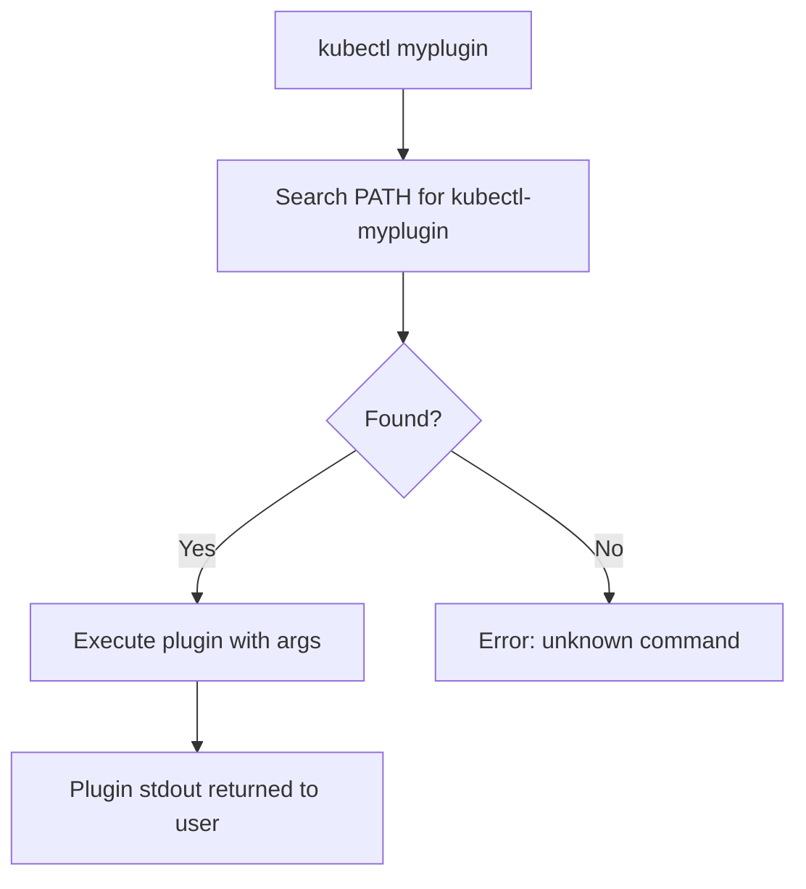

# Plugins - In-Depth Mechanics

Kubernetes functionality is extended through a layered plugin architecture. Understanding each layer, its common implementations, and trade-offs is essential for designing and troubleshooting clusters.

## Plugin Taxonomy

| Layer | Plugin Type | Purpose | Configured Via |
|---|---|---|---|
| Networking | CNI | Pod network setup, IP assignment, policy enforcement | ConfigMap + DaemonSet |
| Storage | CSI / In-tree | Volume provisioning, attaching, mounting | StorageClass + Driver DaemonSet/Deployment |
| Admission | Webhook / Built-in | Validate or mutate objects before persistence | WebhookConfiguration / API server flags |
| Auth | Token / Exec / OIDC | Authenticate users and service accounts | kubeconfig, ServiceAccount, API server flags |
| Scheduler | Framework plugins | Filter and score nodes during pod scheduling | KubeSchedulerConfiguration / feature gates |
| kubectl CLI | kubectl-<name> | Extend `kubectl` with custom subcommands | Executable in `PATH` |
| DNS | CoreDNS plugins | Service discovery, cluster-aware resolution | Corefile ConfigMap |

---

## 1. CNI (Container Network Interface) Plugins

CNI plugins configure pod networking. They run as a DaemonSet or host process and are invoked by the kubelet for each pod.

### Commonly Adopted Variants

| Plugin | Environment | Use At a Glance |
|---|---|---|
| **Calico** | Medium to large clusters, strict network policy needs | BGP-based routing, full NetworkPolicy support, performance-focused; ideal for production multi-tenant clusters |
| **Cilium** | Large clusters, eBPF-optimized environments | Uses eBPF for routing and policy, Hubble observability, rich L7 policies; best for cloud-native, high-scale environments |
| **Weave Net** | Small to medium clusters, quick setup | Simple install, built-in encryption, but higher overhead; good for dev/test or small production |
| **Flannel** | Small to medium clusters, minimal requirements | Simple overlay network (VXLAN/host-gw), no NetworkPolicy enforcement; suited for basic networking where policies are not required |
| **Antrea** | VMware/Kubernetes environments | OVS-based, Layer 2/3 firewalling, bandwidth control; fits well in VMware-centric stacks |

### Resolution & Lifecycle

1. The kubelet calls the CNI plugin binary for every pod sandbox creation.
2. The plugin assigns an IP from its pool and configures interfaces (veth pairs, cni0 bridge).
3. NetworkPolicy enforcement depends entirely on the CNI plugin — Flannel does not enforce policies; Calico, Cilium, and Antrea do.

---

## 2. Storage Plugins

### 2.1 CSI (Container Storage Interface) Drivers

CSI is the modern, vendor-neutral standard for exposing storage systems to Kubernetes.

| Driver / Plugin | Environment | Use At a Glance |
|---|---|---|
| **aws-ebs.csi.aws.com** | AWS | Block storage (gp2, gp3, io1); widely used; latency-sensitive stateful workloads |
| **disk.csi.azure.com** | Azure | Managed Disks (Standard, Premium, Ultra); Azure-native workloads |
| **pd.csi.storage.g8s.io** | GCP | Persistent Disk (PD); balanced price/performance on GCP |
| **csi.vsphere.vmware.com** | vSphere | vSphere CSI; integrates with vCenter and storage profiles; on-prem VMware clusters |
| **topolvm.io** | Any | CSI + Capacity-aware scheduling; dynamic local PVs using LVMs; suited for stateful apps needing fast local storage |
| **longhorn.io** | Any | Distributed block storage; self-healing, live migration; good for edge, dev, or bare-metal environments |

### 2.2 In-Tree Plugins (Deprecated)

| Plugin | Status | Replacement |
|---|---|---|
| `kubernetes.io/aws-ebs` | Deprecated | `ebs.csi.aws.com` |
| `kubernetes.io/gce-pd` | Deprecated | `pd.csi.storage.g8s.io` |
| `kubernetes.io/azure-disk` | Deprecated | `disk.csi.azure.com` |
| `kubernetes.io/cinder` | Deprecated | `cinder.csi.openstack.org` |

> **Pitfall**: In-tree plugins are removed from newer Kubernetes versions. Always prefer CSI drivers and enable CSI migration when upgrading clusters.

---

## 3. Admission Plugins

Admission plugins intercept API requests before persistence. They can validate (reject), mutate (modify), or both.

### Built-in Admission Plugins

| Plugin | Type | Environment | Use At a Glance |
|---|---|---|---|
| `NamespaceLifecycle` | Validate | All | Prevents operations on terminating namespaces; always enabled |
| `LimitRanger` | Mutate / Validate | All | Enforces default requests/limits from LimitRange; essential for multi-tenant namespaces |
| `ServiceAccount` | Mutate | All | Auto-injects ServiceAccount tokens into pods; always enabled |
| `NodeRestriction` | Validate | All | Restricts kubelet to modifying its own node objects; production security best practice |
| `PodSecurity` | Validate / Admit | All | Enforces Pod Security Standards (privileged, baseline, restricted); replaces the deprecated PodSecurityPolicy |
| `ResourceQuota` | Validate | All | Enforces namespace ResourceQuotas; required for quota-limiting environments |
| `PersistentVolumeClaim` | Validate | All | Only allows PVC claims to volumes in the same namespace |

### Webhook Admission Plugins

| Pattern | Use At a Glance |
|---|---|
| **ValidatingWebhook** | Reject invalid configurations (e.g., blocking privileged pods, enforcing label policies). Runs after built-in validation. |
| **MutatingWebhook** | Modify requests before persistence (e.g., inject sidecars, rewrite image registries, add default env vars). |

---

## 4. Authentication Plugins

Authentication plugins determine *who* the client is.

| Plugin | Environment | Use At a Glance |
|---|---|---|
| **x509 client certificates** | Static ops, legacy | Long-lived certificates; high trust; suitable for CI/CD service accounts but hard to rotate at scale |
| **Bearer tokens (ServiceAccount)** | All workloads | Default pod identity; short-lived, auto-rotated; standard for in-cluster workloads |
| **OIDC (e.g., Dex, Keycloak)** | SSO, multi-cluster | Single sign-on, group sync, short-lived tokens; ideal for developer access across clusters |
| **Exec-based plugins** | Cloud / Enterprise | Delegates auth to external binaries (e.g., `aws-iam-authenticator`, `gke-gcloud-auth-plugin`); common in managed Kubernetes |

---

## 5. Scheduler Plugins

The scheduler framework uses plugins to filter and score nodes.

| Plugin | Type | Environment | Use At a Glance |
|---|---|---|---|
| `NodeResourcesFit` | Filter / Score | All | Ensures pod requests fit within node allocatable; baseline scheduling |
| `NodeNameUnschedulable` | Filter | All | Skips nodes marked as unschedulable (`--register-with-taints`) |
| `InterPodAffinity` | Filter / Score | Pod-density environments | Spreads / packs pods based on affinity/anti-affinity rules |
| `VolumeBinding` | Filter | Stateful workloads | Delays binding until PV is available; required for `WaitForFirstConsumer` |
| `NodeAffinity` | Filter / Score | Mixed-instance clusters | Respects pod/node affinity rules for workload placement |
| `TaintToleration` | Filter | All | Honors taints and tolerations; keeps pods off restricted nodes |

---

## 6. CoreDNS Plugins

CoreDNS resolves service names inside the cluster. Its behavior is driven by plugins configured in the Corefile.

| Plugin | Environment | Use At a Glance |
|---|---|---|
| `kubernetes` | All clusters | Core cluster DNS; resolves `service.namespace.svc.cluster.local`; always active |
| `cache` | All clusters | TTL-based response caching; reduces API server load |
| `forward` | Egress-heavy clusters | Forwards unresolved queries to upstream DNS (e.g., `/etc/resolv.conf` or custom resolvers) |
| `rewrite` | Multi-cluster, service mesh | Rewrites DNS names for canary testing or cross-cluster routing |
| `template` | Custom domains | Generates dynamic answers from a template; used for custom split-horizon DNS |
| `external` | ExternalName Services | Handles `ExternalName` service CNAME resolution |

---

## 7. kubectl CLI Plugins

`kubectl` plugins are standalone executables named `kubectl-<name>` that extend `kubectl` with custom subcommands.

| Plugin | Use At a Glance |
|---|---|
| `ctx` / `kubectx` | Quickly switch between cluster contexts (e.g., dev, staging, prod) |
| `ns` / `kubens` | Switch namespaces in one command; avoids typos in `-n` flags |
| `neat` | Clean verbose `kubectl get -o yaml` output into minimal, readable YAML |
| `tree` | Visualize resource hierarchy (Deployment → ReplicaSet → Pod) |
| `stern` | Tail logs from multiple pods with color-coded output and regex filtering |
| `whoami` | Show the currently authenticated subject (user or group) |
| `images` | List all container images running across namespaces |
| `krew` | Plugin manager for kubectl; installs, upgrades, and indexes plugins |

> **Note**: kubectl plugins are not part of the official CKAD curriculum. They are included here as practical developer tooling.

## How kubectl Plugins Work

When you run `kubectl <name>`, kubectl searches your `PATH` for an executable named `kubectl-<name>`. The first match wins. This allows you to extend kubectl with custom subcommands without modifying the kubectl binary itself.



## Resolution Rules

- Resolution is **PATH-based** and **naming-convention-based** (`kubectl-<name>`).
- The first match in `PATH` wins. `kubectl plugin list` warns about duplicates and non-executable files.
- Custom plugins are any executable in `PATH` with the `kubectl-` prefix.

## Build a Custom Plugin

A custom plugin is any executable named `kubectl-<name>` in your `PATH`.

```bash
#!/bin/bash
# Example: kubectl-hello plugin
# Save as ~/.local/bin/kubectl-hello and make executable

echo "Hello from custom kubectl plugin!"
```

```bash
# Make it executable
chmod +x ~/.local/bin/kubectl-hello

# Use it
kubectl hello
```
