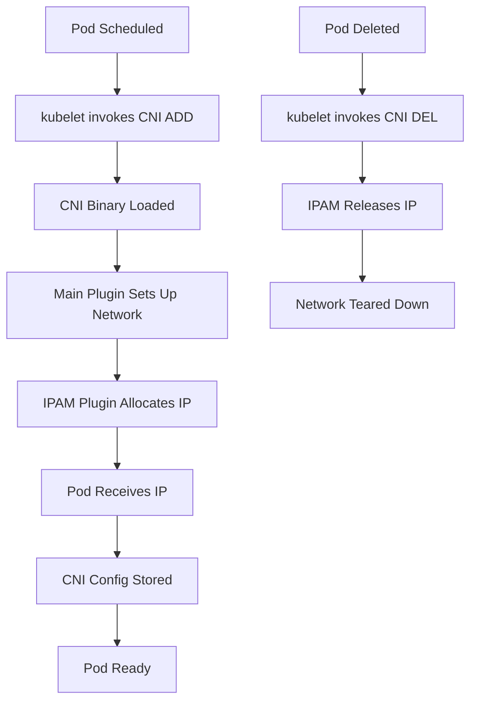
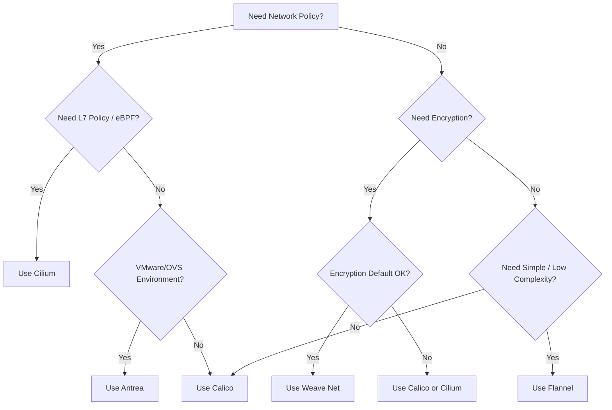

# CNI Network Plugins

Container Network Interface (CNI) plugins are responsible for pod networking in Kubernetes. They configure network interfaces, assign IP addresses, and enforce network policies. The CNI specification defines a simple plugin model: each plugin performs a single function (e.g., IPAM, network setup, policy enforcement).

## CNI Plugin Types

CNI plugins fall into three categories:

1. **Main plugins**: Perform the primary network setup (e.g., bridge, macvlan, ipvlan, host-device).
2. **IPAM plugins**: Manage IP address allocation (e.g., host-local, dhcp, static).
3. **Meta plugins**: Chain other plugins or modify requests (e.g., flannel, port-mapper, tuning).

## How CNI Works

When a pod is scheduled, the kubelet invokes the CNI binary with configuration from `/etc/cni/net.d/`. The CNI plugin sets up the veth pair, configures the bridge (or other network interface), and assigns an IP to the pod's network namespace.



## Common CNI Plugins

### Calico

Calico provides networking and network policy for Kubernetes. It supports both BGP routing (for native L3 routing) and VXLAN/IP-in-IP encapsulation (for overlay networks).

**Key characteristics:**
- Supports BGP for L3 routing (no overlay required)
- Enforces network policies using iptables (Linux) or eBPF (newer versions)
- Uses `calico-ipam` for IP address management
- Compatible with most cloud and on-premises environments
- Felix is the agent running on each node that programs routes and policies

**Installation:**

```bash
# Using manifest
kubectl apply -f https://projectcalico.docs.tigera.io/manifests/calico.yaml

# Using operator (recommended for eBPF dataplane)
kubectl apply -f https://projectcalico.docs.tigera.io/operator/v1/manifests/tigera-operator.yaml
kubectl apply -f https://projectcalico.docs.tigera.io/operator/v1/manifests/custom-resources.yaml
```

**Example CNI config:**

```json
{
  "name": "k8s-calico",
  "cniVersion": "0.3.1",
  "type": "calico",
  "log_level": "info",
  "log_file_path": "/var/log/calico/cni/cni.log",
  "ipam": {
    "type": "calico-ipam"
  },
  "policy": {
    "type": "k8s"
  },
  "kubernetes": {
    "kubeconfig": "/etc/cni/net.d/calico.conf"
  }
}
```

**When to use:**
- Large clusters requiring high-performance networking
- Environments where BGP routing is preferred over overlay
- Advanced network policy requirements
- Multi-cluster or hybrid-cloud deployments

### Cilium

Cilium is an eBPF-based CNI plugin that provides high-performance networking, security, and observability. It replaces iptables with eBPF programs running in the Linux kernel.

**Key characteristics:**
- eBPF-based data plane (no iptables chains, no conntrack limitations)
- Native network policies using CiliumNetworkPolicy (beyond Kubernetes NetworkPolicy)
- Hubble for flow-based observability
- Built-in service mesh (L7 policies, traffic metrics, mutual TLS)
- Supports multiple overlay modes: VXLAN, Geneve, native routing
- Integrates with CiliumEnvoyConfig for Envoy proxy configuration

**Installation:**

```bash
# Using helm
helm repo add cilium https://helm.cilium.io/
helm install cilium cilium/cilium \
  --namespace kube-system \
  --set ipam.mode=kubernetes

# Using cilium CLI
cilium install
```

**Example CiliumNetworkPolicy:**

```yaml
apiVersion: cilium.io/v2
kind: CiliumNetworkPolicy
metadata:
  name: allow-frontend-to-backend
spec:
  endpointSelector:
    matchLabels:
      app: backend
  ingress:
    - fromEndpoints:
        - matchLabels:
            app: frontend
      toPorts:
        - ports:
            - port: "8080"
              protocol: TCP
```

**When to use:**
- High-performance requirements with eBPF acceleration
- L7-aware network policies and service mesh integration
- Need for deep observability (Hubble)
- Kernel 4.9.17+ or newer

### Flannel

Flannel is a simple overlay network CNI plugin designed for ease of use. It provides a flat network across all nodes using VXLAN, host-gw, or UDP encapsulation.

**Key characteristics:**
- Very simple to deploy and operate
- Supports multiple backends: VXLAN (default), host-gw, UDP, wireguard (encryption)
- Uses a distributed key-value store (etcd or Kubernetes API) to store subnet assignments
- Does **not** support network policies (relies on other tools like Calico for policy)
- Allocates a /24 subnet per node from a larger /16

**Installation:**

```bash
# Apply manifest
kubectl apply -f https://raw.githubusercontent.com/flannel-io/flannel/master/Documentation/kube-flannel.yml

# With wireguard encryption
kubectl apply -f https://raw.githubusercontent.com/flannel-io/flannel/master/Documentation/kube-flannel-wg.yml
```

**Example ConfigMap:**

```yaml
apiVersion: v1
kind: ConfigMap
metadata:
  name: kube-flannel-cfg
  namespace: kube-flannel
data:
  cni-conf.json: |
    {
      "name": "cbr0",
      "cniVersion": "0.3.1",
      "plugins": [
        {
          "type": "flannel",
          "delegate": {
            "hairpinMode": true,
            "isDefaultGateway": true
          }
        }
      ]
    }
  net-conf.json: |
    {
      "Network": "10.244.0.0/16",
      "Backend": {
        "Type": "vxlan"
      }
    }
```

**When to use:**
- Simple, flat networking without complex policy requirements
- Quick lab or development environments
- When paired with another CNI that provides policy (e.g., Calico for policy + Flannel for networking)

### Weave Net

Weave Net creates a virtual network connecting Docker containers, Kubernetes pods, and other services. It encrypts traffic by default and provides a simple topology.

**Key characteristics:**
- Encrypts all traffic by default (IPsec)
- Fast failover with router peers
- Supports network policies (using iptables)
- Uses Weave Net's own IPAM (or host-local)
- Includes Weave Scope for visual topology
- Peer-to-peer architecture (no central controller required)

**Installation:**

```bash
# Apply manifest
kubectl apply -f https://cloud.weave.works/k8s/net?k8s-version=$(kubectl version | base64 | tr -d '\n')

# With encryption
kubectl apply -f "https://cloud.weave.works/k8s/net?k8s-version=$(kubectl version | base64 | tr -d '\n')&password-secret=weave-password"
```

**Example:**

```bash
# Enable encryption
kubectl create secret generic weave-passwd \
  --from-literal=weave-passwd="my-password" \
  -n kube-system

kubectl apply -f "https://cloud.weave.works/k8s/net?k8s-version=$(kubectl version | base64 | tr -d '\n')&password-secret=weave-passwd"
```

**When to use:**
- Environments requiring encrypted pod-to-pod traffic out of the box
- When visual topology (Weave Scope) is helpful
- Multi-cloud or hybrid networking scenarios

### Antrea

Antrea is an Open vSwitch (OVS)-based CNI plugin originally developed by VMware. It uses OVS for packet forwarding and provides advanced networking and security features.

**Key characteristics:**
- Open vSwitch-based data plane
- Supports both overlay (VXLAN/Geneve) and no-overlay (routed) modes
- Network policy enforcement (Kubernetes NetworkPolicy + Antrea-native policies)
- Flow-based visibility with Antrea Flow Exporter
- Supports IPFIX, traffic control, bandwidth management
- Windows node support
- NSX lineage with consistent feature set

**Installation:**

```bash
# Using helm
helm repo add antrea https://antrea-io.github.io/antrea/
helm install antrea antrea/antrea -n kube-system

# Using kubectl
kubectl apply -f https://github.com/antrea-io/antrea/releases/download/v1.0.0/antrea.yml
```

**Example Antrea-native policy:**

```yaml
apiVersion: crd.antrea.io/v1alpha1
kind: ClusterNetworkPolicy
metadata:
  name: allow-http
spec:
  priority: 1
  applyTo:
    - podSelector: {}
  ingress:
    - from:
        - podSelector:
            matchLabels:
              app: frontend
      ports:
        - protocol: TCP
          port: 80
```

**When to use:**
- VMware/OpenStack environments leveraging OVS expertise
- Advanced network observability requirements
- Windows node support needed
- Need for traffic shaping and bandwidth control

## CNI Plugin Comparison

| Plugin | Data Plane | Policy Support | Encryption | Complexity | Best For |
|--------|-----------|----------------|------------|------------|----------|
| Calico | iptables/eBPF | Native + Calico | IP-in-IP (optional) | Medium | Large clusters, BGP routing |
| Cilium | eBPF | Native + Cilium | Wireguard (optional) | High | High performance, L7 policy |
| Flannel | VXLAN/UDP | None (needs partner) | Wireguard (optional) | Low | Simple overlay networks |
| Weave Net | Fast datapath | Native | IPsec (default) | Low-Medium | Encrypted traffic by default |
| Antrea | Open vSwitch | Native + Antrea | Optional | Medium | VMware environments, OVS |

## Decision Flowchart



## Best Practices

1. **Avoid multiple CNI plugins**: Only one CNI should be active at a time. Remove old CNI configs before installing a new one.
2. **Prefer eBPF for new clusters**: Cilium's eBPF dataplane offers better performance and fewer limitations than iptables-based solutions.
3. **Use network policies**: Regardless of CNI choice, enforce network segmentation using Kubernetes NetworkPolicy or CNI-specific policy CRDs.
4. **Test failover**: Verify pod connectivity survives node failures and CNI restarts.
5. **Keep CNI images cached**: Use node labels and imagePullPolicy to ensure CNI images are available during upgrades.

## Troubleshooting

| Symptom | Likely Cause | Fix |
|---------|-------------|-----|
| Pods stuck in `ContainerCreating` | CNI plugin not installed or misconfigured | Check `/etc/cni/net.d/`, verify CNI binary exists, check kubelet logs |
| `NetworkPlugin cni failed to set up network` | CNI config missing or invalid | Verify CNI config JSON syntax and network CIDR overlap |
| No IP assigned to pod | IPAM pool exhausted or CNI not working | Check IPAM configuration, expand CIDR range |
| Inter-node pod communication fails | Overlay not configured or firewall blocking | Verify VXLAN/Geneve ports (8472/UDP for Flannel), check node firewall rules |
| Network policy not enforced | CNI does not support policy or policy not enabled | Use Calico, Cilium, or Antrea for policy support |
| High latency on pod-to-pod traffic | Overhead from IPsec or VXLAN | Consider native routing mode or tuning MTU |

## Commands

```bash
# Verify CNI plugin
kubectl get pods -n kube-system -l k8s-app=calico-node
kubectl get pods -n kube-system -l app=cilium
kubectl get pods -n kube-system -l app=flannel
kubectl get pods -n kube-system -l app=weave-net
kubectl get pods -n kube-system -l app=antrea

# Check CNI config on node
kubectl get configmap -n kube-system kube-flannel-cfg -o yaml
kubectl get configmap -n kube-system cni-config -o yaml

# Verify CNI binaries
ls /opt/cni/bin/
ls /etc/cni/net.d/

# Check kubelet CNI configuration
ps aux | grep kubelet | grep cni
kubectl get node <node> -o yaml | grep -A 10 runtime

# Test pod networking
kubectl run net-test --image=alpine --restart=Never -- sleep 3600
kubectl exec -it net-test -- ping -c 3 8.8.8.8
kubectl exec -it net-test -- ping -c 3 <another-pod-ip>

# Debug CNI with CNI plugins test tool
CNI_PATH=/opt/cni/bin /usr/bin/cnitool add <namespace>/<podname> /var/run/netns/<namespace>-<podname>
CNI_PATH=/opt/cni/bin /usr/bin/cnitool del <namespace>/<podname> /var/run/netns/<namespace>-<podname>
```
